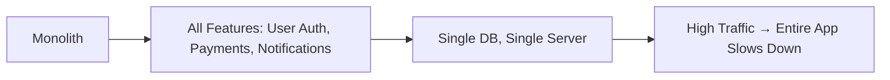

## **Introduction**

Building a software system from scratch is exciting—you’re the architect, the coder, and the visionary. But as your project grows, so does the complexity. Many teams start with a **monolithic architecture** (a single, unified codebase handling all business logic, databases, and services) because it’s simple, fast to develop, and works for small projects.

However, as your application scales—whether due to increased users, features, or team size—a monolithic design can become a **nightmare**. This is where **monolith anti-patterns** come into play.

Monolith anti-patterns describe common **missteps** that make a well-intentioned monolith unwieldy, slow, or impossible to maintain. In this guide, we’ll explore:
✅ What makes a monolith fail
✅ Practical anti-patterns and how to spot them
✅ Code examples showing **bad vs. good** approaches
✅ How to refactor away from anti-patterns

By the end, you’ll know how to **avoid** common pitfalls and decide when a monolith is still the right choice.

---

## **The Problem: Why Monoliths Fail**

Monoliths are **great for early-stage products**—they’re easy to deploy, debug, and iterate on. But as they grow, they introduce **three major pain points**:

### **1. Scalability Nightmares**
A monolith runs everything in a single process. If one feature (e.g., payment processing) gets a traffic spike, the entire application slows down. **Horizontal scaling** (adding more servers) is difficult because you can’t just scale the problematic part.

**Example:**


### **2. Slow Feedback Loops**
With a single codebase, changes (like fixing a bug or adding a feature) require a **full redeploy**. Small tweaks take **minutes instead of seconds**, slowing down development.

### **3. Tech Debt Accumulation**
As features pile up, the codebase becomes **monolithic in the worst way**:
- **Spaghetti dependencies** (Feature A depends on Feature B which depends on Feature C, even if unrelated)
- **Mixed technologies** (JavaScript for the frontend, Python for the backend, SQL for analytics—all in one repo)
- **Hard-to-test code** (business logic scattered across layers)

**Result?** Developers spend **more time debugging than building**.

---

## **The Solution: Spotting & Fixing Monolith Anti-Patterns**

Fortunately, most monolith anti-patterns can be mitigated **without immediately splitting the codebase**. Here are the most common ones—and how to fix them.

---

### **1. Anti-Pattern: The "Big Ball of Mud"**
**What it is:**
A codebase where:
- No clear architecture (procedural spaghetti)
- Heavy use of global variables, singletons, or circular dependencies
- Business logic mixed with UI logic

**Example of Bad Code:**
```python
# 🚫 A monolith "Big Ball of Mud" example
class UserManager:
    def __init__(self, db_connection, logger):
        self.db = db_connection
        self.logger = logger

    def create_user(self, user_data):
        # Mixes business logic with database calls
        if not self.validate_user(user_data):
            return {"error": "Invalid data"}

        # Directly inserts into the DB (no ORM)
        query = f"INSERT INTO users (name, email) VALUES ('{user_data['name']}', '{user_data['email']}')"
        self.db.execute(query)
        return {"success": True}

    def validate_user(self, user_data):
        # Logic for validation is scattered
        if not user_data.get("email"):
            return False
        return "@" in user_data["email"]
```

**Problems:**
❌ **No separation of concerns** (business logic + DB logic + validation)
❌ **Hard to test** (mocking the DB is painful)
❌ **Scaling is impossible** (one change affects everything)

---

**Solution: Modularize with the Layered Architecture**
Split the code into **clear layers**:
- **Presentation Layer** (API endpoints)
- **Business Logic Layer** (services, rules)
- **Data Access Layer** (repositories, ORM calls)

**Good Example:**
```python
# ✅ Separated layers
from dataclasses import dataclass
from typing import Optional

@dataclass
class User:
    name: str
    email: str

# 🔧 Business Logic Layer
class UserValidator:
    def is_valid(self, user_data: dict) -> bool:
        return (
            "email" in user_data
            and "@" in user_data["email"]
            and len(user_data["name"]) > 0
        )

# 🗃️ Data Access Layer
class UserRepository:
    def __init__(self, db_connection):
        self.db = db_connection

    def save(self, user: User) -> bool:
        query = "INSERT INTO users (name, email) VALUES (%s, %s)"
        self.db.execute(query, (user.name, user.email))
        return True

# 🏛️ API Layer
class UserService:
    def __init__(self, validator: UserValidator, repo: UserRepository):
        self.validator = validator
        self.repo = repo

    def create_user(self, user_data: dict):
        if not self.validator.is_valid(user_data):
            raise ValueError("Invalid user data")
        user = User(**user_data)
        return self.repo.save(user)
```

**Benefits:**
✔ **Easier to test** (mock `UserValidator` and `UserRepository` separately)
✔ **Cleaner dependencies** (layers don’t know about each other’s internals)
✔ **Future-proof** (can replace `UserRepository` with a microservice later)

---

### **2. Anti-Pattern: The "Database Percolator"**
**What it is:**
A single database table that **does everything**—stores users, orders, payments, and analytics—with no clear schema.

**Example of Bad Schema:**
```sql
-- 🚫 One monstrous table
CREATE TABLE everything (
    id SERIAL PRIMARY KEY,
    user_name TEXT,
    user_email TEXT,
    order_total DECIMAL,
    payment_status TEXT,
    last_login TIMESTAMP,
    clicks_count INT
);
```

**Problems:**
❌ **Query performance suffers** (full-table scans for everything)
❌ **Data integrity risks** (e.g., `null` values in `order_total` for non-order users)
❌ **Hard to index** (can’t optimize for both user searches and payment queries)

---

**Solution: Normalize Your Database**
Split the database into **related tables** with proper relationships.

**Good Schema:**
```sql
-- ✅ Normalized tables
CREATE TABLE users (
    id SERIAL PRIMARY KEY,
    name TEXT NOT NULL,
    email TEXT UNIQUE NOT NULL,
    created_at TIMESTAMP DEFAULT NOW()
);

CREATE TABLE orders (
    id SERIAL PRIMARY KEY,
    user_id INT REFERENCES users(id),
    total DECIMAL NOT NULL,
    status TEXT CHECK (status IN ('pending', 'completed', 'cancelled')),
    created_at TIMESTAMP DEFAULT NOW()
);

CREATE TABLE user_activity (
    id SERIAL PRIMARY KEY,
    user_id INT REFERENCES users(id),
    action_type TEXT,  -- 'login', 'click', etc.
    count INT,
    timestamp TIMESTAMP DEFAULT NOW()
);
```

**Benefits:**
✔ **Faster queries** (indexes on `user_id`, `status`, etc.)
✔ **Data consistency** (foreign keys enforce relationships)
✔ **Scalability** (can add dedicated tables for analytics later)

---

### **3. Anti-Pattern: The "Tightly Coupled Services"**
**What it is:**
When your monolith has **services that depend on each other too much**, making changes risky.

**Example:**
```python
# 🚫 Service A depends on Service B, which depends on Service C
class PaymentService:
    def __init__(self, email_service: EmailService):
        self.email_service = email_service

class EmailService:
    def __init__(self, sms_service: SMSService):
        self.sms_service = sms_service

class SMSService:  # 👀 What if SMS changes? Everything breaks.
    pass
```

**Problems:**
❌ **Change risk** (updating `SMSService` affects `EmailService` and `PaymentService`)
❌ **Slow deployments** (must test the entire chain)
❌ **Hard to mock for tests**

---

**Solution: Decouple with Dependency Injection & Interfaces**
Use **interfaces** (abstract classes) to define contracts, not implementations.

**Good Example:**
```python
from abc import ABC, abstractmethod

# ✅ Define interfaces first
class NotificationService(ABC):
    @abstractmethod
    def send(self, message: str) -> bool:
        pass

class EmailService(NotificationService):
    def send(self, message: str) -> bool:
        print(f"Sending email: {message}")
        return True

class SMSService(NotificationService):
    def send(self, message: str) -> bool:
        print(f"Sending SMS: {message}")
        return True

# 🔧 PaymentService now depends on an interface, not a concrete class
class PaymentService:
    def __init__(self, notification: NotificationService):
        self.notification = notification

    def process_payment(self, amount: float):
        if amount > 0:
            self.notification.send(f"Payment of ${amount} processed")
        else:
            self.notification.send("Invalid payment amount")
```

**Benefits:**
✔ **Loose coupling** (can swap `EmailService` for `SMSService` without breaking `PaymentService`)
✔ **Easier testing** (mock `NotificationService` in unit tests)
✔ **Future-proof** (add `WhatsAppService` later)

---

### **4. Anti-Pattern: The "Feature Blob"**
**What it is:**
A monolith where **new features are just dumpster-fired into the existing code**, leading to:
- Duplicate business logic
- Inconsistent APIs
- Impossible-to-follow control flow

**Example:**
```python
# 🚫 Feature X and Feature Y both modify the same database table
def create_user_route(request):
    # Feature X logic: user registration
    user = User(name=request.json["name"], email=request.json["email"])
    user.save()

    # Feature Y logic: welcome email (added later)
    if "send_welcome_email" in request.json:
        send_welcome_email(user.email)

    return user.to_dict()

def checkout_route(request):
    # Feature Z logic: payment processing
    order = Order(user_id=request.json["user_id"], total=request.json["total"])
    order.save()

    # 👀 What if payment fails? Where’s the error handling?
    if order.total > 1000:
        send_enterprise_notification(order.user_id)
```

**Problems:**
❌ **No clear ownership** (who maintains `send_welcome_email`?)
❌ **Testing hell** (one API call affects multiple features)
❌ **Deploy risk** (small change breaks unrelated code)

---

**Solution: Isolate Features with Modular Endpoints**
Each feature should have its **own route and service**.

**Good Example:**
```python
# ✅ Separated by feature
from flask import Blueprint, request

# 🏠 Feature: User Management
user_bp = Blueprint("users", __name__)

@user_bp.route("/register", methods=["POST"])
def register_user():
    user = User.from_dict(request.json)
    user.save()
    return user.to_dict(), 201

@user_bp.route("/welcome-email", methods=["POST"])
def send_welcome_email():
    email = request.json["email"]
    send_email(f"Welcome! {email}", "welcome_template")
    return {"status": "sent"}

# 💳 Feature: Payments
payment_bp = Blueprint("payments", __name__)

@payment_bp.route("/checkout", methods=["POST"])
def checkout():
    order = Order.from_dict(request.json)
    if order.total > 1000:
        send_enterprise_notification(order.user_id)
    order.save()
    return order.to_dict(), 201

# 🔌 Register blueprints in the main app
app.register_blueprint(user_bp, url_prefix="/api/v1")
app.register_blueprint(payment_bp, url_prefix="/api/v1")
```

**Benefits:**
✔ **Clear separation** (each feature is self-contained)
✔ **Independent testing** (test `register_user` without `send_welcome_email`)
✔ **Easier scaling** (can later turn `payments` into a microservice)

---

## **Implementation Guide: How to Refactor a Monolith**

Now that you know the anti-patterns, how do you **actually fix** a messy monolith?

### **Step 1: Audit Your Codebase**
- **List all major features** (e.g., Auth, Payments, Analytics)
- **Map dependencies** (which features call which others?)
- **Identify "god objects"** (classes/methods doing too much)

**Tool:** Use `grep`, `ctags`, or IDE refactoring tools to visualize dependencies.

### **Step 2: Apply the Layered Architecture**
- **Separate business logic** from database access
- **Use interfaces** for external dependencies (DB, APIs, etc.)
- **Group related routes** into feature-specific modules

### **Step 3: Normalize the Database**
- **Split large tables** into smaller, related ones
- **Add foreign keys** to enforce relationships
- **Optimize queries** (add indexes, avoid `SELECT *`)

### **Step 4: Introduce Modularity**
- **Split into microservices (later)** by feature (e.g., `auth-service`, `payment-service`)
- **Use event-driven architecture** (e.g., Kafka, RabbitMQ) for loose coupling
- **Containerize** (Docker) to isolate services

### **Step 5: Automate Testing**
- **Unit tests** for business logic
- **Integration tests** for API endpoints
- **E2E tests** for critical workflows

---

## **Common Mistakes to Avoid**

1. **❌ "Big Bang Refactoring"**
   - **Mistake:** Trying to split a monolith into microservices all at once.
   - **Fix:** Start with **modularization** (separate layers, features) before moving to services.

2. **❌ Ignoring Database Growth**
   - **Mistake:** Keeping a single massive table "just for now."
   - **Fix:** Normalize early—it’s harder to split later.

3. **❌ Over-Engineering Early**
   - **Mistake:** Adding Kafka, gRPC, and microservices **before** the monolith is stable.
   - **Fix:** Follow the **Boy Scout Rule**: "Leave the code cleaner than you found it."

4. **❌ Poor Error Handling**
   - **Mistake:** Swallowing exceptions or logging them poorly.
   - **Fix:** Use **structured logging** and **dead-letter queues** for async failures.

5. **❌ Forgetting to Document**
   - **Mistake:** Assuming the code is self-documenting.
   - **Fix:** Write **API specs** (OpenAPI), **architecture diagrams**, and **READMEs**.

---

## **Key Takeaways: Monolith Anti-Patterns Checklist**

| **Anti-Pattern**          | **Signs You Have It**                          | **How to Fix It**                          |
|---------------------------|-----------------------------------------------|--------------------------------------------|
| **Big Ball of Mud**       | No clear architecture, spaghetti dependencies | Split into layers (API ↔ Business ↔ Data) |
| **Database Percolator**   | One table for everything, no indexes          | Normalize DB, add proper relationships     |
| **Tightly Coupled Services** | Services depend on each other directly      | Use interfaces, dependency injection       |
| **Feature Blob**          | Features mixed in one endpoint/function      | Isolate by feature (blueprints, modules)   |
| **Poor Error Handling**   | Exceptions swallowed, no retries             | Implement retries, dead-letter queues     |

**When to Avoid a Monolith:**
✅ Your team is **small** (1-5 developers)
✅ Your app is **simple** (CRUD, no complex workflows)
✅ You **don’t need horizontal scaling** yet

**When to Consider a Microservice:**
❌ **High traffic** (e.g., 1M+ users)
❌ **Team grows** (different teams own different features)
❌ **Independent scaling** is needed (e.g., payments vs. analytics)

---

## **Conclusion: Monoliths Aren’t Evil—They’re Just Misused**

A monolith isn’t inherently bad. **Problems arise when:**
- Code grows **without structure**
- Teams **ignore modularity**
- **Scalability is ignored**

By recognizing these **anti-patterns** and applying **layered architecture, database normalization, and loose coupling**, you can keep your monolith **maintainable, fast, and scalable**—without an immediate need for microservices.

### **Next Steps:**
1. **Audit your current codebase**—are any of these anti-patterns creeping in?
2. **Start small**—refactor one feature at a time.
3. **Automate testing**—catch regressions early.
4. **Document as you go**—future you (and your team) will thank you.

Monoliths **can** work for years if built **intentionally**. The key is **avoiding the anti-patterns** this guide covered. Now go build something **scalable, not chaotic**!

---
**What’s your biggest monolith struggle?** Share in the comments—I’d love to hear your war stories! 🚀