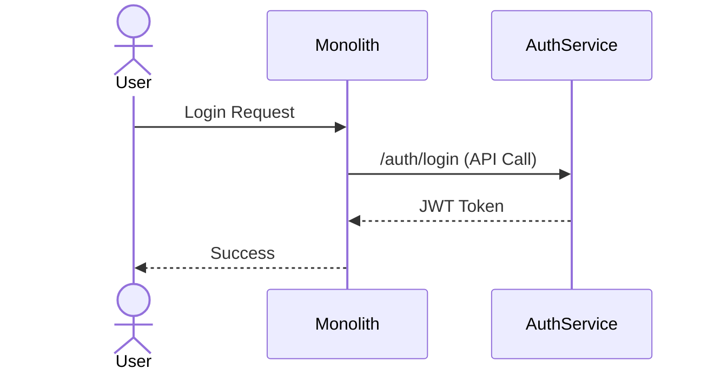

# **Mastering Monolith Maintenance: A Backend Engineer’s Guide**

## **Introduction**

You’ve written your first monolith. It’s slick, fast, and handles all your business logic in one codebase. For a while, it’s a dream—no microservices overhead, no distributed transactions, no complex deployment pipelines. But as the application grows, you start seeing cracks: slow builds, bloated dependencies, and deployment times that feel like they’re measured in minutes instead of seconds.

This is the inevitable path of **monolith maintenance**—a phase where your once-elegant system becomes a tangled web of legacy code, tight coupling, and maintenance debt. Yet, despite the hype around microservices, many high-traffic, long-lived applications (think FinTech platforms, enterprise SaaS, or legacy systems) still thrive as monoliths—not because they should, but because they’re **tightly optimized for maintenance**.

In this guide, we’ll explore the **Monolith Maintenance Pattern**: how to structure, evolve, and keep a monolith performant, scalable, and developer-friendly over time. We’ll cover:
- **The telltale signs your monolith is struggling**
- **Strategies to refactor incrementally** (without risking downtime)
- **Code organization patterns** that improve maintainability
- **Performance optimizations** for large-scale monoliths
- **Deployment and CI/CD best practices** for monoliths
- **When to consider (and when to avoid) migrations to microservices**

Let’s dive in.

---

## **The Problem: Why Monolith Maintenance Becomes a Nightmare**

Monoliths start simple, but complexity grows exponentially with time. Here’s what happens when maintenance falls behind:

### **1. The Build-Time Curse**
Imagine your monolith depends on 150+ npm packages, each with its own test suite. Your `npm install` now takes **10 minutes**, and your CI/CD pipeline grinds to a halt. Every pull request requires waiting for tests that take **20 minutes** to run.

```bash
# A monolith with 150+ dependencies - build times skyrocket
$ npm install
# => 10 minutes of waiting...
$ npm test
# => 20 minutes of running 5,000 tests...
```

### **2. Deployment Times That Feel Like Forever**
A monolith is a **single binary (or containerized unit)**—but that binary now includes **everything**. Redeploying a small change means rebuilding and redeploying the entire application, which can take **minutes in production** or **hours in staging**.

```bash
# Deploying a monolith - every change means a full rebuild
$ docker build -t my-app .
# => 8 minutes...
$ docker push my-app
# => 2 minutes...
$ kubectl rollout restart deployment/my-app
# => 5 minutes (while the old pods drain)...
```

### **3. Tight Coupling Leads to Fragile Code**
As features accumulate, your layers become **interdependent**. Changing one part of the application (e.g., an authentication library) might break **dozens of services**. You start avoiding refactors because you’re afraid of breaking **everything**.

```java
// Example of tight coupling in a Java monolith
public class UserService {
    private final AuthService authService;
    private final PaymentService paymentService;
    private final NotificationService notificationService;

    public UserService(
        AuthService authService,
        PaymentService paymentService,
        NotificationService notificationService) {
        this.authService = authService;
        this.paymentService = paymentService;
        this.notificationService = notificationService;
    }

    // Every change here might require updates to 3 other services...
}
```

### **4. Debugging Becomes a Black Box**
With **no clear boundaries**, debugging a monolith is like finding a needle in a haystack. Logs are convoluted, and you’re constantly digging through **millions of lines of code** to isolate an issue.

```plaintext
# Production logs - how do you find the real issue?
[2024-02-20 14:30:00] [ERROR] UserService: Failed to process order
[2024-02-20 14:30:01] [DEBUG] AuthService: Token invalid
[2024-02-20 14:30:02] [INFO] PaymentService: Transaction started
[2024-02-20 14:30:03] [ERROR] DBConnectionPool: Timeout after 5 seconds
```

### **5. Team Velocity Grinds to a Halt**
Not all engineers contribute equally. Some know **specific modules**, while others avoid touching **legacy code**. This creates **knowledge silos**, where only 2-3 people understand critical parts of the system. Onboarding new engineers becomes **painful**.

### **6. Scaling Becomes a Gamble**
Monoliths **can scale**, but not without effort. You might hit **database bottlenecks**, **memory limits**, or **network latency** before needing to distribute workloads. Without proper structure, scaling often requires **big, risky refactors**.

```sql
-- Example of a poorly structured database schema that breaks under load
CREATE TABLE Orders (
    id INT PRIMARY KEY,
    user_id INT,
    product_id INT,
    quantity INT,
    status VARCHAR(50),
    -- But wait... what if we need to track inventory per region?
    -- Or add a new payment gateway? The schema is now a moving target.
);
```

---

## **The Solution: The Monolith Maintenance Pattern**

The key to long-term monolith success is **strategic maintenance**—not avoiding refactors, but making **intentional, low-risk changes**. The **Monolith Maintenance Pattern** follows these principles:

1. **Structure for Scalability** – Organize code in **loosely coupled modules** that can be maintained independently.
2. **Optimize for Builds & Deploys** – Reduce dependency bloat and speed up iterations.
3. **Improve Debugging** – Use **structured logging**, **distributed tracing**, and **modular testing**.
4. **Refactor Incrementally** – Break down the monolith into **self-contained services** where it makes sense.
5. **Automate Everything** – Ensure CI/CD, testing, and monitoring are **fast and reliable**.

---

## **Components of the Monolith Maintenance Pattern**

### **1. Modular Code Organization**
Instead of one massive `src/` directory, structure your monolith into **logical modules** with clear boundaries.

#### **Example: Modular Monolith in JavaScript (Node.js)**
```bash
my-monolith/
├── src/
│   ├── api/                # REST/GraphQL endpoints
│   │   ├── auth/
│   │   │   ├── routes.ts
│   │   │   ├── controllers.ts
│   │   │   └── services/
│   ├── business/           # Core logic
│   │   ├── orders/
│   │   │   ├── order.service.ts
│   │   │   ├── order.repository.ts
│   │   │   └── order.types.ts
│   ├── shared/             # Reusable utilities
│   │   ├── db/
│   │   │   └── connection.ts
│   │   └── validation/
│   └── tests/              # Module-specific tests
│       ├── api/
│       └── business/
├── package.json
└── tsconfig.json
```

**Key Benefits:**
- **Faster builds** (only test changed modules).
- **Easier refactors** (isolate changes).
- **Better onboarding** (new devs learn modules, not the entire codebase).

---

### **2. Dependency Management**
Monoliths suffer from **dependency bloat**. Use **monorepo tools** (if already in one) or **modular dependency trees** to isolate changes.

#### **Example: Using `lerna` for a Monorepo**
```bash
# Example package.json for a monolith with multiple packages
{
  "name": "my-monolith",
  "private": true,
  "workspaces": [
    "packages/auth",
    "packages/orders",
    "packages/inventory"
  ]
}
```

**Tradeoffs:**
✅ **Faster builds** (parallel test runs).
✅ **Easier dependency versioning**.
❌ **Slightly steeper learning curve** for new engineers.

---

### **3. Fast Builds & CI/CD Optimizations**
Monoliths **must** have fast CI/CD. Here’s how:

#### **a. Parallel Test Execution**
Run tests in **parallel** for different modules.

```javascript
// Example: Using Jest with parallel workers
module.exports = {
  projects: [
    "<rootDir>/packages/auth/tests/**/*.ts",
    "<rootDir>/packages/orders/tests/**/*.ts",
  ],
};
```

#### **b. Caching Dependencies**
Use **Docker layers** and **CI/CD caching** to avoid reinstalling dependencies every time.

```dockerfile
# Example Dockerfile with multi-stage builds
FROM node:18 as builder
WORKDIR /app
COPY package.json yarn.lock ./
RUN yarn install --frozen-lockfile
COPY . .
RUN yarn build

FROM node:18
WORKDIR /app
COPY --from=builder /app/dist ./dist
COPY --from=builder /app/node_modules ./node_modules
CMD ["node", "dist/index.js"]
```

#### **c. Canary Deployments**
Instead of **full redeploys**, use **canary releases** to test changes in production.

```bash
# Example: Using Kubernetes canary deployment
apiVersion: apps/v1
kind: Deployment
metadata:
  name: my-app-canary
spec:
  replicas: 2
  template:
    spec:
      containers:
      - name: my-app
        image: my-app:v2-canary
---
apiVersion: apps/v1
kind: Deployment
metadata:
  name: my-app-stable
spec:
  replicas: 8
  template:
    spec:
      containers:
      - name: my-app
        image: my-app:v1-stable
```

---

### **4. Refactoring Without Downtime**
Not all monoliths need to become microservices—but **some parts should**. Use the **"Strangler Fig Pattern"** to extract modules incrementally.

#### **Example: Extracting an Auth Service from a Monolith**
1. **Start with a sidecar service** (e.g., `auth-service`) that handles authentication.
2. **Gradually replace monolith auth calls** with API calls to the new service.
3. **Eventually, fully decommission the monolith auth code**.



**When to Extract a Module:**
✔ **High traffic** (e.g., auth, payments).
✔ **Rapidly changing logic** (e.g., ML models, complex business rules).
✔ **Tight coupling** (e.g., database schemas becoming unmanageable).

**When to Keep It as a Monolith:**
✔ **Small team** (communication overhead of microservices isn’t justified).
✔ **Low traffic** (no need for horizontal scaling).
✔ **Frequent cross-service changes** (e.g., a shared inventory system).

---

### **5. Performance Optimizations**
Monoliths can **scale vertically**, but they need **smart optimizations**:

#### **a. Database Sharding**
If your DB is the bottleneck, **shard by tenant** or **region**.

```sql
-- Example: Sharding orders by region
CREATE TABLE Orders (
    id INT PRIMARY KEY,
    tenant_id INT,
    region VARCHAR(10),
    data JSONB
) PARTITION BY LIST (region);
```

#### **b. Caching Layers**
Use **Redis** or **memory stores** for frequently accessed data.

```javascript
// Example: Caching in Express with Redis
const express = require('express');
const Redis = require('ioredis');
const redis = new Redis();

const app = express();

app.get('/users/:id', async (req, res) => {
  const cacheKey = `user:${req.params.id}`;
  const cachedUser = await redis.get(cacheKey);

  if (cachedUser) {
    return res.json(JSON.parse(cachedUser));
  }

  const user = await db.getUser(req.params.id);
  await redis.set(cacheKey, JSON.stringify(user), 'EX', 3600); // Cache for 1 hour
  res.json(user);
});
```

#### **c. Asynchronous Processing**
Offload **long-running tasks** (e.g., reports, notifications) to **background workers**.

```javascript
// Example: Using BullMQ for async jobs
const { Queue } = require('bullmq');
const queue = new Queue('generate-reports', { connection: redis });

app.post('/generate-report', async (req, res) => {
  await queue.add('generate', req.body);
  res.json({ status: 'queued' });
});
```

---

### **6. Debugging & Observability**
Monoliths **must** have **strong logging, tracing, and monitoring**.

#### **a. Structured Logging**
Use **JSON logs** for easier parsing.

```javascript
// Example: Structured logging with Winston
const winston = require('winston');
const logger = winston.createLogger({
  level: 'info',
  format: winston.format.json(),
  transports: [new winston.transports.Console()],
});

logger.info({ event: 'user_login', user_id: 123, ip: '192.168.1.1' });
```

#### **b. Distributed Tracing**
Use **OpenTelemetry** to trace requests across modules.

```javascript
// Example: OpenTelemetry tracing
import { NodeTracerProvider } from '@opentelemetry/sdk-trace-node';
import { JaegerExporter } from '@opentelemetry/exporter-jaeger';

const provider = new NodeTracerProvider();
provider.addSpanProcessor(new SimpleSpanProcessor(new JaegerExporter()));
provider.register();
```

#### **c. Synthetic Monitoring**
Use **crontab-based checks** to simulate production traffic.

```bash
# Example: Synthetic monitoring with Locust
locust -f locustfile.py --headless -u 100 -r 10 --run-time 1m
```

---

## **Implementation Guide: Steps to Apply the Pattern**

### **Step 1: Audit Your Monolith**
- **Identify bottlenecks** (slow builds, long deploys, debuggability issues).
- **Map dependencies** (use tools like `npm ls` or `gradle dependencies`).
- **Measure performance** (Gauge CI/CD times, deployment durations, latency).

### **Step 2: Modularize the Codebase**
- Split into **logical modules** (e.g., `auth`, `orders`, `payments`).
- Use **package.json workspaces** (if in a monorepo) or **separate directories**.
- **Isolate tests** per module.

### **Step 3: Optimize Builds & Deploys**
- **Reduce dependencies** (remove unused packages).
- **Cache Docker layers** and **CI artifacts**.
- **Enable parallel test execution**.

### **Step 4: Implement Canary Deployments**
- Use **Kubernetes**, **Argo Rollouts**, or **serverless functions** for gradual rollouts.
- **Monitor errors** and roll back if needed.

### **Step 5: Refactor Incrementally**
- **Strangle problematic modules** (e.g., auth, payments).
- **Use the Sidecar Pattern** for gradual migration.
- **Document migration steps** for your team.

### **Step 6: Add Observability**
- **Structured logging** (JSON, ELK stack).
- **Distributed tracing** (OpenTelemetry, Jaeger).
- **Synthetic monitoring** (Locust, k6).

### **Step 7: Document Maintenance Rules**
- **Define breaking change policies**.
- **Set up a "refactor queue"** (small, low-risk improvements).
- **Train new engineers** on module boundaries.

---

## **Common Mistakes to Avoid**

### **1. Over-Renovating Before Needed**
- **Microservices aren’t always the answer**. If your team is small and the system is stable, **don’t force a refactor**.
- **Signs you might need microservices:**
  - Deployments take **>10 minutes**.
  - **3+ teams** are working on different parts.
  - You’re **constantly hitting database limits**.

### **2. Ignoring Build Performance**
- **Slow builds kill velocity**. If `npm install` takes **5+ minutes**, you’re doing it wrong.
- **Solutions:**
  - Use **Docker caching**.
  - **Parallelize tests**.
  - **Reduce dependencies**.

### **3. Not Structuring for Future Scalability**
- **Hardcoding database schemas** makes scaling **impossible**.
- **Solution:** Use **database agnostic patterns** (e.g., CQRS, event sourcing).

### **4. Skipping Observability**
- **Without logs/tracing, debugging is impossible**.
- **Solution:** Implement **structured logging + tracing early**.

### **5. Refactoring Without Tests**
- **Every change should have tests**.
- **Solution:** Use **module-specific test suites** and **integration tests**.

### **6. Forgetting Documentation**
- **Monoliths grow opaque over time**.
- **Solution:** Document **module boundaries**, **assumptions**, and **anti-patterns**.

---

## **Key Takeaways**

✅ **Monoliths can be maintained successfully**—but they require **intentional structure**.
✅ **Modularization** (not microservices) is usually the first step.
✅ **Fast builds & deploys** are **non-negotiable** for team velocity.
✅ **Incremental refactoring** (Strangler Fig Pattern) is safer than Big Bang migrations.
✅ **Observability** (logging, tracing, monitoring) is **critical** for debugging.
✅ **Know when to stop**. Not every monolith needs to become microservices.

---

## **Conclusion**

Monoliths **aren’t dead**—they’re **evolving**. The **Monolith Maintenance Pattern** shows how to keep them **scalable, debuggable, and maintainable** over time. By structuring code **modularly**, optimizing **builds and deploys**, and **refactoring incrementally**, you can avoid the pitfalls of **technical debt** and **slowdowns**.

When it’s **