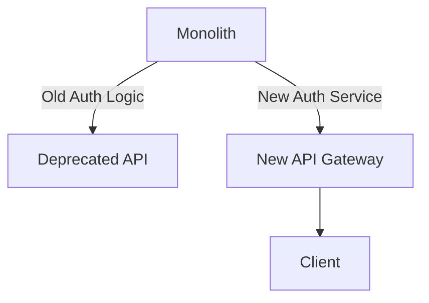

```markdown
# Maintaining Monoliths Without Losing Your Mind: A Backend Engineer’s Survival Guide

*by [Your Name], Senior Backend Engineer*

---

## Introduction

You’ve seen it before—the “perfect” architecture plan with microservices, event-driven systems, and cloud-native flexibility. But here’s the truth: **most production systems are monoliths**. Or at least, they started as monoliths. And they’re not going anywhere soon.

Monoliths dominate legacy systems, startups with tight budgets, and even early-stage innovative companies building their first product. Even if you dream of the day when your system is split into elegant microservices, monoliths have their place. The challenge isn’t *whether* to maintain them—it’s *how* to do it effectively. In this post, I’ll share the **Monolith Maintenance** pattern, a pragmatic approach to evolving and scaling monolithic applications without refactoring everything at once.

This guide will cover the **challenges** of maintaining monoliths, the **key strategies** to tackle them, and practical **code examples** to demonstrate how to apply these patterns. By the end, you’ll understand how to balance agility, maintainability, and scalability in monolithic systems—without starting a never-ending rewrite.

---

## The Problem: Why Monolith Maintenance is Hard

Monoliths aren’t inherently bad. They work great for small teams, rapid iteration, and simple use cases. But as applications grow, so do the problems:

### **1. The Indirect Coupling Nightmare**
Monoliths couple everything—business logic, data models, and external services—into a single codebase and database. Changes to one component can break unrelated parts. For example, modifying a simple `User` model might force you to update 20 unrelated API endpoints, tests, and database migrations:

```sql
-- Example: Adding a "premium_status" field to the User table
ALTER TABLE users ADD COLUMN premium_status BOOLEAN DEFAULT FALSE;

-- Now, you must update:
-- - User service logic (e.g., `UserRepository`)
-- - API endpoints (e.g., `/users/{id}`)
-- - Frontend components (e.g., React hooks)
-- - Authorization middleware
-- - Data migration scripts
-- - Tests (unit, integration, and e2e)
```

This **indirect coupling** makes even small changes risky and slow.

### **2. Scaling Bottlenecks**
Monoliths are hard to scale because:
- **Database contention**: A single database table locks everything (e.g., `users` table slows down when read-heavy).
- **Processing bottlenecks**: A single application server handles all requests, creating CPU/memory pressure.
- **Team coordination**: One PR can block the entire team if it touches critical paths.

### **3. Technical Debt Snowball**
Over time, monoliths accumulate:
- **Inconsistent architecture**: Mix of OOP, functional, and procedural styles.
- **Duplicated logic**: E.g., repeated authentication logic in 10 different modules.
- **Hard-to-test code**: Deep dependencies make unit tests brittle.
- **Undocumented assumptions**: “We’ve always done it this way” becomes a liability.

### **4. Deployment Risks**
Deploying a monolith is a **high-risk, high-reward** proposition:
- One misstep (e.g., a bad migration, a broken dependency) can bring down the entire system.
- Rollbacks are complex (e.g., reverting a `DROP TABLE`).
- Feature flags and canary releases are harder to implement.

---

## The Solution: The Monolith Maintenance Pattern

The **Monolith Maintenance** pattern is a set of **tactical strategies** to manage monoliths sustainably. It’s not about rewriting the system—it’s about **incrementally improving** it while minimizing risk. The core principles are:

1. **Decouple Indirect Coupling**: Reduce dependencies between modules.
2. **Isolate Scaling Pressures**: Scale components independently.
3. **Control Technical Debt**: Refactor strategically, not randomly.
4. **Improve Observability**: Make hidden issues visible.
5. **Plan for Extraction**: Lay groundwork for future microservices.

Let’s dive into each.

---

## Components/Solutions

### **1. Modularize the Monolith**
Break the monolith into **logical modules** (not physical services) to reduce coupling. This doesn’t require rewriting; it’s about organizing code better.

#### **Example: Feature Modules**
Group code by **feature** (e.g., `auth`, `payments`, `notifications`) rather than by layer (e.g., `models`, `services`). This makes changes safer.

```javascript
// Before: Deeply nested by layer
// app/models/user.js
// app/services/auth.js
// app/api/user.js
// app/tests/user.test.js

// After: Feature-based modularization
// features/auth/
//   ├── models/
//   │   └── user.js
//   ├── services/
//   │   └── auth.js
//   ├── api/
//   │   └── routes.js
//   └── tests/
//       └── auth.test.js
```

**Tradeoff**: Modularization alone won’t scale the database, but it makes **localized changes** safer.

---

### **2. Database Sharding (Partial)**
If your database is the bottleneck, **shard by feature** or **tenant**. This doesn’t require full microservices—just split tables.

#### **Example: User Sharding**
Split the `users` table by tenant ID:

```sql
-- Before: Single table
CREATE TABLE users (
    id SERIAL PRIMARY KEY,
    tenant_id VARCHAR(255),
    email VARCHAR(255) UNIQUE,
    created_at TIMESTAMP
);

-- After: Sharded by tenant_id
CREATE TABLE users_tenant1 (
    id SERIAL PRIMARY KEY,
    email VARCHAR(255) UNIQUE,
    created_at TIMESTAMP,
    tenant_id VARCHAR(255) DEFAULT 'tenant1'
);

CREATE TABLE users_tenant2 (
    id SERIAL PRIMARY KEY,
    email VARCHAR(255) UNIQUE,
    created_at TIMESTAMP,
    tenant_id VARCHAR(255) DEFAULT 'tenant2'
);
```

**Tradeoff**: Requires application logic to route queries (e.g., via a **tenant router** service). Not ideal for global writes, but works for read-heavy systems.

---

### **3. Externalize Configuration**
Decouple configuration from code to make changes safer. Use **environment variables**, **feature flags**, and **config files**.

#### **Example: Feature Flags**
Enable/disable features without code changes:

```javascript
// In your application JS/TS
const enableNewAuthFlow = process.env.ENABLE_NEW_AUTH_FLOW === 'true';

if (enableNewAuthFlow) {
    // Use new auth logic
} else {
    // Fall back to old logic
}
```

**Tradeoff**: Adds complexity (e.g., flag management), but reduces risk of breaking changes.

---

### **4. Lazy-Initialize Heavy Dependencies**
If a module is rarely used, **load it dynamically** to reduce startup time and memory.

#### **Example: Lazy-Loading a Payment Service**
```javascript
// In Node.js with ES modules
import { loadPaymentService } from './payment-service.js';

let paymentService;

async function handlePayment() {
    if (!paymentService) {
        paymentService = await loadPaymentService();
    }
    // Use paymentService...
}
```

**Tradeoff**: Increases latency for first use, but saves memory during idle periods.

---

### **5. Gradual Refactoring with the "Strangler Fig" Pattern**
Instead of rewriting the monolith, **incrementally replace modules** with new services. Start with low-risk parts:

1. **Expose the module as an API** (e.g., `/api/v1/auth`).
2. **Replace the front-end call** to use the new API.
3. **Deprecate the old code** over time.

#### **Example: Strangling the Auth Module**


**Tradeoff**: Requires careful testing to avoid divergence between old and new implementations.

---

### **6. Improve Observability**
Add **logging**, **metrics**, and **tracing** to identify bottlenecks. Tools like **OpenTelemetry**, **Prometheus**, and **ELK** help.

#### **Example: Distributed Tracing**
```javascript
// Using OpenTelemetry
import { initTracing } from '@opentelemetry/sdk-node';
import { getNodeAutoInstrumentations } from '@opentelemetry/auto-instrumentations-node';

initTracing({
    instrumentations: [getNodeAutoInstrumentations()],
});
```

**Tradeoff**: Adds overhead, but pays off when debugging distributed issues.

---

## Implementation Guide

### Step 1: Audit Your Monolith
Start by **mapping dependencies**:
- **Code**: Use tools like `dependency-checker` (Python) or `ndepend` (C#).
- **Database**: Identify hot tables with `pg_stat_statements` (PostgreSQL) or `slow_query_log`.
- **Deploys**: Analyze rollback rates and failure modes.

### Step 2: Prioritize Refactoring
Focus on:
1. **High-risk areas**: Code with high churn or failure rates.
2. **Scaling bottlenecks**: Database queries, slow endpoints.
3. **Technical debt**: Duplicate code, undocumented logic.

### Step 3: Apply the Pattern Incrementally
- **Week 1**: Modularize one feature (e.g., `auth`).
- **Week 2**: Shard a hot table (e.g., `users`).
- **Week 3**: Externalize a config (e.g., feature flags).
- **Month 1**: Use Strangler Fig to replace a small module.

### Step 4: Automate Testing
Ensure changes don’t break anything:
- **Unit tests**: Isolate modules.
- **Integration tests**: Test APIs end-to-end.
- **Chaos testing**: Simulate failures (e.g., database timeouts).

### Step 5: Monitor and Iterate
Use metrics to track progress:
- **Mean time to recovery (MTTR)**: Should improve.
- **Deployment frequency**: Should increase.
- **Technical debt ratio**: Should decrease.

---

## Common Mistakes to Avoid

### **1. Big-Bang Refactoring**
Don’t try to modularize everything at once. **Small, focused changes** are safer.
❌ Wrong: “I’ll rewrite the auth module in 2 weeks.”
✅ Right: “I’ll extract auth into a separate folder and add tests.”

### **2. Ignoring Database Coupling**
Monoliths often share a database. **Don’t assume separation of concerns applies to the DB.**
❌ Wrong: “I’ll split the code, but keep one table.”
✅ Right: **Plan database sharding early** or accept tradeoffs.

### **3. Skipping Observability**
Without metrics, you won’t know where to focus.
❌ Wrong: “I’ll refactor when we have time.”
✅ Right: **Add logging and tracing first** to identify bottlenecks.

### **4. Over-Investing in Microservices**
Don’t prematurely extract services. **Start with modularization** before splitting databases.
❌ Wrong: “Let’s split payment and auth into separate services now.”
✅ Right: “Let’s modularize auth first, then evaluate extraction.”

### **5. Neglecting Documentation**
Monoliths are harder to understand. **Document decisions, assumptions, and tradeoffs.**
❌ Wrong: “The code is self-documenting.”
✅ Right: **Add a `DECISIONS.md` file** in the repo root.

---

## Key Takeaways

- **Monoliths aren’t evil**: They’re practical for many use cases. Focus on **maintaining them well**.
- **Modularization reduces risk**: Split code by feature, not layer.
- **Database sharding helps but has limits**: Only shard when necessary; avoid global writes.
- **Strangler Fig is safer than rewrites**: Replace modules incrementally.
- **Observability is non-negotiable**: Without metrics, you’re flying blind.
- **Small, focused changes win**: Big refactors fail; incremental wins.
- **Plan for extraction**: Even if you never split the monolith, modularize for future flexibility.

---

## Conclusion

Maintaining a monolith doesn’t have to be a death march. By applying the **Monolith Maintenance** pattern—modularization, gradual refactoring, observability, and strategic sharding—you can keep your system **agile, scalable, and sustainable** without the risk of a full rewrite.

Remember: **The goal isn’t to eliminate monoliths—it’s to make them work for you.** Start small, stay disciplined, and iterate. Your future self (and your team) will thank you.

---
**Further Reading:**
- ["Monolith First" by Gilad Bracha](https://github.com/giladbracha/monolith-first)
- ["The New Monolith" by Rich Hickey](https://www.infoq.com/presentations/Reconciling-Consistency-Elasticity/)
- ["Strangler Fig Pattern" by Martin Fowler](https://martinfowler.com/bliki/StranglerFigApplication.html)

**Tools to Try:**
- [Dependabot](https://dependabot.com/) (for dependency management)
- [Sentry](https://sentry.io/) (error tracking)
- [K6](https://k6.io/) (performance testing)

---
**What’s your biggest monolith challenge? Share in the comments—I’d love to hear your stories!**
```