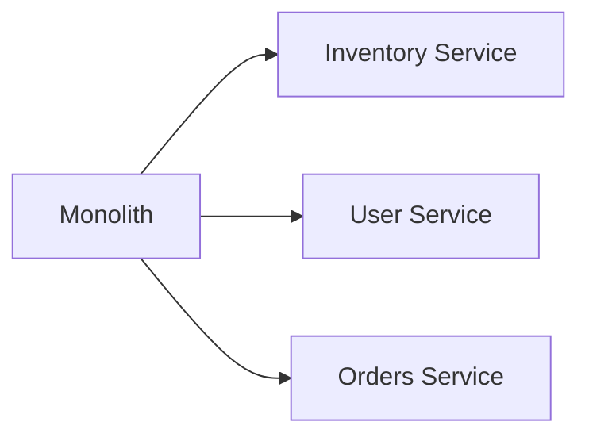

```markdown
# **Monolith Verification: How to Validate Your Backend Before Splitting It**

*Ensure your microservices are truly ready before making the leap—learn how the "Monolith Verification" pattern helps you avoid costly refactoring.*

---

## **Introduction**

As backend engineers, we’ve all faced the classic tension between monolithic simplicity and microservices scalability. At some point, most legacy systems grow too complex to maintain, forcing us to consider breaking them into smaller, independent services. But before we rush into splitting our monolith, we need to ask: *Is our system truly ready for microservices?*

This is where the **"Monolith Verification"** pattern comes in. Instead of blindly refactoring, we first validate whether our monolith is *actually* the right architectural choice—or if a microservices approach would be better *after* careful testing. Monolith Verification is about proving that our monolithic design *can* handle future growth, meets performance needs, and aligns with business requirements—before we even consider splitting it.

In this post, we’ll explore:
- Why monoliths aren’t always the problem (and when they’re the *right* design)
- How to systematically verify if your monolith is fit for purpose
- Practical code and database patterns to test scalability, reliability, and maintainability
- Common pitfalls and how to avoid them

By the end, you’ll have a structured approach to deciding whether to keep, optimize, or split your monolith—without wasted effort.

---

## **The Problem: When Monoliths Become a Blind Leap**

Microservices are often sold as a silver bullet, but in reality, they’re just one tool in our toolbox. Before investing in a costly refactoring effort, we must ask:
- **Is our monolith actually slow?** (Or are we assuming it is?)
- **Do we have bottlenecks that microservices *really* solve?** (Or is the problem just bad queries?)
- **Are we splitting for the right reasons?** (Team structure? Tech debt? Or just FOMO?)

### **The Cost of Premature Splitting**
Without proper verification, we risk:
- **Over-engineering**: Splitting a monolith that doesn’t need it, adding unnecessary complexity.
- **Hidden debt**: Microservices introduce distributed complexity (network calls, service discovery, transactions), which can *worsen* reliability if not managed well.
- **Wasted effort**: Refactoring without proving the need often leads to abandoned projects midway.

### **When *Is* a Monolith the Right Choice?**
A monolith can be **perfectly fine** if:
✅ It meets performance SLAs (even at scale)
✅ Team velocity isn’t hindered by tight coupling
✅ Future growth aligns with monolithic scaling (e.g., vertical scaling)
✅ There’s no clear domain boundary for splitting

But how do we *prove* these conditions? That’s where Monolith Verification comes in.

---

## **The Solution: Monolith Verification**

Monolith Verification is an **experimental, data-driven approach** to validating whether a monolith can handle future demands *before* splitting it. The goal isn’t to abandon microservices but to **eliminate guesswork** in the decision process.

### **Core Principles**
1. **Measure, don’t assume**: Use real-world load testing to validate performance.
2. **Isolate bottlenecks**: Identify where the monolith *actually* needs improvement.
3. **Simulate future scale**: Stress-test with projected traffic before refactoring.
4. **Compare alternatives**: Evaluate whether microservices would *actually* help—or just complicate things.

### **Key Questions to Answer**
Before splitting, we must answer:
❓ **Can this monolith scale under expected load?**
❓ **Are there clear functional boundaries for microservices?**
❓ **Will splitting improve developer productivity, or just move complexity elsewhere?**
❓ **Are there non-functional requirements (SLAs, compliance) that favor a monolith?**

---

## **Components of Monolith Verification**

To systematically verify a monolith, we need a combination of **testing, measurement, and architectural analysis**. Here’s how we approach it:

### **1. Performance Benchmarking**
Before assuming a monolith is slow, we must **measure it under realistic conditions**.

#### **Example: Load Testing with Locust (Python)**
```python
# locustfile.py - Simulate 1000 concurrent users
from locust import HttpUser, task, between

class MonolithUser(HttpUser):
    wait_time = between(1, 3)

    @task
    def fetch_product(self):
        self.client.get("/api/products/123")

    @task(3)
    def checkout(self):
        self.client.post("/api/checkout", json={"id": "cart-abc"})
```

**Key Metrics to Track:**
- Response times (P95, P99)
- Requests per second (RPS)
- Database query latency
- Memory/CPU usage

**Tooling:**
- **Locust** (Python), **JMeter** (Java), **k6** (JavaScript)
- **APM tools** (Datadog, New Relic, Prometheus + Grafana)

---

### **2. Database-Level Verification**
A monolithic database isn’t inherently bad—but if it’s a single-table monolith with no indexes or denormalization, it *will* become a bottleneck.

#### **Example: Analyzing Query Performance**
```sql
-- Check slow queries (PostgreSQL)
SELECT query, calls, total_time, mean_time
FROM pg_stat_statements
ORDER BY mean_time DESC
LIMIT 10;
```

**Common Fixes (Before Splitting):**
```sql
-- Add missing indexes
CREATE INDEX idx_products_category ON products(category_id);

-- Denormalize if needed
ALTER TABLE orders ADD COLUMN user_email TEXT;
UPDATE orders o
SET user_email = u.email
FROM users u
WHERE o.user_id = u.id;
```

**When to Consider Splitting Databases:**
- If you’re **repeatedly** hitting the same bottleneck (e.g., `products` table is bloated).
- If **future growth** requires **strong consistency** across services (eventual consistency may not suffice).

---

### **3. Functional Boundary Analysis**
Not all monoliths are bad—if they have **clear functional boundaries**, splitting *might* help. But if they’re **procedural spaghetti**, splitting could make things worse.

#### **Example: Identifying Splitting Candidates**
```python
# monolith/app/services/orders.py
class OrderService:
    def __init__(self):
        self.db = DatabaseConnection()

    def create_order(self, user_id, items):
        # 1. Validate user
        # 2. Check stock
        # 3. Create order
        # 4. Notify warehouse
        pass

    def cancel_order(self, order_id):
        # 1. Check status
        # 2. Refund payment
        # 3. Update inventory
        pass
```

**Red Flags for Poor Splitting Candidates:**
⚠ **Tight coupling** (e.g., `OrderService` calls `InventoryService` *and* `PaymentService` in the same transaction).
⚠ **Unclear ownership** (e.g., "Who owns the `user` table?").
⚠ **Over-engineering** (e.g., "We’ll split *everything* because we heard it’s good").

**Better Approach:**
- **Start small**: Identify **one clear boundary** (e.g., `Inventory` service).
- **Use Domain-Driven Design (DDD)**: Model services around **ubiquitous language**.

---

### **4. Team Velocity Analysis**
A monolith isn’t just code—it’s **people + processes**. If a monolith slows down development, that’s a legitimate reason to split.

#### **Example: Codebase Health Metrics**
| Metric               | Monolith Threshold | Microservices Threshold |
|----------------------|--------------------|--------------------------|
| **Mean Change Size** | > 50 lines         | < 30 lines               |
| **Cycle Time**       | > 48 hours         | < 24 hours               |
| **Test Coverage**    | < 70%              | > 85%                    |
| **Build Duration**   | > 5 mins           | < 1 min                  |

**Tools to Measure:**
- **Git metrics** (e.g., `git blame`, `git log --stat`)
- **CI/CD pipeline times** (Jenkins, GitHub Actions)
- **SonarQube** for code quality

---

### **5. Failure Mode Testing**
A monolith might work fine under normal load—but what if **10% of requests fail**? Microservices introduce **distributed failure modes** (network splits, timeouts, etc.).

#### **Example: Chaos Engineering with Gremlin**
```bash
# Simulate 10% timeouts on /api/orders
gremlin -t 60 -d "order-service:8080" -D "timeout=10%"
```

**Key Failure Scenarios to Test:**
✔ **Database connection loss**
✔ **High latency (100ms → 1s)**
✔ **Partial service failures**
✔ **Concurrency spikes**

**Tools:**
- **Gremlin** (chaos engineering)
- **Chaos Mesh** (Kubernetes-native)
- **PostgreSQL `pg_pause_backend`** (simulate DB slowdowns)

---

## **Implementation Guide: Step-by-Step Verification**

### **Step 1: Define Success Criteria**
Before testing, agree on **what "good enough" looks like**:
- **Performance**: P99 response time < 500ms under 10K RPS.
- **Reliability**: < 0.1% error rate.
- **Maintainability**: Team can deploy changes in < 1 hour.

### **Step 2: Load Test with Realistic Data**
- Use **synthetic traffic** (Locust, k6) to simulate production load.
- **Seed the database** with realistic data (e.g., 1M users, 100K orders).
- **Run tests in staging** (not production!).

```bash
# Example: Load test with Locust
locust -f locustfile.py --headless -u 1000 -r 100 --run-time 5m
```

### **Step 3: Analyze Bottlenecks**
Use **APM tools** to find:
- Slowest endpoints (`/api/checkout` in our example).
- Database queries (`SELECT * FROM orders`).
- External dependencies (payment gateways, third-party APIs).

**Example Fix (Optimizing a Slow Checkout Endpoint):**
```python
# Before: Inefficient ORM query
orders = db.session.query(Order).filter(Order.user_id == user_id).all()

# After: Paginated query with caching
@cache.cached(timeout=60)
def get_user_orders(user_id):
    return list(db.session.query(Order)
                .filter(Order.user_id == user_id)
                .order_by(Order.created_at.desc())
                .limit(100))
```

### **Step 4: Compare Monolith vs. Hypothetical Microservices**
If bottlenecks persist, **model what microservices would look like**:
- **Estimate network overhead** (each service call adds ~50-100ms latency).
- **Compare database schema complexity** (single DB vs. multiple DBs).
- **Evaluate deployment overhead** (CI/CD for 10 services vs. 1 monolith).

| Metric               | Monolith | Microservices (Estimate) |
|----------------------|----------|---------------------------|
| **Deploy Time**      | 10 mins  | 45 mins (10 services)     |
| **Database Queries** | 12       | 30 (due to joins)         |
| **Failure Recovery** | 30s      | 2m (distributed tx)       |

### **Step 5: Decide with Data**
Based on the analysis, ask:
- **Can we optimize the monolith with better indexing, caching, or async tasks?**
- **Does splitting actually solve the problem, or just move it elsewhere?**
- **Is the team ready for microservices complexity?**

**Possible Outcomes:**
✅ **Keep the monolith** (if it meets requirements).
✅ **Optimize the monolith** (indexes, caching, better queries).
✅ **Start small with microservices** (e.g., split only `InventoryService`).
❌ **Abandon splitting** (if it doesn’t improve anything).

---

## **Common Mistakes to Avoid**

### **1. Assuming "Big Data" Requires Microservices**
Just because your database grows doesn’t mean you need to split it.
- **Solution**: Use **sharding** or **read replicas** in the monolith first.
- **Example**:
  ```sql
  -- PostgreSQL: Add a shard key
  CREATE INDEX idx_orders_region ON orders(region_id);
  ```

### **2. Splitting for the Wrong Reasons**
❌ *"Our monolith is too slow."* (Without proof.)
❌ *"Everyone else is using microservices."* (FOMO.)
❌ *"We’ll split later."* (Procrasination.)

**Solution**: **Measure before assuming**.

### **3. Ignoring Distributed Complexity**
Microservices introduce:
- **Network overhead** (~50-100ms per call).
- **Distributed transactions** (harder to implement correctly).
- **Service discovery** (Consul, Eureka, etc.).

**Solution**: **Simulate these costs** before committing.

### **4. Over-Splitting**
❌ *"Let’s split everything!"*
✅ *"Let’s split only what needs it."*

**Example of Good Splitting**:

(Only split **clear boundaries** like `Inventory`.)

### **5. Not Testing Failure Modes**
Microservices fail in **new ways** (e.g., cascading failures, partial outages).
**Solution**: Use **chaos engineering** to test resilience.

---

## **Key Takeaways**

| Lesson | Actionable Insight |
|--------|--------------------|
| **Measure before assuming** | Load test before splitting. |
| **Optimize first, split second** | Fix slow queries, add indexes, cache before splitting. |
| **Splitting isn’t always better** | Microservices add complexity—only split if it *actually* helps. |
| **Team velocity matters** | If the monolith slows down development, that’s a valid reason to split. |
| **Failure testing is critical** | Chaos engineering reveals hidden fragilities. |
| **Start small** | Split one service at a time, not the whole monolith. |
| **Document tradeoffs** | Keep a record of why you *didn’t* split (for future reference). |

---

## **Conclusion**

Monolith Verification isn’t about **hating monoliths**—it’s about **making informed decisions**. Too often, teams jump into microservices without first proving the need, leading to wasted effort and technical debt. By following this pattern, you’ll:
✔ **Avoid premature optimization**.
✔ **Prove whether splitting is truly necessary**.
✔ **Make data-driven architectural choices**.

### **Next Steps**
1. **Pick one monolithic service** and load-test it.
2. **Identify bottlenecks** and optimize them first.
3. **Compare monolith vs. microservices** with real metrics.
4. **Decide with confidence**—not just FOMO.

If you found this useful, share it with your team—because the best refactoring is the one you **prove you need**.

---
**Further Reading:**
- [Microservices vs. Monoliths: When to Choose Which?](https://martinfowler.com/articles/microservices.html)
- [Chaos Engineering for Microservices](https://www.chaossummit.org/)
- [PostgreSQL Performance Tuning Guide](https://use-the-index-luke.com/)
```