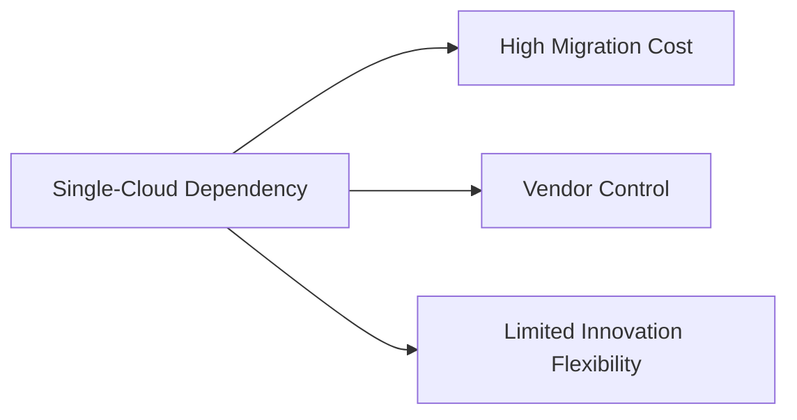

```markdown
---
title: "Multi-Cloud Mastery: How to Build Resilient Backend Systems Across AWS, Azure, and GCP"
date: 2023-11-15
author: "Alex Carter, Senior Backend Engineer"
tags: ["Cloud", "DevOps", "Backend Design", "Anti-Fragility"]
description: "Learn how to implement a robust multi-cloud strategy for your backend systems. Avoid vendor lock-in and build systems that adapt to any cloud environment."
---

# Multi-Cloud Mastery: How to Build Resilient Backend Systems Across AWS, Azure, and GCP

Modern backend systems can't afford to rely on a single cloud provider. When you hear about AWS outages, Azure pricing changes, or Google Cloud platform limitations, you understand why *multi-cloud* isn't just a buzzword—it's a necessity for resilience and cost-efficiency. But how do you *actually* design systems that work across multiple cloud providers without reinventing the wheel every time you add a new provider?

In this guide, we'll walk through a practical **multi-cloud strategy** for your backend systems. We'll cover the core challenges, architectural approaches, real-world code examples, and the pitfalls to avoid. By the end, you'll have a toolkit to deploy resilient, cloud-agnostic backends.

---

## The Problem: Why Single-Cloud Isn’t Enough

### **1. Vendor Lock-In**
Many teams start on a single cloud (AWS, Azure, or GCP) and gradually become dependent on proprietary services. For example, if your team relies on **AWS Lambda + DynamoDB + S3**, migrating to Azure requires rewriting significant parts of your stack—even for minor features.



### **2. Unplanned Outages & Cost Spikes**
Even major cloud providers experience outages (e.g., AWS’s 2022 outage affecting thousands of services). Without redundancy, your entire system can go down. Additionally, cloud pricing models can shift unexpectedly (e.g., Azure’s sudden compute price changes in 2023).

### **3. Team Skill Fragmentation**
If your team is deeply specialized in one cloud, adding another (e.g., switching from AWS to GCP) requires retraining, slowing down innovation. This creates bottlenecks in product development.

### **4. Customization Overkill**
Cloud providers often optimize for their own ecosystems. For instance:
- AWS RDS vs. Azure SQL vs. Cloud SQL (GCP) have different pricing, features, and SQL dialects.
- IAM roles, networking models, and observability tools vary drastically between clouds.

### **Real-World Example: The Cost of Monoculture**
A fintech startup built on AWS Lambda + DynamoDB saw a **40% cost increase** after AWS introduced new pricing tiers. They had no backup plan and faced delays in adjusting their architecture.

---
## The Solution: Building a Multi-Cloud Strategy

The key to multi-cloud success is **abstraction**—hiding cloud-specific details behind a unified interface. This way, your application logic remains the same, regardless of the underlying cloud.

### **Core Principles**
1. **Infrastructure as Code (IaC) First** – Use tools like Terraform, Pulumi, or Crossplane to define infrastructure declaratively.
2. **Containerization & Orchestration** – Run workloads in Kubernetes (EKS, AKS, GKE) instead of cloud-specific services.
3. **Cloud-Agnostic Services** – Replace vendor-specific databases, queues, and APIs with open standards (e.g., PostgreSQL instead of RDS).
4. **Feature Flags & Modularity** – Build components that can be swapped in/out without downtime.
5. **Observability Across Clouds** – Use open tools like Prometheus, Grafana, and OpenTelemetry.

---

## Components/Solutions: Key Building Blocks

| **Component**          | **Single-Cloud Approach**               | **Multi-Cloud Solution**                          |
|-------------------------|-----------------------------------------|---------------------------------------------------|
| **Compute**             | AWS Lambda / EC2 / Azure Functions      | Kubernetes (EKS/AKS/GKE) + Serverless Functions   |
| **Database**            | DynamoDB / MongoDB Atlas                | PostgreSQL (RDS / Azure SQL / Cloud SQL) + Flyway |
| **Storage**             | S3 / Azure Blob Storage                | MinIO / Ceph (self-hosted S3-compatible)         |
| **Messaging**           | SQS / Azure Service Bus                | NATS / RabbitMQ (self-hosted or managed)          |
| **Identity & Auth**     | Cognito / Azure AD                      | Keycloak / OAuth2 (open standards)                |
| **CI/CD**               | AWS CodePipeline / Azure DevOps        | GitHub Actions / ArgoCD (cloud-agnostic)        |

---

## Implementation Guide: Step-by-Step

### **Phase 1: Audit Your Current Stack**
Before migrating, assess your dependencies:
```bash
# Example: Check AWS-specific services in your Terraform
terraform plan | grep -i "module.aws_*"
```
**Goal:** Identify cloud-specific services that need replacement.

### **Phase 2: Adopt Containerization**
Wrap your backend services in Docker containers and deploy to Kubernetes (EKS/AKS/GKE).

#### **Example: Dockerfile for a Multi-Cloud App**
```dockerfile
# Multi-cloud Dockerfile (works on AWS, Azure, GCP)
FROM python:3.11-slim

WORKDIR /app
COPY requirements.txt .
RUN pip install --no-cache-dir -r requirements.txt

COPY . .

# Use a non-root user for security
RUN useradd -m appuser && chown -R appuser /app
USER appuser

EXPOSE 8000
CMD ["gunicorn", "--bind", "0.0.0.0:8000", "app:app"]
```

### **Phase 3: Replace Vendor-Locked Services with Open Standards**
#### **Example: PostgreSQL Database (Cloud-Agnostic)**
Instead of DynamoDB, use **PostgreSQL with Flyway** for migrations:
```sql
-- Flyway migration (works on RDS, Azure SQL, Cloud SQL)
-- V1__initial_schema.sql
CREATE TABLE users (
    id SERIAL PRIMARY KEY,
    username VARCHAR(50) UNIQUE NOT NULL,
    email VARCHAR(100) UNIQUE NOT NULL
);
```

#### **Example: Cloud-Agnostic Storage with MinIO**
```python
# Python client for MinIO (compatible with S3)
import boto3
from minio import Minio

# AWS S3 vs MinIO (self-hosted) – same API!
client = Minio(
    "minio-server:9000",
    access_key="minioadmin",
    secret_key="minioadmin",
    secure=False
)

# Upload file (works on any cloud)
client.fput_object("my-bucket", "data.csv", "/local/data.csv")
```

### **Phase 4: Deploy with Terraform (Cloud-Agnostic IaC)**
```hcl
# main.tf (deployable to AWS, Azure, GCP)
terraform {
  required_providers {
    aws = {
      source  = "hashicorp/aws"
      version = "~> 5.0"
    }
    azure = {
      source  = "hashicorp/azure"
      version = "~> 3.0"
    }
    google = {
      source  = "hashicorp/google"
      version = "~> 4.0"
    }
  }
}

# Provider selection (can be switched per environment)
provider "aws" {}
# provider "azure" {}
# provider "google" {}

resource "aws_instance" "app_server" {
  ami           = "ami-0c55b159cbfafe1f0"
  instance_type = "t3.micro"
  tags = {
    Name = "Multi-Cloud App"
  }
}
```

### **Phase 5: CI/CD with GitHub Actions**
```yaml
# .github/workflows/deploy.yaml (works on any cloud)
name: Deploy to Cloud

on:
  push:
    branches: [ main ]

jobs:
  build-and-deploy:
    runs-on: ubuntu-latest
    steps:
      - uses: actions/checkout@v3
      - name: Build Docker image
        run: docker build -t my-app .
      - name: Deploy to Kubernetes (EKS/AKS/GKE)
        run: |
          # Use kubectl for multi-cloud deployments
          kubectl set image deployment/my-app my-app=my-app:latest
```

---

## Common Mistakes to Avoid

1. **Over-Abstraction**
   - *Problem:* Creating a 100-layer abstraction for every cloud-specific feature.
   - *Solution:* Only abstract what matters (e.g., storage, networking). Keep cloud-specific optimizations (e.g., GPU instances) for when needed.

2. **Ignoring Cost Differences**
   - *Example:* AWS Lambda pricing vs. Azure Functions can differ significantly.
   - *Solution:* Run cost comparisons before committing to a cloud.

3. **Assuming All Clouds Are Equal**
   - *Myth:* "All clouds support Kubernetes equally."
   - *Reality:* EKS, AKS, and GKE have different networking models and costs.
   - *Fix:* Test workloads in each cloud before production.

4. **No Disaster Recovery Plan**
   - *Problem:* Multi-cloud without failover is useless.
   - *Solution:* Implement **active-active** deployments or **multi-region DR**.

5. **Underestimating Team Skills**
   - *Problem:* Teams often lack expertise in multiple clouds.
   - *Solution:* Train developers in **cloud-agnostic** tools (Terraform, Kubernetes).

---

## Key Takeaways

✅ **Multi-cloud isn’t about avoiding one cloud—it’s about resilience and flexibility.**
✅ **Use open standards (PostgreSQL, Kubernetes, Docker) to reduce lock-in.**
✅ **Terraform and IaC are critical for consistency across clouds.**
✅ **Containerize everything—Kubernetes is the glue that binds multi-cloud.**
✅ **Monitor and optimize for cost—cloud pricing varies wildly.**
✅ **Start small (e.g., deploy a single service to two clouds) before full migration.**

---

## Conclusion: Your Path to Multi-Cloud Success

Building a multi-cloud backend isn’t about spreading your workload across providers arbitrarily—it’s about **strategic abstraction, resilience, and cost control**. By following the principles in this guide, you can reduce vendor lock-in, avoid outages, and future-proof your systems.

### **Next Steps**
1. **Start with a non-critical service** (e.g., a microservice) and deploy it to two clouds.
2. **Automate deployments** with Terraform/Kubernetes.
3. **Monitor costs** and optimize where possible.
4. **Iterate:** Refine your strategy as you gain experience.

Multi-cloud isn’t for the faint-hearted, but the rewards—**resilience, cost savings, and innovation freedom**—are worth the effort. Now go build something that works everywhere!

---
**Further Reading:**
- [Google’s Multi-Cloud Guide](https://cloud.google.com/blog/products/architecture-and-plan/multi-cloud-strategy)
- [Kubernetes Multi-Cloud Patterns](https://kubernetes.io/blog/2021/06/02/multi-cloud-strategy/)
- [Terraform Multi-Cloud Providers](https://registry.terraform.io/providers/hashicorp/aws/latest/docs)

---
**Your turn:** What’s the first cloud-specific service you’ll replace in your stack? Share your journey on Twitter [@alexcarterdev](https://twitter.com/alexcarterdev)!
```