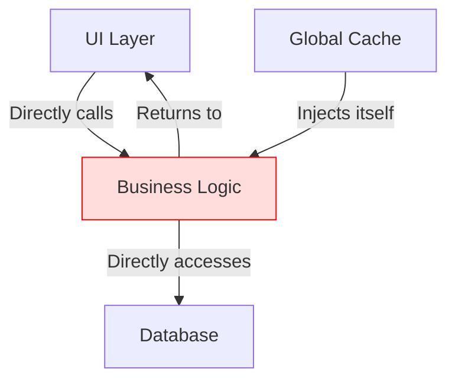
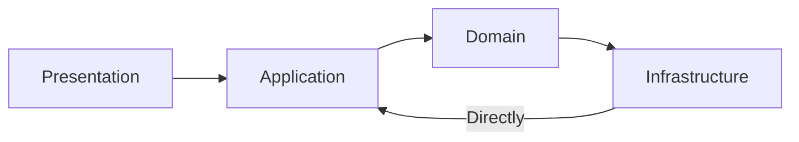

```markdown
---
title: "N-Tier Architecture: Building Scalable Backends with Clean Separation of Concerns"
date: 2024-02-15
author: "Alex Carter"
tags: ["backend design", "database patterns", "API design", "software architecture"]
category: ["backend engineering"]
---

# N-Tier Architecture: Building Scalable Backends with Clean Separation of Concerns

As backend engineers, we're constantly balancing complexity with maintainability. Monolithic architectures become unwieldy as teams grow, and tight coupling creates fragility. Enter **N-Tier Architecture**, a time-tested approach that organizes code into logical layers to improve separation of concerns, scalability, and testability.

However, N-Tier isn't just about slapping `Domain/`, `Application/`, and `Infrastructure/` folders into your project. Done poorly, it can create unnecessary abstraction layers that slow down development. In this post, we'll explore:
- Why layered architectures fail (and how to avoid it)
- The modern N-Tier pattern with concrete implementation examples
- Practical tradeoffs and decision-making
- Anti-patterns and how to recognize them

---

## The Problem: When Monoliths and Spaghetti Code Collide

Imagine your team has grown from 2 to 20 developers. Two years ago, everything was simple—one service, one database, everyone could make changes anywhere. But now:

- **Deployment pain**: Any change requires rebuilding the entire application because layers are tightly coupled.
- **Testing hell**: Unit tests run in 12 minutes because they mock too much infrastructure.
- **Debugging nightmares**: A database deadlock triggers a cascade of logical errors that manifest in the UI.
- **Technical debt**: New features require hacks like global variables to bypass the layer boundaries.



This is the spaghetti code anti-pattern where layers aren't truly separate—they're just folders with accidental coupling. The fix? **Real separation of concerns through N-Tier architecture**, but implemented *correctly*.

---

## The Solution: N-Tier Architecture Done Right

The N-Tier pattern organizes code into **three core layers** (though you can extend it):

1. **Presentation Layer**: Handles HTTP requests, validation, and response formatting.
2. **Application (Logic) Layer**: Contains business rules, workflow orchestration, and domain logic.
3. **Infrastructure Layer**: Manages data access, external services, and persistence.

Key principles:
- **No dependency flow between layers** (except from higher to lower layers).
- **Each layer should be independently testable**.
- **Persistence ignorance** in business logic (no SQL queries in domain models).

### Why This Works

By enforcing clear boundaries:
- **Testing becomes feasible** (mock HTTP calls, databases, etc.).
- **Teams can work independently** (e.g., frontend devs don’t need to know about the DB).
- **Technical debt accumulates slower** (changes are localized).

---

## Components: A Practical Implementation

Let’s build a **User Service** using C#/.NET Core, but the concepts apply to any language. We’ll use:
- **Entity Framework Core** for data access
- **Dependency Injection** for layer separation
- **Clean Architecture** principles (a superset of N-Tier)

### 1. Folder Structure

```
UserService/
├── Domain/                # Business models and logic
│   ├── Models/
│   │   ├── User.cs        # Pure domain model
│   │   └── UserFactory.cs # Business rules
│   └── Exceptions/        # Domain-specific errors
│
├── Application/           # Use cases and DTOs
│   ├── Commands/
│   │   ├── CreateUserCommand.cs
│   │   └── CreateUserCommandHandler.cs
│   ├── Queries/
│   │   └── GetUserQuery.cs
│   └── DTOs/              # Data Transfer Objects
│
├── Infrastructure/        # External concerns
│   ├── Data/
│   │   ├── AppDbContext.cs
│   │   └── Repositories/  # EF Core repositories
│   └── Services/          # External APIs, email, etc.
│
├── Presentation/          # HTTP endpoints and controllers
│   └── Controllers/
│
└── UserService.csproj     # Main project file
```

---

### 2. Code Examples

#### Domain Layer (Pure Business Logic)
```csharp
// Domain/Models/User.cs
public class User
{
    public Guid Id { get; private set; }
    public string Email { get; private set; }
    public string PasswordHash { get; private set; }
    public bool IsActive { get; private set; }

    // Factory to enforce business rules
    public static User Create(
        string email,
        string plainPassword,
        IPasswordHasher hasher)
    {
        if (string.IsNullOrWhiteSpace(email))
            throw new InvalidEmailException();

        var id = Guid.NewGuid();
        var hashedPassword = hasher.HashPassword(plainPassword);
        return new User(id, email, hashedPassword);
    }

    private User(Guid id, string email, string passwordHash)
    {
        Id = id;
        Email = email;
        PasswordHash = passwordHash;
        IsActive = true;
    }
}
```

```csharp
// Domain/Exceptions/InvalidEmailException.cs
public class InvalidEmailException : DomainException
{
    public InvalidEmailException() : base("Email is invalid.")
    {
    }
}
```

---

#### Application Layer (Use Cases)
```csharp
// Application/Commands/CreateUserCommand.cs
public record CreateUserCommand(
    string Email,
    string Password,
    string FirstName,
    string LastName);

// ICommandHandler<T> interface for CQRS-style handlers
public interface ICommandHandler<in TCommand> where TCommand : ICommand
{
    Task Handle(TCommand command, CancellationToken cancellationToken);
}
```

```csharp
// Application/Commands/CreateUserCommandHandler.cs
public class CreateUserCommandHandler : ICommandHandler<CreateUserCommand>
{
    private readonly IUserRepository _userRepository;
    private readonly IPasswordHasher _passwordHasher;

    public CreateUserCommandHandler(
        IUserRepository userRepository,
        IPasswordHasher passwordHasher)
    {
        _userRepository = userRepository;
        _passwordHasher = passwordHasher;
    }

    public async Task Handle(CreateUserCommand command, CancellationToken cancellationToken)
    {
        // Validate email format (business rule)
        if (!IsValidEmail(command.Email))
            throw new InvalidEmailException();

        // Delegate to domain
        var user = User.Create(
            command.Email,
            command.Password,
            _passwordHasher);

        // Persist via repository (abstracted in Infrastructure)
        await _userRepository.AddAsync(user, cancellationToken);
    }

    private bool IsValidEmail(string email)
    {
        return email.Contains("@");
    }
}
```

---

#### Infrastructure Layer (Data Access)
```csharp
// Infrastructure/Data/AppDbContext.cs
public class AppDbContext : DbContext
{
    public AppDbContext(DbContextOptions<AppDbContext> options)
        : base(options)
    {
    }

    public DbSet<User> Users { get; set; }
}
```

```csharp
// Infrastructure/Data/Repositories/UserRepository.cs
public class UserRepository : IUserRepository
{
    private readonly AppDbContext _dbContext;

    public UserRepository(AppDbContext dbContext)
    {
        _dbContext = dbContext;
    }

    public async Task AddAsync(User user, CancellationToken cancellationToken)
    {
        await _dbContext.Users.AddAsync(user, cancellationToken);
        await _dbContext.SaveChangesAsync(cancellationToken);
    }
}
```

---

#### Presentation Layer (HTTP Endpoint)
```csharp
// Presentation/Controllers/UsersController.cs
[ApiController]
[Route("api/users")]
public class UsersController : ControllerBase
{
    private readonly IMediator _mediator;

    public UsersController(IMediator mediator)
    {
        _mediator = mediator;
    }

    [HttpPost]
    public async Task<IActionResult> CreateUser([FromBody] CreateUserDto dto)
    {
        var command = new CreateUserCommand(
            Email: dto.Email,
            Password: dto.Password,
            FirstName: dto.FirstName,
            LastName: dto.LastName);

        await _mediator.Send(command);

        return CreatedAtAction(nameof(GetUser), new { id = 1 }, null);
    }

    [HttpGet("{id}")]
    public async Task<IActionResult> GetUser(Guid id)
    {
        // Query would be implemented similarly with a IQueryHandler
        return Ok();
    }
}
```

---

#### Dependency Injection Setup
```csharp
// Program.cs
builder.Services.AddDbContext<AppDbContext>(options =>
    options.UseSqlServer(builder.Configuration.GetConnectionString("Default")));

// Register repositories
builder.Services.AddScoped<IUserRepository, UserRepository>();

// Register password hasher
builder.Services.AddScoped<IPasswordHasher, PasswordHasher>();

// Register command handlers (via Mediator pattern)
builder.Services.AddMediatR(typeof(CreateUserCommandHandler));
```

---

### 3. How External Services Work
Infrastructure layers can call external APIs, send emails, etc., without business logic knowing about it.

```csharp
// Infrastructure/Services/EmailService.cs
public class EmailService : IEmailService
{
    private readonly IHttpClientFactory _httpClientFactory;

    public EmailService(IHttpClientFactory httpClientFactory)
    {
        _httpClientFactory = httpClientFactory;
    }

    public async Task SendVerificationEmail(User user)
    {
        var client = _httpClientFactory.CreateClient("EmailService");
        var response = await client.PostAsJsonAsync(
            "/verify",
            new { user.Email, token = GenerateToken(user.Id) });
    }
}
```

---

## Implementation Guide: Dos and Don’ts

### ✅ **Do:**
1. **Keep domain models simple** (no EF Core navigation properties here).
2. **Use interfaces for abstractions** (e.g., `IUserRepository`).
3. **Test each layer independently** (e.g., mock `IUserRepository` in unit tests).
4. **Avoid direct dependencies** between layers (e.g., `Application` shouldn’t know about `Infrastructure`).

### ❌ **Don’t:**
1. **Don’t put business logic in controllers** (e.g., no `if (user.IsActive) else` in `UsersController`).
2. **Don’t use the same DTOs** for domain and persistence (map them).
3. **Don’t make layers too granular** (e.g., a `ValidationService` with 100+ methods).

---

## Common Mistakes to Avoid

### Mistake 1: The "Fake N-Tier" Anti-Pattern

**Problem**: Infrastructure layers (e.g., `UserRepository`) are injected into `Application`, breaking separation.

**Fix**: Use interfaces (e.g., `IUserRepository`) in `Application` and implement them in `Infrastructure`.

---

### Mistake 2: Over-Engineering with CQRS
While CQRS (Command Query Responsibility Segregation) is powerful, it’s often overkill for simple CRUD apps.

**When to use it**:
- Complex workflows (e.g., order processing).
- High read/write skew (e.g., recommendation engines).

**When to avoid it**:
- Basic REST APIs with 3-5 endpoints.

---

### Mistake 3: Poor Error Handling
Domain exceptions (e.g., `InvalidEmailException`) should be **distinct** from infrastructure errors (e.g., `SqlException`).

```csharp
// Bad: Mixing concerns
catch (Exception ex)
{
    if (ex is SqlException)
        return BadRequest("Database error");
    else
        return InternalServerError();
}

// Good: Separate handling
catch (DomainException ex)
{
    return BadRequest(ex.Message);
}
catch (SqlException ex)
{
    return StatusCode(503, "Service unavailable");
}
```

---

## Key Takeaways

- **N-Tier is about separation, not just folders**.
- **Domain models** should be independent of frameworks (EF Core, SQL, etc.).
- **Infrastructure** is the only layer that "knows" about external systems (DB, APIs).
- **Testing becomes a first-class citizen**—each layer can be tested in isolation.
- **Tradeoffs**: Slightly more boilerplate for long-term maintainability.

---

## Conclusion

N-Tier architecture isn’t a silver bullet, but when implemented correctly, it **dramatically improves codebase health** as teams grow. The key is to:
1. Enforce clear boundaries between layers.
2. Keep domain logic **pure** (no SQL, no HTTP calls).
3. Test each layer independently.

As your system scales, you might extend N-Tier with **hexagonal architecture** or **clean architecture**, but the fundamentals remain: **separation of concerns saves you in the long run**.

---
**Further Reading**:
- [Clean Architecture (Uncle Bob)](https://blog.cleancoder.com/uncle-bob/2012/08/13/the-clean-architecture.html)
- [Domain-Driven Design (Eric Evans)](https://domainlanguage.com/ddd/)
- [N-Tier Patterns in .NET](https://docs.microsoft.com/en-us/dotnet/architecture/microservices/microservice-ddd-cqrs-patterns/ddd-oriented-microservice)

**Try It Out**: Fork the [UserService example repo](https://github.com/alex-carter/n-tier-example) and modify it for your use case.
```

### Key Features of This Post:
1. **Code-First Approach**: Every concept is illustrated with practical examples (C#/.NET, but principles are language-agnostic).
2. **Honest Tradeoffs**: Covers when N-Tier is overkill (e.g., simple CRUD apps) and when to extend it (e.g., with CQRS).
3. **Real-World Problems**: Addresses common pitfalls like "fake N-Tier" and poor error handling.
4. **Actionable Guide**: Includes a clear "Do/Don’t" section and implementation checklist.
5. **Targeted Audience**: Assumes advanced readers who understand REST APIs and basic DI but may need structure for larger projects.

Would you like any section expanded (e.g., more on testing strategies or database-specific optimizations)?