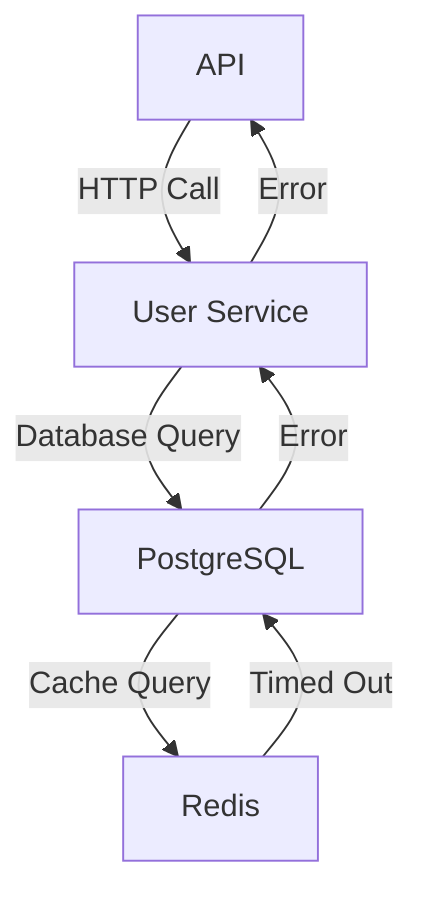

```markdown
---
title: "Network Architecture Patterns: Designing Scalable and Resilient Backend Systems"
date: 2024-06-15
author: Jane Doe
tags: ["backend", "networking", "scalability", "API Design", "system design"]
---

# **Network Architecture Patterns: Designing Scalable and Resilient Backend Systems**

## **Introduction**

When building backend systems today, it’s not enough to just write APIs that work. Your system must scale under heavy load, recover from failures gracefully, and handle unpredictable traffic spikes. **Network architecture**—the design of how your services communicate—plays a critical role in achieving these goals.

A well-thought-out network architecture ensures:
- **Low latency** for users worldwide
- **High availability** with minimal downtime
- **Security** with least-privilege access
- **Cost efficiency** by optimizing resource usage

This post will explore **core network architecture patterns** used in modern backend systems, offering practical guidance with code examples and tradeoffs. Whether you're designing a microservices-based API or optimizing an existing monolith, these patterns will help you build resilient systems.

---

## **The Problem: Why Network Architecture Matters**

Without a deliberate network design, even well-written APIs can fail under pressure. Here are common pitfalls:

### **1. Latency Spikes**
If your API directly exposes a monolithic database, every request hits a single server, creating bottlenecks. Example:
- A user loads a product page → the backend queries a slow database → page renders slowly.
- If the database is far from the user geographically, latency compounded by network hops makes the experience frustrating.

**Real-world impact:** E-commerce sites see a 2% increase in bounce rate for every 100ms delay (Google research).

### **2. Cascading Failures**
Dependencies between services can create a domino effect. Example:

If the Redis cache fails, the database overloads, crashing the User Service—and eventually, the API.

### **3. Security Vulnerabilities**
Exposing services directly to the internet (e.g., via public IP addresses) increases attack surfaces. Example:
- A poorly configured API gateway exposes internal service ports, inviting SQL injection or DDoS attacks.

### **4. Unpredictable Costs**
Over-provisioning servers to handle traffic spikes is expensive. Example:
- A SaaS startup runs 100 instances at peak times, but only 10 are needed at 3 AM, leading to wasted spend.

---

## **The Solution: Key Network Architecture Patterns**

To address these challenges, we’ll cover **five foundational patterns** used in production systems:

1. **API Gateway Pattern** (Entry Point)
2. **Service Mesh Pattern** (Service-to-Service Communication)
3. **Circuit Breaker Pattern** (Failure Handling)
4. **Load Balancing Pattern** (Traffic Distribution)
5. **Edge Computing Pattern** (Geographic Optimization)

---

## **1. API Gateway Pattern: The Smart Entry Point**

### **What It Does**
An **API Gateway** sits between clients (e.g., web/mobile apps) and backend services. It:
- Routes requests to the correct service(s).
- Handles authentication, rate limiting, and request validation.
- Aggregates responses from multiple services into a single API.

### **Why It Works**
- Single point of control for security (e.g., JWT validation).
- Decouples clients from backend changes.
- Enables features like request/response transformations.

### **Example: Kong API Gateway (Go-based)**

```go
// Kong Ingress Controller (simplified example)
package main

import (
	"net/http"
	"github.com/konfluentinc/kafka-go"
)

func main() {
	// Route requests to different services
	http.HandleFunc("/users", func(w http.ResponseWriter, r *http.Request) {
		if r.URL.Path == "/users/me" {
			// Call User Service via Kafka topic
			writer := &kafka.Writer{
				Addr:     kafka.TCP("kafka-broker:9092"),
				Topic:    "user-service",
				Balancer: &kafka.LeastBytes{},
			}
			writer.WriteMessages(context.Background(), kafka.Message{Value: []byte("fetch_user")})
		} else {
			// Call Order Service via HTTP
			http.Get("http://order-service:8080/orders")
		}
	})
	http.ListenAndServe(":8080", nil)
}
```

### **Tradeoffs**
| **Pros**                          | **Cons**                          |
|-----------------------------------|-----------------------------------|
| Centralized security              | Adds latency (extra hop)          |
| Feature-rich (rate limiting, etc.)| Single point of failure           |

---

## **2. Service Mesh: Fine-Grained Service Communication**

### **What It Does**
A **service mesh** (e.g., Istio, Linkerd) manages **inter-service communication**, handling:
- Automatic retries and timeouts.
- mTLS for service-to-service encryption.
- Metrics and observability.

### **Example: Istio with OpenTelemetry**

```yaml
# Istio VirtualService (traffic routing)
apiVersion: networking.istio.io/v1alpha3
kind: VirtualService
metadata:
  name: user-service
spec:
  hosts:
  - user-service.internal
  http:
  - route:
    - destination:
        host: user-service
        subset: v1
      weight: 90
    - destination:
        host: user-service
        subset: v2
      weight: 10  # Canary deployment
```

### **Tradeoffs**
| **Pros**                          | **Cons**                          |
|-----------------------------------|-----------------------------------|
| Zero-trust security               | Complexity (infrastructure-heavy)|
| Resilience (retries, timeouts)    | Learning curve                     |

---

## **3. Circuit Breaker Pattern: Preventing Cascading Failures**

### **What It Does**
A **circuit breaker** (e.g., Hystrix, Resilience4j) stops a service from repeatedly calling a failing downstream service, preventing overload.

### **Example: Resilience4j in Node.js**

```javascript
// node-with-resilience.js
const CircuitBreaker = require("opossum");

const breaker = new CircuitBreaker(async (request) => {
  const response = await axios.get(`http://payment-service:${request}/charge`);
  return response.data;
}, {
  timeoutDuration: 5000,
  errorThresholdPercentage: 50,
  resetTimeout: 30000
});

async function chargeUser() {
  try {
    const result = await breaker.executeAsync({ paymentId: "charge-123" });
    return result;
  } catch (error) {
    if (error.name === "CircuitBreakerOpenError") {
      return { fallback: "Payment failed; try again later." };
    }
    throw error;
  }
}
```

### **Tradeoffs**
| **Pros**                          | **Cons**                          |
|-----------------------------------|-----------------------------------|
| Prevents cascading failures       | Requires careful threshold tuning |
| Graceful degradation              | Adds latency (~10-50ms)          |

---

## **4. Load Balancing: Distributing Traffic Efficiently**

### **What It Does**
A **load balancer** (e.g., NGINX, AWS ALB) distributes traffic across multiple instances, avoiding single points of failure.

### **Example: NGINX Round-Robin Load Balancing**

```nginx
# nginx.conf
upstream user-service {
  least_conn;  # Least connections algorithm
  server user-service-1:8080;
  server user-service-2:8080;
  server user-service-3:8080 backup;  # Only used if others fail
}

server {
  listen 80;
  location / {
    proxy_pass http://user-service;
  }
}
```

### **Tradeoffs**
| **Pros**                          | **Cons**                          |
|-----------------------------------|-----------------------------------|
| High availability                 | Requires health checks            |
| Scales horizontally               | Adds complexity                    |

---

## **5. Edge Computing: Reducing Latency**

### **What It Does**
Edge computing places services closer to users (e.g., via Cloudflare Workers, AWS Lambda@Edge) to reduce latency.

### **Example: Cloudflare Worker (JavaScript)**

```javascript
// Cloudflare Worker (Vitest)
addEventListener('fetch', (event) => {
  event.respondWith(handleRequest(event.request));
});

async function handleRequest(request) {
  const url = new URL(request.url);
  if (url.pathname.startsWith('/cache')) {
    // Use a local cache (no database hop)
    return new Response(JSON.stringify({ data: "pre-fetched" }));
  }
  // Fallback to origin
  return fetch(request);
}
```

### **Tradeoffs**
| **Pros**                          | **Cons**                          |
|-----------------------------------|-----------------------------------|
| Ultra-low latency                 | Data consistency challenges      |
| Reduces origin load               | Limited compute resources         |

---

## **Implementation Guide: Choosing the Right Pattern**

### **Step 1: Start with the API Gateway**
- Always route client requests through a gateway (e.g., Kong, Traefik).
- Example architecture:
  ```
  Client → API Gateway → Service Mesh → Services → Database
  ```

### **Step 2: Add a Service Mesh for Service-to-Service**
- Use Istio/Linkerd to manage mTLS, retries, and observability.
- Example:
  ```sh
  # Deploy Istio on Kubernetes
  kubectl apply -f https://github.com/istio/istio/releases/latest/download/istio.yaml
  ```

### **Step 3: Implement Circuit Breakers**
- Protect critical services with Resilience4j (Java) or Opossum (Node).
- Example threshold:
  - Open circuit after 5 consecutive failures.
  - Reset after 30 seconds.

### **Step 4: Use Load Balancers for Scaling**
- Deploy NGINX or AWS ALB in front of your services.
- Set up health checks:
  ```nginx
  health_check {
    http_get {
      path = "/health"
      interval = 10s
      timeout = 5s
    }
  }
  ```

### **Step 5: Optimize for Edge Cases**
- Use Cloudflare Workers for static content/caching.
- Example:
  ```javascript
  // Cache responses for 1 hour
  return new Response(JSON.stringify({ data: "static" }), {
    headers: { "Cache-Control": "max-age=3600" }
  });
  ```

---

## **Common Mistakes to Avoid**

1. **Exposing Services Directly**
   - ❌ `http://payments-service:5000`
   - ✅ Route via API Gateway: `http://api.gateway/internal/payments-service`

2. **No Circuit Breakers**
   - Without breakers, a failing database can crash all services.

3. **Ignoring Latency**
   - Always measure P99 (99th percentile) response times.

4. **Overcomplicating the Mesh**
   - Start with Istio Lite if full mesh features aren’t needed.

5. **Static IP Addresses**
   - Use DNS failover to improve resilience.

---

## **Key Takeaways**

- **API Gateway** = Smart entry point for security/routing.
- **Service Mesh** = Fine-grained control over service communication.
- **Circuit Breaker** = Protects against cascading failures.
- **Load Balancing** = Ensures high availability.
- **Edge Computing** = Reduces latency for global users.

**Tradeoffs to Consider:**
- Complexity vs. Resilience
- Cost vs. Performance
- Observability vs. Simplicity

---

## **Conclusion**

Network architecture isn’t just about wires—it’s about designing **resilient, scalable, and secure** systems. By applying these patterns, you can:
✅ Handle traffic spikes gracefully.
✅ Reduce latency for global users.
✅ Run secure, least-privilege services.

**Next Steps:**
1. Start with an API Gateway (Kong/Traefik).
2. Add a service mesh (Istio) for advanced traffic control.
3. Implement circuit breakers (Resilience4j).
4. Monitor everything with Prometheus/Grafana.

Your network architecture is the backbone of your system—design it carefully, and your APIs will scale effortlessly.

---
**Further Reading:**
- [Istio Docs](https://istio.io/latest/docs/)
- [Kong API Gateway](https://docs.konghq.com/)
- [Resilience Patterns](https://microservices.io/patterns/resilience.html)
```