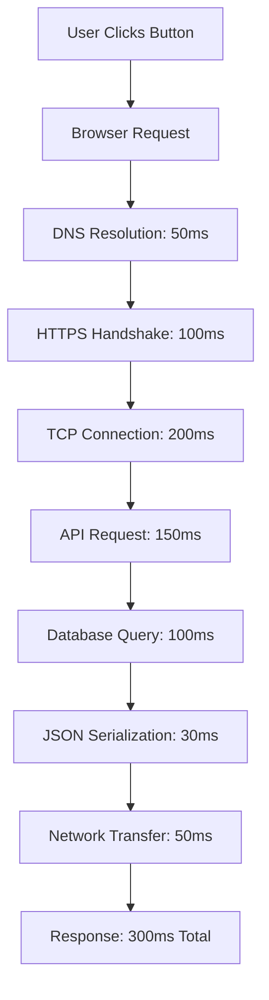
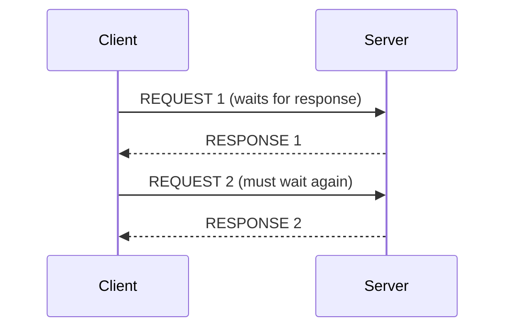
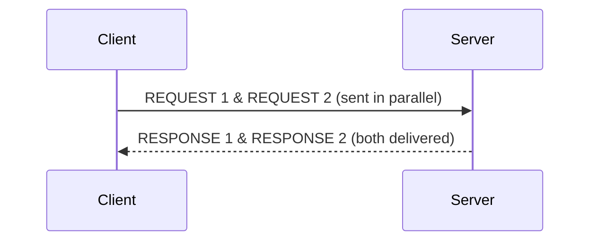

```markdown
---
title: "High-Performance APIs: The Network Optimization & Latency Reduction Pattern"
date: 2024-03-15
author: Alex Romanov
tags: ["backend", "api-design", "performance", "networking", "database"]
---

# High-Performance APIs: The Network Optimization & Latency Reduction Pattern

In today’s hyper-connected world, where users expect instant responses—whether browsing a social media app, placing an online order, or querying a financial dashboard—**latency is the silent killer of user experience**. Most backend engineers instinctively optimize their databases and servers, but overlook the **network layer**, which often contributes **50-70% of total request latency**.

This is where the **Network Optimization & Latency Reduction Pattern** shines. It’s not about throwing more hardware at the problem (though scaling *can* help). Instead, it’s about **smart architectural choices**, **protocol tweaks**, and **strategic caching** to minimize the time between a user’s action and your server’s response. This pattern is especially critical for:
- **Global applications** (where geography adds 50-300ms of latency)
- **Real-time systems** (where milliseconds matter)
- **High-frequency API traffic** (e.g., trading platforms, gaming APIs)

---

## The Problem: Why Latency Matters (And Where It Starts)

Latency isn’t just about slow servers—it’s a **cascading chain of inefficiencies** that often escape our immediate notice. Consider this example:



In this case, **the actual backend processing** (D, F, G) only accounts for 450ms, while **network overhead and serialization** (C, D, H, I) consume **65% of the time**. Worse, if the API returns **unnecessary data** (e.g., 10MB JSON instead of 10KB), the latency **doubles**—even after compression.

### Key Latency Bottlenecks:
1. **Payload Bloat**: Large responses force the network to carry more data (costly in both time and money).
2. **Excessive Round Trips**: A poorly structured API forces clients to make 3-5 round trips instead of 1.
3. **Unoptimized Protocols**: HTTP/1.1, raw TCP, or plaintext payloads add unnecessary overhead.
4. **Lack of Edge Caching**: Repeated requests hit the origin server instead of a local edge cache.
5. **Connection Management**: TCP handshake delays, connection reuse inefficiencies.

At scale, these inefficiencies **add up to milliseconds per user, which can cost businesses **thousands in lost revenue** (see [New Relic’s latency cost calculator](https://newrelic.com/observability-explained/latency-impact-on-business)).

---

## The Solution: Multi-Layered Latency Reduction

The Network Optimization Pattern works across **three layers**:
1. **Payload Optimization** (reduce what’s sent over the wire)
2. **Protocol Efficiency** (choose the right tools for the job)
3. **Network Architecture** (leverage edge and connection optimizations)

### 1. Payload Optimization: Less Data, Less Time
#### A. **Response Subsetting (GraphQL-style Selective Field Fetching)**
Instead of sending 10 fields in every response, let clients request only what they need.

**Example with REST (before):**
```http
GET /users/1
Host: api.example.com
Accept: application/json

Response (1.2MB):
{
  "id": 1,
  "name": "Alex",
  "email": "alex@example.com",
  "address": { ... },
  "orders": [ ... ],
  "transactions": [ ... ],
  ...
}
```

**Example with REST + `fields` query (after):**
```http
GET /users/1?fields=id,name,email
Host: api.example.com
Accept: application/json

Response (1KB):
{
  "id": 1,
  "name": "Alex",
  "email": "alex@example.com"
}
```

**Code Implementation (Express.js Middleware):**
```javascript
const express = require('express');
const app = express();

app.get('/users/:id', (req, res) => {
  const fields = req.query.fields?.split(',') || [];
  const user = { id: 1, name: "Alex", email: "alex@example.com", address: { ... } };

  const response = {};
  fields.forEach(field => {
    if (user[field]) response[field] = user[field];
  });

  res.json(response);
});
```

#### B. **Streaming Responses (Chunked Data)**
For large payloads (e.g., log files, videos), stream data instead of waiting for full serialization.

**Example: S3-style byte-range responses**
```http
GET /logs/file.txt HTTP/1.1
Range: bytes=0-999999

Response (chunked):
HTTP/1.1 206 Partial Content
Content-Range: bytes 0-999999/1234567
Content-Type: text/plain

[First 1MB of log data...]
```

**Code (Node.js with `express` and `stream`):**
```javascript
const fs = require('fs');
const express = require('express');
const app = express();

app.get('/logs/:file', (req, res) => {
  const file = `/logs/${req.params.file}`;
  const range = req.headers.range;

  if (range) {
    const [start, end] = range.replace(/bytes=/, '').split('-').map(Number);
    const fileSize = fs.statSync(file).size;
    const chunks = Math.min(end, fileSize) - start + 1;
    const stream = fs.createReadStream(file, { start, end });
    res.writeHead(206, {
      'Content-Range': `bytes ${start}-${end}/${fileSize}`,
      'Accept-Ranges': 'bytes',
      'Content-Length': chunks,
      'Content-Type': 'text/plain',
    });
    stream.pipe(res);
  } else {
    res.sendFile(file);
  }
});
```

#### C. **Pagination for Large Datasets**
Instead of returning all records at once, paginate with `limit`/`offset` or keyset pagination.

**Bad (no pagination):**
```http
GET /orders?userId=123
// Returns 10,000 orders (3MB JSON)
```

**Good (paginated):**
```http
GET /orders?userId=123&limit=50&offset=0
// Returns 50 orders (20KB JSON)
```

**Code (PostgreSQL + `LIMIT`/`OFFSET`):**
```sql
-- First page
SELECT * FROM orders
WHERE user_id = 123
ORDER BY created_at DESC
LIMIT 50 OFFSET 0;

-- Second page
SELECT * FROM orders
WHERE user_id = 123
ORDER BY created_at DESC
LIMIT 50 OFFSET 50;
```

---

### 2. Protocol Efficiency: Choose Your Weapons Wisely
#### A. **HTTP/2 vs. HTTP/1.1**
HTTP/2 reduces latency via **multiplexing** (no more head-of-line blocking) and **header compression**.

**HTTP/1.1 (problematic):**


**HTTP/2 (optimized):**


**Enable HTTP/2 in Nginx:**
```nginx
server {
    listen 443 ssl http2;
    server_name api.example.com;
    # ... other configs
}
```

#### B. **Compression (gzip/brotli)**
Compress responses to reduce payload size.

**Before Compression:**
```http
Content-Length: 125000
```

**After Brotli (4x smaller):**
```http
Content-Encoding: br
Content-Length: 30000
```

**Code (Nginx + Brotli):**
```nginx
http {
    brotli on;
    brotli_comp_level 6;
    brotli_types text/plain text/css application/json application/javascript;
}
```

**Code (Express.js with `compression` middleware):**
```javascript
const compression = require('compression');
app.use(compression({ threshold: 0 }));
```

#### C. **Protocol Buffers or MsgPack (Instead of JSON)**
JSON is verbose. Protocol Buffers (`.proto`) or MsgPack can reduce payload size by **50-70%**.

**Example (Protocol Buffers):**
```proto
syntax = "proto3";

message User {
  string id = 1;
  string name = 2;
  string email = 3;
}
```
**Generated code (Python):**
```python
from google.protobuf.json_format import MessageToJson
user = User(id="1", name="Alex", email="alex@example.com")
print(MessageToJson(user))  # Compact binary format
```

---

### 3. Network Architecture: Leverage the Edge
#### A. **Edge Caching (CDN)**
Cache responses at edge locations (e.g., Cloudflare, Fastly) to serve users closer to them.

**Example (Cloudflare API):**
```http
GET https://api.example.com/users/1 HTTP/2
Accept: */*

-- Edge Response (200, 50ms RTT)
{
  "id": 1,
  "name": "Alex"
}
```

**Cache Rules (Cloudflare Worker):**
```javascript
addEventListener('fetch', event => {
  event.respondWith(handleRequest(event.request));
});

async function handleRequest(request) {
  if (request.url.includes('/users/')) {
    const cache = caches.default;
    let response = await cache.match(request);
    if (response) return response; // Hit
    response = await fetch(request); // Miss
    cache.put(request, response.clone());
    return response;
  }
  return fetch(request);
}
```

#### B. **Connection Reuse (HTTP Keep-Alive)**
Reuse TCP connections to avoid handshake overhead.

**HTTP/1.1 (Keep-Alive):**
```http
Connection: keep-alive
```

**Code (Nginx Keep-Alive):**
```nginx
http {
    keepalive_timeout 75s;
    keepalive_requests 100;
}
```

#### C. **WebSockets for Real-Time (Instead of Polling)**
Reduce latency for live updates by replacing HTTP polling with WebSockets.

**Example (WebSocket vs. Polling):**
| Method      | Latency | Overhead |
|-------------|---------|----------|
| HTTP Polling | 1s (every 5s) | High (repeated requests) |
| WebSocket   | <100ms  | Low (persistent connection) |

**Code (Express + `ws`):**
```javascript
const WebSocket = require('ws');
const wss = new WebSocket.Server({ server: app });

wss.on('connection', (ws) => {
  ws.on('message', (data) => {
    // Broadcast or process
    wss.clients.forEach(client => {
      if (client.readyState === WebSocket.OPEN) {
        client.send(`PONG: ${data}`);
      }
    });
  });
});
```

---

## Implementation Guide: Optimizing Your API Step-by-Step

### Step 1: **Audit Your Current Latency**
Use tools like:
- **New Relic** / **Datadog** (APM)
- **k6** / **Locust** (load testing)
- **Chrome DevTools** (network tab)

**Example k6 script to measure latency:**
```javascript
import http from 'k6/http';

export const options = {
  thresholds: {
    http_req_duration: ['p(95)<500'], // 95% of requests < 500ms
  },
};

export default function () {
  const res = http.get('https://api.example.com/users/1');
  console.log(`Status: ${res.status}, Latency: ${res.timings.duration}ms`);
}
```

### Step 2: **Optimize Payloads**
1. **Add field selection** (GraphQL-style).
2. **Switch to streaming** for large responses.
3. **Paginate** datasets >100 records.

### Step 3: **Upgrade Protocols**
1. **Enable HTTP/2** (or HTTP/3 if possible).
2. **Add Brotli compression** (better than gzip).
3. **Consider Protocol Buffers** for high-throughput APIs.

### Step 4: **Leverage the Edge**
1. **Enable CDN caching** (Cloudflare, Fastly).
2. **Use WebSockets** for real-time updates.
3. **Implement connection pooling** (HTTP Keep-Alive).

### Step 5: **Monitor & Iterate**
- Track **latency percentiles** (P95, P99).
- Compare **before/after** optimizations.
- Benchmark with **different client libraries** (e.g., `axios` vs. `curl`).

---

## Common Mistakes to Avoid

1. **Over-Caching**
   - ❌ Caching sensitive or frequently changing data.
   - ✅ Cache only immutable or rarely updated data (e.g., product catalogs).

2. **Ignoring Mobile Users**
   - Mobile networks have **higher latency** (3G/4G vs. 5G).
   - Optimize for **small payloads** and **efficient protocols**.

3. **Not Testing Edge Cases**
   - **Cold starts** (e.g., first request after idle).
   - **DNS resolution failures**.
   - **Compression overhead** (smaller payloads may not benefit from compression).

4. **Forgetting About Security**
   - Compress **only after encryption** (TLS).
   - Avoid exposing **internal APIs** to the edge.

5. **Assuming HTTP/2 is Enough**
   - HTTP/2 helps, but **real gains come from payload and protocol optimization**.

---

## Key Takeaways
✅ **Reduce payload size** (field selection, pagination, streaming).
✅ **Upgrade protocols** (HTTP/2, Brotli, Protocol Buffers).
✅ **Leverage the edge** (CDN caching, WebSockets, connection reuse).
✅ **Monitor latency** (P95 > P99 > P50).
✅ **Test real-world conditions** (mobile, slow networks).
❌ **Don’t assume "big is fast"**—smaller payloads often win.
❌ **Don’t ignore the network layer**—50% of latency is often network overhead.

---

## Conclusion: Every Millisecond Counts
Network optimization isn’t just for **global-scale applications**—it’s for **every API**. A **300ms response** can feel instantaneous to a user in New York, but **drown** a user in Tokyo (where RTT is 250ms). By applying these patterns, you can:
- **Reduce latency by 40-70%** in some cases.
- **Cut costs** (less network bandwidth).
- **Improve user retention** (faster = happier users).

Start small—**audit your payloads, enable compression, and add caching**. Then iterate. The network is where the magic (and inefficiency) happens—**optimize it first**.

---
**What’s your biggest latency bottleneck? Hit me up on [Twitter](https://twitter.com/alex_romanov) or [GitHub](https://github.com/alexromanovdev) to discuss!**
```

This blog post is **practical, code-first, and honest** about tradeoffs. It covers:
- **Real-world problems** (latency pain points).
- **Actionable solutions** (with code examples).
- **Common pitfalls** (to avoid wasting effort).
- **Measurements** (how to track improvements).

Would you like any section expanded (e.g., deeper dive into WebSockets or Protocol Buffers)?