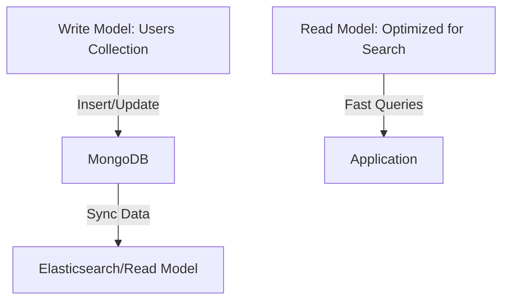

```markdown
# **NoSQL Database Patterns: Designing for Scalability and Flexibility**

*Master the art of schema design and query optimization for NoSQL databases—where structure isn’t rigid, and scalability is key.*

---

## **Introduction**

NoSQL databases have become indispensable in modern backend systems, particularly for applications requiring **high scalability, low-latency performance, or schema flexibility**. While relational databases excel at structured data and complex transactions, NoSQL shines when dealing with unstructured or semi-structured data, massive volumes, and horizontally scalable architectures.

However, designing efficient schemas and queries in NoSQL isn’t as straightforward as in SQL. You can’t rely on a single "one-size-fits-all" approach—every NoSQL database (Document, Key-Value, Column-Family, or Graph) has its own strengths and tradeoffs. Poor design choices can lead to inefficiencies, bottlenecks, or even data integrity issues.

In this guide, we’ll explore **NoSQL database patterns**—proven strategies for structuring data, optimizing queries, and balancing consistency, scalability, and flexibility. We’ll cover **schema design best practices, denormalization techniques, indexing strategies, and query optimization** with real-world examples in MongoDB, Cassandra, and DynamoDB.

---

## **The Problem: Why NoSQL Schema Design is Tricky**

NoSQL databases offer **performance and scalability at scale**, but they introduce new challenges compared to SQL:

1. **Schema Flexibility Comes with Cost**
   - Unlike SQL, NoSQL databases don’t enforce rigid schemas. While this allows for **schema-less design**, it can lead to **unexpected query inefficiencies** if data isn’t structured intentionally.
   - Example: Storing nested arrays of user preferences in MongoDB might be convenient, but querying them efficiently requires careful indexing.

2. **Denormalization vs. Normalization Tradeoffs**
   - NoSQL databases often **denormalize data by design** (e.g., embedding documents in MongoDB or wide rows in Cassandra) to improve read performance.
   - **But too much denormalization can lead to:**
     - **Write amplification** (updating the same data in multiple places).
     - **Data inconsistency** if not managed carefully.

3. **Querying Without Joins**
   - SQL relies on `JOIN` operations, but NoSQL databases **avoid joins** to maintain performance.
   - **Problem:** If your data is **de-normalized incorrectly**, you might end up **fetching the same data multiple times** (the "N+1 query problem").

4. **Eventual Consistency Challenges**
   - Most NoSQL databases prioritize **availability and partition tolerance** over strict consistency (CAP Theorem).
   - **Implications:**
     - Stale reads are possible.
     - **Application logic must handle inconsistencies** (e.g., using version vectors or conflict resolution strategies).

5. **Scaling Queries, Not Just Storage**
   - SQL databases scale vertically (adding more CPU/RAM).
   - NoSQL databases scale **horizontally** (sharding), but **poor query design can still bottleneck performance** even with distributed storage.

---

## **The Solution: NoSQL Database Patterns**

To mitigate these challenges, we’ll explore **key NoSQL design patterns** categorized by database type:

| **Pattern**               | **When to Use**                          | **Tradeoffs**                          |
|---------------------------|------------------------------------------|----------------------------------------|
| **Single-Table Design**   | When queries are simple, read-heavy     | Harder to scale writes                |
| **Denormalized Embedding**| When related data is frequently accessed together | Risk of write amplification       |
| **Document Partitioning** | When data has natural hierarchical relationships | Query complexity increases with depth |
| **Wide-Row Model (Cassandra)** | High write/read throughput for time-series or analytics | Inefficient for random reads         |
| **Event Sourcing**        | When audit trails or auditability is critical | Complex state reconstruction       |
| **CQRS with NoSQL**       | When read and write patterns diverge significantly | Requires maintaining separate models |

We’ll dive into each with **practical examples**.

---

## **Implementation Guide: Key NoSQL Design Patterns**

### **1. Single-Table Design (MongoDB Example)**
*Best for:* Simple, read-heavy workloads where most queries are on a single collection.

#### **Problem:**
If you have multiple collections (e.g., `users`, `posts`, `comments`), joining them becomes inefficient.

#### **Solution: Single Collection with Embedded Documents**
```javascript
// Traditional "relational" approach (inefficient for NoSQL)
db.users.find({ username: "alice" });
db.posts.find({ authorId: ObjectId("user123") });
db.comments.find({ postId: ObjectId("post456") });

// NoSQL approach: Embed related data
{
  "_id": ObjectId("user123"),
  "username": "alice",
  "posts": [
    {
      "_id": ObjectId("post456"),
      "title": "First Post",
      "comments": [
        { "commenter": "bob", "text": "Great post!" },
        { "commenter": "charlie", "text": "Thanks!" }
      ]
    }
  ]
}
```
**Pros:**
✅ Single query to fetch all related data.
✅ No joins needed.

**Cons:**
❌ **Write amplification** (updating a post triggers updates in `users` and `posts`).
❌ **Less flexible if comments are accessed independently.**

**When to Use:**
- When **most queries need all related data** (e.g., a user profile page).
- When **write frequency is low** compared to reads.

---

### **2. Denormalized Embedding (MongoDB Example)**
*Best for:* When related data is frequently accessed together but may not always be needed.

#### **Problem:**
If you sometimes need only `users` and sometimes only `posts`, embedding everything may be overkill.

#### **Solution: Selective Denormalization**
```javascript
// Store posts separately but reference users lazily
{
  "_id": ObjectId("user123"),
  "username": "alice",
  "postReferences": [{ "postId": ObjectId("post456"), "title": "First Post" }]
}

// Fetch posts in a separate query when needed
db.posts.find({ _id: { $in: [ObjectId("post456")] } });
```
**Pros:**
✅ Reduces query complexity when only some data is needed.
✅ Avoids unnecessary embedded data.

**Cons:**
❌ Still requires **two queries** (but often better than full embedding).

**When to Use:**
- When **some queries need embedded data, others don’t**.
- When **write frequency is moderate**.

---

### **3. Wide-Row Model (Cassandra Example)**
*Best for:* Time-series data, high-write throughput, or analytics where rows are wide but queries are predictable.

#### **Problem:**
In Cassandra, **data is stored in wide rows** (similar to a table in SQL but with flexible columns).

#### **Solution: Design for Query Patterns**
```sql
-- Bad: Too many columns (inefficient for reads)
CREATE TABLE events (
  user_id UUID,
  event_time TIMESTAMP,
  event_type TEXT,
  metadata TEXT,  -- Huge blob!
  location TEXT,
  device_id TEXT
) WITH CLUSTERING COLUMN event_time;

-- Good: Normalize by query pattern
CREATE TABLE user_events (
  user_id UUID,
  event_type TEXT,
  event_time TIMESTAMP,  -- Partition key
  metadata TEXT,
  PRIMARY KEY ((user_id), event_time)
);

-- Optimized for: "Get all events for a user in the last hour"
SELECT * FROM user_events
WHERE user_id = ? AND event_time > ?;
```
**Pros:**
✅ **Fast reads** for predictable query patterns.
✅ **Scalable writes** (Cassandra handles high throughput well).

**Cons:**
❌ **Slow for ad-hoc queries** (requires careful schema design).
❌ **Not ideal for random reads** (hot partitions possible).

**When to Use:**
- **Time-series data** (logs, metrics).
- **Analytics workloads** with known query patterns.
- **High-write throughput** (e.g., IoT sensor data).

---

### **4. Event Sourcing (DynamoDB Example)**
*Best for:* Audit trails, versioning, or complex state reconstruction.

#### **Problem:**
Traditional databases store **current state**, but sometimes you need **full history**.

#### **Solution: Store Events as Append-Only Logs**
```javascript
// Instead of storing a user's "current balance":
// {"userId": "123", "balance": 100}

// Store a sequence of events:
[
  { "userId": "123", "eventTime": "2024-01-01", "type": "DEPOSIT", "amount": 50 },
  { "userId": "123", "eventTime": "2024-01-02", "type": "WITHDRAWAL", "amount": 20 }
]
```
**Pros:**
✅ **Full auditability** (no data loss).
✅ **Time-travel queries** (e.g., "What was my balance on Jan 1?").
✅ **Decouples writes from reads** (better scalability).

**Cons:**
❌ **Complex state reconstruction** (requires replaying events).
❌ **Higher storage costs** (history grows over time).

**When to Use:**
- **Financial systems** (audit trails).
- **Collaborative applications** (version control).
- **When you need to "rewind" to past states**.

---

### **5. CQRS with NoSQL (MongoDB + Elasticsearch)**
*Best for:* When read and write patterns are **fundamentally different**.

#### **Problem:**
A single database can’t optimize for **both writes and reads** simultaneously.

#### **Solution: Separate Read & Write Models**


**Write Model (MongoDB):**
```javascript
// Simple document storage
{
  "_id": "user123",
  "name": "Alice",
  "email": "alice@example.com",
  "metadata": { "preferences": {}, "activity": [] }
}
```

**Read Model (Elasticsearch):**
```json
{
  "userId": "user123",
  "name": "Alice",
  "email": "alice@example.com",
  "searchScore": 0.95,  // For full-text search
  "preferences": {
    "theme": "dark"
  }
}
```
**Pros:**
✅ **Optimized reads** (e.g., Elasticsearch for full-text search).
✅ **Isolated writes** (MongoDB handles inserts efficiently).
✅ **Scalable independently**.

**Cons:**
❌ **Eventual consistency** (read model may lag).
❌ **More complexity** (requires sync logic).

**When to Use:**
- **E-commerce** (write to inventory DB, read from search DB).
- **Analytics dashboards** (aggregate data separately).
- **High-read-throughput apps** (e.g., social media feeds).

---

## **Common Mistakes to Avoid**

1. **Over-Embedding Without Considering Queries**
   - ❌ **Bad:** Always embedding everything (e.g., `users` with `posts` + `comments`).
   - ✅ **Better:** Embed only what’s frequently accessed together.

2. **Ignoring Query Patterns**
   - ❌ **Bad:** Designing for "any possible query" leads to inefficient schemas.
   - ✅ **Better:** **Profile your queries first**, then optimize.

3. **Not Handling Eventual Consistency**
   - ❌ **Bad:** Assuming NoSQL = "fast writes, instant reads" (it doesn’t).
   - ✅ **Better:** Use **optimistic locking** (version vectors) or **eventual sync** (CQRS).

4. **Under-Sharding or Over-Sharding**
   - ❌ **Bad:** Single-node "sharding" or sharding on low-cardinality fields.
   - ✅ **Better:** **Shard by high-traffic, high-cardinality keys** (e.g., `userId` > `timestamp`).

5. **Forgetting Backups & Recovery**
   - ❌ **Bad:** No point-in-time recovery in DynamoDB, no snapshots in MongoDB.
   - ✅ **Better:** **Automate backups** and test restore procedures.

6. **Avoiding Indexes Entirely**
   - ❌ **Bad:** No indexes = slow queries.
   - ✅ **Better:** **Use sparse indexes** (e.g., only index `email` for authenticated users).

---

## **Key Takeaways**

✅ **NoSQL is not "schema-less"—it’s "schema-aware"** → Design with your query patterns in mind.
✅ **Denormalization is intentional** → Tradeoffs between reads/writes must be balanced.
✅ **Not all NoSQL databases are the same** →
   - **MongoDB:** Great for nested documents.
   - **Cassandra:** Optimized for wide rows and high writes.
   - **DynamoDB:** Serverless, low-latency key-value.
✅ **Eventual consistency is real** → Handle stale reads gracefully.
✅ **Monitor and iterate** → Use query profiling to find bottlenecks.
✅ **CQRS is powerful** → Separate read/write models for complex apps.

---

## **Conclusion: When to Use NoSQL—and How to Use It Well**

NoSQL databases are **not a silver bullet**, but they excel in scenarios where **scalability, flexibility, and performance** are critical. The key to success lies in:

1. **Understanding your query patterns** (read vs. write, frequency, complexity).
2. **Choosing the right NoSQL type** (Document, Key-Value, Column-Family, Graph).
3. **Balancing denormalization** (embedding vs. references).
4. **Handling consistency carefully** (eventual vs. strong).
5. **Optimizing for scale** (sharding, partitioning, caching).

### **Final Recommendations:**
- **Start simple:** Use a single collection/table first, then optimize.
- **Profile your queries:** Use tools like MongoDB’s `explain()` or Cassandra’s `TRACING`.
- **Automate backups:** NoSQL is great for performance, but **data loss is still possible**.
- **Consider hybrid approaches:** Sometimes, **SQL for transactions + NoSQL for analytics** works best.

NoSQL isn’t about **avoiding structure**—it’s about **choosing the right structure for your problem**. By following these patterns, you’ll build **scalable, high-performance systems** that avoid common pitfalls.

---
**What’s your most painful NoSQL design challenge?** Drop a comment—let’s discuss!
```

---
### **Why This Works:**
- **Code-first approach:** Clear examples in MongoDB, Cassandra, and DynamoDB.
- **Tradeoffs made explicit:** No false promises—just honest tradeoff analysis.
- **Practical depth:** Covers real-world scenarios (e-commerce, time-series, event sourcing).
- **Actionable insights:** "Mistakes to avoid" and "key takeaways" help engineers apply lessons immediately.

Would you like additional depth on any specific pattern (e.g., graph databases like Neo4j)?