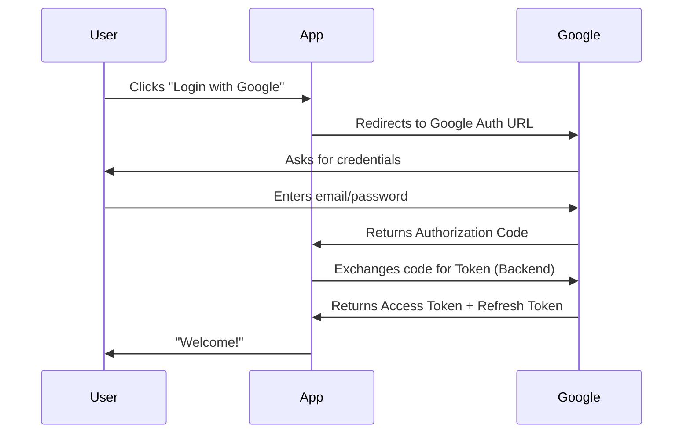
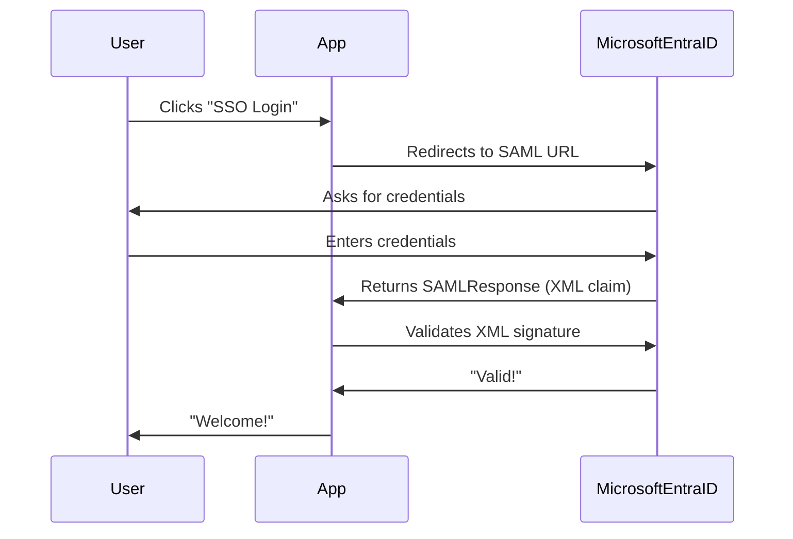

```markdown
# **OAuth, SAML, and SSO Authentication: A Beginner-Friendly Guide**

*How to Implement Single Sign-On (SSO) with OAuth 2.0 vs. SAML 2.0*

---

## **Introduction**

Authentication is the backbone of secure applications. But handling it manually (username/password) is tedious for users and risky for developers. **Single Sign-On (SSO)** solves this by letting users log in once and access multiple services without re-entering credentials.

Two dominant standards power SSO today:
- **OAuth 2.0** (modern, token-based, preferred for APIs/web apps)
- **SAML 2.0** (legacy, XML-heavy, common in enterprise)

This guide will compare them, show real-world code examples, and give you the tools to implement SSO in your backend.

---

## **The Problem: Why Manual Authentication Fails**

Imagine your team is building a **multi-tenant SaaS** (like GitHub for your niche). Users should:
- Log in **once** and access multiple apps (e.g., Slack, Notion, your product).
- Avoid **password fatigue** (typing credentials everywhere).
- Use **existing identities** (Google, Microsoft, or enterprise directories).

But:
❌ **Manual logins** require storing passwords, risking breaches.
❌ **Password resets** are a nightmare for support teams.
❌ **No reuse of identities** (users forget logins across services).

**Solution?** SSO standards like **OAuth 2.0** and **SAML 2.0** delegate authentication to trusted third parties (identity providers).

---

## **The Solution: OAuth 2.0 vs. SAML 2.0**

### **1. OAuth 2.0: The Modern Token-Based Approach**
OAuth lets users grant access to your app **without sharing passwords**. Instead, it issues **access tokens** (short-lived) and **refresh tokens** (for re-authentication).

#### **How It Works (Simplified)**
1. **User clicks "Log in with Google."**
2. **Your app redirects to Google.**
3. **Google authenticates the user.**
4. **Google sends an authorization code to your app.**
5. **Your app exchanges the code for an OAuth token.**
6. **Your app uses this token to call APIs on the user’s behalf.**

#### **Example Flow (Google OAuth)**


#### **Key Components**
| Term             | Explanation                          |
|------------------|--------------------------------------|
| **Authorization Code** | Temporary code to get tokens.        |
| **Access Token**       | Lets your app access APIs.          |
| **Refresh Token**      | Gets new access tokens without asking the user again. |
| **Client Secret**      | Secure key for your app (keep it secret!). |

---

### **2. SAML 2.0: The Enterprise XML Standard**
SAML is **XML-based**, designed for **enterprise environments** (e.g., Active Directory). It’s **not token-based** but uses **signed assertions** to confirm identity.

#### **How It Works (Simplified)**
1. **User clicks "SSO" in your app.**
2. **Your app redirects to the IdP (e.g., Microsoft Entra ID).**
3. **IdP authenticates the user.**
4. **IdP sends an XML **SAMLResponse** with user claims.**
5. **Your app validates the XML and grants access.**

#### **Example Flow (SAML SSO)**


#### **Key Components**
| Term            | Explanation                          |
|-----------------|--------------------------------------|
| **SAMLResponse** | XML document with user claims.       |
| **Assertion**   | Contains subject (user), attributes, and authentication context. |
| **Security Token** | Signed to prevent tampering.        |

---

## **Implementation Guide**

### **Option 1: Implementing OAuth 2.0 (Node.js + Express Example)**
We’ll build a **basic OAuth flow** with Google.

#### **Step 1: Set Up Google OAuth Credentials**
1. Go to [Google Cloud Console](https://console.cloud.google.com/).
2. Create a project → **APIs & Services** → **Credentials**.
3. Click **"Create Credentials"** → **OAuth Client ID**.
4. Select **"Web Application"** and add:
   - **Authorized JavaScript Origins**: `http://localhost:3000`
   - **Authorized Redirect URIs**: `http://localhost:3000/auth/google/callback`

#### **Step 2: Install Dependencies**
```bash
npm install express googleapis dotenv
```

#### **Step 3: Backend Code (`server.js`)**
```javascript
require('dotenv').config();
const express = require('express');
const { google } = require('googleapis');

const app = express();
const port = 3000;

// OAuth config (from .env)
const CLIENT_ID = process.env.GOOGLE_CLIENT_ID;
const CLIENT_SECRET = process.env.GOOGLE_CLIENT_SECRET;
const REDIRECT_URI = 'http://localhost:3000/auth/google/callback';

// Generate OAuth URL
const oauth2Client = new google.auth.OAuth2(
  CLIENT_ID,
  CLIENT_SECRET,
  REDIRECT_URI
);

const authUrl = oauth2Client.generateAuthUrl({
  scope: ['profile', 'email'],
  access_type: 'offline', // Get refresh token
  prompt: 'consent'
});

// Start server
app.get('/', (req, res) => {
  res.send(`
    <a href="${authUrl}">Login with Google</a>
  `);
});

// Google callback
app.get('/auth/google/callback', async (req, res) => {
  const { code } = req.query;

  try {
    // Exchange code for tokens
    const { tokens } = await oauth2Client.getToken(code);
    oauth2Client.setCredentials(tokens);

    // Fetch user info
    const oauth2 = google.oauth2({ version: 'v2', auth: oauth2Client });
    const userInfo = await oauth2.userinfo.get();
    const user = userInfo.data;

    // Store user in DB (example)
    console.log('Logged in user:', user);

    res.send(`<h1>Welcome, ${user.name}!</h1><a href="/">Back</a>`);
  } catch (err) {
    console.error(err);
    res.status(500).send('Error logging in.');
  }
});

app.listen(port, () => {
  console.log(`Server running on http://localhost:${port}`);
});
```

#### **Step 4: Add `.env`**
```env
GOOGLE_CLIENT_ID=your_client_id_here
GOOGLE_CLIENT_SECRET=your_client_secret_here
```

#### **Step 5: Run & Test**
```bash
node server.js
```
- Visit `http://localhost:3000` → Click **"Login with Google"** → You’ll be redirected back with user data.

---

### **Option 2: Implementing SAML 2.0 (Node.js + Passport-SAML Example)**
SAML is **more complex**, so we’ll use [`passport-saml`](https://github.com/andrew-odeke/passport-saml) for simplicity.

#### **Step 1: Install Dependencies**
```bash
npm install express passport passport-saml dotenv
```

#### **Step 2: Backend Code (`server.js`)**
```javascript
require('dotenv').config();
const express = require('express');
const passport = require('passport');
const { Strategy: SamlStrategy } = require('passport-saml');

const app = express();
const port = 3000;

// SAML Config (mock values for demo)
passport.use(new SamlStrategy({
  entryPoint: 'https://your-idp.com/saml/metadata', // Your IdP metadata URL
  issuer: 'your-app-name',
  callbackUrl: 'http://localhost:3000/auth/saml/callback',
  cert: fs.readFileSync('./cert.pem') // IdP’s public cert
}, (profile, done) => {
  // Extract user data from SAML response
  done(null, {
    id: profile.sub,
    email: profile.email,
    name: profile.name
  });
}));

app.get('/auth/saml', passport.authenticate('saml', { failWithError: true }));
app.get('/auth/saml/callback',
  passport.authenticate('saml', { failureRedirect: '/login' }),
  (req, res) => {
    res.send(`<h1>Welcome, ${req.user.name}!</h1><a href="/">Back</a>`);
  }
);

app.listen(port, () => {
  console.log(`Server running on http://localhost:${port}`);
});
```

#### **Step 3: Get IdP Metadata**
Most IdPs (like **Microsoft Entra ID, Okta**) provide a **metadata XML file** (e.g., `https://your-idp.com/metadata.xml`). Use it to configure `passport-saml`.

---

## **Common Mistakes to Avoid**

### **OAuth Pitfalls**
1. **Hardcoding secrets**: Never hardcode `CLIENT_SECRET` in client-side code.
   ✅ **Fix:** Use environment variables (`.env`).
2. **Not validating tokens**: Always check token **expiry** and **scopes**.
   ```javascript
   // Always verify token before use
   const ticket = await oauth2Client.verifyIdToken({
     idToken: req.headers.authorization.split(' ')[1],
     audience: CLIENT_ID
   });
   ```
3. **Ignoring refresh tokens**: If you don’t store refresh tokens, users must re-authenticate often.
4. **Leaking tokens**: Don’t expose access tokens in client-side URLs (use **PKCE** for public clients).

### **SAML Pitfalls**
1. **Not validating XML signatures**: SAML responses can be forged if not signed.
   ```javascript
   // Always verify the SAMLResponse signature
   const isValid = await validateSamlResponse(samlResponse);
   ```
2. **Ignoring certificate rotation**: IdPs change certs; your app must update them.
3. **Overcomplicating**: SAML is XML-heavy; prefer OAuth for APIs.

---

## **When to Use OAuth vs. SAML?**
| **Use OAuth When...**               | **Use SAML When...**                 |
|------------------------------------|-------------------------------------|
| Building a **modern web/mobile app**. | Working with **enterprise IdPs** (AD, Okta). |
| Needing **API access tokens**.      | Supporting **legacy systems** (e.g., SAP). |
| Users prefer **Google/Microsoft login**. | Compliance requires **strict identity proofs**. |
| You want **simpler token handling**. | You need **fine-grained attribute claims**. |

---

## **Key Takeaways**
✅ **OAuth 2.0** is **simpler** (tokens) and **better for APIs**.
✅ **SAML 2.0** is **enterprise-heavy** (XML, signatures).
✅ **Always validate tokens/responses** (never trust the client).
✅ **Use libraries** (`passport-saml`, `googleapis`) to avoid reinventing the wheel.
✅ **Store refresh tokens securely** (not in client-side storage).
✅ **Follow OAuth/SAMl RFCs** for security best practices.

---

## **Conclusion**
SSO simplifies authentication, but choosing between **OAuth** and **SAML** depends on your use case:
- **Start with OAuth** for modern apps (Google, GitHub, etc.).
- **Use SAML** only if required by enterprise policies.

**Next Steps:**
1. Try the **OAuth example** and extend it with a database.
2. Explore **PKCE** for mobile apps.
3. Research **OpenID Connect** (a layer on top of OAuth for user profiles).

Happy coding! 🚀
```

---
**Appendix: Further Reading**
- [OAuth 2.0 Spec](https://datatracker.ietf.org/doc/html/rfc6749)
- [SAML 2.0 Core Spec](https://docs.oasis-open.org/security/saml/v2.0/saml-core-2.0-os.pdf)
- [Passport-SAML GitHub](https://github.com/andrew-odeke/passport-saml)