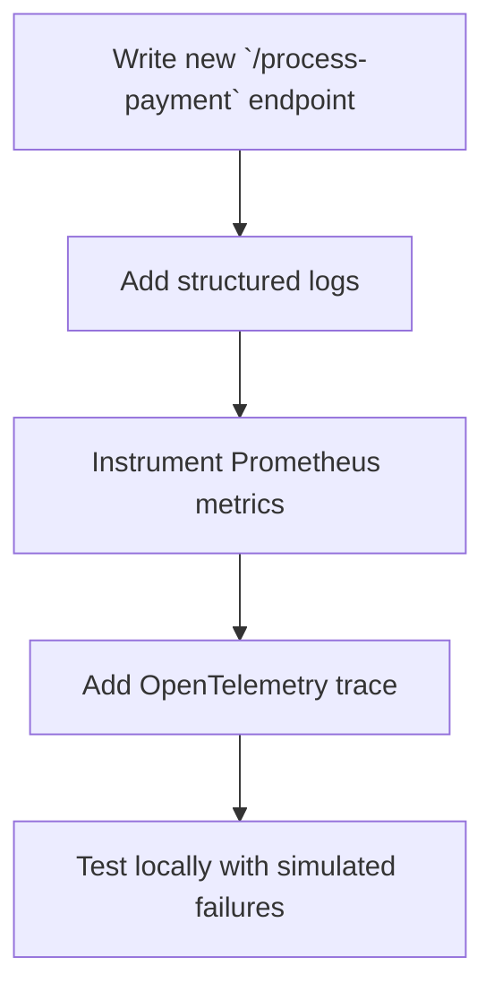

```markdown
# **Observability-Driven Development: Building Systems You Can Trust**

*Debugging is twice as hard as writing the code in the first place. Therefore, if you write the code as cleverly as possible, you are, by definition, not smart enough to debug it.*

— **Brian W. Kernighan**

But what if you could **prevent** debugging nightmares before they happen? What if your systems logged their own issues, alerted you to anomalies, and even guided you toward fixes—**before users noticed a problem**?

Welcome to **Observability-Driven Development (ODD)**. This isn’t just about adding logs or dashboards after the fact. It’s a **holistic approach** where observability is baked into the design from Day 1. By embedding telemetry, structured monitoring, and proactive alerts into your code and infrastructure, you build systems that are **self-healing, self-documenting, and resilient**—even as they grow complex.

In this guide, we’ll cover:
✅ **Why observability isn’t an afterthought** (and why most teams get it wrong)
✅ **Key components of observability** (logs, metrics, traces, and beyond)
✅ **Practical examples** showing how to instrument code, databases, and APIs
✅ **Common pitfalls** (and how to avoid them)
✅ **A step-by-step implementation guide** for beginners

Let’s dive in.

---

## **The Problem: "We’ll Fix Observability Later" (Spoiler: You Won’t)**

Observability is often treated as an **optional feature**, tacked on after the fact. Developers focus on writing fast APIs, scaling services, and shipping features—only to realize *months later* that:
- **Logs are unstructured**, making debugging a needle-in-a-haystack struggle.
- **Critical errors** slip through without alerts because no one knew to monitor them.
- **Performance bottlenecks** exist, but no one can pinpoint where—so they just "guess and patch."
- **New features break old ones**, but no one notices until users complain.

This isn’t just inefficient—it’s **risky**. In 2023, the average **downtime cost** for a Fortune 100 company was **$5,600 per minute** ([Dynatrace State of Resilience Report](https://www.dynatrace.com/resources/whitepaper/state-of-resilience-report-2023/)). **Observability isn’t a luxury; it’s survival insurance.**

### **The Reality of "Adding Observability Later"**
Consider a typical microservices architecture. You launch `user-service` and `order-service` with basic logs. A month later, you add `payment-service`. Soon, you’re juggling:
- **3 different log formats** (some JSON, some plaintext, some with timestamps missing).
- **No correlation between services**—when a payment fails, you don’t know if it’s the payment service, the order service, or the database.
- **Alert fatigue**—your team is drowning in noise because you didn’t define what "critical" even means.

By the time you **finally** add observability tools (APM, log aggregation, etc.), you’re playing **catch-up**. The systems were designed **without** observability in mind, so adding it is **hard, expensive, and often incomplete**.

---

## **The Solution: Observability-Driven Development (ODD)**

Observability-Driven Development (ODD) flips the script:
1. **Plan for observability first**—treat it like feature development.
2. **Instrument everything early**—logs, metrics, traces, and even custom alerts.
3. **Design for debuggability**—make every component self-documenting.
4. **Automate detection**—set up alerts before problems escalate.

The goal? **Build systems that are inherently observable**—so when something goes wrong, you **know it immediately**, **understand why**, and **fix it fast**.

### **The Three Pillars of Observability**
Every observability strategy relies on three core components:

| **Component** | **What It Is** | **Example Use Case** |
|--------------|----------------|----------------------|
| **Logs** | Structured, timestamped records of events. | "User `12345` failed login at `2024-05-20T14:30:00Z`" |
| **Metrics** | Quantitative data (latency, error rates, throughput). | "API `/checkout` failed 12x in the last 5 minutes." |
| **Traces** | End-to-end request flows across services. | "Order `abc123` took 800ms due to `payment-service` timeout." |
| **Alerts** | Proactive notifications for anomalies. | "CPU usage > 90% for 30s in `user-service`." |

*(Note: Some sources include **profiling** and **distributed context** as pillars, but for beginners, we’ll stick to these four.)*

---

## **Components/Solutions: Building an Observable System**

Let’s break down how to implement each pillar with **real-world examples**.

---

### **1. Structured Logging (Because Plaintext Logs Are a Scam)**
**Problem:** Old-school logs look like this:
```
ERROR: Failed to connect to DB at 14:30:00
```

**Solution:** Use **structured logging** (JSON) so you can:
- Filter logs by `error_type`, `user_id`, or `service_name`.
- Query logs in tools like Grafana or ELK.
- Automatically detect patterns.

#### **Example: Structured Logging in Python (FastAPI)**
```python
import json
import logging
from fastapi import FastAPI, Request

app = FastAPI()
logging.basicConfig(level=logging.INFO)
logger = logging.getLogger(__name__)

@app.post("/checkout")
async def checkout(request: Request):
    try:
        data = await request.json()
        # Do business logic...

        # Structured log (JSON format)
        logger.info(
            json.dumps({
                "event": "checkout_success",
                "user_id": data["user_id"],
                "order_id": "abc123",
                "timestamp": datetime.utcnow().isoformat(),
                "service": "payment",
            })
        )
        return {"status": "success"}

    except Exception as e:
        logger.error(
            json.dumps({
                "event": "checkout_failed",
                "user_id": data.get("user_id"),
                "error": str(e),
                "trace_id": uuid.uuid4(),  # For correlating traces
                "service": "payment",
            })
        )
        raise
```

**Key Takeaways:**
✔ **Always include `timestamp` and `service_name`.**
✔ **Use JSON**—it’s machine-readable and queryable.
✔ **Log errors with context** (user_id, request_id, etc.).

---

### **2. Metrics: Quantify What Matters**
**Problem:** You don’t know if your API is slow, unstable, or overloaded.

**Solution:** Track **key business metrics** (not just "success/failure" counts).

#### **Example: Prometheus Metrics in Node.js**
```javascript
const express = require('express');
const client = require('prom-client');

const app = express();

// Register metrics
const counter = new client.Counter({
  name: 'api_requests_total',
  help: 'Total HTTP requests',
  labelNames: ['method', 'path', 'status'],
});
const gauge = new client.Gauge({
  name: 'active_connections',
  help: 'Number of active HTTP connections',
});

// Expose metrics endpoint
app.get('/metrics', async (req, res) => {
  res.set('Content-Type', client.register.contentType);
  res.end(await client.register.metrics());
});

// Track every request
app.use((req, res, next) => {
  counter.inc({ method: req.method, path: req.path });
  gauge.inc();

  res.on('finish', () => {
    counter.inc({ method: req.method, path: req.path, status: res.statusCode });
    gauge.dec();
  });

  next();
});

app.listen(3000, () => console.log('Server running'));
```

**Key Metrics to Track:**
| Metric | Purpose |
|--------|---------|
| `http_requests_total` | Count of API calls by method/endpoint. |
| `error_rate` | % of failed requests (e.g., 5xx errors). |
| `latency_p99` | 99th percentile response time (spots outliers). |
| `db_queries_total` | How many DB calls are happening? |
| `memory_usage` | Is your service leaking RAM? |

**Tool Recommendation:**
- **[Prometheus](https://prometheus.io/)** (for metrics collection).
- **[Grafana](https://grafana.com/)** (for visualization).
- **[CloudWatch](https://aws.amazon.com/cloudwatch/)** (if you’re on AWS).

---

### **3. Distributed Traces (Follow the Money)**
**Problem:** When a request spans multiple services, logs are scattered across teams.

**Solution:** **Traces** show the **full journey** of a request.

#### **Example: OpenTelemetry in Python (FastAPI)**
```python
from fastapi import FastAPI
from opentelemetry import trace
from opentelemetry.sdk.trace import TracerProvider
from opentelemetry.sdk.trace.export import BatchSpanProcessor
from opentelemetry.exporter.otlp.proto.grpc.trace_exporter import OTLPSpanExporter

app = FastAPI()

# Initialize OpenTelemetry
trace.set_tracer_provider(TracerProvider())
otlp_exporter = OTLPSpanExporter(endpoint="http://localhost:4317")
trace.get_tracer_provider().add_span_processor(BatchSpanProcessor(otlp_exporter))

# Get tracer
tracer = trace.get_tracer(__name__)

@app.post("/process-order")
async def process_order():
    # Start a new span (trace)
    with tracer.start_as_current_span("process_order") as span:
        span.set_attribute("user_id", "12345")
        span.set_attribute("order_id", "abc123")

        # Simulate calling other services
        await call_payment_service()
        await call_inventory_service()

        return {"status": "order_processed"}

async def call_payment_service():
    with tracer.start_as_current_span("post_payment") as span:
        span.set_attribute("service", "payment")
        # ... payment logic ...
```

**What You’ll See in Jaeger/Zipkin:**
```
┌───────────────┐       ┌───────────────┐       ┌───────────────┐
│   Frontend    │──────▶│   Payment     │──────▶│   Inventory  │
│  (FastAPI)    │       │   Service     │       │   Service     │
└───────────────┘       └───────────────┘       └───────────────┘
   100ms          300ms          500ms        Total: 900ms
```

**Key Benefits of Traces:**
✅ **Find bottlenecks** (e.g., "payment-service took 80% of the time").
✅ **Debug failures** (e.g., "request failed at `inventory-service`").
✅ **Correlate logs** (e.g., "Same `trace_id` appears in all logs").

**Tool Recommendation:**
- **[OpenTelemetry](https://opentelemetry.io/)** (standard for instrumentation).
- **[Jaeger](https://www.jaegertracing.io/)** (trace visualization).
- **[AWS X-Ray](https://aws.amazon.com/xray/)** (if you’re on AWS).

---

### **4. Alerts: Don’t Just Collect Data—Act on It**
**Problem:** You have metrics and logs, but no one reacts.

**Solution:** **Automated alerts** for critical issues.

#### **Example: Prometheus Alerts**
```yaml
# alerts.yml
groups:
- name: api-alerts
  rules:
  - alert: HighErrorRate
    expr: rate(http_requests_total{status=~"5.."}[5m]) / rate(http_requests_total[5m]) > 0.05
    for: 5m
    labels:
      severity: critical
    annotations:
      summary: "High error rate on {{ $labels.instance }}"
      description: "5xx errors > 5% for 5 minutes"

  - alert: HighLatency
    expr: histogram_quantile(0.99, sum(rate(http_request_duration_seconds_bucket[5m])) by (le, instance)) > 1.0
    for: 10m
    labels:
      severity: warning
    annotations:
      summary: "High latency on {{ $labels.instance }}"
      description: "99th percentile latency > 1s for 10 minutes"
```

**How It Works:**
1. **Prometheus** checks metrics every `5m`.
2. If `error_rate > 5%` for 5 minutes, **Slack/PagerDuty is notified**.
3. Your team **acts before users notice**.

**Alerting Best Practices:**
✔ **Start broad, then narrow down** (e.g., alert on all 5xx errors first, then refine).
✔ **Use severity levels** (`critical`, `warning`, `info`).
✔ **Set thresholds based on SLOs** (e.g., "Latency > 500ms for 1% of requests").

---

## **Implementation Guide: From Zero to Observable**

### **Step 1: Define Observability Requirements**
Before writing a single line of code, ask:
- **What are our critical paths?** (e.g., `/checkout`, `/payment`).
- **What defines a "good" experience?** (e.g., <500ms latency, <1% errors).
- **Where do failures most often occur?** (e.g., DB timeouts, third-party APIs).

**Example:**
| Service       | Critical Metrics               | Alert Condition          |
|---------------|--------------------------------|--------------------------|
| `user-service` | `login_errors`, `auth_latency` | `errors > 0` for 1m      |
| `payment-service` | `payment_failure_rate` | `rate > 2%` for 5m      |

---

### **Step 2: Instrument Early (Before "It Works")**
**Never add observability "later."** Instead:
1. **Add logs when writing a new feature.**
2. **Track metrics for every endpoint.**
3. **Correlate traces for cross-service calls.**

**Example Workflow:**


---

### **Step 3: Automate Alerts (Before Problems Escalate)**
Set up alerts **before** a feature goes live.

**Example Alert Rules:**
| Rule | Condition | Severity | Action |
|------|-----------|----------|--------|
| `High Error Rate` | `errors > 5%` for 5m | Critical | Page @team Slack |
| `Database Timeout` | `db_query_duration > 2s` for 1m | Warning | Email @dba |
| `Spike in Traffic` | `requests > 10k/min` | Info | Alert @oncall |

**Tools:**
- **[Grafana Alerts](https://grafana.com/docs/grafana/latest/alerting/)** (for Prometheus).
- **[Datadog](https://www.datadoghq.com/)** (all-in-one observability).
- **[PagerDuty](https://www.pagerduty.com/)** (incident management).

---

### **Step 4: Test Observability Locally**
**Debugging in production is hard.** Test your observability setup **locally** with:
- **Mock failures** (e.g., simulate a 500 error in `payment-service`).
- **Check trace correlation** (e.g., see if logs match traces).
- **Test alerts** (e.g., does Slack ping when latency spikes?).

**Example: Local Observability Setup**
```bash
# Run locally with OpenTelemetry
export OTLP_ENDPOINT=http://localhost:4317
python -m pytest app.py --cov=app

# Check traces in Jaeger UI
http://localhost:16686
```

---

### **Step 5: Iterate and Improve**
Observability is **never "done."** Keep improving:
✅ **Add more metrics** (e.g., "How many users see errors?").
✅ **Refine alert thresholds** (e.g., "Is 5% errors really critical?").
✅ **Automate incident response** (e.g., auto-scale if CPU > 80%).

---

## **Common Mistakes to Avoid**

### **❌ Mistake 1: "We’ll Add Observability Later"**
**Why it fails:**
- Features ship without proper telemetry.
- Debugging becomes a **fire drill** when something breaks.

**Fix:**
- **Instrument code as you write it.**
- **Define observability requirements in the PR template.**

---

### **❌ Mistake 2: Overlogging or No Logging**
| **Bad** | **Good** |
|---------|---------|
| `logger.debug("User clicked button")` | `logger.info({ event: "button_click", user_id: "123" })` |
| No logs for **successful** operations | Log **both successes and failures** |

**Rule of Thumb:**
- **Log what matters for debugging** (not every variable dump).
- **Use different log levels** (`INFO`, `ERROR`, `DEBUG`).

---

### **❌ Mistake 3: Ignoring Distributed Systems**
**Problem:**
- You trace `/checkout` but only see `frontend-service`.
- You miss the **actual bottleneck** (`payment-service` timeouts).

**Fix:**
- **Use OpenTelemetry** for cross-service traces.
- **Correlate logs with trace IDs** (e.g., `trace_id: "abc123"` in every log).

---

### **❌ Mistake 4: No Alerting Strategy**
**Problem:**
- Your team is **drowned in noise** (e.g., "CPU 85%" every 5 minutes).
- **Critical failures go unnoticed** because alerts are too strict/loose.

**Fix:**
- **Start