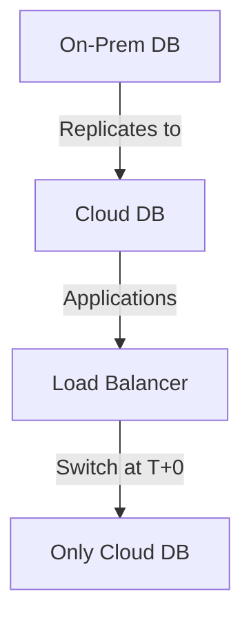

```markdown
---
title: "Lift-and-Shift or Strategic Modernization? Navigating On-Premise Database Migration"
date: "October 12, 2023"
author: "Alex Carter"
tags: ["database design", "migration patterns", "cloud adoption", "backend engineering"]
categories: ["database", "scaling", "architecture"]
description: "Learn the On-Premise Migration pattern: when to lift-and-shift vs. refactor, and how to execute successful database migrations with real-world tradeoffs."
---

# **Lift-and-Shift or Strategic Modernization? Navigating On-Premise Database Migration**

Migrating your on-premise database to the cloud—or even upgrading to a newer version—is rarely an event. It’s a strategic maneuver that requires careful planning, execution, and often a mix of pragmatism and innovation. Whether you’re moving from SQL Server 2008 to Azure SQL or transitioning from a monolithic on-premise setup to a cloud-native microservices architecture, the **On-Premise Migration** pattern helps you modernize your infrastructure without disrupting business operations.

This guide walks you through the challenges of database migration, introduces the **On-Premise Migration** pattern with practical strategies, and provides code-first examples to illustrate tradeoffs and best practices. By the end, you’ll know when to lift-and-shift vs. refactor, how to minimize downtime, and how to handle common pitfalls.

---

## **The Problem: Why On-Premise Migrations Are Hard**

Migrating databases isn’t just about moving data—it’s about **minimizing risk, ensuring reliability, and maintaining performance** while reducing downtime. Without a structured approach, you risk:

### **1. Unplanned Downtime**
If you don’t replicate data, synchronize schemas, or test failover procedures, a migration can turn into a **blackout event**. For example, a retail company migrating from Oracle to PostgreSQL without a failback strategy might lose sales during peak hours.

### **2. Data Loss or Inconsistency**
Even small discrepancies in schema changes or missing constraints can corrupt your database. For instance, a mismatched foreign key in a migration script might cause cascading failures during cutover.

### **3. Performance Degradation**
Cloud databases (e.g., Aurora, Cosmos DB) or newer on-premise versions (e.g., SQL Server 2022) often have different query optimizations. A migration might introduce ** queries that were fast on-premise but fail on the cloud.

### **4. Application Dependency Hell**
Legacy applications tied to specific SQL dialects (e.g., Oracle PL/SQL) or outdated connection strings may break during migration. A single misconfigured `JDBC` connection can bring down an entire service.

### **5. Security and Compliance Gaps**
If you forget to update encryption keys, audit logs, or IAM policies during migration, your new environment might violate compliance requirements (e.g., GDPR, HIPAA).

### **Real-World Example: The Lift-and-Shift Trap**
A financial firm moved their entire **Oracle DB** to **AWS RDS** without testing query performance. After migration, their **OLTP** workloads slowed down because AWS RDS defaults to **burstable performance** instead of provisioned IOPS. They had to **re-architect** their application to use **partitioned tables** and **read replicas**—costing weeks of extra work.

---
## **The Solution: The On-Premise Migration Pattern**

The **On-Premise Migration** pattern isn’t a single tool but a **framework** for safely moving data and applications between environments. It consists of **four core phases**, each with tradeoffs:

| Phase | Goal | Strategies | Tradeoffs |
|--------|------|------------|-----------|
| **1. Assessment** | Understand current state & risks | Schema analysis, query profiling, dependency mapping | Time-consuming; requires deep expertise |
| **2. Replication** | Synchronize data & schemas | Side-by-side replication, CDC (Change Data Capture) | High overhead; potential for drift |
| **3. Cutover** | Switch from old to new system | Blue-green deployment, phased rollout | Risk of failure during cutover |
| **4. Validation** | Ensure correctness & performance | Automated testing, A/B comparison | May require rollback if issues arise |

We’ll dive into each phase with **real-world examples**.

---

## **Components & Solutions for On-Premise Migration**

### **1. Schema Migration: Lift-and-Shift vs. Refactor**
#### **Option A: Lift-and-Shift (Minimal Change)**
If your database is mostly compatible (e.g., PostgreSQL → AWS RDS PostgreSQL), you can **skip heavy refactoring** and focus on:
- **Schema conversion** (SQL dialect changes)
- **Connection string updates**
- **Dependencies** (e.g., replacing Oracle’s `DBMS_SCHEDULER` with a cloud scheduler)

**Example: Converting SQL Server to Azure SQL**
```sql
-- Old SQL Server (on-premise)
CREATE TABLE Customers (
    CustomerID INT PRIMARY KEY,
    Name NVARCHAR(100),
    Email VARCHAR(255),
    CONSTRAINT UQ_CustomerEmail UNIQUE (Email)
);

-- New Azure SQL (with JSON extension)
CREATE TABLE Customers (
    CustomerID INT PRIMARY KEY,
    Name NVARCHAR(100),
    Email VARCHAR(255),
    Profile NVARCHAR(MAX) -- Store extra attributes in JSON
) WITH (EXAMPLE_PERCENTILE = 70); -- Optimize for mixed workloads
```

**Tradeoff:** ✅ Fast & low-risk, but ❌ misses cloud-native optimizations (e.g., JSON indexing, serverless scaling).

#### **Option B: Strategic Refactor (Maximize Cloud Benefits)**
If you’re moving to **PostgreSQL → Aurora Serverless**, you might:
- **Replace stored procedures** with **Lambda functions**
- **Use Aurora’s global databases** for multi-region replication
- **Switch from `VARCHAR` to `TEXT`** for better query performance

**Example: Migrating from MySQL to Aurora PostgreSQL**
```sql
-- Old MySQL (on-premise)
ALTER TABLE Orders ADD COLUMN Notes TEXT NULL;

-- New Aurora PostgreSQL (with JSONB)
ALTER TABLE Orders ADD COLUMN Metadata JSONB NULL;
-- Now you can query: SELECT * FROM Orders WHERE Metadata->>'payment_status' = 'pending';
```

**Tradeoff:** ⚡ Faster long-term, but ❌ requires **application changes** and **testing**.

---

### **2. Data Migration: Bulk vs. Streaming**
#### **Option A: Bulk Export/Import (Fast but Risky)**
Use `pg_dump` (PostgreSQL), `mysqldump`, or **AWS Database Migration Service (DMS)** for large datasets.

```bash
# Example: Export PostgreSQL to CSV (on-premise)
pg_dump -U postgres -d mydb -a -Fc -f backup.dump
# Then import into cloud:
pg_restore -U postgres -d mydb_cloud backup.dump
```

**Tradeoff:** ✅ Quick, but ❌ **data drift** if the schema changes mid-migration.

#### **Option B: Change Data Capture (CDC) (Low Risk but Complex)**
Use **Debezium**, **AWS DMS**, or **WAL (Write-Ahead Log) replication** to sync changes in real-time.

**Example: Setting up Debezium for PostgreSQL**
```json
// Kafka Connect Debezium config (for PostgreSQL -> Cloud)
{
  "name": "postgres-connector",
  "config": {
    "connector.class": "io.debezium.connector.postgresql.PostgresConnector",
    "database.hostname": "onprem-db.example.com",
    "database.port": "5432",
    "database.user": "repl_user",
    "database.password": "...",
    "database.dbname": "mydb",
    "database.server.name": "postgres-server",
    "slot.name": "debezium_slot",
    "plugin.name": "pgoutput",
    "wal.level": "logical",
    "topic.prefix": "db.changes"
  }
}
```
**Tradeoff:** ⚡ Real-time sync, but ❌ **requires Kafka/KSQL setup**.

---

### **3. Application Layer: Zero-Downtime Migration**
#### **Option A: Blue-Green Deployment**
Run **both databases in parallel**, then flip traffic at cutoff.



**Tradeoff:** ✅ No downtime, but ❌ **doubled costs** during transition.

#### **Option B: Phased Rollout (Gradual Cutover)**
Start with **non-critical tables**, then expand.

```bash
# Example: Using AWS Schema Conversion Tool (SCT)
aws database-schema-conversion-tool convert-to-postgresql \
  --database-name mydb \
  --database-engine-source mysql \
  --database-engine-target postgres \
  --schema-include-list users,products \
  --output-file schema-converted.sql
```

**Tradeoff:** ✅ Lower risk, but ❌ **longer migration window**.

---

### **4. Validation: Testing for Success**
- **Data Integrity Checks**: Compare row counts, checksums.
  ```sql
  -- Example: Verify row count after migration
  SELECT COUNT(*) FROM onprem_customers;
  SELECT COUNT(*) FROM cloud_customers;
  ```
- **Performance Benchmarking**: Run `pgbench` or `SYSSTAT` before/after.
- **Failover Testing**: Simulate region outages (if using multi-region DBs).

---

## **Implementation Guide: Step-by-Step**

### **Phase 1: Assessment**
1. **Audit your database**:
   - Run `pg_catalog.pg_stat_statements` (PostgreSQL) to find slow queries.
   - Use **AWS RDS Performance Insights** if migrating to AWS.
2. **Map dependencies**:
   - Check `INFORMATION_SCHEMA` for foreign keys.
   - Use **DBeaver** or **SQL Developer** to visualize schemas.

### **Phase 2: Replicate Data**
- **For small DBs (≤100GB)**: Use `pg_dump` + `psql`.
- **For large DBs (>100GB)**: Use **AWS DMS** or **Debezium**.
- **For real-time apps**: Enable **binary replication** (PostgreSQL) or **logical replication**.

```sql
-- Example: Set up logical replication in PostgreSQL
ALTER TABLE customers REPLICA IDENTITY USING INDEX customers_id_index;
```

### **Phase 3: Cutover**
1. **Switch primary connection** (e.g., update apps to point to cloud DB).
2. **Monitor for errors** (use **Prometheus + Grafana**).
3. **Keep old DB in read-only** mode for fallback.

### **Phase 4: Validate**
- **Run regression tests** (e.g., compare `SELECT * FROM orders`).
- **Load test** with **JMeter** or **locust**.
- **Monitor cloud metrics** (AWS CloudWatch, Azure Monitor).

---

## **Common Mistakes to Avoid**

| Mistake | Why It’s Bad | How to Fix It |
|---------|-------------|---------------|
| **Not testing failover** | If the cloud DB fails, you’re stuck. | Set up **multi-AZ deployment** (AWS) or **high availability groups** (Azure). |
| **Ignoring schema changes** | Missing constraints can corrupt data. | Use **AWS SCT** or **Flyway** for schema migrations. |
| **Rushing the cutover** | Downtime kills business. | Use **blue-green** or **phased rollout**. |
| **Overlooking security** | Old DB credentials might leak. | Rotate passwords, enable **TLS**, and **restrict IAM roles**. |
| **Assuming "same DB = same performance"** | Cloud DBs optimize differently. | Benchmark **read/write latency** before cutover. |

---

## **Key Takeaways**

✅ **Lift-and-shift is faster but misses cloud benefits** (e.g., serverless scaling).
✅ **CDC (Debezium/AWS DMS) reduces risk** but adds complexity.
✅ **Blue-green deployment is safest** for zero-downtime migrations.
✅ **Always validate data integrity**—assume nothing is perfect.
✅ **Monitor performance religiously** after cutover.
✅ **Document everything**—future devs will thank you.

---

## **Conclusion: When to Lift-and-Shift vs. Refactor**

| Scenario | Recommended Approach | Tools to Use |
|----------|----------------------|--------------|
| **Simple upgrade (e.g., SQL Server 2008 → 2019)** | Lift-and-shift | `sqlpackage.exe`, AWS DMS |
| **Moving to cloud (e.g., Oracle → Aurora PostgreSQL)** | Refactor key tables | AWS SCT, Flyway |
| **High-availability critical app** | Blue-green + CDC | Debezium, Kubernetes |
| **Legacy monolith** | Phased migration | AWS Schema Conversion Tool |

### **Final Thought**
On-premise migration **isn’t just about moving data—it’s about modernizing**. Whether you **lift-and-shift** or **refactor**, the key is **minimizing risk** while **maximizing long-term benefits**. Start small, test aggressively, and **never assume the old system is perfect**.

Now go forth and migrate—**without tears!** 🚀

---
**Further Reading:**
- [AWS Database Migration Service (DMS) Docs](https://docs.aws.amazon.com/dms/latest/userguide/Welcome.html)
- [Debezium for PostgreSQL Replication](https://debezium.io/documentation/reference/stable/connectors/postgresql.html)
- [PostgreSQL Logical Replication](https://www.postgresql.org/docs/current/logical-replication.html)
```