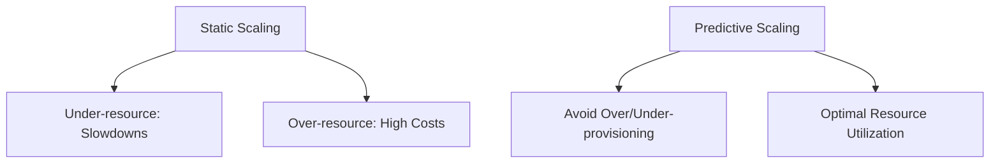

```markdown
# **Load Prediction Patterns: Anticipating Traffic to Scale Gracefully**

Scaling infrastructure to handle unpredictable traffic is a constant challenge for backend engineers. Whether it's a viral tweet, a seasonal spike, or a planned product launch, traffic patterns rarely follow a predictable linear trend. **Load prediction**—anticipating future demand—isn’t just about over-provisioning; it’s about balancing cost, performance, and resilience efficiently.

This guide explores **load prediction patterns**, practical techniques to forecast traffic spikes and optimize backend systems accordingly. We’ll cover:
- Why traditional scaling approaches fail under dynamic load.
- How to model, predict, and automate responses to predicted load.
- Real-world examples using metrics, machine learning, and dynamic infrastructure.
- Pitfalls to avoid when implementing predictive scaling.

---

## **The Problem: Why Static Scaling is Obsolete**

Traditional scaling strategies—like scaling up or scaling out based on current load—are reactive. They rely on **past or real-time metrics** rather than foresight. Here’s why this approach falls short:

1. **Late to the Party**: By the time a new record user count hits your monitoring alerts, latency spikes, and errors have already degraded the user experience.
2. **Overhead of Over-Provisioning**: Always scaling up front waste resources—underutilized servers add cost without ROI.
3. **Black Swan Events**: Unpredictable spikes (e.g., DDoS, social media virality) can overwhelm even pre-scaled systems.
4. **Manual Interventions Lag**: Human operators can’t react quickly enough to automate scaling decisions.

### **A Concrete Example: The Case of "Black Friday"**
Consider an e-commerce platform that historically sees an **8x traffic increase** during Black Friday. If the team scales linearly based on yesterday’s load, they’ll likely under-resource. If they over-scale to cover the 8x peak, they waste **700% capacity** on average traffic.



---

## **The Solution: Load Prediction Patterns**

Predictive scaling combines **historical data analysis**, **real-time insights**, and **automated responses** to preemptively adjust infrastructure. The core patterns include:

1. **Time-Series Analysis**: Modeling traffic based on historical patterns.
2. **Anomaly Detection**: Identifying outliers and deviations from normal traffic.
3. **Machine Learning Forecasting**: Predicting future load using statistical models.
4. **Dynamic Auto-Scaling**: Automatically adjusting resources in response to predictions.
5. **Caching & Pre-Warming**: Preparing systems to handle expected spikes.

---

## **Components/Solutions: Building a Prediction System**

### **1. Data Collection Layer**
Gather metrics from:
- **Application logs** (HTTP requests, errors)
- **Infrastructure metrics** (CPU, memory, latency)
- **External events** (e.g., social media mentions, weather data)

#### **Example: Collecting Metrics in Prometheus**
```go
// Pseudocode for a Go service collecting metrics
func StartMetricsServer() {
    // Register Prometheus metrics endpoints
    http.Handle("/metrics", promhttp.Handler())
    go http.ListenAndServe(":8080", nil)

    // Track custom metrics
    requestCount := prom.NewCounterVec(
        prom.CounterOpts{Name: "http_requests_total"},
        []string{"method", "path"},
    )
    prom.Register(requestCount)

    // Example: Increment counter on each request
    http.HandleFunc("/", func(w http.ResponseWriter, r *http.Request) {
        requestCount.WithLabelValues(r.Method, r.URL.Path).Inc()
        w.Write([]byte("Hello, world"))
    })
}
```

### **2. Time-Series Forecasting with Prophet**
Facebook’s **Prophet** is a great library for forecasting trends and seasonality in time-series data.

#### **Example: Predicting Traffic with Prophet**
```python
from prophet import Prophet
import pandas as pd

# Sample data: timestamps and request counts
data = pd.DataFrame({
    'ds': pd.date_range(start='2023-01-01', periods=365),
    'y': [1000 + 500 * (i % 30) + 200 * (i // 30) for i in range(365)]  # fake seasonal traffic
})

# Fit model
model = Prophet(seasonality_mode='multiplicative')
model.fit(data)

# Predict next 30 days
forecast = model.predict(future_periods=30)
print(forecast[['ds', 'yhat', 'yhat_lower', 'yhat_upper']].tail())
```

### **3. Anomaly Detection with Isolation Forest**
Detect unexpected spikes using **Isolation Forest**, a machine learning algorithm for anomaly detection.

```python
from sklearn.ensemble import IsolationForest
import numpy as np

# Simulate request rates over time (normal + spike)
request_rates = np.concatenate([
    np.random.normal(1000, 100, 1000),  # normal traffic
    np.random.normal(8000, 500, 100),   # spike
])

# Fit Isolation Forest
clf = IsolationForest(contamination=0.05)
clf.fit(request_rates.reshape(-1, 1))

# Detect anomalies
anomalies = clf.predict(request_rates.reshape(-1, 1)) == -1
print("Anomalies detected at indices:", np.where(anomalies)[0])
```

### **4. Dynamic Auto-Scaling with Kubernetes HPA + Custom Metrics**
Kubernetes Horizontal Pod Autoscaler (HPA) can scale based on custom metrics (e.g., predicted load).

#### **Example: HPA Config for Predictive Scaling**
```yaml
# hpa-predictive.yaml
apiVersion: autoscaling/v2
kind: HorizontalPodAutoscaler
metadata:
  name: app-hpa
spec:
  scaleTargetRef:
    apiVersion: apps/v1
    kind: Deployment
    name: app
  minReplicas: 2
  maxReplicas: 20
  metrics:
  - type: External
    external:
      metric:
        name: predicted_requests_per_sec
        selector:
          matchLabels:
            app: myapp
      target:
        type: AverageValue
        averageValue: 1000
```

### **5. Pre-Warming with Caching and CDN**
Preload frequently accessed data to reduce latency during spikes.

#### **Example: AWS CloudFront Pre-Warming**
```bash
# Pre-warm CloudFront cache for a specific path
aws cloudfront create-invalidation \
  --distribution-id YOUR_DISTRIBUTION_ID \
  --paths "/static/assets/*"
```

---

## **Implementation Guide: Step-by-Step**

### **Step 1: Define Your Prediction Scope**
- **What to predict?** (e.g., request rate, error rate, latency)
- **Time horizon?** (e.g., 1 hour ahead, 24 hours ahead)
- **Granularity?** (per minute, per hour, per user segment)

### **Step 2: Collect and Store Metrics**
Use tools like:
- **Prometheus** + **Grafana** for time-series data.
- **Amazon Managed Grafana** if using AWS.
- **Custom databases** (e.g., TimescaleDB) for long-term retention.

### **Step 3: Build a Prediction Pipeline**
1. **Ingest data** (e.g., via Kafka or Fluentd).
2. **Process data** (e.g., Prophet, ARIMA).
3. **Expose predictions** (e.g., via REST API or Kafka topic).

#### **Example: Prediction API with FastAPI**
```python
from fastapi import FastAPI
from pydantic import BaseModel
import pickle
import pandas as pd

app = FastAPI()
model = pickle.load(open("prophet_model.pkl", "rb"))

class PredictionRequest(BaseModel):
    start_date: str
    end_date: str

@app.post("/predict")
async def predict(request: PredictionRequest):
    future = pd.DataFrame({
        'ds': pd.date_range(start=request.start_date, end=request.end_date)
    })
    forecast = model.predict(future)
    return {"predictions": forecast[['ds', 'yhat']].to_dict('records')}
```

### **Step 4: Integrate with Auto-Scaling**
- **Kubernetes HPA**: Use custom metrics from your prediction API.
- **Serverless (AWS Lambda)**: Scale based on predicted load.
- **Database auto-scaling**: Pre-warm read replicas for expected traffic.

### **Step 5: Monitor and Iterate**
- Track prediction accuracy (e.g., MAPE—Mean Absolute Percentage Error).
- Adjust models when patterns change (e.g., new marketing campaigns).

---

## **Common Mistakes to Avoid**

1. **Ignoring Cost**: Over-predicting leads to wasted resources. Balance accuracy with cost.
2. **Over-Reliance on ML**:
   - ML models require **high-quality data** and **continuous training**.
   - Simple time-series models (e.g., Prophet) often suffice for basic predictions.
3. **No Fallbacks**: Always have a **reactive scaling plan** (e.g., circuit breakers) if predictions fail.
4. **Ignoring External Factors**:
   - Traffic spikes aren’t just about your app (e.g., DDoS, third-party outages).
   - Incorporate **external data** (e.g., weather, holidays) into predictions.
5. **Neglecting Cold Starts**:
   - Serverless functions (e.g., AWS Lambda) have cold-start latency. Pre-warm them if critical.
6. **Static Thresholds**:
   - Don’t scale based on fixed thresholds (e.g., "scale if CPU > 70%").
   - Use **dynamic thresholds** based on predictions.

---

## **Key Takeaways**
✅ **Load prediction reduces reactive scaling** and improves user experience.
✅ **Time-series forecasting (Prophet, ARIMA) is a low-code way to start**.
✅ **Anomaly detection helps identify black swan events early**.
✅ **Dynamic auto-scaling (Kubernetes, Serverless) turns predictions into action**.
✅ **Always pre-warm critical components** (caches, databases, functions).
✅ **Monitor prediction accuracy** and adjust models over time.
✅ **Balance prediction precision with cost**—don’t over-engineer.
✅ **Have a fallback plan** for when predictions are wrong.

---

## **Conclusion: Predict, Scale, Repeat**

Load prediction isn’t about eliminating uncertainty—it’s about **reducing blind spots** in your scaling strategy. By combining **historical trends**, **real-time insights**, and **automated responses**, you can:
- Avoid costly over-provisioning.
- Deliver seamless experiences during spikes.
- Focus on building features, not just fixing outages.

Start small: Use **Prophet for forecasting**, **HPA for auto-scaling**, and **monitor results**. As your needs grow, integrate **ML models**, **external data sources**, and **more advanced controls**. The goal isn’t perfection—it’s **reducing the surprise in scale**.

---
### **Further Reading**
- [Kubernetes Horizontal Pod Autoscaler Docs](https://kubernetes.io/docs/tasks/run-application/scale-autoscaling-hpa/)
- [Prophet Documentation](https://facebook.github.io/prophet/)
- [TimescaleDB for Time-Series Data](https://www.timescale.com/)
- [AWS Pre-Warming CloudFront](https://docs.aws.amazon.com/AmazonCloudFront/latest/DeveloperGuide/PreWarm.html)
```

This blog post provides a **practical, code-heavy guide** to load prediction patterns while keeping it **honest about tradeoffs** (e.g., ML isn’t always needed, cost matters). The examples are **real-world relevant** (Prometheus, Prophet, Kubernetes HPA), and the structure makes it **easy to follow**.