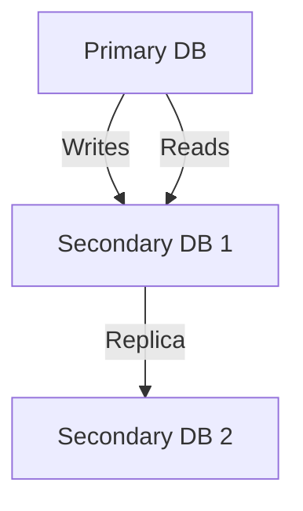

```markdown
# **Optimization Patterns: Supercharging Your Backend Performance**

When your application starts scaling—whether due to increasing users, heavier workloads, or complex data flows—performance bottlenecks become inevitable. A slow API response, bloated database queries, or inefficient caching strategies can turn a slick user experience into a frustrating crawl.

The good news? **Optimization patterns** are battle-tested techniques that address these challenges systematically. From query tuning to caching strategies, these patterns help you squeeze every last millisecond of efficiency out of your system—without sacrificing maintainability or readability.

In this guide, we’ll explore **real-world optimization patterns** for databases and APIs, their tradeoffs, and how to apply them effectively.

---

## **The Problem: Performance Without Patterns**

Imagine your e-commerce platform is doing well—users are growing, traffic is increasing, and revenue is up. But suddenly, your checkout process slows to a crawl because:

- **Database queries** are fetching unnecessary data.
- **API calls** are cascading, waiting for dependent microservices.
- **Caching** is either too aggressive (stale data) or nonexistent (constant recomputation).
- **Load balancing** isn’t distributing requests efficiently, causing spikes in latency.

Without structured optimization patterns, these issues often feel like a guessing game:

- *"Should I add an index here?"* (But which one?)
- *"Is this cache key too broad or too narrow?"*
- *"Why is this query suddenly slow after a schema change?"*

There’s no silver bullet—but there are **proven patterns** that help you systematically eliminate these pain points.

---

## **The Solution: Optimization Patterns for Databases & APIs**

Optimization patterns fall into three broad categories:

1. **Database Optimization** – Reducing query load, improving index usage, and minimizing I/O.
2. **API Optimization** – Reducing latency, batching requests, and caching strategically.
3. **System-Level Optimization** – Load balancing, rate limiting, and parallel processing.

Each pattern comes with tradeoffs—some improve performance at the cost of complexity, while others require careful monitoring.

---

## **Components/Solutions: Key Optimization Patterns**

### **1. Database Optimization Patterns**

#### **a) Indexing & Query Tuning**
**When to use:** When queries are slow due to full table scans or missing indexes.

**Example:** Suppose we have a `User` table with a common search filter (`email`):

```sql
-- Slow query (no index)
SELECT * FROM users WHERE email = 'user@example.com';
```

We can add a composite index:

```sql
CREATE INDEX idx_users_email ON users(email);
```

Now the query leverages the index:

```sql
-- Optimized with index
EXPLAIN SELECT * FROM users WHERE email = 'user@example.com';
-- Expected output: Uses index (idx_users_email)
```

**Tradeoffs:**
✅ Faster reads, but:
⚠️ Writes become slower (index updates).
⚠️ Unused indexes are maintenance overhead.

**Key Rule:** Always check `EXPLAIN ANALYZE` before optimizing.

---

#### **b) Read/Write Splitting**
**When to use:** When read-heavy workloads overwhelm your primary database.

**Example:** A blog application with high traffic but mostly read-heavy operations.



**Implementation:**
- Use a **read replica** (PostgreSQL, MySQL) or **sharding** (MongoDB, Cassandra).
- Route read queries to replicas using a load balancer.

**Tradeoffs:**
✅ Scales reads without overloading writes.
⚠️ Requires eventual consistency (for replicas).

---

### **2. API Optimization Patterns**

#### **a) Caching Strategies (CDN, Client-Side, In-Memory)**
**When to use:** When API responses are expensive or repeated.

**Example:** A weather API returning the same data for a location.

```python
# FastAPI Example: Client-Side Caching
from fastapi import FastAPI, Response

app = FastAPI()

@app.get("/weather/{city}")
async def get_weather(city: str):
    # Simulate expensive computation
    response = fetch_weather(city)
    return Response(content=response, headers={"Cache-Control": "max-age=300"})
```

**Tradeoffs:**
✅ Reduces server load.
⚠️ Stale data if not invalidated properly.

---

#### **b) Request Batching & Pagination**
**When to use:** When clients request large datasets inefficiently.

**Example:** A user fetching 1000 orders in one call.

```python
# Bad: Single massive query
orders = db.query("SELECT * FROM orders WHERE user_id = ?", user_id)

# Good: Paginated API
@app.get("/orders/{user_id}/page/{page:int}")
def get_orders_paginated(user_id: str, page: int):
    limit = 20
    offset = (page - 1) * limit
    orders = db.query("SELECT * FROM orders WHERE user_id = ? LIMIT ? OFFSET ?", user_id, limit, offset)
    return {"orders": orders}
```

**Tradeoffs:**
✅ Improves client performance.
⚠️ Requires frontend to handle pagination.

---

### **3. System-Level Optimization Patterns**

#### **a) Load Balancing & Auto-Scaling**
**When to use:** When traffic spikes unpredictably.

**Example:** Using Kubernetes to scale API pods under load.

```yaml
# Kubernetes Deployment Example
apiVersion: apps/v1
kind: Deployment
metadata:
  name: api-service
spec:
  replicas: 2  # Start with 2 pods
  template:
    spec:
      containers:
      - name: api
        image: my-api:latest
        resources:
          requests:
            cpu: "100m"
            memory: "128Mi"
          limits:
            cpu: "500m"
            memory: "512Mi"
```

**Tradeoffs:**
✅ Handles traffic surges.
⚠️ Costs more at scale.

---

## **Implementation Guide**

### **Step 1: Profile First, Optimize Later**
Before optimizing, **measure** performance:

```bash
# Example: Using `pg_stat_statements` in PostgreSQL
SELECT query, calls, total_time, mean_time FROM pg_stat_statements ORDER BY mean_time DESC LIMIT 10;
```

**Tools:**
- **Databases:** `EXPLAIN ANALYZE`, `pg_stat_statements`, Slow Query Logs.
- **APIs:** `curl -v`, APM tools (New Relic, Datadog).

### **Step 2: Apply Patterns Methodically**
| **Pattern**          | **When to Use**                          | **Example Fix**                          |
|----------------------|------------------------------------------|------------------------------------------|
| Indexing             | Slow `SELECT` queries                   | Add `SELECT * FROM orders WHERE user_id = ...` |
| Read Replicas        | Read-heavy workloads                    | Route `SELECT` queries to replicas.      |
| Caching              | Repeated API calls                      | Use Redis + TTL (e.g., `max-age=300`).   |
| Pagination           | Large dataset fetches                   | Limit results to `LIMIT 20 OFFSET 0`.    |
| Load Balancing       | Traffic spikes                          | Scale pods dynamically (K8s HPA).        |

### **Step 3: Monitor & Iterate**
- Set up **alerts** for slow queries (e.g., > 1s).
- Use **A/B testing** for caching strategies (e.g., stale-while-revalidate vs. short TTL).

---

## **Common Mistakes to Avoid**

❌ **Over-Indexing:** Adding indexes without measuring impact.
❌ **Ignoring Write Costs:** Indexes help reads but hurt writes.
❌ **Caching Everything:** Some data changes too frequently (use `ETAGs` or `If-Modified-Since`).
❌ **Bypassing Pagination:** Returning all data in one call (even with filtering).
❌ **Static Scaling:** Over-provisioning without auto-scaling.

---

## **Key Takeaways**

✔ **Profile before optimizing** – Always measure before guessing.
✔ **Index strategically** – Only index columns used in `WHERE`, `JOIN`, or `ORDER BY`.
✔ **Leverage read replicas** – Offload reads to secondary DBs.
✔ **Cache wisely** – Balance freshness (`TTL`) and performance.
✔ **Use pagination/batching** – Avoid massive dataset transfers.
✔ **Scale dynamically** – Use auto-scaling for unpredictable traffic.
✔ **Monitor continuously** – Performance degrades over time (schema changes, data growth).

---

## **Conclusion**

Optimization isn’t about applying every pattern blindly—it’s about **systematically identifying bottlenecks** and applying the right solution. Whether it’s fine-tuning SQL queries, caching strategically, or scaling infrastructure, these patterns give you a structured way to squeeze out performance gains without breaking your application.

Start small, measure impact, and iterate. Over time, your system will become **faster, more responsive, and more cost-efficient**.

---
**Next Steps:**
- Experiment with `EXPLAIN ANALYZE` on your slowest queries.
- Try caching a high-traffic API endpoint with Redis.
- Set up a cloud auto-scaler (e.g., K8s Horizontal Pod Autoscaler).

Happy optimizing!
```