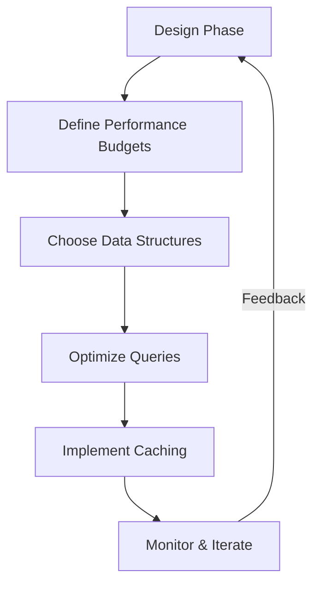

```markdown
---
title: "Performance Integration Pattern: Building High-Performance APIs with Efficient Data Access"
date: "2023-11-15"
description: "Learn how to integrate performance optimization into your backend systems with the Performance Integration Pattern. This guide covers challenges, solutions, practical code examples, and anti-patterns to help you build scalable, high-performance APIs."
tags: ["database design", "API design", "performance optimization", "backend engineering"]
author: "Alex Carter"
---

# Performance Integration Pattern: Building High-Performance APIs with Efficient Data Access

Performance is not just about tuning your database or caching layer in isolation. It’s about integrating performance optimizations holistically across your entire system—from the API layer down to the database—and ensuring they work together seamlessly. The **Performance Integration Pattern** is about embedding performance considerations into every design decision, from schema design to query execution to caching strategies.

In this post, we’ll explore why performance integration matters, how to identify bottlenecks, and how to implement concrete solutions using practical examples. We’ll also discuss common pitfalls and tradeoffs to help you build systems that scale efficiently.

---

## The Problem: Challenges Without Proper Performance Integration

Backend systems suffer from performance issues when developers treat performance as an afterthought. This often leads to:

### 1. **Performance Spikes During Load**
   - Apps work fine in development but degrade under production load.
   - Example: A social media feed that’s fast in QA but slows to a crawl at 50K users.
   - *Root cause*: No performance budget or load testing during early design phases.

### 2. **Overly Complex Caching Strategies**
   - Engineers add caching layers (e.g., Redis alongside database) without aligning their TTL (Time-To-Live) or invalidation policies.
   - Example: A product catalog that takes 100ms to load without caching but slows to 500ms when cached data is stale.
   - *Root cause*: Inconsistent caching strategies across services.

### 3. **Inefficient Database Design**
   - Normalized schemas lead to N+1 query problems or excessive joins.
   - Example: An e-commerce app where fetching a user’s order history requires 100 database queries instead of one.
   - *Root cause*: ORMs or query builders generating inefficient SQL.

### 4. **No Performance Observability**
   - Slow response times are discovered only after users complain, not proactively.
   - Example: A payment gateway that occasionally hangs due to an unoptimized database index.
   - *Root cause*: Lack of performance monitoring and tracing.

These issues arise because performance is fragmented across layers (API, app, database, caching) without a unified approach. The **Performance Integration Pattern** addresses these problems by treating performance as a first-class concern in every design decision.

---

## The Solution: The Performance Integration Pattern

The goal is to **integrate performance optimizations across all layers** of your system, ensuring that changes in one layer don’t break optimizations in another. Here’s how:

### Core Principles
1. **Performance-First Design**: Optimize for performance during development, not as an afterthought.
2. **Layer-Aware Optimization**: Optimize the database, caching, and API layers in tandem.
3. **Observability-Driven**: Continuously monitor and validate performance at every stage.
4. **Decoupled Tradeoffs**: Isolate optimizations so that changes in one layer don’t cascade unpredictably.

### Components/Solutions

| **Layer**       | **Optimization Strategy**                                                                 | **Tools/Techniques**                                                                 |
|------------------|-------------------------------------------------------------------------------------------|--------------------------------------------------------------------------------------|
| **API Layer**    | Reduce payload size, async processing, rate limiting                                      | GraphQL, gRPC, async/await, JWT token validation in background                     |
| **Application**  | Query batching, connection pooling, DTOs                                                 | Hibernate batching, PgBouncer, DTOs instead of full objects                        |
| **Database**     | Indexes, query optimization, denormalization                                              | EXPLAIN ANALYZE, materialized views, read replicas                                 |
| **Caching**      | Multi-layer caching (CDN + Redis + database) with TTLs                                   | Redis + Varnish, cache-aside pattern, write-through caching                        |
| **Observability**| Distributed tracing, APM, performance budgets                                             | OpenTelemetry, Datadog, New Relic, Grafana                                            |

---

## Code Examples: Practical Implementation

### Example 1: Batching Queries to Avoid N+1 Problems
**Problem**: Fetching a user’s orders in a loop leads to 100+ database queries.

**Solution**: Use a single query with joins or batch fetching.

#### SQL (Original Inefficient Approach)
```sql
-- N+1 query problem: One query per order
SELECT * FROM orders WHERE user_id = 1;
SELECT * FROM order_items WHERE order_id = 1;
SELECT * FROM order_items WHERE order_id = 2;
...
```

#### SQL (Optimized with JOIN)
```sql
-- Single query with JOIN
SELECT
    o.id,
    o.user_id,
    o.created_at,
    oi.product_id,
    oi.quantity
FROM
    orders o
JOIN
    order_items oi ON o.id = oi.order_id
WHERE
    o.user_id = 1;
```

#### Code Implementation (Spring Data JPA)
```java
// Original (N+1)
List<Order> orders = orderRepository.findByUserId(userId);
for (Order order : orders) {
    List<OrderItem> items = orderItemRepository.findByOrderId(order.getId());
    order.setItems(items); // Lazy-loads unless @BatchSize is set
}

// Optimized (Batch Fetch)
@EntityGraph(attributePaths = {"items"})
List<Order> orders = orderRepository.findByUserId(userId);
```

---

### Example 2: Caching Strategies with TTL Alignment
**Problem**: Inconsistent cache TTLs cause stale data or excessive cache misses.

**Solution**: Align caching layers with the same TTL or use a multi-level cache.

#### Redis + Database Caching (Optimized)
```java
// Cache key: "user:123:orders"
String cacheKey = "user:" + userId + ":orders";

// Try cache first
List<Order> orders = cacheService.get(cacheKey, () -> {
    // Fallback to database
    List<Order> dbOrders = orderRepository.findByUserId(userId);
    cacheService.set(cacheKey, dbOrders, 300L); // TTL = 5 minutes
    return dbOrders;
}, 300L); // TTL = 5 minutes
```

#### Kubernetes HPA + Database Read Replicas
```yaml
# Example: Auto-scaling for read replicas
apiVersion: autoscaling/v2
kind: HorizontalPodAutoscaler
metadata:
  name: order-service-read-replica
spec:
  scaleTargetRef:
    apiVersion: apps/v1
    kind: Deployment
    name: order-service-read-replica
  minReplicas: 2
  maxReplicas: 10
  metrics:
  - type: Resource
    resource:
      name: cpu
      target:
        type: Utilization
        averageUtilization: 70
```

---

### Example 3: GraphQL vs. REST for Performance
**Problem**: REST APIs over-fetch data, while GraphQL allows fine-grained queries.

**Solution**: Use GraphQL for flexible queries and GraphQL Persisted Queries to reduce parsing overhead.

#### GraphQL Schema (Optimized)
```graphql
type Query {
    userOrders(userId: ID!): [Order!]!
}

type Order {
    id: ID!
    userId: ID!
    total: Float!
    items: [OrderItem!]!
}

type OrderItem {
    productId: ID!
    quantity: Int!
}
```

#### GraphQL Persisted Query (Reduces Parsing Overhead)
```sql
-- Database query (generated from persisted query)
SELECT
    o.id,
    o.user_id,
    o.total,
    oi.product_id,
    oi.quantity
FROM
    orders o
JOIN
    order_items oi ON o.id = oi.order_id
WHERE
    o.user_id = $1;
```

---

## Implementation Guide: Step-by-Step

### 1. **Performance Budgeting**
   - Define latency targets for each API endpoint (e.g., 95th percentile < 150ms).
   - Use tools like [K6](https://k6.io/) or [Locust](https://locust.io/) to simulate load.

```bash
# Example: K6 script to test API latency
import http from 'k6/http';
import { check, sleep } from 'k6';

export const options = {
  stages: [
    { duration: '30s', target: 200 }, // Ramp-up
    { duration: '1m', target: 500 },  // Steady state
    { duration: '30s', target: 200 }, // Ramp-down
  ],
};

export default function () {
  const res = http.get('https://api.example.com/orders');
  check(res, {
    'Status is 200': (r) => r.status === 200,
    'Latency < 150ms': (r) => r.timings.duration < 150,
  });
  sleep(1);
}
```

### 2. **Database Optimization**
   - **Add Indexes Strategically**:
     ```sql
     -- Index for user orders lookups
     CREATE INDEX idx_orders_user_id ON orders(user_id);
     ```
   - **Use Query Explain**:
     ```sql
     -- Analyze a slow query
     EXPLAIN ANALYZE SELECT * FROM orders WHERE user_id = 123 LIMIT 100;
     ```
   - **Denormalize Where Needed**:
     ```sql
     -- Add computed columns for faster filtering
     ALTER TABLE orders ADD COLUMN user_name VARCHAR(100);
     UPDATE orders o JOIN users u ON o.user_id = u.id SET o.user_name = u.name;
     ```

### 3. **Caching Layer Integration**
   - **Multi-Level Cache**:
     - CDN (for static assets)
     - Redis (for dynamic data)
     - Database (for freshness)
   - **Cache Invalidation**:
     ```python
     # Flask example: Invalidate cache on order update
     from flask import current_app
     from redis import Redis

     cache = Redis(current_app.config['REDIS_URL'])

     @app.route('/orders/<int:order_id>', methods=['PUT'])
     def update_order(order_id):
         cache.delete(f"order:{order_id}")  # Invalidate cache
         # Update database...
         return {"status": "updated"}
     ```

### 4. **API Layer Optimizations**
   - **Async Processing**:
     ```java
     // Spring WebFlux example: Async order processing
     @GetMapping("/orders/{id}/process")
     public Mono<String> processOrderAsync(@PathVariable String id) {
         return orderService.processOrder(id)
             .map(r -> "Processing started for order " + id);
     }
     ```
   - **Compression**:
     ```yaml
     # Nginx config for gzip compression
     gzip on;
     gzip_types text/plain text/css application/json application/javascript text/xml application/xml application/xml+rss text/javascript;
     ```

### 5. **Observability**
   - **Distributed Tracing**:
     ```go
     // Go example: OpenTelemetry tracing
     import (
         "go.opentelemetry.io/otel"
         "go.opentelemetry.io/otel/trace"
     )

     func handler(w http.ResponseWriter, r *http.Request) {
         ctx, span := otel.Tracer("api").Start(r.Context(), "fetch_orders")
         defer span.End()

         // ... business logic ...
     }
     ```
   - **Performance Budgets**:
     ```markdown
     ### API Performance Budget
     | Endpoint          | 95th Percentile Target | Current (Q3 2023) |
     |-------------------|------------------------|--------------------|
     | `/orders`         | 150ms                  | 220ms              |
     | `/users/:id`      | 100ms                  | 85ms               |
     ```

---

## Common Mistakes to Avoid

1. **Over-Optimizing Prematurely**:
   - Don’t optimize database indexes or caching before profiling. Use tools like `pg_stat_statements` (PostgreSQL) or `slow_query_log` (MySQL) to identify bottlenecks.

2. **Ignoring Cache Stampede**:
   - When all requests miss the cache simultaneously, it can overwhelm the database. Use **warm-up caches** or **probabilistic early expiration**.

     ```sql
     -- Example: Probabilistic early expiration (Redis)
     SETEX "user:123:orders" 300 "ordered_data" NX
     ```

3. **Tight Coupling Between Layers**:
   - Avoid hardcoding database queries in the API layer. Use **abstraction layers** (e.g., repository pattern) to decouple logic.

4. **Neglecting Cold Starts**:
   - Cloud functions (e.g., AWS Lambda) have cold start latencies. Use **provisioned concurrency** or **warm-up requests**.

5. **Silent Failures in Caching**:
   - Always handle cache failures gracefully. Implement **fallback mechanisms** (e.g., retry with database).

   ```python
   # Cache fallback with retry
   def get_user_orders(user_id):
       cache_key = f"user:{user_id}:orders"
       try:
           orders = cache.get(cache_key)
           if orders:
               return orders
       except Exception as e:
           print(f"Cache error: {e}. Falling back to DB.")

       # Fallback to database
       orders = db.get_user_orders(user_id)
       cache.set(cache_key, orders, 300)
       return orders
   ```

---

## Key Takeaways

- **Performance integration is not a one-time task**—it’s an ongoing process embedded in your CI/CD pipeline.
- **Measure, don’t guess**. Use APM tools to identify bottlenecks objectively.
- **Optimize end-to-end**. Focus on user-perceived latency, not just database speed.
- **Balance tradeoffs**. Caching improves reads but complicates writes. Denormalization speeds reads but slows writes.
- **Automate performance checks**. Include latency tests in your test suite and enforce performance budgets.



---

## Conclusion

The **Performance Integration Pattern** shifts performance from an afterthought to a first-class concern in your system design. By integrating optimizations across the API, application, database, and cache layers—while continuously measuring and iterating—you can build scalable, high-performance systems that meet user expectations even under heavy load.

### Next Steps
1. **Profile your system**: Use tools like `pt-mysql-summary` (MySQL), `pg_stat_statements` (PostgreSQL), or APM tools (Datadog, New Relic).
2. **Set performance budgets**: Enforce latency goals in your tests.
3. **Experiment**: Try denormalization, caching, or async processing in one service at a time.
4. **Automate**: Integrate performance checks into your testing pipeline.

Performance isn’t about working harder—it’s about working smarter. Start small, measure, and iteratively improve.

---
```

This blog post provides a comprehensive guide to the Performance Integration Pattern, balancing practical code examples with deeper technical insights.