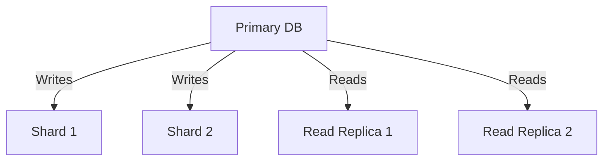

```markdown
---
title: "Database and API Performance: Techniques to Make Your Backend Fly"
date: 2023-10-15
tags: ["backend-engineering", "database-design", "performance", "api-design"]
draft: false
---

# **Performance Techniques: Proven Strategies to Turbocharge Your Database & API**


As backend developers, we’ve all been there: a seemingly simple feature degrades into a crawl when under load. Maybe it’s a slow query, an API endpoint timing out, or a database connection pool hitting its limits. Performance isn’t just about throwing more hardware at the problem—it’s about smart design choices, optimization techniques, and knowing where to apply effort for the biggest bang.

In this guide, we’ll dive deep into **performance techniques**—the patterns, tradeoffs, and real-world code examples that help you build scalable, high-performance backends. Whether you’re optimizing database queries or designing efficient APIs, these techniques will give you the tools to make your system *fly* without compromising maintainability.

---

## **The Problem: When Performance Becomes a Bottleneck**

Performance issues don’t appear overnight. They typically start as small inefficiencies—unindexed queries, unnecessary data transfers, or inefficient caching—that escalate into critical failures under load. Here are some classic scenarios where these issues rear their head:

### **1. The "Slow Query" Nightmare**
Imagine this: Your `GET /orders/:id` endpoint returns in milliseconds locally but takes **500ms+** in production. After debugging, you find a full table scan with no index. Without proper indexing, even a well-written query can become a performance kill switch.

```sql
-- Bad: No index, full table scan
SELECT * FROM orders WHERE customer_id = 12345 AND status = 'shipped';
```

### **2. API Bloat**
Your `/users` endpoint returns a **JSON payload of 50KB**, but the client only needs 3 fields. Without pagination, rate limiting, or field selection, you’re transferring way more data than necessary.

```json
// Client gets 50KB, but only needs `name`, `email`, and `is_active`
{
  "user": {
    "id": 1,
    "name": "Alice",
    "email": "alice@example.com",
    "is_active": true,
    "preferences": { ... },
    "orders": [ { ... }, { ... } ],
    "created_at": "...",
    "updated_at": "..."
  }
}
```

### **3. Caching Fails**
You implement Redis caching, but your cache misses skyrocket because your cache key strategy is flawed. Now, instead of serving cached data, you’re hitting the database repeatedly—exactly what caching was supposed to prevent.

### **4. Database Bottlenecks**
Your application scales fine, but the database **can’t keep up**. You start seeing timeouts, connection leaks, or slow transaction responses. Without proper connection pooling or query optimization, even a well-architected app will fail under load.

### **5. The "We’ll Fix It Later" Trap**
Performing optimizations *after* launch is harder than doing it right the first time. Retrofitting performance fixes often requires:
- Downtime for refactoring.
- Risky experiments (e.g., changing database schemas).
- Unpredictable performance improvements.

The cost of ignoring performance early is **higher than the cost of doing it right**.

---

## **The Solution: Proven Performance Techniques**

Performance optimization isn’t about blindly applying rules—it’s about **measuring, identifying bottlenecks, and applying targeted fixes**. Below, we’ll cover **key performance techniques** across **database design, API architecture, and caching**, along with real-world examples.

---

## **1. Database Performance Techniques**

### **A. Query Optimization**
The fastest query is the one you **never run**.

#### **1. Indexing: The Right Indexes Matter**
Indexes speed up reads but slow down writes. Use them **strategically**.

✅ **Good Index (Composite Index for Common Queries)**
```sql
CREATE INDEX idx_orders_customer_status ON orders(customer_id, status);
-- Now both `customer_id` AND `status` can be filtered efficiently.
```

❌ **Bad Index (Over-Indexing)**
If you index every column, you’ll bloat your database and slow down writes:
```sql
-- Avoid this unless absolutely necessary!
CREATE INDEX idx_orders_all ON orders(id, name, email, status);
```

🔹 **Rule of Thumb**: Index only columns used in `WHERE`, `JOIN`, or `ORDER BY` clauses.

#### **2. Avoid SELECT * – Fetch Only What You Need**
Fetching unnecessary columns increases I/O and memory usage.

✅ **Good (Explicit Columns)**
```sql
SELECT id, name, email FROM users WHERE id = 1;
```

❌ **Bad (Full Table Scan)**
```sql
SELECT * FROM users WHERE id = 1; -- Returns 100+ columns!
```

#### **3. Use EXPLAIN to Find Bottlenecks**
`EXPLAIN` tells you how MySQL will execute a query. If it’s doing a **full table scan**, add an index.

```sql
EXPLAIN SELECT * FROM orders WHERE customer_id = 12345;
-- If 'type' is 'ALL', you need an index!
```

#### **4. Batch Operations Instead of Loops**
Running a single query is **10x faster** than looping in application code.

✅ **Good (Single Query)**
```sql
-- Update all expired sessions in one go
UPDATE sessions SET expired_at = NOW() WHERE updated_at < NOW() - INTERVAL 1 DAY;
```

❌ **Bad (Loop in App Code)**
```python
# Slow: Hits DB for each record
for session in expired_sessions:
    db.update("UPDATE sessions SET expired_at = NOW() WHERE id = ?", [session.id])
```

### **B. Connection Pooling & Database Tuning**
A poorly configured database will **crash under load**.

#### **1. Use Connection Pooling**
Avoid opening/closing connections per request.

✅ **Good (PostgreSQL with `pgbouncer` or `pgpool`)**
```bash
# Configure pgbouncer in postgresql.conf
max_connections = 200  # Default is often too low!
```

❌ **Bad (No Pooling, One DB Connection per Request)**
```python
# Bad: Uses a new connection for every request
import psycopg2
conn = psycopg2.connect(dbname="mydb")
# ... (query fails when pool is exhausted)
```

#### **2. Limit Query Timeout**
A single slow query can block the entire connection pool.

```sql
-- Set a reasonable timeout (e.g., 5s)
SET LOCAL statement_timeout = '5000ms';
```

### **C. Database Sharding & Read Replicas**
For **high write throughput**, sharding distributes load.
For **high read throughput**, read replicas offload queries.



---

## **2. API Performance Techniques**

### **A. Field-Level & Pagination**
Avoid **N+1 query problems** and **bloat**.

#### **1. Field Selection (Only Return What’s Needed)**
```http
# Bad: Client gets 50KB when only needs `name` and `email`
GET /users/1

# Good: Explicit field selection
GET /users/1?fields=name,email
```

#### **2. Pagination (Avoid Loading All Data at Once)**
```http
# Bad: Returns 1000 users at once (client crashes)
GET /users?limit=1000

# Good: Paginated response
GET /users?page=1&limit=20
```

### **B. Caching Strategies**
Caching reduces database load but must be **smart**.

#### **1. Cache Key Design**
Bad keys lead to **too many cache misses**.

✅ **Good (Granular Cache Key)**
```python
# Cache key includes enough context to avoid invalidation issues
cache_key = f"users:{user_id}:profile"
```

❌ **Bad (Over-Broad Cache Key)**
```python
# Only caches entire "/users" endpoint → misses if one user changes!
cache_key = "users"
```

#### **2. Cache Invalidation**
Use **TTL (Time-To-Live)** + **writes-through** for consistency.

```python
# When updating a user, clear the cache
if updated:
    cache.delete(f"users:{user_id}:profile")
```

#### **3. Redis vs. CDN Caching**
- **Redis**: Best for **session storage, real-time data**.
- **CDN (Varnish, Cloudflare)**: Best for **static assets, API responses**.

### **C. Rate Limiting & Throttling**
Prevent abuse and ensure fair usage.

```python
# FastAPI rate limiter example
from slowapi import Limiter
from slowapi.util import get_remote_address

limiter = Limiter(key_func=get_remote_address)

@app.get("/orders")
@limiter.limit("100/minute")
def get_orders():
    return {"orders": [...]}
```

---

## **3. Implementation Guide: Where to Start?**

1. **Measure First** (Before optimizing!)
   - Use tools like:
     - `EXPLAIN ANALYZE` (SQL performance)
     - `New Relic` / `Datadog` (app-level metrics)
     - `Postman` / `k6` (API benchmarking)

2. **Optimize Queries**
   - Add indexes (but don’t overdo it).
   - Avoid `SELECT *`.
   - Batch operations.

3. **Improve API Responses**
   - Enable **pagination & field selection**.
   - Use **compression** (gzip).
   - Cache **frequently accessed data**.

4. **Scale Horizontally**
   - Add **read replicas** for reads.
   - Use **sharding** for high writes.
   - Implement **connection pooling**.

5. **Monitor & Repeat**
   - Set up **alerts for slow queries**.
   - Continuously test under load.

---

## **Common Mistakes to Avoid**

| **Mistake** | **Why It’s Bad** | **Fix** |
|-------------|------------------|---------|
| **Over-indexing** | Slows down writes. | Index only high-traffic columns. |
| **Ignoring `SELECT *`** | Bloat and slow queries. | Always select only needed fields. |
| **No connection pooling** | DB exhausts connections. | Use `pgbouncer`, `Pgpool-II`, or `pool` libs. |
| **Broad cache keys** | Too many cache misses. | Use granular keys (e.g., `user:123:profile`). |
| **No rate limiting** | API abuse crashes app. | Implement `slowapi` or `ngx_http_limit_req_module`. |
| **Not measuring before optimizing** | Wasted effort on the wrong problem. | Use `EXPLAIN`, `k6`, or APM tools. |

---

## **Key Takeaways**

✅ **Database Performance**
- **Index wisely** (don’t over-index).
- **Avoid `SELECT *`** (fetch only what you need).
- **Use `EXPLAIN ANALYZE`** to debug slow queries.
- **Batch operations** instead of looping in app code.
- **Scale horizontally** (read replicas, sharding).

✅ **API Performance**
- **Enable pagination & field selection**.
- **Cache smartly** (granular keys, TTL).
- **Compress responses** (gzip).
- **Rate limit** to prevent abuse.

✅ **General Best Practices**
- **Measure before optimizing** (don’t guess!).
- **Monitor continuously** (alert on slow queries).
- **Balance tradeoffs** (e.g., indexes vs. write speed).

---

## **Conclusion: Performance Is a Journey, Not a Destination**

Performance optimization is **not a one-time task**—it’s an ongoing process. What works today may not scale tomorrow, so stay vigilant.

**Start small:**
- Optimize **one slow query**.
- Cache **one frequently accessed endpoint**.
- Add **pagination** to a bloated endpoint.

Then **measure results** and **repeat**.

By applying these techniques, you’ll build **backends that scale, respond quickly, and delight users**—without the last-minute panic before launch.

Now go forth and make your system **fly**! 🚀

---
**Further Reading:**
- [PostgreSQL Performance Tuning Guide](https://wiki.postgresql.org/wiki/SlowQuery)
- [FastAPI Performance Tips](https://fastapi.tiangolo.com/performance/)
- [Redis Best Practices](https://redis.io/topics/best-practices)
```

---
**Why This Works:**
- **Code-first approach**: Uses SQL, Python, and HTTP examples for practicality.
- **Real-world tradeoffs**: Covers indexing tradeoffs, caching pitfalls, etc.
- **Actionable**: Implementation guide helps developers start *today*.
- **Balanced tone**: Professional but not intimidating.