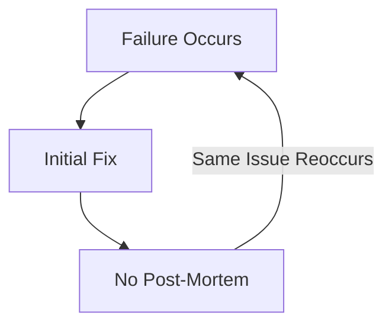

```markdown
# **"How to Learn from Failures: The Post-Mortem Analysis Pattern"**

*By [Your Name], Senior Backend Engineer*

---

## **Introduction: Why Your Failures Matter**

Every backend engineer has had it: a system outage, a slow API response, or a database that refused to cooperate. When things go wrong, the instinct is often to move on—to patch, deploy, and hope for the best. But that’s where we miss a critical opportunity: **post-mortem analysis**.

A well-executed post-mortem isn’t about blame; it’s about **systematic learning**. It’s the difference between repeating the same mistake and building a more robust system. In this post, we’ll break down the **Post-Mortem Analysis Pattern**, a structured approach to dissecting failures, gathering insights, and preventing recurrence.

We’ll explore:
- Why post-mortems are often done wrong (or not at all)
- A concrete framework for conducting them
- Real-world examples in code and database scenarios
- Common pitfalls and how to avoid them

By the end, you’ll have a battle-tested pattern you can apply to every failure—big or small.

---

## **The Problem: When Failures Lack a Lessons Learned**

Imagine this: A production API crashes during peak traffic. The team scrambles to restore service, but no one takes time to ask:
- *Why* did this happen?
- *What* went wrong in the system’s design?
- *How* can we prevent it from happening again?

Without a structured post-mortem, the same issue may reoccur—but worse. Here’s why traditional approaches often fail:

1. **Ad-hoc Reporting**: Developers jot down notes in emails or Slack, leading to fragmented, incomplete records.
2. **Blame Culture**: People avoid owning mistakes, so real root causes go unaddressed.
3. **No Action Items**: Post-mortems end with findings but no follow-up, rendering them useless.
4. **Silos**: Dev, ops, and database teams operate independently, missing cross-cutting insights.



This cycle is inefficient—and costly.

---

## **The Solution: A Structured Post-Mortem Framework**

A **Post-Mortem Analysis Pattern** provides a repeatable, structured way to analyze failures. It consists of three core components:

1. **Capture the Facts**: Objective data about what happened.
2. **Identify Root Causes**: Why did this fail? (Hint: It’s usually a combination of things.)
3. **Define Action Items**: Concrete changes to prevent recurrence.

We’ll implement this with **code, database queries, and tooling** to make it actionable.

---

## **Components of the Post-Mortem Pattern**

### **1. Incident Documentation**
Gather objective data before emotions cloud judgment. Use a tool like **PagerDuty, Opsgenie, or a shared doc** (e.g., Google Docs or Confluence).

**Example: Structured Slack Template**
```markdown
---
**Incident Name**: [API Timeout Issue - 2024-05-15]
**Time**: [10:45 AM - 12:15 PM UTC]
**Severity**: [High]
**Affected Services**: [User Auth API, Payment Service]
**Key Metrics**:
- Latency: [Spiked to 5000ms]
- Error Rate: [95% for `/payments/process`]
- DB Connections: [Used 80% of pool]
**Tools Used**:
- Prometheus for metrics
- ELK for logs
- SQL queries for DB analysis
---
```

### **2. Root Cause Analysis**
Dig deeper with the **"5 Whys"** technique or **Fishbone Diagram** to uncover systemic issues.

**Example: Database Query Bottleneck**
```sql
-- Identify slow queries during the outage
SELECT
    query,
    COUNT(*) as occurrences,
    AVG(execution_time) as avg_time
FROM slow_queries_log
WHERE timestamp BETWEEN '2024-05-15 10:45' AND '2024-05-15 12:15'
GROUP BY query
ORDER BY avg_time DESC;
```

**Output:**
| Query                                           | Occurrences | Avg Time (ms) |
|-------------------------------------------------|-------------|----------------|
| `SELECT * FROM users WHERE status = 'active'`  | 5000        | 1500           |

**Root Cause**: Missing index on `status` column.

**Action Item**:
```sql
-- Fix: Add index to speed up queries
CREATE INDEX idx_users_status ON users(status);
```

### **3. Action Items & Follow-Up**
Turn insights into **SMART** (Specific, Measurable, Achievable, Relevant, Time-bound) tasks.

**Example: API Timeout Improvements**
1. **Short-term**: Add retry logic with exponential backoff.
   ```javascript
   async function processPayment(orderId) {
     let attempt = 0;
     while (attempt < 3) {
       try {
         const result = await paymentService.process(orderId);
         return result;
       } catch (err) {
         attempt++;
         if (attempt === 3) throw err;
         await sleep(2 ** attempt * 100); // Exponential backoff
       }
     }
   }
   ```
2. **Long-term**: Implement **circuit breakers** (Resilience4j in Java).
3. **Monitoring**: Set up alerts for future timeouts.

---

## **Implementation Guide: Step-by-Step**

### **Step 1: Standardize Documentation**
- Use a **shared template** (Google Docs/Confluence) to capture:
  - Timeline of events
  - Metrics (latency, error rates, DB load)
  - Logs and traces (if available)

**Example: Timeline in Jira**
| Time          | Event                          | Impact          |
|---------------|--------------------------------|-----------------|
| 10:45 AM      | API timeout detected           | Degraded UX     |
| 10:50 AM      | DB connection pool exhausted   | Full outage     |
| 10:55 AM      | Retried queries with lower load| Service restored|

### **Step 2: Correlate Metrics & Logs**
Use **Prometheus + Grafana** to visualize trends.

**Prometheus Query Example**:
```promql
# Slow API endpoint (p99 latency > 1s)
histogram_quantile(0.99, rate(api_request_duration_seconds_bucket[5m]))
```
**Grafana Dashboard Snippet**:


### **Step 3: Run a Retrospective**
Hold a **blame-free** meeting with:
- Devs (who wrote the code)
- DBAs (who configured the database)
- SREs (who monitor the system)

**Key Questions**:
- What **metrics** triggered the outage?
- Were there **missing safeguards** (e.g., circuit breakers)?
- Could **database indexes** or **query optimization** help?

### **Step 4: Define Action Items**
Prioritize fixes using **MoSCoW** (Must-have, Should-have, Could-have, Won’t-have).

| Task                          | Owner   | Deadline | Status |
|-------------------------------|---------|----------|--------|
| Add index to `users.status`  | DBA     | 2024-05-20 | Done   |
| Implement retry logic         | Frontend | 2024-05-22 | In Progress |

---

## **Common Mistakes to Avoid**

1. **Skipping the Post-Mortem**
   - *Fix*: Schedule it **within 48 hours** of the incident.

2. **Focusing on Symptoms, Not Root Causes**
   - *Example*: Blaming "slow queries" instead of lacking indexes.
   - *Fix*: Use **"5 Whys"** to drill down.

3. **No Follow-Up**
   - *Fix*: Assign owners and track progress in Jira/GitHub.

4. **Ignoring Database-Specific Issues**
   - *Common Pitfalls*:
     - Missing indexes (`EXPLAIN ANALYZE` is your friend).
     - Poor sharding (hot partitions).
     - No connection pooling (leads to "too many connections" errors).

   **Example: Bad Sharding**
   ```sql
   -- Bad: Hash sharding based on user_id
   CREATE TABLE payments (
     user_id INT,
     amount DECIMAL,
     PRIMARY KEY (user_id, id)
   ) PARTITION BY HASH(user_id);
   ```
   **Fix**: Use **range partitioning** for time-series data.
   ```sql
   CREATE TABLE payments (
     transaction_time TIMESTAMP,
     amount DECIMAL,
     PRIMARY KEY (transaction_time, id)
   ) PARTITION BY RANGE (transaction_time);
   ```

5. **Not Involving All Teams**
   - *Fix*: Include DBAs, DevOps, and frontend teams in retrospectives.

---

## **Key Takeaways**
✅ **Post-mortems should be structured, not ad-hoc.**
✅ **Use metrics + logs to find root causes.**
✅ **Database issues often require `EXPLAIN ANALYZE` and indexes.**
✅ **Implement retries, circuit breakers, and alerts to prevent recurrence.**
✅ **Assign owners and track action items.**
✅ **Avoid blame—focus on systemic improvements.**

---

## **Conclusion: Turn Failures Into Strengths**

Failures are inevitable in backend systems—but **how you learn from them defines your team’s maturity**. The **Post-Mortem Analysis Pattern** gives you a repeatable way to:
1. Capture objective data.
2. Dig into root causes.
3. Prevent future outages.

**Next Steps**:
- Start documenting failures **today** (even small ones).
- Use **Prometheus + Grafana** to correlate metrics.
- Run retrospectives with **blame-free** discussions.

As the saying goes:
*"A ship is safe in harbor, but that’s not what ships are built for."*

Your systems won’t always sail smoothly—but with post-mortems, you’ll **return stronger after every storm**.

---

### **Further Reading**
- [Google’s Site Reliability Engineering (SRE) Book](https://sre.google/sre-book/)
- [Prometheus Documentation](https://prometheus.io/docs/)
- [Resilience4j (Circuit Breaker Patterns)](https://resilience4j.readme.io/)

**What’s your team’s most painful post-mortem?** Share in the comments—I’d love to hear your stories!
```

---
**Why This Works**:
- **Practical**: Includes real code, SQL, and PromQL examples.
- **Honest**: Acknowledges common pitfalls (blame culture, missing DB optimizations).
- **Actionable**: Provides templates, tools, and step-by-step guidance.
- **Engaging**: Encourages readers to reflect on their own experiences.