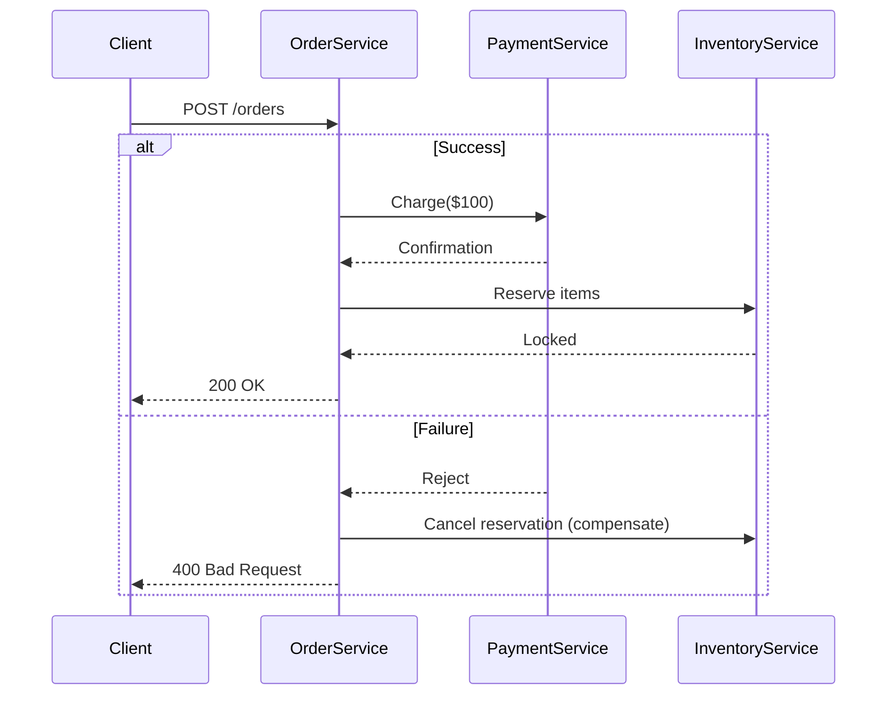

```markdown
# **Waterfall Practices in API and Database Design: A Beginner-Friendly Guide**

*How to structure backend workflows for reliability and maintainability—when you need one thing to finish before starting the next.*

---

## **Introduction**

When building backend systems, we often face workflows where one task must complete before another can begin. A user can’t finalize an order until their payment is processed. A report can’t be generated until the database is fully synced. A feature can’t go live until all dependent migrations are applied.

This is where the **"waterfall pattern"** comes into play. The waterfall pattern (sometimes called *sequential execution* or *chained operations*) ensures that tasks are executed step-by-step, in strict order, with each stage depending entirely on the previous one. It’s a simple yet powerful approach that guarantees atomicity—either all steps succeed, or none do.

However, waterfall isn’t just about rigid sequencing. It’s about **making dependencies explicit**, **managing state carefully**, and **designing for fault tolerance**. In this guide, we’ll explore the when, why, and how of waterfall practices—with practical code examples in Python, SQL, and API design.

---

## **The Problem: Why Waterfall Matters (and When It’s Necessary)**

### **1. Unpredictable Dependencies**
Imagine an e-commerce API where a user submits an order request. The workflow looks like this:
1. **Validate cart items** (check stock, prices, expiries)
2. **Process payment** (deduct funds, verify gateway)
3. **Reserve inventory** (lock stock)
4. **Ship the order** (update tracking)

If any step fails (e.g., payment timeout), the entire order should be rolled back—not just the payment. If we don’t enforce waterfall execution, we risk:
- **Partial state changes** (inventory reserved but payment fails)
- **Race conditions** (another user buys the same item while we’re holding it)
- **Inconsistent data** (database and payment gateway out of sync)

### **2. Database Integrity Risks**
Without waterfall, a transaction might look like this (pseudo-code):

```python
def create_order(order_data):
    # Step 1: Save order to DB (without payment)
    order = Orders.create(**order_data)

    # Step 2: Process payment
    payment_result = Stripe.charge(order_id=order.id, amount=order.total)

    # Step 3: Lock inventory (if payment succeeds)
    if payment_result.success:
        inventory_lock(order_id=order.id)
```

**Problem:** If `Stripe.charge()` fails after saving the order, we now have a broken order record with no payment. This violates the **ACID** principle of atomicity.

### **3. API Design Pitfalls**
RESTful APIs often assume idempotency (repeatable calls have the same effect), but waterfall-dependent flows break this. Example:
- **PUT /orders/{id}/process** (expects atomic execution)
- **POST /orders** (followed by **POST /payments**, then **POST /shipments**)

If a client retries `/orders` due to a 500 error, it could create duplicate orders. Waterfall helps by treating the entire workflow as a single logical operation.

---

## **The Solution: Waterfall Patterns in Practice**

Waterfall isn’t a monolithic pattern—it’s a collection of techniques to enforce sequential execution while keeping systems robust. Here’s how to implement it:

### **1. Transactional Waterfall (Database-Level)**
Use **database transactions** to wrap all steps in a single atomic unit.

#### **Example: Order Processing with Transactions**
```python
from django.db import transaction

def process_order(order_data):
    try:
        with transaction.atomic():
            # 1. Save order (starts transaction)
            order = Orders.objects.create(**order_data)

            # 2. Process payment (fails if DB error occurs)
            payment = Stripe.charge(
                order_id=order.id,
                amount=order.total,
                description="Order #" + str(order.id)
            )

            if not payment.success:
                raise ValueError("Payment failed")

            # 3. Lock inventory
            inventory_lock(order_id=order.id)

            # 4. Send confirmation email
            send_email(order.email, "Order Confirmation", order)
            return order

    except Exception as e:
        # Rollback entire transaction on failure
        logging.error(f"Order failed: {e}")
        raise
```

**Key Points:**
- `transaction.atomic()` ensures all steps succeed or fail together.
- If `Stripe.charge()` fails, the `Orders` record is **never committed**.
- Works for most CRUD operations where data consistency is critical.

---

### **2. Saga Pattern (Distributed Workflows)**
When your waterfall spans multiple services (e.g., payment service, inventory service), use the **Saga pattern**—a sequence of local transactions with compensating actions.

#### **Example: Cross-Service Order Flow**


**Implementation (Python + Asyncio):**
```python
async def process_order_saga(order_data):
    order = Orders.create(**order_data)  # Step 1

    try:
        # Step 2: Payment
        payment = await payment_service.charge(order.id, order.total)
        if not payment.success:
            raise PaymentError("Failed")

        # Step 3: Inventory
        await inventory_service.reserve(order.id)
        await inventory_service.lock(order.id)

        # Step 4: Email
        await email_service.send_confirmation(order)

    except Exception as e:
        # Compensating actions
        if "payment" in str(e).lower():
            await inventory_service.cancel_reservation(order.id)
        raise
```

**Key Points:**
- Each service maintains its own transaction.
- **Compensation logic** undoes changes if a step fails.
- Used in microservices where single-table transactions aren’t feasible.

---

### **3. API-Level Waterfall (Idempotency Keys)**
For REST APIs, enforce waterfall by requiring **idempotency keys** or **synchronous responses**.

#### **Example: Idempotent Order Creation**
```python
@app.post("/orders")
def create_order(request: Request, idempotency_key: str):
    order_id = request.json["idempotency_key_hash"]

    # Check if order already exists for this key
    existing = Orders.objects.filter(idempotency_key=order_id).first()
    if existing:
        return {"status": "already_processed", "order_id": existing.id}

    try:
        with transaction.atomic():
            order = Orders.objects.create(..., idempotency_key=order_id)
            process_payment(order)
            reserve_inventory(order)
            return {"status": "created", "order_id": order.id}
    except:
        return {"status": "failed"}, 400
```

**Key Points:**
- Prevents duplicate processing of the same request.
- Clients must retry with the same `idempotency_key`.
- Works well for user-triggered actions (e.g., checkout).

---

## **Implementation Guide: Choosing the Right Approach**

| **Scenario**               | **Recommended Pattern**       | **Tools/Libraries**          |
|----------------------------|-------------------------------|-------------------------------|
| Single-service CRUD workflow| Transactional Waterfall       | Django ORM, SQLAlchemy, raw SQL|
| Microservices               | Saga Pattern                  | Kafka (events), gRPC, asyncio  |
| Public-facing APIs          | Idempotency Keys              | FastAPI, Flask, Django REST   |
| Event-driven systems        | Event Sourcing + CQRS         | EventStore, Debezium          |

---

## **Common Mistakes to Avoid**

### **1. Overusing Transactions**
❌ **Problem:**
```python
# Too long = risk of timeouts or deadlocks
with transaction.atomic():
    process_order(order)
    generate_report()  # Takes 10 seconds
    send_emails()      # Takes 5 seconds
```

✅ **Fix:**
- Break long-running operations into smaller transactions.
- Use **sagas** for distributed steps.
- Offload async tasks (e.g., emails) to a message queue.

### **2. Ignoring Compensation Logic**
❌ **Problem:**
```python
if charge_fails:
    pass  # No rollback for inventory!
```

✅ **Fix:**
Always define **undo steps** (e.g., `cancel_reservation()`) for each step in the saga.

### **3. Exposing Partial State in APIs**
❌ **Problem:**
```python
@app.post("/orders")
def create_order():
    order = Orders.create(...)  # Saved!
    if not payment_service.charge(...):
        return {"error": "payment failed"}  # Order is already in DB!
```

✅ **Fix:**
- Use **idempotency keys** or **atomic writes**.
- Consider **optimistic locking** (`SELECT FOR UPDATE` in SQL).

### **4. Not Testing Failure Paths**
❌ **Problem:**
Testing only happy paths means bugs slip through in production.

✅ **Fix:**
Write tests for:
- Network failures (e.g., API call timeouts).
- Database errors (e.g., connection issues).
- Payment gateway downtime.

**Example Test (Pytest):**
```python
def test_order_failure_rolls_back(mock_payment_service):
    # Setup
    mock_payment_service.side_effect = PaymentGatewayError()
    order_data = {...}

    # Execute (expect failure)
    with pytest.raises(PaymentGatewayError):
        process_order(order_data)

    # Verify
    assert Orders.objects.count() == 0  # No order created!
```

---

## **Key Takeaways**

✅ **Waterfall enforces strict sequencing**—critical for workflows with hard dependencies.
✅ **Use transactions for single-service atomicity** (ACID compliance).
✅ **Use sagas for distributed systems**—with compensation logic.
✅ **Idempotency keys prevent duplicates** in APIs.
✅ **Always test failure paths**—waterfall works best when failures are handled gracefully.
✅ **Avoid long transactions**—split into smaller steps or async tasks.
✅ **Document compensating actions**—so teams know how to undo steps.

---

## **Conclusion**

Waterfall practices are a **practical necessity** when your backend workflows require sequential, atomic execution. Whether you’re building a simple CRUD API or a complex microservice saga, the principles remain the same:
1. **Make dependencies explicit.**
2. **Handle failures gracefully.**
3. **Keep transactions small and targeted.**

By combining **database transactions**, **saga patterns**, and **API-level idempotency**, you can design robust systems that avoid partial updates, race conditions, and inconsistent states. And remember: no pattern is a silver bullet. Waterfall works best when paired with **asynchronous processing** (e.g., for emails/notifications) and **eventual consistency** (e.g., for analytics).

Now go forth and build—**one step at a time!**

---
### **Further Reading**
- [Saga Pattern (Martin Fowler)](https://martinfowler.com/articles/microservices.html#Saga)
- [ACID vs. BASE: Choosing the Right Database Model](https://www.mongodb.com/acid-vs-base)
- [Idempotency Keys in Practice](https://www.postman.com/postman/workflows/idempotency-keys-in-api-design/)

---
**Got questions?** Drop them in the comments—or tweet at me `@backend_educator`!
```

---
**Why this works for beginners:**
1. **Code-first**: Every concept is illustrated with practical examples (Python, SQL, asyncio).
2. **Tradeoffs highlighted**: Explains when waterfall *isn’t* ideal (e.g., long transactions).
3. **Anti-patterns**: Clear "don’t do this" examples with fixes.
4. **Actionable**: Includes a testing example and further reading.