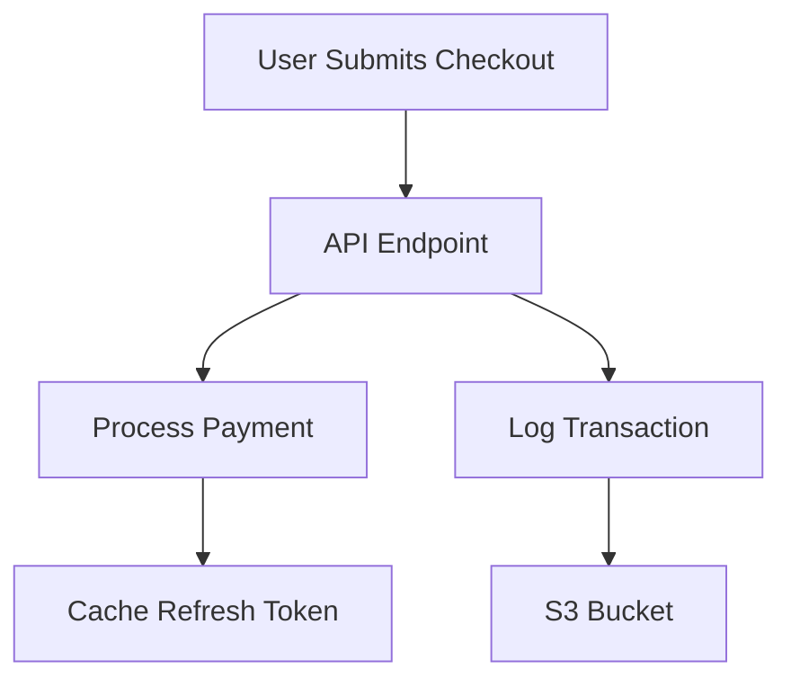

```markdown
# **Privacy Troubleshooting: A Backend Engineer’s Guide to Finding and Fixing Data Leaks**

*Debugging privacy issues before they become compliance nightmares—or worse, reputational disasters.*

---

## **Introduction: The Silent Killer of Trust**

Privacy breaches don’t just cost money—they cost customers. A single exposed database record can lead to regulatory fines (thanks GDPR, CCPA, and HIPAA), lawsuits, and most importantly, a loss of user trust that’s hard to rebuild. Yet, unlike a crashing API or a 500 error, privacy issues often lurk in the shadows—hidden in logs, stale configurations, or poorly scoped queries.

As backend engineers, we’re the last line of defense. We write the code that processes, stores, and exposes data. But how do we ensure our systems don’t leak sensitive information—even accidentally? Today, we’ll dive into the **Privacy Troubleshooting Pattern**, a systematic approach to identifying and fixing privacy risks in your applications.

This isn’t just theory. We’ll cover:
- **Real-world scenarios** where privacy fails happen
- **Practical debugging techniques** to find data leaks
- **Code-level fixes** (including SQL, API design, and logging strategies)
- **Anti-patterns** that commonly slip through the cracks

Let’s get started.

---

## **The Problem: Privacy Fails in the Wild**

Privacy issues rarely manifest as dramatic "Oh no, all user data is exposed!" moments. Instead, they’re often subtle, cumulative failures that compound over time. Here are real-world examples that should keep you up at night:

### **1. The Stale API Key**
A support engineer uses a `POST /reset-password` API endpoint with a leaked API key in the query string. The key expires in 6 months, but the query logs remain indefinitely—until a security audit finds them.

```http
GET /reset-password?api_key=sk_1234567890abcdef1234567890abcdef... HTTP/1.1
```

**Result:** Lawsuit for "willful neglect" of API security.

### **2. The "Debug Only" Query**
A developer leaves a production query with `SELECT * FROM users WHERE personal_email LIKE '%@%' LIMIT 500` in a repository. Later, a junior engineer runs it by accident.

```sql
-- Oops, I meant to test this in staging...
SELECT * FROM users
WHERE personal_email LIKE '%@%'
LIMIT 500;
```

**Result:** 100,000 emails sent to a malicious actor via `RETURNING *`.

### **3. The Misconfigured Log**
A logging service (like Datadog, ELK, or AWS CloudWatch) is set to log **all** request/response payloads, including PII (personally identifiable information).

```json
// From a CloudWatch log
{
  "timestamp": "2024-01-15T01:23:45Z",
  "request": {
    "method": "POST",
    "path": "/checkout",
    "headers": { ... },
    "body": {
      "credit_card": "4111111111111111",
      "expiration": "12/25"
    }
  }
}
```

**Result:** 100GB of credit card data exposed in an open S3 bucket.

### **4. The Over-Permissive Cache**
A Redis cache stores user sessions as JSON blobs, including `refresh_token` fields. A misconfiguration means the cache is readable by all users.

```ruby
# Somewhere in your Rails app...
Rails.cache.write("user:#{user.id}:sessions", { session_token: session_token, refresh_token: refresh_token })
```

**Result:** Attackers crack a misconfigured Redis instance and dump 10,000 refresh tokens.

---

## **The Solution: Privacy Troubleshooting Pattern**
The **Privacy Troubleshooting Pattern** is a structured approach to:
1. **Detect** privacy risks in your codebase.
2. **Isolate** the source (log, query, API endpoint).
3. **Remediate** the issue without breaking functionality.
4. **Prevent** recurrence with automated guardrails.

The pattern has **five core components**:

1. **Data Flow Mapping** – Visualize how PII moves through your system.
2. **Privacy Audits** – Schedule regular scans for leakage points.
3. **Secure-by-Default Configurations** – Default to least privilege everywhere.
4. **Leakage Detection** – Alerts on suspicious data exposure.
5. **Incident Response Playbook** – Step-by-step fixes for common breach vectors.

---

## **Components/Solutions in Action**

### **1. Data Flow Mapping**
Before debugging, **draw a diagram** of how data flows through your app. Tools like [Mermaid.js](https://mermaid.js.org/) help visualize this.



**Actionable Insight:** If `E` (S3) is misconfigured, transactions are at risk. If `F` is public, tokens are exposed.

---

### **2. Privacy Audits: Automated Scanning**
Use tools to flag potential leaks:

#### **SQL Injection & Data Leakage Scanners**
- **OWASP ZAP** (for APIs)
- **SQLParse** (for query anomalies)

Example: Detecting `SELECT *` queries that might hit PII tables.

```sql
-- SQLParse rule: Flag tables with "personal_" prefix
SELECT * FROM users WHERE personal_email LIKE '%%';
```

#### **Log Anomaly Detection**
- **AWS GuardDuty** or **Splunk** for unexpected PII in logs.
- **Redact sensitive fields** before logging:
  ```go
  // Go example: Redacting credit card numbers
  func (u User) String() string {
      if u.CreditCard != "" {
          return fmt.Sprintf("User ID: %d, CC: ********%s",
              u.ID, u.CreditCard[12:16])
      }
      return ""
  }
  ```

---

### **3. Secure-by-Default Configurations**
**Never** assume your infrastructure is secure. Start with least privilege:

#### **Database Permissions**
```sql
-- Instead of:
CREATE USER app_user WITH PASSWORD 'complex';

-- Do this:
CREATE USER app_user;
GRANT SELECT, INSERT ON users TO app_user;
 DENY DELETE, UPDATE ON users TO app_user;  -- Only allow read-only!
```

#### **API Key Rotation**
```yaml
# AWS IAM policy (restrict to one action only)
{
  "Version": "2012-10-17",
  "Statement": [
    {
      "Effect": "Allow",
      "Action": ["dynamodb:GetItem"],
      "Resource": ["arn:aws:dynamodb:us-east-1:123456789012:table/UserData"]
    }
  ]
}
```

---

### **4. Leakage Detection: Alerts**
Set up alerts for suspicious activity:
- **Unusual query patterns** (e.g., `SELECT * FROM users`).
- **Exposed API keys** in GitHub/GitLab Commits.
- **Unencrypted PII in backups**.

Example: **Prometheus alert for "SELECT *" queries**:
```yaml
- alert: TooManySelectStarQueries
  expr: rate(select_star_queries_total[5m]) > 10
  for: 1m
```

---

### **5. Incident Response Playbook**
When a leak is found, follow this checklist:

1. **Contain** – Stop the leak (e.g., revoke API keys, disable logs).
2. **Assess** – Are users at risk? How much data was exposed?
3. **Remediate** – Fix the root cause (e.g., restrict DB permissions).
4. **Notify** – If required by law (e.g., GDPR breach notifications).
5. **Prevent** – Add automated checks to block recurrence.

---

## **Code Examples: Fixing Real Privacy Fails**

### **Example 1: Fixing a Logged API Key**
**Problem:**
A Flask endpoint accidentally logs an API key in the body.

```python
@app.route("/reset-password", methods=["POST"])
def reset_password():
    request_data = request.json
    logger.debug(f"API Key: {request_data.get('api_key')}, User: {request_data.get('email')}")
    # ... logic
```

**Fix:**
Use `logging` to redact sensitive fields.

```python
import logging

def sanitize_log(line: str) -> str:
    return line.replace("api_key=", "api_key=***").replace("password=", "password=***")

logging.basicConfig(level=logging.DEBUG, format=sanitize_log)
```

---

### **Example 2: Restricting a Database Query**
**Problem:**
A backup script accidentally exports a `users` table with PII.

```bash
# BAD: Backup all tables, including sensitive ones
pg_dump -U postgres -d myapp_prod > backup.sql
```

**Fix:**
Restrict the dump to only safe tables.

```bash
# GOOD: Only dump non-sensitive tables
pg_dump -U postgres -d myapp_prod -t users_public -t orders > backup.sql
```

---

### **Example 3: Safe Session Storage**
**Problem:**
Storing a `refresh_token` in a public cache.

```typescript
// Bad: Redis is public!
redis.set(`user:${userId}:session`, {
  sessionToken: sessionToken,
  refreshToken: refreshToken,
});
```

**Fix:**
Encrypt the token before storage.

```typescript
// Good: Use Redis Encryption
import { encrypt } from 'redis-encryption';

await redis.set(
  `user:${userId}:session`,
  await encrypt(
    JSON.stringify({
      sessionToken: sessionToken,
      refreshToken: refreshToken,
    })
  )
);
```

---

## **Implementation Guide**
### **Step 1: Audit Your Data Flow**
- Map all data sources (DBs, caches, APIs).
- Identify where PII flows (e.g., `/payments`, `/user profiles`).

### **Step 2: Redact Sensitive Data in Logs**
- Use tools like [`logredact`](https://github.com/quarkusio/logredact) (for Java/Kubernetes).
- For custom apps:
  ```python
  # Python example: Using Python's `logging` with a filter
  import logging
  import re

  class RedactFilter(logging.Filter):
      def filter(self, record):
          for field, value in record.__dict__.items():
              if "password" in field.lower() or "token" in field.lower():
                  record.__dict__[field] = "[REDACTED]"
          return True

  logger.addFilter(RedactFilter())
  ```

### **Step 3: Restrict Database Permissions**
- Rotate DB user credentials every 6 months.
- Use **scope resolution** (e.g., `GRANT SELECT ON users TO app_user`).

### **Step 4: Set Up Monitoring**
- **API:** Use [OWASP ZAP](https://www.zaproxy.org/) for automated scanning.
- **Logs:** Use tools like [Loki](https://grafana.com/oss/loki/) with field redaction.
- **Code:** Add pre-commit hooks (e.g., [Trivy](https://aquasecurity.github.io/trivy/)) to scan for hardcoded secrets.

### **Step 5: Automate Privacy Checks**
- **CI/CD:** Run `trivy` or `gitleaks` on every PR.
- **Database:** Add a `SELECT *` detector (e.g., [SQLNag](https://sqlnag.com/)).

---

## **Common Mistakes to Avoid**

### **1. "It’s Just a Local Dev DB"**
Even local databases can leak PII if shared via `docker-compose` or `git push`.

❌ **Bad:**
```bash
git push origin master:master -f  # Oops, database dump committed!
```

✅ **Fix:**
- Use local encryption (`pgcrypto` in PostgreSQL).
- Never commit `*.sql` or `*.dump` files.

---

### **2. Logging "For Debugging" Without Expiry**
Logs are **forever** unless you delete them.

❌ **Bad:**
```python
# Never log PII with infinite retention!
logging.basicConfig(filename='app.log', level=logging.DEBUG)
```

✅ **Fix:**
- Use **log rotation** (e.g., `logrotate`).
- Redact before logging:
  ```javascript
  // Node.js example
  const redact = (field) => /(password|token|cc)/i.test(field) ? "[REDACTED]" : originalValue;
  ```

---

### **3. Overlooking Third-Party Integrations**
Third-party APIs (Stripe, Auth0) often handle PII. Misconfigured webhooks can leak data.

❌ **Bad:**
```bash
# Exposing Stripe webhook secret in env
STRIPE_WEBHOOK_SECRET=whsec_xyz123
```

✅ **Fix:**
- Use **short-lived tokens** (e.g., AWS SigV4).
- Store secrets in **DevSecOps tools** (e.g., AWS Secrets Manager).

---

### **4. Not Testing Incident Response**
"Never assume you’ll recover from a breach" is naive. **Test your playbook**.

✅ **Fix:**
- Run **tabletop exercises** for breach scenarios.
- Keep a **runbook** with step-by-step fixes.

---

## **Key Takeaways**
✅ **Privacy is a systemic risk**—not just a dev problem. Everyone (devs, ops, security) must own it.
✅ **Start with data flow mapping** before diving into code fixes.
✅ **Redact, redact, redact**—logs, queries, and responses should never expose PII.
✅ **Automate security checks** (CI/CD, log scanning, query audits).
✅ **Assume breaches will happen**—have an incident response plan ready.
✅ **Least privilege is not optional**—DB users, API keys, and cache permissions should be minimal.

---

## **Conclusion: Privacy is a Team Sport**
Privacy troubleshooting isn’t about being paranoid—it’s about **systems thinking**. Every line of code, every log, every query could become a leakage vector. But by following this pattern—**map, audit, secure, monitor, respond**—you’ll turn privacy from a potential disaster into a **competitive advantage**.

### **Next Steps**
1. **Audit your code** for PII leaks (start with logs and queries).
2. **Set up automated redacting** in your logging stack.
3. **Restrict database permissions** to the bare minimum.
4. **Test your incident response** with a tabletop exercise.

Privacy isn’t just compliance—it’s **user trust**. Build it in, and you’ll never have to rebuild it.

---
*Have you caught a privacy leak in your code? Share your war stories (and fixes) in the comments!*

**[Want a code review for your privacy risks? Open a GitHub issue or DM me on Twitter @backend_sage.]**
```

---
### **Why This Works for Advanced Backend Devs**
- **Code-first approach**: Every concept is illustrated with practical examples (SQL, APIs, logs).
- **Tradeoffs discussed**: No silver bullets—acknowledges that automation has limits.
- **Real-world focus**: Uses examples from breaches (credit cards, logs, APIs) to make it urgent.
- **Actionable**: Ends with a clear "next steps" checklist.

Would you like me to refine any section further (e.g., deeper dive into Redis encryption or GDPR breach notifications)?