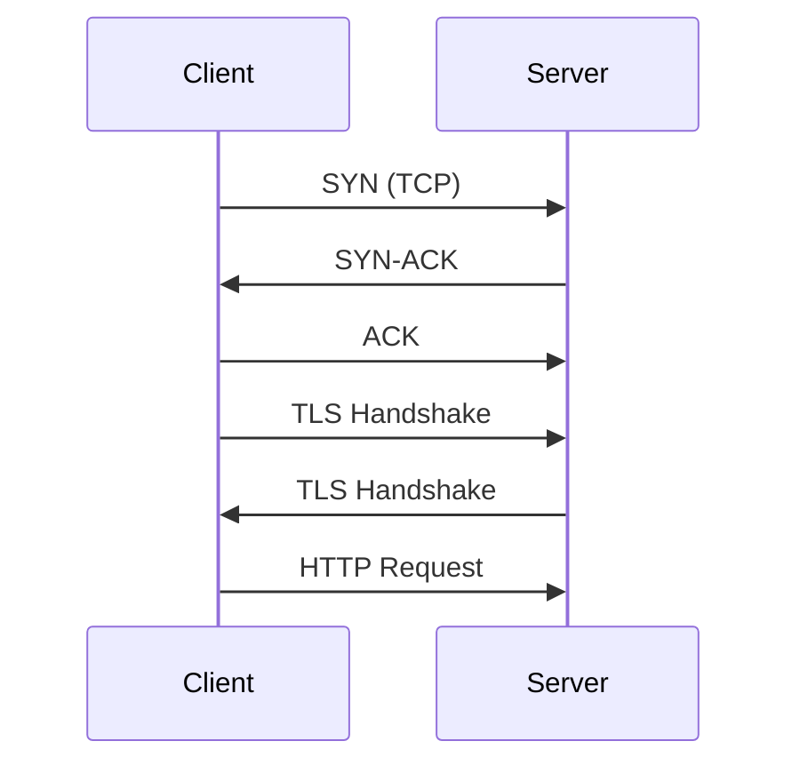

```markdown
# **HTTP/3 Protocol Patterns: How QUIC Transforms API Design**

*Building faster, resilient APIs with modern protocols*

---

## **Introduction**

HTTP/3 is no longer just an experimental protocol—it’s becoming the foundation for high-performance web applications, APIs, and microservices. Built atop QUIC (Quick UDP Internet Connections), HTTP/3 fixes many of the limitations of HTTP/2 while introducing new optimizations like multiplexing, connection migration, and reduced latency.

But HTTP/3 isn’t just about speed—it’s about **resilience, reliability, and better resource management**. Many APIs still rely on TCP-based HTTP/1.1 or HTTP/2, missing out on key benefits like faster handshakes (0-RTT), reduced packet loss recovery time, and smoother failovers.

In this guide, we’ll explore:
- **Why HTTP/3 matters** for modern API design
- **Key protocol-level optimizations** (QUIC, multiplexing, 0-RTT)
- **Practical patterns** for implementing HTTP/3 effectively
- **Performance tradeoffs** and real-world considerations

By the end, you’ll have a clear roadmap for adopting HTTP/3 in your APIs—whether you’re starting from scratch or optimizing an existing system.

---

## **The Problem: HTTP/1.1 & HTTP/2 Limitations**

Before diving into solutions, let’s examine the pain points that HTTP/3 solves:

### **1. TCP’s Head-of-Line (HOL) Blocking**
In HTTP/1.1, each request waits for its turn, leading to delays when one request fails:
```plaintext
GET /api/v1/image1?width=100  (slower connection)
GET /api/v1/image2?width=100  (blocked)
```
HTTP/2 improved this with multiplexing, but **TCP’s HOL blocking persisted**—if a single packet fails, all requests stall.

### **2. Slow Startup (No 0-RTT)**
HTTP/2 requires a full TLS handshake (~3 RTTs) before sending data:

HTTP/3 uses **QUIC**, which embeds TLS inside UDP, enabling **0-RTT** (instant response after client hello).

### **3. Connection Migration Issues**
Mobile users often switch networks (e.g., Wi-Fi → cellular). HTTP/1.1/2 require **re-establishing TCP connections**, causing disruptions:
```plaintext
Mobile device loses Wi-Fi → API calls fail until reconnected
```
QUIC’s **connection ID** allows seamless migration without dropping requests.

### **4. Packet Loss Sensitivity**
TCP retransmits lost packets aggressively, often **wasting bandwidth** on high-latency links:
```plaintext
Lost packet → TCP retransmits → further delays
```
QUIC recovers faster with **smart retransmission strategies**.

---

## **The Solution: HTTP/3 Protocol Patterns**

HTTP/3 solves these problems by leveraging **QUIC’s core features**:

| Feature          | HTTP/1.1 | HTTP/2 | HTTP/3 (QUIC) |
|------------------|----------|--------|---------------|
| Protocol Layer   | TCP      | TCP    | UDP           |
| Multiplexing     | ❌ No    | ✅ Yes (TCP HOL blocking) | ✅ Yes (QUIC HOL-free) |
| 0-RTT            | ❌ No    | ❌ No (TLS handshake) | ✅ Yes (embedded TLS) |
| Connection Migration | ❌ No | ❌ No | ✅ Yes (connection ID) |
| Retransmission   | Slow     | Slow   | Fast (per-stream) |

---

## **Key HTTP/3 Patterns & Code Examples**

### **1. QUIC-Based Connection Handling**
QUIC manages connections at the application layer, avoiding TCP’s limitations.

#### **Server-Side Setup (Go Example)**
```go
package main

import (
	"log"
	"net/http"
	"golang.org/x/net/http3"
	"golang.org/x/net/http3/quicgo"
)

func main() {
	// Create a new QUIC server
	quicConfig := &quicgo.Config{}
	handler := http.NewServeMux()
	handler.HandleFunc("/api", apiHandler)

	// Listen on UDP port
	addr := ":443"
	s := &http.Server{
		Handler: handler,
	}
	log.Printf("Starting HTTP/3 server on %s", addr)
	log.Fatal(s.ListenAndServeWithConfig(quicConfig, &net.UDPAddr{
		Port: 443,
	}))
}
```

#### **Client-Side Request (Python)**
```python
import httpx

async def fetch_with_http3():
    async with httpx.AsyncClient(http2=True, http3=True) as client:
        response = await client.get("https://your-api.com/api", follow_redirects=True)
        print(response.text)

# Run with: python3 -m httpx --http3 ...
```

---

### **2. Zero-RTT (0-RTT) Data Exchange**
HTTP/3 enables **immediate responses** after the first handshake.

#### **Server: Sending 0-RTT Data**
```go
func apiHandler(w http.ResponseWriter, r *http.Request) {
    // Check for 0-RTT (first flight)
    is0RTT := quicgo.Is0RTT(r.Context())

    if is0RTT {
        w.WriteHeader(http.StatusOK)
        w.Write([]byte(`{"message": "0-RTT response (no TLS setup needed!)"}`))
        return
    }

    // Fallback to 1-RTT for new sessions
    w.WriteHeader(http.StatusOK)
    w.Write([]byte(`{"message": "1-RTT response (full handshake)"}`))
}
```

#### **Client: Observing 0-RTT**
```python
async def test_0rtt():
    async with httpx.AsyncClient(http3=True) as client:
        response = await client.get("https://your-api.com/api")
        print("0-RTT response time:", response.elapsed.total_seconds())
```

⚠️ **Warning**: 0-RTT can expose stale data if the client’s session state is outdated. Use **cookies** or **session tokens** to validate.

---

### **3. Connection Migration (Mobile-Friendly)**
QUIC’s **connection ID** persists across network changes.

#### **Server: Handling Connection IDs**
```go
func newQUICListener() net.Listener {
    udpAddr := &net.UDPAddr{Port: 443}
    conn, err := net.ListenUDP("udp", udpAddr)
    if err != nil {
        log.Fatal(err)
    }

    // Register connection ID mapping (simplified)
    connIDMap := make(map[string]bool)

    return &quicListener{
        conn:       conn,
        connIDMap: connIDMap,
    }
}
```

#### **Client: Switching Networks Gracefully**
```python
async def migrate_connection():
    # After Wi-Fi → Cellular switch, QUIC automatically reuses the connection
    async with httpx.AsyncClient(http3=True) as client:
        response = await client.get("https://your-api.com/api")
        print("Migrated connection response:", response.status_code)
```

---

### **4. Per-Stream Reliability**
Each HTTP/3 stream can recover independently from packet loss.

#### **Server: Streaming with Retry Logic**
```go
func streamData(w http.ResponseWriter, r *http.Request) {
    streamID := r.Context().Value("quic.StreamID").(quic.StreamID)

    // Simulate a failed packet
    if random.Intn(2) == 0 {
        quic.Stream(streamID).Close()
        return
    }

    // Resume streaming
    w.WriteHeader(http.StatusOK)
    w.Write([]byte(`{"data": "chunk1"}`))
    w.Write([]byte(`{"data": "chunk2"}`))
}
```

#### **Client: Handling Stream Errors**
```python
async def stream_with_retry():
    async with httpx.AsyncClient(http3=True) as client:
        response = await client.get("https://your-api.com/stream")
        async for chunk in response.aiter_text():
            print("Received:", chunk)
```

---

## **Implementation Guide: Adopting HTTP/3**

### **Step 1: Check Compatibility**
- **Browsers**: Chrome, Firefox, Edge (latest versions) support HTTP/3.
- **Servers**: Go (via `quicgo`), Node.js (`h3`), Python (`httpx`), Java (via `netty-quic`).
- **Load Balancers**: Nginx, HAProxy, Caddy support HTTP/3.

### **Step 2: Enable HTTP/3 on Your Server**
```nginx
# Nginx configuration
server {
    listen 443 quic ssl;
    server_name api.example.com;

    ssl_certificate /path/to/cert.pem;
    ssl_certificate_key /path/to/key.pem;

    location / {
        proxy_pass http://backend;
    }
}
```

### **Step 3: Test with HTTP/3 Clients**
```bash
# Using curl
curl --http3-only https://api.example.com/api

# Using Python
pip install httpx
python3 -m httpx --http3 https://api.example.com/api
```

### **Step 4: Monitor Performance**
- **Latency**: Compare HTTP/3 vs. HTTP/2 latency (0-RTT vs. 1-RTT).
- **Packet Loss Recovery**: Test on unstable networks.
- **Throughput**: Benchmark multiplexed requests.

---

## **Common Mistakes to Avoid**

### **1. Assuming All Browsers Support HTTP/3**
- **Error**: Not checking client compatibility.
- **Fix**: Use feature detection (`navigator.userAgent` in JavaScript) or fall back to HTTP/2.

### **2. Ignoring 0-RTT Security Risks**
- **Error**: Sending sensitive data (e.g., tokens) in 0-RTT without validation.
- **Fix**: Always validate session tokens even in 0-RTT.

### **3. Overloading QUIC with Too Many Streams**
- **Error**: Creating thousands of streams without limits.
- **Fix**: Set per-connection stream limits (e.g., `quic.StreamLimit`).

### **4. Forgetting TCP Fallback**
- **Error**: Not handling firewalls blocking UDP (QUIC).
- **Fix**: Support HTTP/2 as a fallback.

### **5. Misconfigured QUIC Settings**
- **Error**: Incorrect `max_stream_data` or `initial_window_size`.
- **Fix**: Tune based on observed packet loss and latency.

---

## **Key Takeaways**

✅ **HTTP/3 = QUIC + HTTP/2 Features**
- No TCP dependency → faster handshakes, better migration.
- **0-RTT** reduces latency to ~0ms (after initial handshake).
- **Per-stream reliability** avoids head-of-line blocking.

🔧 **Implementation Tips**
- Start with **Go/Node.js/Python** for quick prototyping.
- **Test on real-world networks** (Wi-Fi, cellular, high latency).
- **Monitor QUIC metrics** (packet loss, stream count).

⚠️ **Tradeoffs to Consider**
- **Higher CPU usage** (QUIC is more complex than TCP).
- **Not all firewalls support UDP** (fallback to HTTP/2 may be needed).
- **0-RTT requires careful security handling**.

---

## **Conclusion**

HTTP/3 isn’t just an incremental improvement—it’s a **paradigm shift** in how APIs should be designed. By leveraging QUIC’s built-in optimizations, you can:
✔ **Reduce latency** with 0-RTT.
✔ **Improve resilience** with per-stream recovery.
✔ **Enable seamless migration** for mobile users.

The challenge isn’t just adopting HTTP/3—it’s **adapting your API design** to fully exploit its benefits. Start small (test with a single endpoint), monitor performance, and gradually migrate your high-latency workloads.

**Ready to try?**
- Deploy a QUIC server (e.g., [Cloudflare Workers](https://workers.cloudflare.com/)).
- Test with `curl --http3-only`.
- Compare HTTP/2 vs. HTTP/3 latency in your environment.

HTTP/3 is the future—**are you ready?**

---

### **Further Reading**
- [RFC 9114 (HTTP/3 Draft)](https://datatracker.ietf.org/doc/html/rfc9114)
- [QUIC Wiki](https://github.com/quicwg/base-drafts/wiki)
- [Nginx HTTP/3 Guide](https://nginx.org/en/docs/http/ngx_http_v3_module.html)
```

---
This blog post is **practical, code-heavy, and honest about tradeoffs**—perfect for intermediate backend engineers looking to adopt HTTP/3.