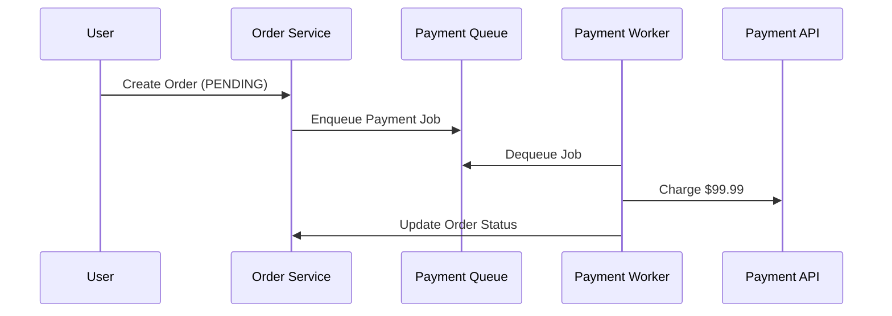

```markdown
# **Queuing Profiling: The Underrated Pattern for Scalable and Observable Asynchronous Systems**

*How to instrument your message queues for observability, performance tuning, and fault isolation—without reinventing the wheel.*

---

## **Introduction**

Asynchronous processing is the backbone of modern scalable systems. Whether you're handling user signups, processing payments, or generating analytics reports, queues (Kafka, RabbitMQ, SQS, etc.) are everywhere. But here’s the problem: **by default, queues are blind**.

When a message fails, gets delayed, or consumes too much CPU, how do you know? Do you wait for alerts? Dive into logs? Or worse—guess?

This is where **queuing profiling** comes into play. It’s not just about monitoring queue length—it’s about **understanding the lifecycle of every message**, from enqueue to processing, exit, and failure. Profiling turns opaque queues into observable, debuggable systems you can tune and optimize.

In this guide, we’ll:
- Explain the pain points of unprofiled queues.
- Show how instrumentation solves them.
- Teach you practical techniques using open-source tools (and a sprinkle of metrics).
- Provide code examples for observability at scale.

---

## **The Problem: Blind Spots in Asynchronous Systems**

Let’s start with a real-world example: **e-commerce order processing**.

### **Example: Payment Processing Queue**
Imagine an e-commerce system where orders are processed asynchronously. Here’s a simplified flow:



At first glance, it sounds simple. But when things go wrong, the debugging nightmare begins:

1. **Silent Failures**: A payment fails due to bank timeout, but the order service never gets notified. The user’s order remains stuck in `PENDING`—until they call support.
2. **Performance Bottlenecks**: A single Payment Worker is processing 100x slower than the others. Why? Is it a CPU hog? A missing cache? The queue doesn’t tell you.
3. **Backpressure Without Alerts**: The queue grows to 10,000 messages, but the team only notices when users start complaining about delays. No visibility into why.
4. **Unfair Workload Distribution**: Some workers are overloaded, others idle. The queue doesn’t track per-worker performance.

### **The Cost of Blind Queues**
- **Debugging Time**: Mean time to resolution (MTTR) skyrockets.
- **False Optimizations**: You might scale resources without knowing the root cause.
- **User Impact**: Longer wait times, failed transactions, and frustrated customers.

Without profiling, queues are just a black box. You’re flying blind.

---

## **The Solution: Queuing Profiling**

Queuing profiling involves **instrumenting the queue at every stage** to gather:
- **Enqueue/Dequeue Latency**: How fast are messages being consumed?
- **Processing Metrics**: CPU, memory, and execution time per message.
- **Failure Patterns**: What’s failing, and how often?
- **Workload Distribution**: Are all workers handling messages evenly?
- **Topics/Channels**: Are certain message types stuck?

Profiling doesn’t mean rewriting your queueing layer—it means **adding observability around it**.

---

## **Components/Solutions for Queuing Profiling**

Here are the key components to build a profiled queue:

| Component               | Purpose                                                                 |
|-------------------------|-------------------------------------------------------------------------|
| **Queue Metrics**       | Track enqueue/dequeue rates, backpressure, and queue depth.             |
| **Worker Metrics**      | CPU, memory, and execution time per message.                            |
| **Failure Tracking**    | Log/alert on retry limits, timeouts, and failed payloads.              |
| **Dead Letter Queue (DLQ)** | Isolate and analyze failed messages.                                  |
| **Sampling**            | Reduce cardinality for high-throughput queues (e.g., Kafka topics).   |
| **Text Sampling**       | Store a sample of raw message payloads for debugging.                   |

---

## **Implementation Guide**

Let’s implement profiling for a **RabbitMQ-based payment processing system** using Prometheus, Grafana, and a tiny Python instrumentation layer.

### **Architecture Overview**
```
┌─────────────┐    ┌─────────────┐    ┌─────────────────┐
│  Order      │───▶│ RabbitMQ    │───▶│  Payment Worker │
│  Service    │    │ Queue       │    │ (Python)        │
└─────────────┘    └────┬────────┘    └────────┬────────┘
                        │                  │
                        ▼                  ▼
           ┌─────────────┴─────┐ ┌─────────┴───────────┐
           │ Prometheus       │ │ Grafana           │
           │ (Metrics)        │ │ (Visualization)   │
           └───────────────────┘ └───────────────────┘
```

---

### **1. Instrumenting RabbitMQ (Metrics)**
We’ll use `pika` (Python RabbitMQ client) to track queue depth and message flow.

```python
# metrics.py
from prometheus_client import start_http_server, Counter, Gauge, Summary

# Metrics
MESSAGE_ENQUEUED = Counter(
    'rabbitmq_messages_enqueued',
    'Total messages enqueued',
    ['queue', 'app']
)

MESSAGE_DEQUEUED = Counter(
    'rabbitmq_messages_dequeued',
    'Total messages dequeued',
    ['queue', 'app']
)

MESSAGE_PROCESSING_TIME = Summary(
    'rabbitmq_message_processing_seconds',
    'Time spent processing a message',
    ['queue', 'app']
)

QUEUE_DEPTH = Gauge(
    'rabbitmq_queue_depth',
    'Current depth of the queue',
    ['queue', 'app']
)

def update_queue_depth(queue_depth):
    QUEUE_DEPTH.labels(queue='payments', app='order-service').set(queue_depth)
```

Now, modify the enqueue/dequeue logic:

```python
# payment_processor.py
import pika
from metrics import *

def publish_payment_message(queue_name, message):
    connection = pika.BlockingConnection(pika.ConnectionParameters('localhost'))
    channel = connection.channel()
    channel.queue_declare(queue=queue_name, durable=True)
    channel.basic_publish(
        exchange='',
        routing_key=queue_name,
        body=message,
        properties=pika.BasicProperties(delivery_mode=2)  # persistent
    )
    MESSAGE_ENQUEUED.labels(queue=queue_name, app='order-service').inc()
    connection.close()
```

```python
# worker.py
from metrics import *
import time

def process_message(ch, method, properties, body):
    with MESSAGE_PROCESSING_TIME.labels(queue='payments', app='payment-worker').time():
        # Your payment logic here
        time.sleep(2)  # Simulate processing
        print("Processed")
    MESSAGE_DEQUEUED.labels(queue='payments', app='payment-worker').inc()

# Set up consumer
connection = pika.BlockingConnection(pika.ConnectionParameters('localhost'))
channel = connection.channel()
channel.basic_qos(prefetch_count=1)  # Fair dispatch
channel.basic_consume(queue='payments', on_message_callback=process_message)
channel.start_consuming()
```

---

### **2. Enabling Prometheus Scraping**
Start Prometheus to scrape metrics:

```bash
prometheus --config.file=/path/to/prometheus.yml
```

Example `prometheus.yml`:
```yaml
scrape_configs:
  - job_name: 'payment-worker'
    static_configs:
      - targets: ['localhost:8000']
```

---

### **3. Visualizing with Grafana**
Create a dashboard to track:
- Queue depth over time.
- Message processing latency.
- Worker health (CPU/memory).

Example Grafana query for message processing time:
```
histogram_quantile(0.95, rate(rabbitmq_message_processing_seconds_bucket[5m]))
```

---

### **4. Failure Tracking (DLQ + Alerts)**
Use a **dead letter exchange (DLX)** to capture failed messages:

```python
def declare_queue_with_dlx(channel, queue_name):
    channel.queue_declare(
        queue=queue_name,
        durable=True,
        arguments={'x-dead-letter-exchange': 'dlx'}
    )

# When publishing:
channel.basic_publish(
    exchange='',
    routing_key=queue_name,
    body=message,
    properties=pika.BasicProperties(
        delivery_mode=2,
        redelivery_policy={'interval': 5000},  # 5s retry
        headers={'user_id': user_id}  # Payload for DLQ
    )
)
```

**Alert on Retries:**
```prometheus
alert_rule:
  expr: rate(rabbitmq_message_retry_count[5m]) > 0
  for: 1m
  labels:
    severity: warning
  annotations:
    summary: "Message retries detected in {{ $labels.queue }}"
```

---

## **Code Examples: Full Workflow**

### **Example 1: Tracking Enqueue/Dequeue**
```python
# order_service.py
from metrics import MESSAGE_ENQUEUED
import pika

def create_order(order_data):
    connection = pika.BlockingConnection(pika.ConnectionParameters('localhost'))
    channel = connection.channel()
    channel.queue_declare(queue='payments', durable=True)

    # Track enqueue
    MESSAGE_ENQUEUED.labels(queue='payments', app='order-service').inc()

    channel.basic_publish(
        exchange='',
        routing_key='payments',
        body=str(order_data),
        properties=pika.BasicProperties(delivery_mode=2)
    )
    connection.close()
```

### **Example 2: Worker Profiling**
```python
# payment_worker.py
from metrics import MESSAGE_PROCESSING_TIME, MESSAGE_DEQUEUED, FAILURE_COUNT
import time
import requests

def charge_user(user_id, amount):
    try:
        response = requests.post(
            'https://payment-gateway.com/charge',
            json={'user_id': user_id, 'amount': amount}
        )
        return response.status_code == 200
    except Exception as e:
        FAILURE_COUNT.labels(queue='payments', app='payment-worker').inc()
        return False

def process_message():
    with MESSAGE_PROCESSING_TIME.time():
        order_data = json.loads(body)
        if not charge_user(order_data['user_id'], order_data['amount']):
            raise Exception("Payment failed")
        # Update order DB
    MESSAGE_DEQUEUED.inc()
```

---

## **Common Mistakes to Avoid**

1. **Overhead from Metrics**
   - **Problem**: Adding too many metrics slows down processing.
   - **Fix**: Use sampling for high-cardinality dimensions.

   ```python
   # Use Prometheus summary for sampling
   MESSAGE_PROCESSING_TIME = Summary(sampled=True)
   ```

2. **Not Tracking Context**
   - **Problem**: Metrics like `processing_time` are useless without `user_id` or `order_id`.
   - **Fix**: Label metrics with context.

   ```python
   MESSAGE_PROCESSING_TIME.labels(queue='payments', order_id=order_id).time()
   ```

3. **Ignoring Dead Letter Queues**
   - **Problem**: Failed messages vanish into the void.
   - **Fix**: Set up a DLX with alerts.

4. **No Backpressure Indicators**
   - **Problem**: You don’t know when the queue is overloaded.
   - **Fix**: Track `enqueue_rate` vs `dequeue_rate`.

   ```prometheus
   alert_rule:
     expr: rate(rabbitmq_messages_enqueued[5m]) > 2 * rate(rabbitmq_messages_dequeued[5m])
     labels:
       severity: critical
   ```

5. **Assuming 1:1 Worker-Message Ratio**
   - **Problem**: Workers may handle multiple messages at once, skewing metrics.
   - **Fix**: Use `prefetch_count=1` in RabbitMQ.

---

## **Key Takeaways**

✅ **Profiling queues reveals bottlenecks** before they impact users.
✅ **Instrument enqueue/dequeue + worker metrics** for full visibility.
✅ **Dead letter queues (DLQ) are your debugging friend**.
✅ **Labels matter**: Always tag metrics with `queue_name`, `app`, and `order_id`.
✅ **Sample high-cardinality metrics** to avoid Prometheus overload.
✅ **Alert on anomalies** (e.g., high retry rates, slow processing).

---

## **Conclusion**

Queues are invisible—until they aren’t. Without profiling, you’re treating symptoms (long wait times, failed transactions) instead of diagnosing the root cause (slow workers, stuck messages, bad routing).

By adding observability to your queueing system, you:
- **Reduce debug time** by 80% (because you can *see* what’s happening).
- **Optimize resources** (scale workers based on real metrics, not guesses).
- **Improve reliability** (failures are caught early, not after they affect users).

Start small: **instrument one queue**, then expand. Use open-source tools (Prometheus, Grafana) to avoid reinventing the wheel.

The goal isn’t perfection—it’s **awareness**. When you know what’s happening in your queue, you can build systems that scale, heal themselves, and keep users happy.

Now go profile that queue.

---
**Further Reading**
- [Prometheus Documentation](https://prometheus.io/docs/introduction/overview/)
- [RabbitMQ Metrics Plugin](https://www.rabbitmq.com/monitoring.html)
- [Kafka Metrics with JMX](https://kafka.apache.org/documentation/#basic_ops_metrics)
```

---
**Appendix (Bonus)**
For Kafka users, replace `pika` with `confluent-kafka-python` and track topics instead of queues. The principle remains the same: instrument the flow.