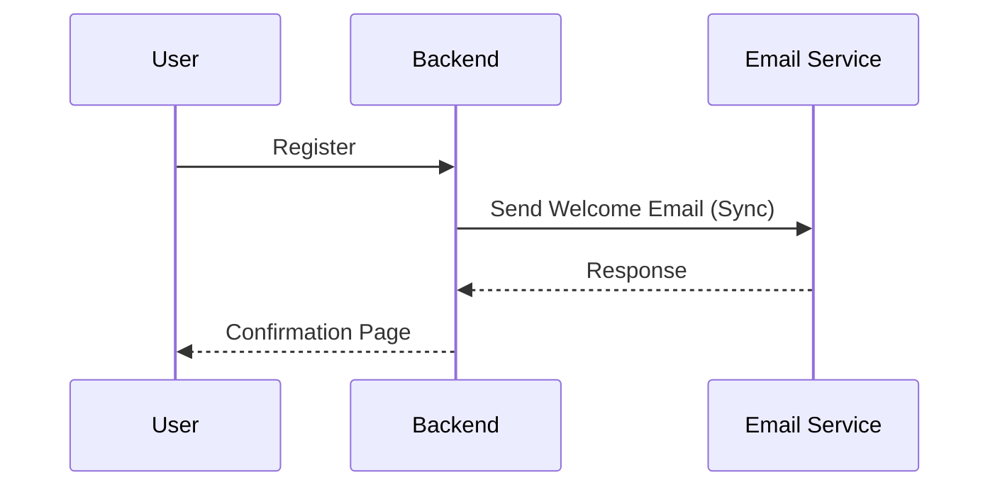
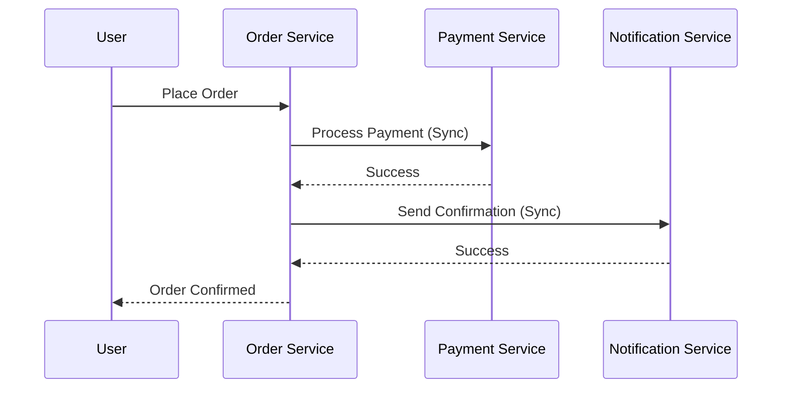
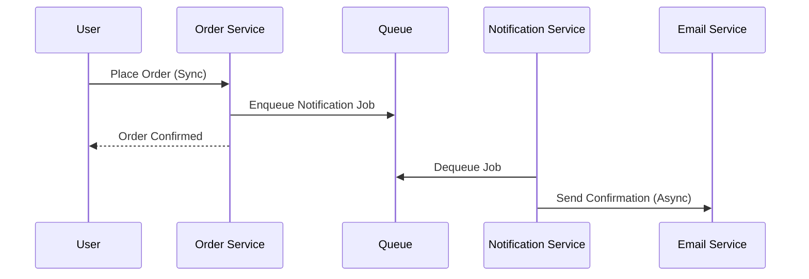

```markdown
# **Queueing Techniques: Handling Asynchronous Work with Grace**

*By [Your Name]*

Asynchronous processing is the backbone of modern scalable applications. When your system needs to handle workloads that are time-consuming, inconsistent, or triggered by events (e.g., notifications, data processing, background jobs), you can’t afford to block the main request flow. This is where **queuing techniques** shine—they decouple producers from consumers, ensuring resilience, scalability, and reliability.

In this guide, we’ll explore why queuing is essential, how to structure it, and dive into practical implementations using popular tools like **RabbitMQ, Kafka, and Redis Queue**. Along the way, we’ll weigh tradeoffs (e.g., latency vs. throughput) and highlight common pitfalls. Whether you're building a high-traffic e-commerce platform or a data analytics pipeline, these techniques will help you design robust, maintainable systems.

---

## **The Problem: Why Queues Are Necessary**

Without proper queuing, your application faces several critical challenges:

### **1. Blocking Requests & Poor User Experience**
If your backend processes requests synchronously (e.g., sending an email or generating a report on every user action), the main thread gets tied up. This leads to:
- Slower response times (users perceive your app as slow).
- Increased load on your database/APIs during spikes.
- Potential timeouts (e.g., HTTP requests failing due to timeout constraints).

**Example:**
An e-commerce app that sends a welcome email *immediately* when a user registers. If the email service is slow or the database is under heavy load, the registration API may time out or slow down the entire flow.


*This is inefficient and blocks the user’s flow.*

---

### **2. Tight Coupling & Failure Domino Effect**
When services depend directly on each other (e.g., `Order Service → Payment Service → Notification Service`), a failure in one component cascades, bringing down everything. Queues introduce **loose coupling**:


*If `Notification Service` fails, the entire order flow halts.*

With queues, services communicate *asynchronously*:



---

### **3. Bursty Loads & Resource Waste**
Some tasks are sporadic but resource-intensive (e.g., generating thumbnails for uploaded images, processing video transcoding). Running them in parallel on a single machine wastes CPU/memory.

Without queuing, you might:
- Over-provision servers to handle worst-case scenarios.
- Under-provision and risk failures during traffic spikes.

---

## **The Solution: Queuing Techniques**

Queues act as a **buffer** between producers (services generating work) and consumers (services processing work). The core benefits:
✅ **Decoupling** – Producers and consumers don’t need to know about each other.
✅ **Scalability** – Add more workers to handle increased load.
✅ **Reliability** – Retry failed jobs or dead-letter them for debugging.
✅ **Ordering Guarantees** – Process events in the correct sequence (if needed).

---

## **Components of a Queueing System**

A typical queueing architecture includes:

1. **Producer** – The service that publishes tasks to the queue.
2. **Queue** – A message broker (e.g., RabbitMQ, Kafka, Redis) that stores and routes tasks.
3. **Consumer** – The service that processes tasks from the queue.
4. **Worker Pool** – One or more instances of the consumer running in parallel.
5. **Monitoring & Retry Logic** – Tools to track job progress and retry failures.

---

## **Code Examples: Practical Implementations**

Let’s implement queues using three popular tools: **RabbitMQ (Python)**, **Kafka (Node.js)**, and **Redis (Go)**.

---

### **1. RabbitMQ (Python) – Simple Task Queue**
RabbitMQ is a lightweight broker ideal for lightweight, task-based workflows.

#### **Setup**
Install dependencies:
```bash
pip install pika
```

#### **Producer (`producer.py`)**
```python
import pika

def publish_task(task):
    connection = pika.BlockingConnection(pika.ConnectionParameters('localhost'))
    channel = connection.channel()
    channel.queue_declare(queue='tasks')
    channel.basic_publish(
        exchange='',
        routing_key='tasks',
        body=task
    )
    print(f"Sent task: {task}")
    connection.close()

if __name__ == "__main__":
    publish_task('{"user_id": 123, "action": "send_welcome_email"}')
```

#### **Consumer (`consumer.py`)**
```python
import pika

def process_task(ch, method, properties, body):
    print(f"Processing task: {body}")
    # Simulate work (e.g., send email)
    import time; time.sleep(1)
    print("Task completed!")

connection = pika.BlockingConnection(pika.ConnectionParameters('localhost'))
channel = connection.channel()
channel.queue_declare(queue='tasks')
channel.basic_consume(
    queue='tasks',
    on_message_callback=process_task,
    auto_ack=True
)
print("Waiting for tasks...")
channel.start_consuming()
```

#### **Key Features**
- **Simple API** – Easy to set up for basic use cases.
- **Pub/Sub & Work Queues** – Supports different messaging patterns.
- **No Persistence by Default** – Jobs are lost on broker restart (unless configured).

---

### **2. Kafka (Node.js) – Event Streaming**
Kafka is designed for high-throughput, distributed event streaming (e.g., logs, metrics, real-time analytics).

#### **Setup**
```bash
npm install kafka-node
```

#### **Producer (`producer.js`)**
```javascript
const Kafka = require('kafka-node');
const client = new Kafka.Client('localhost:9092');
const producer = new Kafka.Producer(client);

const messages = [
  { topic: 'user-activity', messages: JSON.stringify({ user_id: 1, action: 'login' }) }
];

producer.send(messages, (err, result) => {
  if (err) console.error(err);
  else console.log('Message sent:', result);
});
```

#### **Consumer (`consumer.js`)**
```javascript
const Kafka = require('kafka-node');
const client = new Kafka.Client('localhost:9092');
const consumer = new Kafka.Consumer(client, [
  { topic: 'user-activity', partition: 0 }
]);

consumer.on('message', (message) => {
  console.log('Received:', message.value.toString());
  // Process event (e.g., trigger analytics)
});
```

#### **Key Features**
- **High Throughput** – Handles millions of messages/sec.
- **Persistence** – Messages survive broker restarts.
- **Partitioning** – Scales horizontally by adding brokers.

---

### **3. Redis Queue (Go) – Simple & Fast**
Redis is a great choice for lightweight, in-memory queues (e.g., rate limiting, task scheduling).

#### **Setup**
```bash
go get github.com/redis/go-redis/v9
```

#### **Producer (`producer.go`)**
```go
package main

import (
	"context"
	"fmt"
	"github.com/redis/go-redis/v9"
)

func main() {
	rdb := redis.NewClient(&redis.Options{
		Addr: "localhost:6379",
	})

	ctx := context.Background()
	err := rdb.LPush(ctx, "tasks", "{\"user_id\": 456, \"action\": \"process_payment\"}").Err()
	if err != nil {
		panic(err)
	}
	fmt.Println("Task enqueued!")
}
```

#### **Consumer (`consumer.go`)**
```go
package main

import (
	"context"
	"fmt"
	"github.com/redis/go-redis/v9"
)

func main() {
	rdb := redis.NewClient(&redis.Options{
		Addr: "localhost:6379",
	})

	ctx := context.Background()
	for {
		val, err := rdb.RPop(ctx, "tasks").Result()
		if err != nil {
			fmt.Println("Error:", err)
			continue
		}
		fmt.Println("Processing:", val)
		// Simulate work
		time.Sleep(1 * time.Second)
	}
}
```

#### **Key Features**
- **In-Memory Speed** – Sub-millisecond latency.
- **Simple API** – Easy to integrate into existing Go apps.
- **Limited Persistence** – Data is lost on server restart (unless configured with RDB/AOF).

---

## **Implementation Guide**

### **Step 1: Choose the Right Queue**
| Use Case               | Recommended Tool       | Why?                                  |
|------------------------|------------------------|---------------------------------------|
| Simple task queue      | RabbitMQ, Redis Queue  | Lightweight, easy to set up.          |
| High-throughput events | Kafka                  | Handles millions of messages/sec.    |
| Real-time analytics    | Kafka + ClickHouse     | Scales horizontally for big data.    |
| Microservices          | NATS, AWS SQS          | Built for distributed systems.        |

### **Step 2: Design for Failure**
- **Retries**: Implement exponential backoff for failed tasks.
- **Dead Letter Queues (DLQ)**: Move tasks that fail repeatedly to a separate queue for debugging.
- **Monitoring**: Track queue depth, latency, and error rates (e.g., with Prometheus + Grafana).

**Example: Exponential Backoff in RabbitMQ**
```python
import time
import random

def publish_with_retry(task, max_retries=3):
    for attempt in range(max_retries):
        try:
            publish_task(task)
            return
        except Exception as e:
            if attempt == max_retries - 1:
                raise
            wait_time = 2 ** attempt * random.uniform(0.5, 1.5)
            time.sleep(wait_time)
```

### **Step 3: Scale Workers**
- **Horizontal Scaling**: Add more consumer instances to process tasks in parallel.
- **Workload Balancing**: Use fair dispatch (e.g., `basic.qos(1)` in RabbitMQ) to avoid overloading a single worker.

**Example: Fair Dispatch in RabbitMQ**
```python
channel.basic_qos(prefetch_count=1)  # One message at a time per worker
```

### **Step 4: Prioritize Tasks**
Use **priority queues** (e.g., Redis with sorted sets) or **multiple queues** to handle urgency:
- `urgent_tasks` (high-priority)
- `background_tasks` (low-priority)

---

## **Common Mistakes to Avoid**

1. **Ignoring Persistence**
   - *Mistake*: Using in-memory queues (e.g., RabbitMQ without disk persistence).
   - *Fix*: Enable message persistence or choose a tool like Kafka that persists by default.

2. **No Retry Logic**
   - *Mistake*: Failing silently when a task can be retried.
   - *Fix*: Implement exponential backoff and DLQs.

3. **Overloading Workers**
   - *Mistake*: Running too many workers without monitoring.
   - *Fix*: Set `prefetch_count` and monitor CPU/memory usage.

4. **Tight Coupling to Queue**
   - *Mistake*: Hardcoding queue names in code (e.g., `QUEUE_NAME = "tasks"`).
   - *Fix*: Use environment variables or a config service.

5. **No Monitoring**
   - *Mistake*: Not tracking queue depth or processing time.
   - *Fix*: Integrate with APM tools (e.g., Datadog, New Relic).

6. **Not Handling Duplicate Messages**
   - *Mistake*: Assuming messages are processed exactly once.
   - *Fix*: Use idempotent operations (e.g., `INSERT IGNORE` in databases).

---

## **Key Takeaways**

✔ **Queues decouple producers from consumers** → Improves scalability and reliability.
✔ **Choose the right tool** based on throughput, persistence needs, and latency.
✔ **Design for failure** → Retries, DLQs, and monitoring are non-negotiable.
✔ **Scale workers horizontally** → Add more consumers to handle load.
✔ **Prioritize tasks** → Use multiple queues or priority-based processing.
✔ **Avoid common pitfalls** → Persistence, retries, and monitoring matter.

---

## **Conclusion**

Queuing techniques are a **must-have** for modern backend systems. They handle asynchronous workflows elegantly, allowing you to build scalable, resilient applications without blocking requests. Whether you're sending emails, processing payments, or analyzing logs, queues provide the flexibility and reliability you need.

### **Next Steps**
1. **Experiment**: Set up a RabbitMQ/Redis queue locally to process mock tasks.
2. **Benchmark**: Compare Kafka vs. RabbitMQ for your use case.
3. **Deploy**: Integrate queues into a microservice with proper retries and monitoring.

Happy queuing! 🚀

---
**Further Reading**
- [RabbitMQ Design Patterns](https://www.rabbitmq.com/blog/2011/02/16/designing-for-resilience-with-rabbitmq/)
- [Kafka for Microservices](https://kafka.apache.org/documentation/#microservices)
- [Redis Modules for Queues](https://redis.io/topics/modules-intro)
```