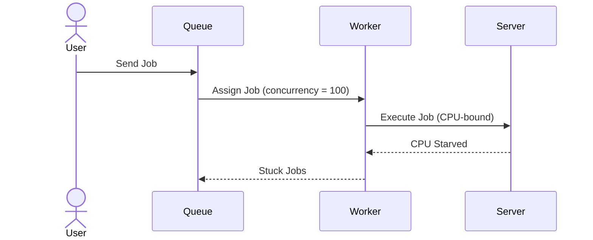
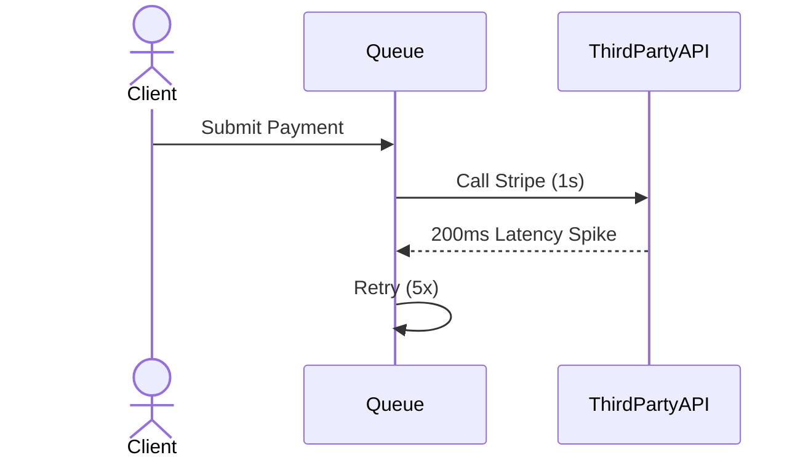

```markdown
---
title: "Queuing Tuning Deep Dive: Optimizing Performance for High-Volume Workloads"
date: 2024-05-15
author: "Alex Chen"
tags: ["database", "api-design", "backend-engineering", "queues"]
---

# **Queuing Tuning Deep Dive: Optimizing Performance for High-Volume Workloads**

In today’s high-performance backend systems, queues are the unsung heroes that mediate between rapid client requests and slow external work (e.g., payments, image processing, or analytics). But queues aren’t just about plug-and-play—they’re complex systems with tunable parameters that directly impact latency, cost, and scalability.

This guide dives into the **Queuing Tuning** pattern, a systematic approach to optimizing queue performance under varying workloads. You’ll learn how to adjust concurrency, batch sizes, rate limits, and retry strategies to avoid common pitfalls like CPU starvation, financial penalties, or cascading failures.

By the end, you’ll have practical strategies to fine-tune a queue system for:
- **High throughput** with predictable latency.
- **Cost efficiency** by balancing worker concurrency.
- **Fault tolerance** via intelligent retry logic.

---

## **The Problem: When Queues Break Under Pressure**

Queues are simple in theory but chaotic in practice. Without proper tuning, even a well-designed system can suffer from:

### **1. CPU Throttling**
If your workers run at maximum concurrency, they’ll consume all available CPU, slowing down every request. Example: A `RabbitMQ` queue serving analytics jobs might max out a server’s CPU, causing new requests to time out.



### **2. External System Bottlenecks**
Queues often offload work to APIs, databases, or third parties. If these systems are slow (e.g., Stripe latency spikes), your queue workers will either:
- **Fail silently** (job loss).
- **Retransmit aggressively** (spiking external costs).



### **3. Cost Explosions**
Pay-as-you-go queues (e.g., AWS SQS, RabbitMQ on cloud VMs) charge per message or CPU hour. Unbounded concurrency will jack up costs:
- **SQS:** Charges per request.
- **RabbitMQ/Kafka:** Charges per worker instance.

### **4. Deadlocks and Resource Leaks**
Uncontrolled retries or long-running jobs can lead to:
- **Memory leaks** (e.g., holding database connections).
- **Deadlocks** if jobs depend on each other (e.g., `Job A` waits for `Job B`, which waits for `Job A`).

```python
# Example: A poorly designed retry loop
while retries < MAX_RETRIES:
    try:
        process_job(job)  # Could hang indefinitely
    except TimeoutError:
        retries += 1
        sleep(5)  # No backoff, no circuit break
```

---

## **The Solution: Queuing Tuning Best Practices**

Tuning a queue involves adjusting **four core levers**:
1. **Concurrency Control** (how many jobs run in parallel).
2. **Batch Processing** (grouping small jobs for efficiency).
3. **Rate Limiting** (preventing overload on downstream systems).
4. **Exponential Backoff & Circuit Breaking** (smart retries).

We’ll explore each with real-world code examples.

---

## **Implementation Guide**

### **1. Concurrency Control: Prevent CPU Starvation**
Most queues (RabbitMQ, Kafka, Celery) let you set worker concurrency. The goal is to:
- **Balance throughput** (more workers = faster completion).
- **Avoid CPU contention** (too many workers = slowdown).

#### **Example: RabbitMQ Worker Tuning**
```bash
# Limit RabbitMQ workers to 50% of CPU cores (adjust based on job type)
rabbitmqctl set_vhost_parameter vhost_name max_consumers 20
```

#### **Python (Celery) Concurrency**
```python
# task.py: Limit Celery workers to 4 tasks per core (8-core server → 32 workers)
app.conf.worker_concurrency = 4
app.conf.worker_max_memory_per_child = 1024 * 1024 * 256  # 256MB per worker
```

#### **Key Metrics to Monitor**
| Metric               | Target Value          | What to Fix If...          |
|----------------------|-----------------------|----------------------------|
| `cpu_usage`          | < 80%                 | Reduce concurrency         |
| `job_queue_length`   | < 1000 messages       | Scale workers              |

---

### **2. Batch Processing: Reduce External API Calls**
Small jobs (e.g., sending emails) are inefficient. Batch them to:
- **Reduce API calls** (e.g., bulk SMS vs. 100 individual calls).
- **Leverage batch APIs** (e.g., Stripe Batch API).

#### **Example: Batching in a Kafka Consumer**
```python
from confluent_kafka import Consumer
import json

conf = {'bootstrap.servers': 'kafka:9092', 'group.id': 'batcher'}
consumer = Consumer(conf)

# Batch emails into chunks of 100
batch = []
for msg in consumer:
    try:
        data = json.loads(msg.value())
        batch.append(data)
        if len(batch) >= 100:
            send_email_batch(batch)  # Hypothetical batch API
            batch = []
    except Exception as e:
        log_error(msg, e)
```

#### **When to Batch?**
| Scenario               | Batch Size | Why?                                  |
|------------------------|------------|---------------------------------------|
| Email sending          | 50–200     | Reduces SMTP connection overhead      |
| Database upserts       | 100–500    | Leverage `INSERT ... ON CONFLICT`     |
| Payment processing     | 1–10       | Stripe API rate limits (e.g., 15/min) |

---

### **3. Rate Limiting: Protect Downstream APIs**
External APIs (e.g., Twilio, SendGrid) have rate limits. Use:
- **Token bucket algorithm** (e.g., `token_bucket` in Python).
- **Redis-based rate limiting** (e.g., `INCR` + `EXPIRE`).

#### **Example: Redis Rate Limiter**
```python
import redis
r = redis.Redis(host='redis')

def check_rate_limit(api_key):
    key = f"rate:limit:{api_key}"
    count, _ = r.incr(key, amount=1).execute()
    if count > 10:  # Max 10 requests/min
        raise RateLimitExceeded()
    r.expire(key, 60)  # Reset in 60s
```

#### **Strategies to Handle Limits**
| Approach               | Use Case                          | Example                          |
|------------------------|-----------------------------------|----------------------------------|
| **Exponential backoff**| Bursty workloads                  | `time.sleep(2 ** retry_count)`   |
| **Priority queues**    | Tiered services (e.g., VIP vs. std)| `priority = user.tier * 10`      |
| **Circuit breakers**   | Unreliable APIs                   | `pybreaker` library               |

---

### **4. Retry Logic: Exponential Backoff + Circuit Breaker**
Poor retries waste resources. Use:
- **Exponential backoff** (e.g., `3s → 6s → 12s → ...`).
- **Circuit breakers** (stop retrying after `N` failures).

#### **Example: Python with `tenacity` and `pybreaker`**
```python
from tenacity import retry, stop_after_attempt, wait_exponential
from pybreaker import CircuitBreaker

@retry(
    stop=stop_after_attempt(3),
    wait=wait_exponential(multiplier=1, min=4, max=10),
    retry=retry_if_exception_type(TimeoutError)
)
def call_external_api(payload):
    return requests.post("https://api.example.com", json=payload)

# Circuit breaker: Stop after 5 failures
breaker = CircuitBreaker(fail_max=5)
with breaker:
    call_external_api(payload)
```

#### **When to Abandon a Job?**
| Condition               | Action                          |
|-------------------------|---------------------------------|
| 5 consecutive failures  | Move to a `dead_letter_queue`   |
| API returns `429`       | Wait `Retry-After` header value |
| Job runtime > 5min      | Cancel and notify user           |

---

## **Common Mistakes to Avoid**

### **1. Ignoring Queue Depth**
- **Problem:** Monitoring only job processing time ignores backlog.
- **Fix:** Track `queue_depth` (e.g., `RabbitMQ: list_queues()`).

```python
# Check RabbitMQ queue length via CLI
rabbitmqctl list_queues name messages_ready messages_unacknowledged
```

### **2. Hardcoding Retry Delays**
- **Problem:** Fixed delays (e.g., `sleep(5)`) waste time.
- **Fix:** Use **exponential backoff** with jitter.

```python
import random

def retry_with_jitter(max_retries):
    for attempt in range(max_retries):
        retry_after = min(2 ** attempt, 60)  # Cap at 60s
        sleep(retry_after + random.uniform(0, 1))  # Jitter
```

### **3. No Dead Letter Queue (DLQ)**
- **Problem:** Failed jobs vanish silently.
- **Fix:** Route failures to a `dead_letter_exchange` (RabbitMQ/Kafka).

```yaml
# RabbitMQ: Configure DLQ
queue:
  dead_letter_exchange: dlx
  max_length: 1000
  message_ttl: 86400000  # 1 day
```

### **4. Over-Optimizing Without Benchmarks**
- **Problem:** Guessing concurrency (e.g., "100 workers will be fast") backfires.
- **Fix:** Load test with tools like:
  - **Locust** (Python-based).
  - **k6** (JavaScript-based).

```python
# Locust script to simulate 1000 users
from locust import HttpUser, task

class QueueUser(HttpUser):
    @task
    def submit_job(self):
        self.client.post("/queue", json={"task": "process"})
```

---

## **Key Takeaways (Cheat Sheet)**

| **Pattern**               | **Tradeoff**                          | **Tools/Libraries**                     |
|---------------------------|---------------------------------------|-----------------------------------------|
| **Concurrency Control**   | More workers = faster but higher cost | `Celery`, `RabbitMQ`, `Kafka`          |
| **Batch Processing**      | Reduces API calls but increases latency | `Bulkhead pattern`, `Redis`              |
| **Rate Limiting**         | Balances load but may throttle users  | `token_bucket`, `Redis`                 |
| **Exponential Backoff**   | Saves retries but delays success     | `tenacity`, `pybreaker`                 |
| **Circuit Breakers**      | Stops cascading failures              | `pybreaker`, `Hystrix` (Java)           |

---

## **Conclusion: Start Small, Iterate Fast**

Queuing tuning isn’t about finding the perfect setting—it’s about **observing, iterating, and adapting**. Here’s your action plan:
1. **Monitor first:** Use tools like `Prometheus` + `Grafana` to track `queue_depth`, `processing_time`, and `error_rates`.
2. **Start conservative:** Begin with `concurrency=1` per worker, then scale up.
3. **Automate retries:** Use libraries like `tenacity` to avoid reinventing the wheel.
4. **Test under load:** Simulate spikes with `Locust` or `k6`.
5. **Document thresholds:** Note when to scale workers (e.g., "If `queue_depth > 1000`, add 5 workers").

Queues are the backbone of scalable systems—mastering their tuning will save you from costly outages and slowdowns. Happy optimizing!

---
**Further Reading:**
- [RabbitMQ Best Practices](https://www.rabbitmq.com/blog/2019/04/17/rabbitmq-high-availability/)
- [Kafka Performance Tuning](https://kafka.apache.org/documentation/#performance)
- [Celery Concurrency Guide](https://docs.celeryq.dev/en/stable/userguide/optimizing.html)
```