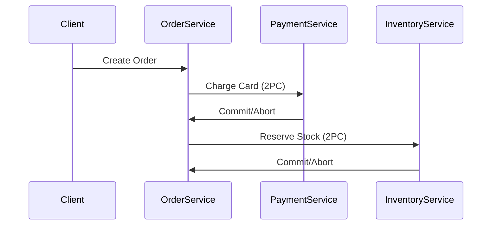

```markdown
# **"Reliability Gotchas: The Hidden Pitfalls That Break Your System (And How to Avoid Them)"**

*By [Your Name], Senior Backend Engineer*

---

## **Introduction**

Building a scalable, high-performance API is exciting—until it isn’t.

When your system works flawlessly in staging but crashes under production load, when transactions mysteriously roll back, or when a seemingly innocent config change takes your database offline, you’ve likely encountered **reliability gotchas**. These are subtle, often overlooked design flaws that sneak into systems during rapid development or under the guise of "optimization."

In this guide, we’ll dissect the most destructive reliability pitfalls—from **race conditions** and **distributed transaction pitfalls** to **overly aggressive retries and cascading failures**. We’ll walk through real-world examples, show how to detect them, and—most importantly—how to fix them with practical code patterns.

By the end, you’ll know how to **audit your systems for fragility** and harden them against the most common reliability landmines.

---

## **The Problem: Why Reliability Gotchas Matter (And Why They’re Everywhere)**

Reliability isn’t just about "making things work"—it’s about **making them work when things go wrong**. Yet, in a world of microservices, async APIs, and globally distributed systems, failure is inevitable.

Here’s what happens when you ignore reliability gotchas:

1. **Race Conditions Turn Catastrophic**:
   A simple `UPDATE` query might work in isolation, but in a high-traffic system, it can lead to **lost updates**, **phantom reads**, or **inconsistent state**.

2. **Distributed Transactions Fail Silently**:
   You assume your two-phase commit works, but in reality, the **compensating transaction** never runs, leaving your system in an invalid state.

3. **Over-Reliance on Retries Worsens Chaos**:
   A well-intentioned retry loop for a failed API call can **amplify load** and trigger a **thundering herd problem**, drowning your system under cascading failures.

4. **Idempotency is Assumed, Not Enforced**:
   Your `POST /orders` endpoint "should be safe to retry," but if you don’t enforce idempotency keys, duplicate orders and billing errors will follow.

5. **Database Schemas Drift Without Warning**:
   A tiny `ALTER TABLE` in one environment doesn’t propagate to others, causing cascading errors when the schema mismatch is exposed under load.

6. **Monitoring Misses the Critical Path**:
   You’re alerted on failed requests—but not on **latency spikes**, **deadlocks**, or **slow query patterns** that degrade performance before they crash.

These aren’t hypotheticals. They’re **real-world incidents** that have taken systems offline, costing millions in lost revenue and developer panic.

---

## **The Solution: A Framework for Spotting and Fixing Reliability Gotchas**

The good news? Most reliability gotchas follow **predictable patterns**. By recognizing them early, you can preemptively guard against failure.

Here’s our **reliability audit checklist**—the "gotchas" you should be watching for, along with **how to fix them**:

| **Gotcha Category**       | **Common Symptoms**                          | **Solution Pattern**                     |
|---------------------------|---------------------------------------------|------------------------------------------|
| **Race Conditions**       | Lost updates, phantom reads, inconsistent state | Optimistic locking, retries with conflicts |
| **Distributed Transactions** | Silent failures, orphaned records         | Saga pattern, compensating transactions |
| **Retry Loops Gone Wrong**| Thundering herd, cascading failures       | Exponential backoff, circuit breakers   |
| **Idempotency Violations** | Duplicate orders, invalid state            | Idempotency keys, transaction logging    |
| **Schema Drift**          | "Works in dev" but breaks in prod          | Schema migrations, versioning            |
| **Monitoring Blind Spots**| Silent failures, latent degradation       | Distributed tracing, anomaly detection   |

We’ll dive into each of these in detail, with **code examples** and **real-world tradeoffs**.

---

## **Components/Solutions: Deep Dive into Reliability Patterns**

### **1. Race Conditions: The Silent State Corruption**
**Problem:** Two processes read the same resource, modify it, and write back—resulting in **lost updates**.

**Example:**
```sql
-- User A and User B both read the same bank balance (1000)
-- User A withdraws 200 → new balance: 800
-- User B withdraws 200 → new balance: 600 ( race condition )
UPDATE accounts SET balance = balance - 200 WHERE id = 1;
```

**Solutions:**
#### **A. Optimistic Locking (Row Versioning)**
```go
// PostgreSQL: Use a "version" column to detect conflicts
UPDATE accounts
SET balance = balance - 200, version = version + 1
WHERE id = 1 AND version = 123;  // Fails if version != 123
```
- **Pros:** Simple, non-blocking.
- **Cons:** Requires app logic to handle retries.

#### **B. Pessimistic Locking (Exclusive Locks)**
```sql
BEGIN;
-- Acquire a row-level lock (PostgreSQL)
SELECT pg_advisory_xact_lock(12345);  -- Locks row 12345

UPDATE accounts SET balance = balance - 200 WHERE id = 1;
COMMIT;
```
- **Pros:** Guarantees consistency.
- **Cons:** Can lead to **deadlocks** under high contention.

**Tradeoff:** Optimistic locking is **scalable** but **requires retry logic**; pessimistic locking is **deterministic** but **risky for high contention**.

---

### **2. Distributed Transactions: When ACID Breaks Under Load**
**Problem:** A distributed system relies on **two-phase commit (2PC)**, but if one participant fails, the transaction **never completes**—leaving your system in an **invalid state**.

**Example: Order Processing Saga**


**Solution: Saga Pattern (Compensating Transactions)**
```python
# Python (using Celery)
from celery import Celery

app = Celery('orders', broker='redis://')

@app.task
def create_order(order_id):
    try:
        # Step 1: Charge payment
        charge_payment.delay(order_id)

        # Step 2: Reserve inventory
        reserve_inventory.delay(order_id)

        # Step 3: Ship order
        ship_order.delay(order_id)
    except Exception:
        # Handle compensating transactions
        refund_payment.slow(order_id)  # Slow to avoid race conditions
        release_inventory.slow(order_id)

@app.task(bind=True)
def refund_payment(self, order_id):
    # Retry until completed
    if not payment_refunded(order_id):
        self.retry(countdown=60)
```

- **Pros:** Works in eventual consistency.
- **Cons:** Requires **event sourcing** and **idempotent operations**.

**Tradeoff:** Saga is **scalable** but **harder to debug** than 2PC.

---

### **3. Retry Loops: When Good Intentions Go Wrong**
**Problem:** A failed API call triggers a retry, but if the retry **doesn’t adapt**, it can **amplify load** and cause a **thundering herd**.

**Example: Naive Retry**
```python
import requests

def process_payment(order_id):
    max_retries = 3
    for attempt in range(max_retries):
        try:
            response = requests.post(f"https://api.payment/{order_id}")
            response.raise_for_status()
            return response.json()
        except requests.exceptions.RequestException:
            time.sleep(1)  # Fixed delay → thundering herd
    raise Exception("Payment failed after retries")
```

**Solution: Exponential Backoff + Circuit Breaker**
```python
import backoff
from requests import Session

@backoff.on_exception(
    backoff.expo,
    requests.exceptions.RequestException,
    max_tries=5
)
def safe_payment(order_id):
    session = Session()
    session.headers.update({"Retry-After": "30"})  # Server hints
    return session.post(f"https://api.payment/{order_id}")

# Circuit breaker (using pybreaker)
from pybreaker import CircuitBreaker

breaker = CircuitBreaker(fail_max=3, reset_timeout=60)

@breaker
def payment_service(order_id):
    return safe_payment(order_id)
```

- **Pros:** Prevents thundering herd, adapts to load.
- **Cons:** Requires **server-side retry-after headers**.

**Tradeoff:** Exponential backoff is **smart**, but **misconfigured**, it can **increase latency**.

---

### **4. Idempotency: The Missing Safety Net**
**Problem:** A duplicate request (due to network glitches) creates **duplicate orders** or **invalid state**.

**Example: Non-Idempotent POST**
```http
POST /orders
{
  "user_id": 123,
  "amount": 99.99
}
```
If sent twice, **two orders are created**.

**Solution: Idempotency Keys**
```javascript
// Express.js with Redis
const express = require('express');
const redis = require('redis');
const app = express();

const client = redis.createClient();

app.post('/orders', async (req, res) => {
    const { idempotency_key } = req.headers;
    const order = req.body;

    if (!idempotency_key) {
        return res.status(400).send("Missing idempotency key");
    }

    const key = `order:${idempotency_key}`;
    const existing = await client.get(key);

    if (existing) {
        return res.status(200).send(JSON.parse(existing));
    }

    // Process order...
    const result = await createOrder(order);
    await client.setex(key, 3600, JSON.stringify(result)); // 1-hour TTL

    res.status(201).send(result);
});
```

- **Pros:** Prevents duplicates, works with retries.
- **Cons:** Requires **client cooperation** (they must send `idempotency-key`).

**Tradeoff:** Idempotency is **simple** but **only works if clients play by the rules**.

---

### **5. Schema Drift: When Dev and Prod Diverge**
**Problem:** A `ALTER TABLE` in staging **doesn’t propagate** to production, causing:
```sql
ERROR:  column "new_column" does not exist
```
**Solution: Database Versioning**
```sql
-- PostgreSQL: Track migrations
CREATE TABLE schema_migrations (
    version INT PRIMARY KEY,
    applied_at TIMESTAMP DEFAULT NOW()
);

-- New migration:
INSERT INTO schema_migrations (version) VALUES (3) ON CONFLICT DO NOTHING;

-- Apply migration only if missing:
DO $$
BEGIN
    IF NOT EXISTS (
        SELECT 1 FROM schema_migrations WHERE version = 3
    ) THEN
        ALTER TABLE users ADD COLUMN email_verified BOOLEAN DEFAULT FALSE;
        INSERT INTO schema_migrations (version) VALUES (3);
    END IF;
END $$;
```

- **Pros:** Ensures **consistency**.
- **Cons:** **Migration complexity** grows over time.

**Tradeoff:** Versioning is **safer** but **slower** than direct ALTERs.

---

### **6. Monitoring Blind Spots: When Failures Hide**
**Problem:** Your system **appears healthy** but is **degrading silently**:
- **Deadlocks** (but no alerts).
- **Slow queries** (but no SLO breaches).
- **Cascading failures** (but no root cause).

**Solution: Distributed Tracing + Anomaly Detection**
```go
// Go with OpenTelemetry
import (
    "go.opentelemetry.io/otel"
    "go.opentelemetry.io/otel/trace"
)

func processOrder(ctx context.Context, orderID string) {
    span := otel.Tracer("order-service").StartSpan("processOrder")
    defer span.End()

    // Track sub-operations
    paymentSpan := span.StartSpan("chargePayment")
    defer paymentSpan.End()
    // ...

    if span.IsRecording() {
        span.SetAttributes(
            trace.Int("order_id", orderID),
            trace.String("status", "processed"),
        )
    }
}
```
**Visualization:**


- **Pros:** **Catches root causes** before failures.
- **Cons:** **Requires instrumentation effort**.

**Tradeoff:** Tracing is **valuable** but **not a silver bullet**.

---

## **Implementation Guide: How to Audit Your System for Gotchas**

### **Step 1: Identify Critical Paths**
- **Where does data flow?** (Order → Payment → Inventory)
- **Where are the locks?** (Database, Redis, external APIs)
- **Where are retries?** (Are they exponential? Do they have circuit breakers?)

### **Step 2: Instrument for Observability**
- **Add tracing** (OpenTelemetry, Jaeger).
- **Log critical operations** (DDL, large transactions).
- **Monitor latency percentiles** (P99, P95).

### **Step 3: Enforce Idempotency by Default**
- **Require `Idempotency-Key`** in all non-GET endpoints.
- **Use Saga pattern** for distributed transactions.

### **Step 4: Test Failure Modes**
- **Chaos engineering**: Kill DB instances mid-transaction.
- **Load test retries**: Simulate thundering herd.
- **Schema drift simulation**: Apply migrations in staging only.

### **Step 5: Automate Reliability Checks**
- **GitHooks**: Block schema changes without migration scripts.
- **CI/CD**: Fail builds if tests detect race conditions.
- **Chaos Testing**: Randomly kill services in staging.

---

## **Common Mistakes to Avoid**

1. **Assuming "Works in Dev" Means Reliable in Prod**
   - Dev environments lack **real-world load** and **schema divergence**.

2. **Over-Relying on Retries Without Backoff**
   - Fixed delays → **thundering herd**.
   - No circuit breakers → **cascading failures**.

3. **Ignoring Distributed Transactions**
   - Using **2PC for microservices** → **silent failures**.
   - Forgetting **compensating transactions** → **orphaned state**.

4. **Not Enforcing Idempotency**
   - Clients skip `Idempotency-Key` → **duplicate orders**.

5. **Schema Changes Without Versioning**
   - ALTER → PROD → **crash**.

6. **Monitoring Only Success Metrics**
   - No deadlock alerts → **silent failures**.

---

## **Key Takeaways (TL;DR)**

✅ **Race Conditions:**
- Use **optimistic locking (row versioning)** or **pessimistic locks**.
- Test with **high concurrency**.

✅ **Distributed Transactions:**
- Avoid **2PC** for microservices.
- Use **Saga pattern + compensating transactions**.

✅ **Retry Loops:**
- **Exponential backoff** + **circuit breakers**.
- Never **fixed delays**.

✅ **Idempotency:**
- **Require `Idempotency-Key`** in all non-GET endpoints.
- **Log requests** for replayability.

✅ **Schema Drift:**
- **Version migrations**.
- **Fail fast** if schema is missing.

✅ **Monitoring:**
- **Distributed tracing** (OpenTelemetry).
- **Anomaly detection** (not just error rates).

---

## **Conclusion: Build for Failure, Not Just Success**

Reliability gotchas don’t disappear—they **evolve** as your system scales. The key is **proactive defense**:
1. **Design for failure** (retries, circuit breakers, idempotency).
2. **Observe everything** (tracing, anomaly detection).
3. **Test failure modes** (chaos engineering).
4. **Automate safeguards** (migrations, CI/CD checks).

The most resilient systems aren’t the ones that **never fail**—they’re the ones that **fail predictably and recover gracefully**.

Now go **audit your code**. You’ll be surprised what you find.

---
**Further Reading:**
- [Saga Pattern (Martin Fowler)](https://martinfowler.com/articles/microservices.html)
- [Chaos Engineering (Netflix)](https://netflixtechblog.com/chaos-engineering-at-netflix-a68cdcdd7f8f)
- [OpenTelemetry Distributed Tracing](https://opentelemetry.io/docs/essentials/tracing/)
```