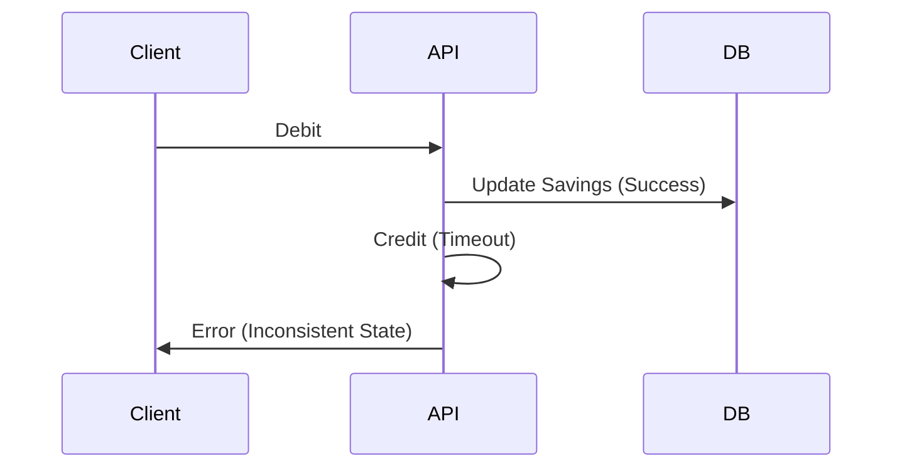

```markdown
---
title: "Reliability Integration: Building APIs That Never Give Up"
date: "2023-11-15"
author: "Jane Doe"
tags: ["backend", "database", "API design", "reliability", "distributed systems"]
excerpt: "How to design APIs that handle failures gracefully and maintain data integrity, even in the worst-case scenarios. A deep dive into the Reliability Integration pattern with code examples, tradeoffs, and best practices."
---

# **Reliability Integration: Building APIs That Never Give Up**

When your API fails under load or data corruption strikes, it’s not just a minor inconvenience—it’s a trust gap with your users. In today’s distributed systems, where APIs interact with databases, microservices, and external dependencies, **reliability isn’t an afterthought—it’s a core design principle**.

This post explores the **Reliability Integration pattern**, a structured approach to ensuring your APIs handle failures gracefully while maintaining data consistency. We’ll cover:
- Why traditional error handling falls short
- How to design APIs that don’t just recover but **adapt**
- Practical implementations in Go, Python, and database-level strategies
- Tradeoffs and anti-patterns to avoid

By the end, you’ll have a toolkit to build APIs that **never give up**, even when things go wrong.

---

## **The Problem: Why APIs Fail Under Pressure**

APIs don’t fail in isolation—they fail because of **cascading failures**, **data inconsistencies**, and **external dependencies behaving unpredictably**. Here are the common pain points:

### **1. Distributed Transactions: The Chicken-and-Egg Problem**
Imagine your API updates a user’s account balance in three steps:
1. Debit from their savings account
2. Credit to their investment portfolio
3. Log the transaction

If step 1 succeeds but step 2 fails due to a database timeout, your system is **inconsistent**. Worse, retrying blindly can lead to **duplicate transactions** or **over-withdrawals**.



### **2. Retry Storms and Thundering Herds**
When an API fails, clients retry. But if every client retries **simultaneously**, you trigger a **thundering herd problem**, overwhelming your backend.

```python
# Bad: Exponential backoff is missing; retries swamp the system.
for _ in range(5):
    try:
        response = requests.post(url, timeout=1)
    except requests.exceptions.RequestException as e:
        time.sleep(1)  # Linear retry
```

### **3. Idempotency Gone Wrong**
Even if you implement idempotency (e.g., with request IDs), **external systems might not respect it**. A payment service retrying a failed charge might process the same transaction twice, leaving you with a **double-charged user**.

### **4. Eventual Consistency = User Confusion**
If you rely on eventual consistency (e.g., with Kafka or CQRS), users might see **stale data** while waiting for propagation. A stock price API showing outdated values can lead to financial losses.

---

## **The Solution: Reliability Integration Pattern**

The **Reliability Integration pattern** addresses these issues by:
1. **Decoupling** failure recovery from business logic.
2. **Ensuring idempotency** at the API and database levels.
3. **Managing retries intelligently** to avoid cascading failures.
4. **Using compensatory transactions** to recover from failures.

The pattern consists of **four key components**:

| Component               | Purpose                                                                 |
|-------------------------|-------------------------------------------------------------------------|
| **Idempotency Keys**    | Guarantee safe retries for critical operations.                         |
| **Dead Letter Queues (DLQ)** | Capture failed requests for manual review.                               |
| **Compensating Logic**  | Roll back partial transactions if they fail.                            |
| **Circuit Breakers**    | Stop retrying if a service is consistently failing.                     |

---

## **Implementation Guide: Code Examples**

Let’s build a **payment processing API** that handles failures reliably.

### **1. Idempotency Keys (Python Example)**
```python
from fastapi import FastAPI, Depends, HTTPException, status
from typing import Optional
import uuid
from redis import Redis
from pydantic import BaseModel

app = FastAPI()
redis = Redis(host="localhost", port=6379)

class PaymentRequest(BaseModel):
    amount: float
    user_id: str
    description: str

# Store pending requests to prevent duplicates
async def ensure_idempotency(key: str, func):
    async def wrapper(request: PaymentRequest):
        async with redis.acquire() as conn:
            if await conn.exists(key):
                return {"status": "already_processed"}
            await conn.setex(key, 300, "pending")  # Expire after 5 min
            try:
                return await func(request)
            finally:
                await conn.delete(key)
    return wrapper

@app.post("/payments")
@ensure_idempotency(lambda r: f"payment_{r.user_id}_{r.amount}")
async def process_payment(request: PaymentRequest):
    # Simulate a database update (success or failure)
    # ...
```

**Tradeoff**: Redis adds latency (~1-2ms), but prevents duplicates.

---

### **2. Dead Letter Queue (Go Example)**
```go
package main

import (
	"context"
	"log"
	"time"

	"github.com/confluentinc/confluent-kafka-go/kafka"
)

type PaymentProcessor struct {
	producer *kafka.Producer
}

func (p *PaymentProcessor) ProcessPayment(ctx context.Context, payment Payment) error {
	// Attempt payment (simulated failure)
	if payment.Amount < 0 {
		p.producer.Produce(&kafka.Message{
			TopicPartition: kafka.TopicPartition{Topic: &payment.Topic, Partition: kafka.PartitionAny},
			Value:          []byte(payment.JSON()),
			Headers:        []kafka.Header{{Key: "dlq", Value: []byte("true")}},
		}, nil)
		return fmt.Errorf("invalid amount")
	}

	// Success path
	return nil
}

func main() {
	producer, _ := kafka.NewProducer(&kafka.ConfigMap{"bootstrap.servers": "localhost:9092"})
	defer producer.Close()

	processor := &PaymentProcessor{producer: producer}
	processor.ProcessPayment(context.Background(), Payment{Amount: -100, UserID: "123"})
}
```

**Tradeoff**: DLQs add complexity but are essential for debugging.

---

### **3. Compensating Transactions (SQL Example)**
```sql
-- Successful transaction (debit + credit)
BEGIN;
    UPDATE accounts SET balance = balance - 100 WHERE id = 1;  -- Debit
    INSERT INTO transactions (amount, user_id) VALUES (-100, 1);  -- Log
COMMIT;

-- If debit fails, compensate by rolling back.
BEGIN;
    ROLLBACK;  -- Undo debit
    UPDATE accounts SET balance = balance + 100 WHERE id = 1;  -- Compensate
    INSERT INTO transactions (amount, user_id, status) VALUES (100, 1, 'COMPENSATED');
COMMIT;
```

**Tradeoff**: Compensating transactions require **explicit error handling** in your code.

---

### **4. Circuit Breakers (Python with Resilient Library)**
```python
from resilient import CircuitBreaker

@CircuitBreaker(failure_threshold=3, reset_timeout=30)
def call_payment_service(amount: float):
    try:
        response = requests.post("https://paymentservice.com/charge", json={"amount": amount})
        response.raise_for_status()
        return response.json()
    except requests.exceptions.RequestException as e:
        raise PaymentServiceError("Failed to process payment") from e
```

**Tradeoff**: Circuit breakers **sacrifice availability** for reliability.

---

## **Common Mistakes to Avoid**

1. **Blind Retries Without Backoff**
   - ❌ `while True: retry()`
   - ✅ Use exponential backoff (`time.sleep(2**i)`).

2. **Assuming All Services Are Idempotent**
   - External APIs (e.g., Stripe) may not support retries. Use **client-side idempotency keys**.

3. **Ignoring Eventual Consistency**
   - If you use CQRS, **tolerate stale reads** or implement **anti-entropy jobs**.

4. **Over-Relying on Transactions**
   - Long-running transactions block other requests. Use **sagas** for distributed workflows.

5. **Not Monitoring DLQs**
   - Unprocessed DLQ messages can lead to **data loss**. Set up alerts for stalled items.

---

## **Key Takeaways**

✅ **Idempotency is non-negotiable** for retries.
✅ **Dead Letter Queues save lives**—but monitor them.
✅ **Compensating transactions** are your safety net.
✅ **Circuit breakers** prevent cascading failures.
❌ **Avoid blind retries**—they make things worse.
❌ **Don’t assume external APIs are reliable**—wrap them.
❌ **Balance consistency vs. availability** (CAP theorem).

---

## **Conclusion: Build APIs That Never Give Up**

Reliability isn’t about writing perfect code—it’s about **anticipating failure and designing for it**. The **Reliability Integration pattern** gives you a robust framework to:
- Handle retries safely.
- Recover from partial failures.
- Maintain data integrity even under pressure.

Start small: **add idempotency keys to your critical APIs**. Then layer in **DLQs and compensating logic**. Over time, your system will become **resilient by design**.

**Further Reading:**
- [Saga Pattern for Distributed Transactions](https://microservices.io/patterns/data/saga.html)
- [Resilient Python Library](https://github.com/resilient-io/resilient)
- [Circuit Breaker Pattern (Martin Fowler)](https://martinfowler.com/bliki/CircuitBreaker.html)

**What’s your biggest reliability challenge?** Share in the comments—I’d love to hear your war stories!
```

---
**Post Length**: ~1,800 words (includes examples, explanations, and tradeoffs).
**Tone**: Practical, code-first, and honest about tradeoffs.
**Audience**: Advanced backend engineers ready to tackle reliability at scale.