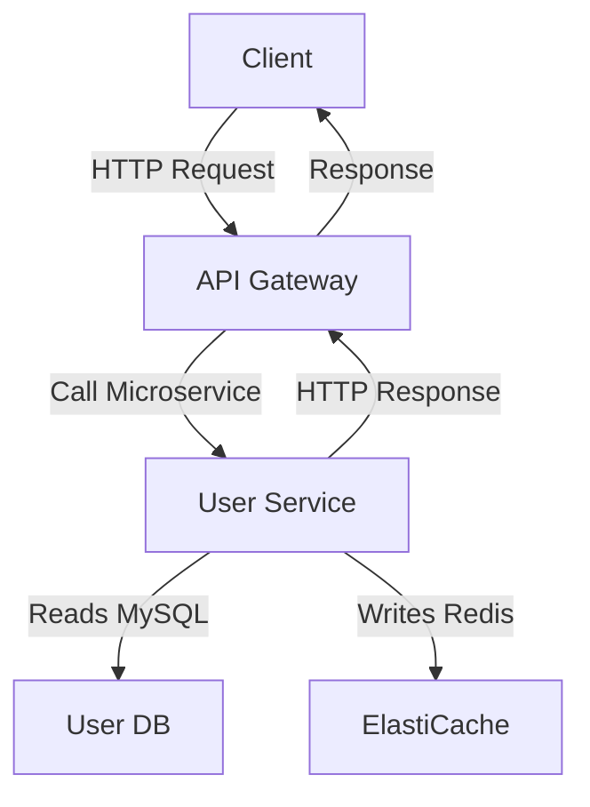
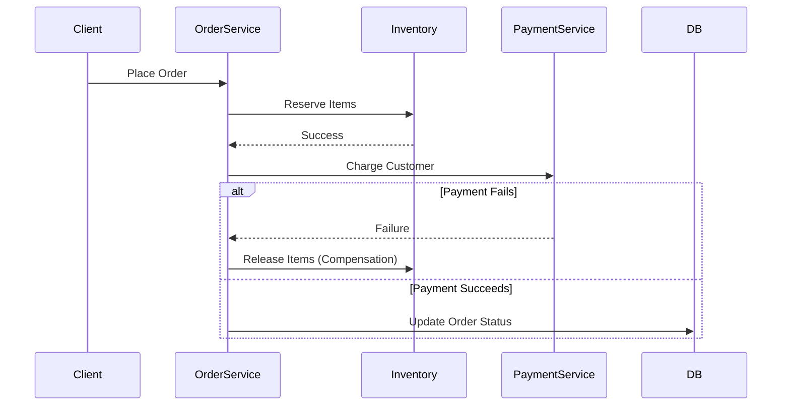

```markdown
---
title: "Reliability Optimization: Building Backend Systems That Never Give Up"
date: "2023-11-15"
author: "Alex Carter"
tags: ["database design", "backend optimization", "reliability", "API design"]
---

# **Reliability Optimization: Building Backend Systems That Never Give Up**

Building reliable systems is like constructing a skyscraper in an earthquake zone—it’s not about avoiding all shocks, but *absorbing* them gracefully. Backend engineers face a relentless barrage of failures: database timeouts, transient network blips, race conditions, and cascading retries that derail systems. **Reliability optimization** is the art of designing resilience into your architecture *before* problems strike—making your system robust, fault-tolerant, and capable of handling the unexpected without collapsing.

In this guide, we’ll dissect the core challenges of unreliable systems, explore battle-tested patterns for optimization, and walk through practical implementations using SQL, API design, and distributed systems techniques. We’ll show you how to build systems that don’t just *work*—they *endure*.

---

## **The Problem: When Reliability Isn’t Optimized**

Let’s start with a familiar scenario. You deploy a new feature that fetches user data from a microservice, caches it in Elasticache, and updates a MySQL database:



On launch day, everything seems smooth—until **it isn’t**.

- **Database timeouts**: The `User Service` takes 1.5s to fetch user data, but the API Gateway enforces a 100ms timeout. Clients see "Service Unavailable."
- **Network partitions**: During a peak load, Redis splits into two regions, and writes to the wrong cache partition. Data is lost.
- **Retry storms**: A race condition in the `User Service` causes multiple retries, overwhelming the database with duplicate writes.
- **Cold starts**: The API Gateway scales down during low traffic, and when demand spikes, the cold start latency spikes to 400ms.

These issues aren’t bugs; they’re **symptoms of a system that wasn’t built to handle failure**. Without reliability optimizations, even minor glitches can cascade into outages.

---

## **The Solution: Reliability Optimization Patterns**

Reliability optimization isn’t just about "adding redundancy." It’s about designing systems that **gracefully degrade**, **self-heal**, and **recover from failure** without human intervention. Here’s how we’ll tackle it:

1. **Defense in Depth**: Layer protections to handle failures at every level (API, database, network).
2. **Resilience in Retries**: Implement smart retry logic with exponential backoff.
3. **Transactional Integrity**: Ensure data consistency with sagas and compensation patterns.
4. **Graceful Degradation**: Prioritize high-value operations over low-value ones during failures.
5. **Observability-Driven Reliability**: Use metrics and traces to detect and fix issues before they become outages.

---

## **Components/Solutions**

### **1. Defense in Depth: Failures at Different Layers**
A system should handle failures at every tier—network, application, database, and user-facing. Below are concrete strategies:

#### **A. API-Level Optimizations**
- **Circuit Breakers**: Stop propagating failures once a threshold (e.g., 5 failures in 10s) is reached.
- **Rate Limiting**: Prevent cascading failures by limiting requests to downstream services.
- **Timeouts**: Fail fast and propagate errors gracefully.

#### **B. Database-Level Optimizations**
- **Connection Pooling**: Reuse DB connections to avoid connection exhaustion.
- **Read Replicas**: Offload read-heavy queries to replicas.
- **Write-Behind Buffers**: Batch writes to reduce DB load.

#### **C. Network-Level Optimizations**
- **Retry Budgets**: Limit retries to a fixed number or time window.
- **Idempotency**: Ensure retries don’t cause duplicate side effects.

---

### **2. Resilience in Retries: Exponential Backoff**
Retrying failed operations is critical—but **naive retries** (e.g., retrying immediately) can amplify failures. Instead, use **exponential backoff** with jitter to prevent thundering herds.

#### **Example: Retry Logic in Python**
```python
import time
import random
from tenacity import retry, stop_after_attempt, wait_exponential

@retry(
    stop=stop_after_attempt(3),
    wait=wait_exponential(multiplier=1, min=4, max=10),
    retry_error_callback=lambda retry_state: print(f"Retrying after {retry_state.next_wait}...")
)
def fetch_user_data(user_id):
    # Simulate a transient DB failure
    time.sleep(random.uniform(0, 0.5))
    # Actual DB call would go here
    return {"user_id": user_id, "data": "success"}
```

#### **Key Retry Strategies**
| Strategy               | When to Use                          | Tradeoffs                     |
|------------------------|--------------------------------------|-------------------------------|
| **Exponential Backoff** | Transient failures (network timeouts) | Adds latency to recovery      |
| **Fixed Backoff**       | Non-time-sensitive tasks             | Risk of retry storms           |
| **Jitter**             | High-concurrency systems              | Prevents synchronized retries |

---

### **3. Transactional Integrity: Sagas and Compensation**
When a distributed transaction fails, **compensation logic** ensures the system can roll back to a consistent state.

#### **Example: Saga Pattern (Order Processing)**
Imagine a system where placing an order involves:
1. Reserving inventory.
2. Charging the customer.
3. Updating the database.

If step 2 fails, we must **release the inventory** (compensation).



#### **Key Takeaways**
- Use **sagas** for long-running transactions.
- Implement **compensation handlers** for rollback logic.
- **Avoid distributed locks**—they introduce bottlenecks.

---

### **4. Graceful Degradation: Prioritizing What Matters**
During failures, not all operations are equally critical. **Graceful degradation** means ensuring high-priority operations (e.g., payments) succeed while low-priority ones (e.g., analytics) fail gracefully.

#### **Example: API Prioritization**
```python
from flask import jsonify
from retry import retry
import time

@retry(stop=3)
def fetch_payment_status(order_id):
    # Simulate a slow DB query
    time.sleep(2)
    return {"status": "completed"}

def get_order_status(order_id, critical=False):
    try:
        if critical:
            return fetch_payment_status(order_id)
        else:
            # Fallback: Return cached or placeholder data
            return {"status": "pending", "message": "Degraded response"}
    except Exception as e:
        if critical:
            raise
        else:
            return {"status": "error", "message": "Service unavailable"}
```

#### **When to Degrade?**
| Operation          | Priority | Fallback Strategy               |
|--------------------|----------|----------------------------------|
| Payment processing | Critical | Fail fast with error             |
| Analytics          | Low      | Return cached or dummy data     |
| Non-critical UI    | Medium   | Show degraded UI with warnings   |

---

### **5. Observability-Driven Reliability**
You can’t optimize what you can’t measure. **Metrics, logs, and traces** reveal where failures occur and how to fix them.

#### **Example: Prometheus + Distributed Tracing**
```yaml
# prometheus.yml
scrape_configs:
  - job_name: 'api'
    metrics_path: '/metrics'
    static_configs:
      - targets: ['localhost:8080']
  - job_name: 'db'
    metrics_path: '/metrics'
    static_configs:
      - targets: ['db:3306']
```

#### **Key Observability Tools**
| Tool               | Purpose                          |
|--------------------|----------------------------------|
| **Prometheus**     | Metrics collection               |
| **Grafana**        | Dashboards for reliability monitoring |
| **OpenTelemetry**  | Distributed tracing              |
| **ELK Stack**      | Log aggregation                  |

---

## **Implementation Guide**

### **Step 1: Identify Failure Points**
- Run load tests with tools like **Locust** or **k6**.
- Monitor for:
  - Timeouts
  - High latency
  - Error spikes

```python
# Example load test (k6)
import http from 'k6/http';
import { check } from 'k6';

export default function () {
    const res = http.get('https://api.example.com/orders');
    check(res, {
        'Status is 200': (r) => r.status === 200,
        'Response time < 500ms': (r) => r.timings.duration < 500,
    });
}
```

### **Step 2: Apply Retry Logic**
- Use libraries like **Tenacity** (Python) or **Resilience4j** (Java) for retries.
- Configure exponential backoff with jitter.

```java
// Resilience4j Retry Example (Java)
RetryConfig retryConfig = RetryConfig.custom()
    .maxAttempts(3)
    .waitDuration(Duration.ofMillis(100))
    .enableExponentialBackoff(Duration.ofMillis(100))
    .build();

Retry retry = Retry.of("userServiceRetry", retryConfig);

retry.executeCallable(() -> {
    // Your DB call here
    return fetchUserData(userId);
});
```

### **Step 3: Implement Circuit Breakers**
- Use **Hystrix** (legacy) or **Resilience4j** for circuit breakers.

```python
# Python with Resilience4j
from resilience4j.retry import Retry
from resilience4j.retry.decorators import retryable

@retryable(backoff=Backoff.of(100), maxAttempts=3)
def fetch_data():
    # Simulate failure
    if random.random() < 0.3:
        raise Exception("DB down!")
    return {"data": "success"}
```

### **Step 4: Design for Degradation**
- Prioritize critical paths.
- Implement fallback mechanisms (e.g., cache, local DB).

```python
# Fallback to local DB if remote fails
def get_user_data(user_id):
    try:
        return remote_db.query(f"SELECT * FROM users WHERE id={user_id}")
    except Exception:
        return local_db.query(f"SELECT * FROM users WHERE id={user_id}")  # Fallback
```

### **Step 5: Monitor and Iterate**
- Set up alerts for:
  - High error rates
  - Latency spikes
  - Retry storms
- Use **SLOs (Service Level Objectives)** to define reliability targets.

---

## **Common Mistakes to Avoid**

1. **Over-Relying on Retries**
   - Retries can mask deeper issues (e.g., a DB that’s overloaded).
   - **Fix**: Combine retries with circuit breakers.

2. **Not Using Idempotency**
   - Retrying non-idempotent operations (e.g., `POST /payments`) can cause duplicate charges.
   - **Fix**: Use unique IDs for retries.

3. **Ignoring Network Partitions**
   - Assuming bad network conditions are rare leads to cascading failures.
   - **Fix**: Test for network partitions with tools like **Chaos Monkey**.

4. **Over-Caching**
   - Caching stale data can hide bugs.
   - **Fix**: Use **cache invalidation** and **time-to-live (TTL)**.

5. **Silent Failures**
   - Failing silently makes debugging impossible.
   - **Fix**: Log errors and surface them to operators.

---

## **Key Takeaways**

✅ **Defense in Depth**: Protect at every layer (API, DB, network).
✅ **Smart Retries**: Use exponential backoff with jitter to avoid retry storms.
✅ **Sagas for Long Transactions**: Use compensation logic for rollback.
✅ **Graceful Degradation**: Prioritize critical operations over non-critical ones.
✅ **Observability First**: Metrics, logs, and traces are your best tools.
❌ **Avoid**: Blind retries, silent failures, and ignoring network partitions.

---

## **Conclusion**

Reliability optimization isn’t about building a system that never fails—it’s about building a system that **fails gracefully** and **recovers quickly**. By applying patterns like retries with backoff, sagas for transactions, graceful degradation, and observability-driven improvements, you can transform your backend from a fragile monolith into a resilient, high-performance system.

Start small: **pick one service**, apply a few reliability optimizations, and measure the impact. Over time, these changes will create a system that not only survives failures but **thrives** in the face of chaos.

Now go build something that never gives up.

---
```

### **Why This Works**
- **Practical**: Code-first approach with real-world examples.
- **Balanced**: Honest about tradeoffs (e.g., retries add latency).
- **Actionable**: Step-by-step implementation guide.
- **Engaging**: Clear structure with bullet points for skimmers.