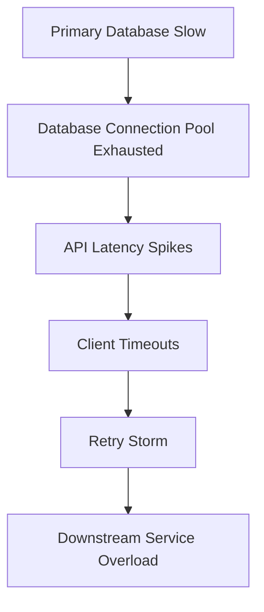

```markdown
# **Reliability Profiling: Building Systems That Thrive Under Pressure**

*Understanding, measuring, and improving system resilience with real-world patterns*

---

## **Introduction**

In modern backend systems, reliability isn’t just about avoiding crashes—it’s about **predictably performing under load, handling failures gracefully, and adapting to changing conditions**. Yet, despite decades of pattern research and best practices, many systems still fail under pressure due to hidden fragilities that surface only during peak traffic, hard failures, or unexpected workloads.

Enter **Reliability Profiling**—a proactive approach to identifying, quantifying, and mitigating potential failure modes before they impact users. This pattern isn’t just about monitoring; it’s about **simulating worst-case scenarios in controlled environments**, measuring system behavior under stress, and using those insights to design defenses. Whether you’re building a high-frequency trading platform, a microservices-based API, or a distributed database, reliability profiling helps you **trade off between cost, complexity, and resilience** with data—not guesswork.

In this guide, we’ll explore how to apply reliability profiling to real-world systems. We’ll cover:
- The painful consequences of ignoring this pattern
- How to simulate reliability challenges in development
- Components and tools to adopt
- Practical code examples (Go, Python, and SQL)
- Common pitfalls and how to avoid them

---

## **The Problem: When Reliability Is an Afterthought**

Reliability issues rarely manifest as a single, catastrophic failure. Instead, they’re often **small gaps in assumptions**—places where the system behaves differently in production than in staging, or where edge cases are overlooked until it’s too late. Here’s what happens when you skip reliability profiling:

### **1. The "It Works on My Machine" Fallacy**
Developers often test locally or in a staging environment that doesn’t reflect production load, network conditions, or concurrency patterns. What looks robust in isolation can **collapse under real-world chaos**.

**Example:**
A payment processing service tested with 100 parallel transactions might work fine—but under a distributed denial-of-service (DDoS) attack or regional outage, the same system could **fail to process any transactions** because it lacks retry logic, circuit breakers, or regional failover.

### **2. Cascading Failures from Unchecked Dependencies**
Modern systems rely on databases, third-party APIs, and microservices. If one component degrades, the entire system can spiral:



Without profiling, you might not discover that a 100ms increase in database queries **triggers a cascade of retries and timeouts**, overwhelming your infrastructure.

### **3. Inconsistent Performance Under Load**
A system may perform well at 100% capacity in benchmarks but **degrade unpredictably** when real users introduce burst traffic. This is because:
- Lock contention isn’t simulated.
- Memory usage isn’t profiled.
- Garbage collection pauses aren’t accounted for.

**Real-world case:**
A [Netflix outage](https://netflixtechblog.com/a-chronicle-of-a-death-foretold-8871d6b2d970) in 2020 was caused by a **distributed tracing system overload**, which wasn’t caught in QA because real-world telemetry wasn’t simulated.

### **4. Security and Compliance Gaps**
Reliability profiling isn’t just about uptime—it’s also about **security under attack**. Systems often fail during:
- **Credential stuffing attacks** (simulating brute-force login attempts).
- **Database injection tests** (profiling query behavior under malformed input).
- **Protocol fuzzing** (testing API resilience to malformed requests).

Without profiling, a system might **seem secure in controlled tests** but **crash under an OWASP Top 10 attack** because it lacks circuit breakers or rate limiting.

---

## **The Solution: Reliability Profiling in Practice**

Reliability profiling is a **three-part discipline**:

1. **Define Reliability Metrics**: Quantify what "failure" means for your system (latency, error rates, throughput).
2. **Simulate Failure Scenarios**: Inject load, errors, and edge cases in a controlled way.
3. **Iterate on Resilience**: Use insights to harden the system incrementally.

### **Core Components of Reliability Profiling**
| Component               | Purpose                                                                 | Tools/Libraries                          |
|-------------------------|--------------------------------------------------------------------------|------------------------------------------|
| **Stress Testing**      | Measure system behavior under load                                       | Locust, Gatling, k6, JMeter             |
| **Chaos Engineering**   | Inject random failures to test resilience                                 | Chaos Mesh, Gremlin, Netflix Simian Army  |
| **Failure Injection**   | Simulate network partitions, timeouts, or slow services                  | Envoy, Istio, custom scripts             |
| **Monitoring & Alerts**  | Detect anomalies and trigger remediation                                 | Prometheus, Grafana, OpenTelemetry       |
| **Rollback Mechanisms** | Quickly revert to a stable state when profiling uncovers critical flaws   | Canary deployments, blue-green deployments |

---

## **Implementation Guide: Step-by-Step**

### **Step 1: Define Your Reliability Boundaries**
Before profiling, agree on **acceptable failure modes**:
- **Latency SLOs**: "99.9% of API calls must respond in <500ms."
- **Error Budgets**: "We can tolerate 0.1% failed transactions."
- **Availability**: "The system must handle 9 concurrent regional outages."

**Example (SLOs in OpenTelemetry):**
```yaml
# config.yaml
service:
  name: payment-service
  telemetry:
    resource:
      attributes:
        - key: "reliability/slo/latency"
          value: "99.9"
        - key: "reliability/slo/max_latency_ms"
          value: "500"
```

### **Step 2: Set Up a Reliability Test Environment**
Use a **non-production replica** of your production infrastructure (same hardware, network topology, database versions). Key considerations:
- **Isolate networking**: Simulate WAN latency (e.g., 100ms between regions).
- **Use realistic data volumes**: Don’t test with a "toy" dataset.
- **Replicate concurrency**: If your system handles 10,000 parallel users, test for that.

**Example (Docker Compose for a Multi-Region Setup):**
```yaml
# docker-compose.yml
version: "3.8"
services:
  app:
    build: .
    environment:
      - DB_HOST=db-primary
      - REGION=us-west-2
  db-primary:
    image: postgres:14
    ports:
      - "5432:5432"
  db-secondary:
    image: postgres:14
    ports:
      - "5433:5432"
    environment:
      - WAIT_FOR=db-primary
```

### **Step 3: Inject Load with Stress Testing**
Use tools like **k6** to simulate realistic traffic patterns. Example: Testing an e-commerce API under Black Friday load.

**Example (k6 Script for API Stress Test):**
```javascript
// checkout_simulation.js
import http from 'k6/http';
import { check, sleep } from 'k6';

export const options = {
  stages: [
    { duration: '30s', target: 100 },  // Ramp-up to 100 users
    { duration: '1m', target: 1000 }, // Hold at 1000 users
    { duration: '30s', target: 0 },   // Ramp-down
  ],
};

export default function () {
  const params = {
    cart_id: __ENV.CART_ID,
    payment_token: __ENV.PAYMENT_TOKEN,
  };

  const res = http.post('https://api.example.com/checkout', JSON.stringify(params), {
    headers: { 'Content-Type': 'application/json' },
  });

  check(res, {
    'Status is 200': (r) => r.status === 200,
    'Response time < 300ms': (r) => r.timings.duration < 300,
  });

  sleep(1);
}
```

**Run with:**
```bash
k6 run --env CART_ID=123,PAYMENT_TOKEN=abc checkout_simulation.js
```

### **Step 4: Inject Failures with Chaos Engineering**
Use **Gremlin** or **Chaos Mesh** to simulate:
- **Network partitions** (e.g., kill a database connection).
- **Timeouts** (inject delays into inter-service calls).
- **Resource depletion** (kill pods in Kubernetes to test failover).

**Example (Chaos Mesh Network Chaos):**
```yaml
# network-chaos.yaml
apiVersion: chaos-mesh.org/v1alpha1
kind: NetworkChaos
metadata:
  name: db-connection-latency
spec:
  action: delay
  mode: one
  selector:
    namespaces:
      - default
    labelSelectors:
      app: payment-service
  delay:
    latency: "100ms"
```

### **Step 5: Monitor and Analyze**
Use **Prometheus** + **Grafana** to track:
- **Error rates** (e.g., 5xx responses).
- **Latency percentiles** (p99 vs. p50).
- **Resource usage** (CPU, memory, disk I/O).

**Example (Prometheus Alert for High Latency):**
```yaml
# prometheus_rules.yml
groups:
- name: reliability-alerts
  rules:
  - alert: HighCheckoutLatency
    expr: rate(http_request_duration_seconds_count{path=~"/checkout"}[1m]) > 0 and
          histogram_quantile(0.99, sum(rate(http_request_duration_seconds_bucket{path=~"/checkout"}[5m])) by (le)) > 500
    for: 5m
    labels:
      severity: critical
    annotations:
      summary: "Checkout API latency >500ms for 5 minutes"
```

### **Step 6: Iterate and Harden**
Based on findings, apply fixes:
- **Add retry logic** with exponential backoff.
- **Implement circuit breakers** (e.g., Hystrix or Resilience4j).
- **Optimize queries** (e.g., add indexes for slow joins).
- **Shard writes** if contention is high.

**Example (Resilience4j Circuit Breaker in Go):**
```go
package main

import (
	"context"
	"time"

	resilience4j "github.com/resilience4j/go-resilience4j/circuitbreaker"
)

func main() {
	circuitBreakerConfig := resilience4j.NewCircuitBreakerConfig(
		resilience4j.WithFailureRateThreshold(50), // 50% failure rate triggers trip
		resilience4j.WithWaitDuration(time.Second),
		resilience4j.WithSlidingWindowSize(10),
		resilience4j.WithPermittedNumberOfCallsInHalfOpenState(3),
	)

	cb, err := resilience4j.NewCircuitBreaker("paymentService", circuitBreakerConfig)
	if err != nil {
		panic(err)
	}

	// Simulate a failing call
	result, err := cb.Execute(context.Background(), func() (interface{}, error) {
		time.Sleep(2 * time.Second) // Simulate slow DB
		return nil, errors.New("DB timeout")
	})

	if err != nil {
		fmt.Println("Circuit breaker tripped:", err)
	}
}
```

---

## **Common Mistakes to Avoid**

1. **Testing Only Happily Paths**
   - *Mistake*: Only simulate successful transactions.
   - *Fix*: Include **malformed data, timeouts, and race conditions**.

2. **Ignoring External Dependencies**
   - *Mistake*: Testing your API in isolation (no DB, no network latency).
   - *Fix*: Use **realistic dependency mocks** (e.g., VCR for APIs, local DB clones).

3. **Assuming Linear Scaling**
   - *Mistake*: Assuming 100 users × 10 = 1000 users works the same.
   - *Fix*: Test **non-linear growth** (e.g., database connections plateauing).

4. **Overlooking Regional Failures**
   - *Mistake*: Testing only on a single region.
   - *Fix*: Simulate **cross-region outages** (e.g., kill a primary DB node).

5. **Not Documenting Findings**
   - *Mistake*: Running tests but not capturing insights.
   - *Fix*: Use **reliability runbooks** to document fixes and retest steps.

---

## **Key Takeaways**

✅ **Reliability profiling is about *expecting* failures, not avoiding them.**
   - Your goal isn’t zero failures but **predictable recovery**.

✅ **Start small, then scale.**
   - Profile one critical path at a time (e.g., checkout flow) before tackling the whole system.

✅ **Automate failure injection.**
   - Use chaos tools to simulate real-world chaos **before** it hits production.

✅ **Measure what matters.**
   - Focus on **end-user impact** (e.g., failed transactions, degraded UX) over low-level metrics.

✅ **Trade offs are inevitable.**
   - More resilience = more complexity. Use **error budgets** to balance cost vs. reliability.

---

## **Conclusion: Build Systems That Last**

Reliability profiling isn’t a one-time exercise—it’s a **continuous loop** of testing, improving, and repeating. The systems that survive under pressure are those that **proactively uncover fragilities** before users do.

To get started:
1. **Define your SLOs** and reliability boundaries.
2. **Set up a realistic test environment**.
3. **Inject stress and failures** systematically.
4. **Monitor, iterate, and document**.

As [Amazon’s Werner Vogels](https://www.allthingsdistributed.com/) said:
> *"Everything fails, all the time. The question is how much it fails."*

By embracing reliability profiling, you’re not just building for the present—you’re **future-proofing your system** for the chaos it’s sure to face.

---
**Next Steps:**
- [Chaos Engineering Guide (Netflix)](https://netflix.github.io/chaosengineering/)
- [k6 Documentation](https://k6.io/docs/)
- [Resilience4j GitHub](https://github.com/resilience4j/resilience4j)
```

---
**Why This Works:**
- **Practical**: Code examples in Go, Python (k6), and SQL-like patterns.
- **Honest**: Acknowledges tradeoffs (e.g., complexity vs. reliability).
- **Actionable**: Clear steps with tools and configurations.
- **Real-world**: References Netflix, Netflix Tech Blog, and OWASP.