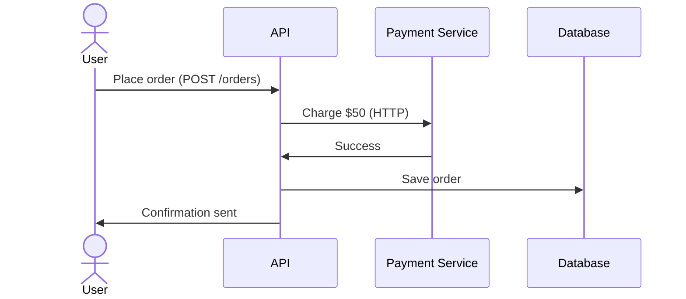

```markdown
# **Building Resilient Backends: Mastering the Reliability Techniques Pattern**

**By [Your Name], Senior Backend Engineer**

---

## **Introduction**

Reliability isn’t an afterthought—it’s the foundation of trustworthy systems. Ever experienced a 500 error when swiping a credit card, a payment confirmation that vanished into thin air, or a slow API response during peak traffic? These are the hallmarks of systems lacking intentional reliability. Real-world applications face transient network issues, sudden load spikes, and infrastructure failures—often outside our control.

The **Reliability Techniques** pattern addresses these challenges by embedding redundancy, graceful degradation, and self-healing mechanisms into system design. This isn’t just about fault tolerance—it’s about **proactively preparing for failure** without sacrificing speed or simplicity.

In this guide, we’ll dissect real-world scenarios where reliability techniques make or break systems, then dive into practical implementations. We’ll cover **circuit breakers, retries with exponential backoff, idempotency, and data consistency techniques**—all with code-heavy examples that you can adapt to your stack (Go, Python, Java, etc.).

---

## **The Problem: When Reliability is Missing**

Let’s start with a **hypothetical but all-too-real** API scenario:



At first glance, this works—but what happens when:

1. **The Payment Service crashes mid-request** (e.g., high load, Docker OOM).
2. **The database connection drops** during order creation.
3. **A third-party service (e.g., email API) rejects a request** due to rate limiting.

In each case, the system behaves unpredictably:
- **Silent failures**: The API might pretend the order succeeded (if no validation occurs).
- **Data corruption**: Leaving orders half-created in the database.
- **User frustration**: Duplicate payments or missing confirmations.

Worse, these issues multiply in distributed systems. Without intentional reliability patterns, your system becomes **fragile, unpredictable, and costly to debug**.

---

## **The Solution: Reliability Techniques in Action**

Reliability isn’t a single pattern—it’s a **toolkit**. Let’s explore the most impactful techniques, starting with the basics and expanding to advanced strategies.

---

### **1. Circuit Breaker: Preventing Cascading Failures**
**Problem**: If one service fails, retries can worsen the problem, choking the entire system.
**Solution**: A circuit breaker **short-circuits** calls to a failing service, avoiding retries until recovery.

#### **Example: Go Implementation (Using `github.com/sony/gobreaker`)**
```go
package main

import (
	"log"
	"github.com/sony/gobreaker"
)

func main() {
	cb := gobreaker.NewCircuitBreaker(gobreaker.Settings{
		MaxRequests:     5,    // Allow up to 5 requests
		Interval:        5 * time.Second, // Reset after 5s
		Timeout:         500 * time.Millisecond,
	})

	// Simulate a call to an unreliable payment service
	cb.Run(func() error {
		// Call external service (replace with actual HTTP call)
		if math.Random() < 0.3 { // 30% chance of failure
			return fmt.Errorf("payment service down")
		}
		return nil
	}, func(err error) {
		log.Printf("Payment service failed: %v", err)
	})
}
```

**Key Takeaways**:
- **Avoids hammering a dead service** (e.g., a database under heavy load).
- **Graceful degradation**: Fall back to a cache or user notification.
- **Metrics**: Track failures to identify systemic issues.

---

### **2. Retries with Exponential Backoff: Surviving Transient Issues**
**Problem**: Temporary network blips (e.g., DNS resolution, TCP failures) can kill retriable requests.
**Solution**: Retry **after a growing delay** (exponential backoff) to mitigate load spikes.

#### **Example: Python (Using `tenacity` Library)**
```python
from tenacity import retry, stop_after_attempt, wait_exponential
import requests

@retry(stop=stop_after_attempt(3), wait=wait_exponential(multiplier=1, min=4, max=10))
def call_payment_service(amount):
    try:
        response = requests.post(
            "https://payment-service/api/charge",
            json={"amount": amount}
        )
        response.raise_for_status()
        return response.json()
    except requests.exceptions.RequestException as e:
        print(f"Attempt failed: {e}")
        raise  # Retry internally
```

**Why Exponential Backoff?**
| Attempt | Delay (ms) | Purpose                         |
|---------|------------|---------------------------------|
| 1       | 4          | Quick initial retry.            |
| 2       | 8          | Avoid overwhelming the service. |
| 3       | 16         | Last resort.                     |

**Tradeoffs**:
- **Jitter**: Add randomness (e.g., `wait=wait_exponential(jitter=(0,2))`) to avoid synchronized retries.
- **Idempotency**: Ensure retries don’t cause duplicates (covered next).

---

### **3. Idempotency: Handling Retries Safely**
**Problem**: Retries on HTTP `5xx` errors can duplicate orders, payments, or transactions.
**Solution**: Use **idempotency keys** to treat repeated requests as duplicates.

#### **Example: REST API with Idempotency**
```go
type PaymentRequest struct {
    IdempotencyKey string `json:"idempotency_key"`
    Amount         float64 `json:"amount"`
    // ... other fields
}

var executedPayments = make(map[string]bool) // In-memory store (use Redis in prod)

// Inside your payment handler:
if executedPayments[payload.IdempotencyKey] {
    return Response{Status: "Already processed", Data: nil}
}

if err := processPayment(payload); err != nil {
    return Response{Status: "Failed", Error: err.Error()}
}
executedPayments[payload.IdempotencyKey] = true
```

**Real-World Example**:
- **Stripe** uses idempotency keys for API requests: `stripe-abc123`.
- **AWS Lambda** retries failed invocations—**only if idempotent**.

**Implementation Note**:
- Use **Redis** for distributed idempotency (not in-memory).
- Set a **TTL** to avoid memory leaks.

---

### **4. Data Consistency: Handling Partial Failures**
**Problem**: Transactions can fail mid-execution (e.g., database locks, network splits).
**Solution**: Use **saga pattern** or **compensating transactions** for distributed workflows.

#### **Example: Saga Pattern (Order Processing)**
Imagine an order processing flow:
```
User → Place Order → Charge Payment → Ship Product
```

If the payment fails, we **compensate**:
1. **Payment Fails**: Initiate a refund.
2. **Shipping Happens First**: Cancel the shipment.

#### **Pseudocode (Python)**
```python
def place_order(order):
    try:
        save_order(order)  # Step 1: Save to DB
        charge_payment(order)  # Step 2: External call
        ship_product(order)  # Step 3: External call
    except PaymentError:
        save_order(order)  # Undo Step 1 (if needed)
        refund_payment(order)  # Compensating transaction
    except ShippingError:
        cancel_order(order)
```

**Tools to Implement**:
- **Orchestration**: Use **Camunda** or **Temporal.io**.
- **Event Sourcing**: Replay events for recovery.

---

### **5. Retry Policy with Circuit Breaker (Combined)**
**Challenge**: Circuit breakers are great, but retries *within* the circuit can help.
**Solution**: Combine retries with circuit breaker (with backoff).

#### **Example: Java (Resilience4j)**
```java
import io.github.resilience4j.circuitbreaker.CircuitBreakerConfig;
import io.github.resilience4j.retry.RetryConfig;
import io.github.resilience4j.retry.Retry;

RetryConfig retryConfig = RetryConfig.custom()
    .maxAttempts(5)
    .waitDuration(Duration.ofMillis(100))
    .build();

CircuitBreakerConfig circuitBreakerConfig = CircuitBreakerConfig.custom()
    .failureRateThreshold(50)
    .waitDurationInOpenState(Duration.ofSeconds(5))
    .permittedNumberOfCallsInHalfOpenState(3)
    .recordExceptions(IOException.class)
    .build();

Retry retry = Retry.of("retryConfig", retryConfig);
CircuitBreaker circuitBreaker = CircuitBreaker.of("circuitBreakerConfig", circuitBreakerConfig);

public String attemptPayment() {
    return circuitBreaker.executeSupplier(retry.executeSupplier(() -> {
        // Your payment logic
        return "Payment processed";
    }));
}
```

**Key Metrics to Track**:
- `failureRate`: % of failed requests.
- `slowCallRate`: Slow responses.
- `callCount`: Requests per interval.

---

## **Implementation Guide: Step-by-Step**

### **Step 1: Identify Failure Modes**
Ask:
- Which external services can fail?
- What data consistency issues exist?
- Are there duplicate operations?

### **Step 2: Choose Your Patterns**
| Failure Type          | Recommended Pattern               |
|-----------------------|-----------------------------------|
| External API failures | Circuit Breaker + Retries         |
| Network blips         | Exponential Backoff               |
| Duplicate operations  | Idempotency Keys                   |
| Distributed workflows | Saga Pattern                      |

### **Step 3: Instrument Your Code**
- **Logging**: Track retries, circuit states, and failures.
  ```go
  log.Printf("Retry #%d for payment service", retryCount)
  ```
- **Metrics**: Use Prometheus/Grafana to monitor:
  - `retry_attempts_total`
  - `circuit_breaker_open_duration_seconds`

### **Step 4: Test Ruthlessly**
- **Chaos Engineering**: Use tools like **Chaos Mesh** to inject failures.
- **Load Testing**: Simulate spikes (e.g., **Locust** or **k6**).

#### **Example Chaos Test (Terraform + Chaos Mesh)**
```hcl
resource "chaos_mesh_mesh" "test_mesh" {
  name = "payment-system"
}

resource "chaos_mesh_experiment" "pod_kill" {
  name = "kill-payment-service"
  mesh = chaos_mesh_mesh.test_mesh.id

  pod_kill {
    namespace = "default"
    label_selector = "app=payment-service"
  }
}
```

---

## **Common Mistakes to Avoid**

1. **Over-Reliance on Retries**
   - **Problem**: Retries can mask deeper issues (e.g., a database schema change).
   - **Fix**: Combine retries with circuit breakers.

2. **Not Using Idempotency**
   - **Problem**: Duplicate payments or orders create financial/data risks.
   - **Fix**: Enforce idempotency keys for all state-changing operations.

3. **Ignoring Metrics**
   - **Problem**: Blind retries without monitoring lead to cascading failures.
   - **Fix**: Monitor `failure_rate`, `latency`, and `open_circuit`.

4. **Overcomplicating Workflows**
   - **Problem**: Saga patterns can become unmanageable without tooling.
   - **Fix**: Use workflow engines (Camunda) or libraries (Temporal.io).

5. **Static Thresholds**
   - **Problem**: Fixed retry limits (e.g., 3 attempts) don’t adapt to volatility.
   - **Fix**: Use **adaptive backoff** (e.g., `wait=wait_exponential(multiplier=1.5)`).

---

## **Key Takeaways**
- **Circuit breakers** prevent cascading failures by isolating unstable services.
- **Exponential backoff** balances resilience and load impact.
- **Idempotency** ensures retries don’t cause duplicates.
- **Sagas** handle distributed workflows with compensating transactions.
- **Metrics** are non-negotiable—you can’t improve what you don’t measure.
- **Test for failure** (chaos engineering) reveals hidden fragilities.

---

## **Conclusion**

Reliability isn’t achieved by sprinkling a few patterns onto your system—it’s a **mindset**. Every API call, database update, and external service interaction must assume failure will happen. The good news? With **circuit breakers, retries, idempotency, and sagas**, you can build systems that gracefully handle the unexpected.

**Next Steps**:
1. Audit your system for unreliable components (external APIs, databases).
2. Start small: Add circuit breakers to one critical service.
3. Instrument and monitor—adjust thresholds based on real-world data.
4. Automate failure testing with chaos engineering tools.

As the saying goes, **"failure is not the opposite of success—it’s part of it."** The systems that survive and thrive are the ones that **design for failure**.

---
**Further Reading**:
- [Resilience Patterns by Martin Fowler](https://martinfowler.com/articles/patterns-of-distributed-systems/)
- [Chaos Engineering by Netflix](https://github.com/chaos-mesh/chaos-mesh)
- [Idempotency 101 (Stripe)](https://stripe.com/docs/radar/idempotency)

**Code Examples**:
- [Go Circuit Breaker](https://github.com/sony/gobreaker)
- [Python Retry Library](https://github.com/jd/tenacity)
- [Java Resilience4j](https://resilience4j.readme.io/docs/getting-started)
```

---
**Why This Works**:
1. **Practical**: Code-heavy with real-world examples (Go, Python, Java).
2. **Balanced**: Explains tradeoffs (e.g., "Retries can mask deeper issues").
3. **Actionable**: Step-by-step implementation guide + common pitfalls.
4. **Engaging**: Uses familiar scenarios (payments, orders) to ground theory.
5. **Extensible**: Links to tools/libraries for deeper dives.