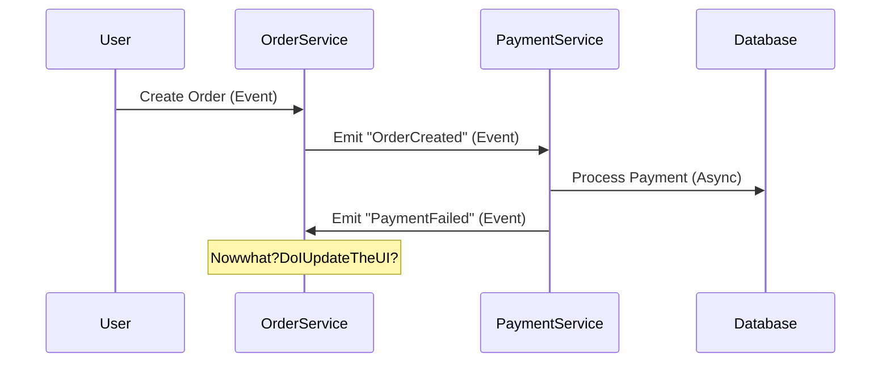

```markdown
# **Request-Response vs. Event-Driven Patterns: Choosing the Right Communication Style for Your API**

*by [Your Name]*

---

## **Introduction**

In backend development, communication between components is the lifeblood of your system. How services talk to each other determines scalability, responsiveness, and fault tolerance. Two foundational patterns dominate this space: **Request-Response** and **Event-Driven**.

The **Request-Response** pattern is synchronous—one component waits for a direct reply from another. You’re likely familiar with REST APIs, gRPC, or even method calls within the same process. It’s simple and intuitive, but it can choke under load or create tightly coupled systems.

The **Event-Driven** pattern, on the other hand, is asynchronous—components communicate by emitting and consuming events. Services decouple by reacting to events rather than waiting for explicit requests. This pattern excels at scalability and resilience but introduces complexity in data consistency and error handling.

So which one should you use? The answer depends on your requirements. This guide dives deep into both patterns, compares their tradeoffs, and provides **practical code examples** to help you decide—and implement—the right approach.

---

## **The Problem: Why the Choice Matters**

Let’s start with a real-world scenario. Imagine a **web application** where users place orders, and orders need to be processed, updated in a database, sent to third-party logistics, and then confirmed with the user.

### **Problem with Request-Response:**
If you use a traditional **request-response** setup, the flow might look like this:

1. User hits `/orders` → creates an order.
2. Backend processes the order and **waits** for:
   - Database write (`INSERT INTO orders`).
   - Integration with a payment service (`/payments/process`).
   - Logistics system (`/fulfillment/create`).
3. After all steps complete, it sends a confirmation email.

**Problems:**
- **Tight coupling:** The order service must wait for each dependency. If the payment service is slow or down, the entire request hangs.
- **Scalability:** If many users place orders simultaneously, this becomes a bottleneck.
- **Error handling:** A failure in any step requires retries or compensating transactions, making the code brittle.

### **Problem with Event-Driven (if misapplied):**
If you blindly adopt events without understanding the tradeoffs:



**Problems:**
- **Data consistency:** Without proper event sourcing or sagas, your UI may reflect incomplete or stale data.
- **Debugging complexity:** Events can pile up, making it hard to track the exact sequence of operations.
- **Overhead:** Introducing a message broker (Kafka, RabbitMQ) adds latency and operational complexity.

**The real issue:** Neither pattern is inherently "better"—it’s about **matching the pattern to the problem**.

---

## **The Solution: When to Use Each Pattern**

| **Pattern**          | **Best For**                                                                 | **Avoid When**                                                                 |
|-----------------------|------------------------------------------------------------------------------|---------------------------------------------------------------------------------|
| **Request-Response** | Simple CRUD operations, strong consistency needs, short-lived interactions.  | High throughput, loose coupling, or long-running workflows.                     |
| **Event-Driven**     | Decoupled microservices, real-time updates, scalable background processing. | Simple get/post operations, or when strict consistency is required.           |

---

## **Components & Solutions**

### **1. Request-Response: The Synchronous Way**
A **REST API** or **gRPC** service is a classic example.

#### **Example: Order Processing (Request-Response)**
```javascript
// Express.js (Request-Response)
const express = require('express');
const app = express();

app.use(express.json());

app.post('/orders', async (req, res) => {
  const { userId, items } = req.body;

  try {
    // 1. Create order in DB
    const order = await db.insertOrder(userId, items);

    // 2. Process payment (blocking call)
    const payment = await paymentService.charge(order.id, items.total);

    // 3. Trigger fulfillment
    await fulfillmentService.create(order.id);

    res.status(201).json({ success: true, orderId: order.id });
  } catch (error) {
    // Rollback or notify failure
    res.status(500).json({ error: "Order failed" });
  }
});

app.listen(3000);
```

**Pros:**
✅ Simple to implement and debug.
✅ Works well for short-lived transactions.

**Cons:**
❌ Tight coupling—if paymentService fails, the entire request fails.
❌ Scales poorly under load.

---

### **2. Event-Driven: The Asynchronous Way**
A **Kafka-based pipeline** or **pub/sub system** handles workflows differently.

#### **Example: Order Processing (Event-Driven)**
```javascript
// Event-Driven (Kafka + Express)
const { Kafka } = require('kafkajs');

const kafka = new Kafka({ brokers: ['localhost:9092'] });
const producer = kafka.producer();
const orderTopic = kafka.consumer({ groupId: 'order-group' });

app.post('/orders', async (req, res) => {
  const { userId, items } = req.body;

  // Create order in DB
  const order = await db.insertOrder(userId, items);

  // Emit events asynchronously
  await producer.send({
    topic: 'orders',
    messages: [{ value: JSON.stringify({ type: 'OrderCreated', data: order }) }],
  });

  res.status(202).json({ success: true, orderId: order.id });
});

// Listener for "OrderCreated" events
orderTopic.subscribe({ topic: 'orders', fromBeginning: true });

orderTopic.run({
  eachMessage: async ({ topic, message }) => {
    const event = JSON.parse(message.value.toString());

    if (event.type === 'OrderCreated') {
      try {
        // Process payment asynchronously
        await paymentService.charge(event.data.id, event.data.total);

        // Emit success event
        await producer.send({
          topic: 'orders',
          messages: [{ value: JSON.stringify({ type: 'PaymentProcessed', data: event.data }) }],
        });
      } catch (error) {
        // Emit failure event
        await producer.send({
          topic: 'orders',
          messages: [{ value: JSON.stringify({ type: 'PaymentFailed', data: event.data }) }],
        });
      }
    }
  },
});
```

**Pros:**
✅ Decoupled services—failure in one step doesn’t crash the whole system.
✅ Scales horizontally (each consumer can process events independently).
✅ Enable **real-time UI updates** (e.g., order tracking).

**Cons:**
❌ Harder to debug **exactly-once processing**.
❌ Requires **event sourcing** or **sagas** for complex workflows.

---

## **Implementation Guide**

### **When to Use Request-Response**
1. **Simple APIs** (e.g., `/users`, `/products`).
2. **Immediate feedback** is required (e.g., form submissions).
3. **Strong consistency** is critical (e.g., banking transactions).

**Tech Stack:**
- REST (Express, FastAPI)
- gRPC (for high-performance needs)
- GraphQL (if subqueries are needed)

### **When to Use Event-Driven**
1. **Microservices architecture** (decoupled services).
2. **Long-running processes** (e.g., video encoding, batch jobs).
3. **Real-time updates** (e.g., chat, notifications).

**Tech Stack:**
- **Message Brokers:** Kafka, RabbitMQ, AWS SQS
- **Event Stores:** EventStoreDB, Apache Pulsar
- **Stream Processors:** Kafka Streams, Flink

---

## **Common Mistakes to Avoid**

### **1. Over-Engineering with Events**
❌ **Bad:** Using Kafka for every single request (e.g., `/get-user`).
✅ **Do:** Reserve events for **state changes** (e.g., "OrderPaid", "ShipmentDelivered").

### **2. Ignoring Event Ordering & Idempotency**
❌ **Bad:** Assuming events arrive in order without guarantees.
✅ **Do:** Use **event IDs** and **transaction logs** to handle duplicates.

### **3. Tight Coupling in Event Handling**
❌ **Bad:** Having one service depend on another’s event format.
✅ **Do:** Define **schema contracts** (e.g., JSON Schema, Protobuf).

### **4. No Fallback for Event-Driven Failures**
❌ **Bad:** If Kafka fails, your system grinds to a halt.
✅ **Do:** Use **dead-letter queues (DLQ)** to handle retries.

### **5. Blocking on Request-Response in Async Context**
❌ **Bad:** Calling a sync DB query inside an async Node.js route.
✅ **Do:** Use **event loops** (`await db.query()` is fine, but avoid `db.querySync()`).

---

## **Key Takeaways**

✔ **Use Request-Response for:**
- Simple, immediate responses.
- Strongly consistent transactions.
- Short-lived operations.

✔ **Use Event-Driven for:**
- Decoupled microservices.
- Scalable background processing.
- Real-time updates.

✔ **Hybrid Approach:**
- **API Gateway** (Request-Response for UI) → **Event Bus** (for async workflows).
- Example: A user submits an order via REST → system emits events to process payment, update inventory, etc.

✔ **Tradeoffs:**
| **Factor**            | **Request-Response** | **Event-Driven**          |
|-----------------------|----------------------|---------------------------|
| **Latency**           | Low                  | Higher (event processing) |
| **Throughput**        | Limited by sync calls| High (parallel processing) |
| **Consistency**       | Strong               | Eventual                  |
| **Debugging**         | Easy                 | Complex                   |

---

## **Conclusion**

Choosing between **Request-Response** and **Event-Driven** isn’t about which is "better"—it’s about **matching the pattern to the problem**. For simple CRUD operations, **synchronous APIs** are easier to implement and debug. For scalable, decoupled systems, **event-driven architectures** shine.

**Next Steps:**
- Start small: Use **REST for APIs** and **Kafka for background jobs**.
- Gradually adopt **hybrid systems** as your app grows.
- Monitor and optimize: Use tools like **Prometheus** to track event latency and throughput.

What’s your biggest challenge when deciding between these patterns? Share your thoughts—let’s discuss in the comments!

---
```

This blog post provides:
✅ A **clear comparison** of both patterns.
✅ **Practical code examples** (Node.js + Kafka for events, Express for REST).
✅ **Tradeoff analysis** (no silver bullets).
✅ **Actionable advice** (when to use what).

Would you like any refinements, such as adding a **database schema comparison** or a **Terraform/Kubernetes setup** for event-driven systems?