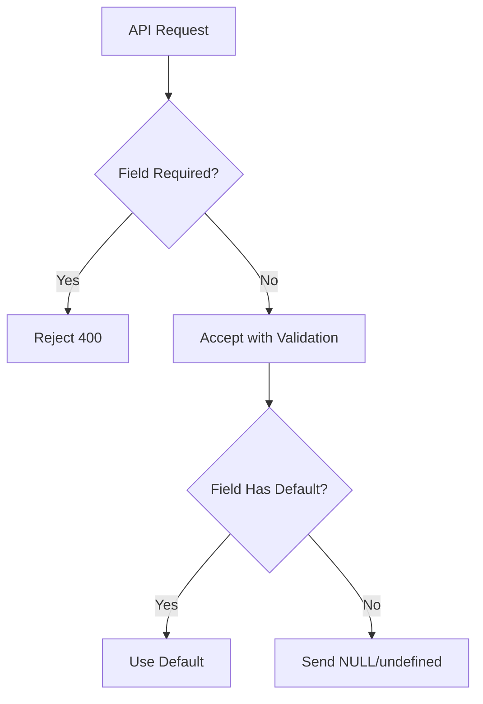

```markdown
# Unlocking Flexibility: The Required vs Optional Fields Pattern in API Design

APIs today serve as the nervous system of our digital ecosystems, enabling everything from simple mobile notifications to complex microservices orchestration. As developers, we're constantly balancing two competing needs: **strict data validation for reliability** and **flexibility for user experience**. The **"Required vs Optional Fields"** pattern emerges as a powerful tool to navigate this tension—helping us design APIs that are both robust and adaptable.

This pattern isn't just about which fields are mandatory—it's about *semantics*. The **`!` modifier** (or lack thereof) in your schema becomes an explicit contract that developers, clients, and tooling can understand at a glance. Whether you're designing a REST API for a SaaS product or a GraphQL schema for an internal microservice, mastering this pattern will make your systems more maintainable and user-friendly.

---

## The Problem: When Fields Become Arbitrary

Imagine implementing a user creation endpoint where you expect `email` and `password` to be provided. But what happens when:
- A mobile client wants to auto-fill the email from device settings?
- An admin dashboard allows creating "suspended" accounts with placeholder credentials?
- You later need to support "guest" accounts with only a name?

Without explicit **required vs optional** semantics, you’re left with three options, each with tradeoffs:

1. **Make everything required** → Clients must always send `password` even for guests, wasting bandwidth.
2. **Use nullable fields** → Clients still send empty/null values, cluttering the payload and making validation harder.
3. **Silent defaults** → The server "forgivably" populates missing fields, leading to inconsistent states.

```json
// Example: Arbitrary required fields
// Client A (mobile) sends:
{
  "email": "user@example.com",  // required by server
  "password": null              // implicitly rejected
}

// Client B (admin UI) sends:
{
  "email": null,                // ignored by server
  "password": "default123"      // hardcoded
}
```
This invisibility introduces friction:
- **Debugging hell**: Clients struggle to predict which fields will be rejected *and how*.
- **Versioning nightmares**: Changing optional fields between releases breaks clients.
- **Security risks**: Optional fields might silently enable dangerous behavior (e.g., `is_active: false` defaults).

---

## The Solution: Explicit Semantics with Required/Optional Fields

The **Required vs Optional Fields** pattern solves these issues by:
1. **Clarifying intent** via schema annotations (e.g., `!` for required).
2. **Enforcing consistency** in validation logic.
3. **Enabling smart clients** that only send necessary fields.

### Core Components
| Component                | Purpose                                                                 | Example                          |
|--------------------------|-------------------------------------------------------------------------|----------------------------------|
| **Schema Annotations**   | Mark fields as `required` or `optional` using standard conventions.      | OpenAPI: `email: { type: string, required: true }` |
| **Field Defaults**       | Provide safe defaults for optional fields to avoid runtime errors.       | `default: null` or `default: "guest"` |
| **Payload Validation**   | Reject malformed requests early with clear error messages.               | HTTP 400 with `required: ["email"]` |
| **Type Safety**          | Leverage language features to enforce requirements (e.g., TypeScript).   | `email: string!` or `email: string?` |

---

## Code Examples: Implementation Across Technologies

### 1. REST API with OpenAPI/Swagger (Node.js + Express)
```yaml
# openapi.yml
paths:
  /users:
    post:
      summary: Create a user
      requestBody:
        required: true
        content:
          application/json:
            schema:
              type: object
              properties:
                email:
                  type: string
                  required: true          # Required
                  format: email
                password:
                  type: string
                  required: true          # Required
                name:
                  type: string            # Optional
                  nullable: true
                is_active:
                  type: boolean
                  default: true           # Optional with default
                last_login:
                  type: string
                  nullable: true          # Optional (nullable)
```

**Validation Middleware (Node.js):**
```javascript
const { body, validationResult } = require('express-validator');

app.post('/users',
  body('email').isEmail().notEmpty(),
  body('password').isLength({ min: 8 }).optional(), // <-- Optional!
  (req, res) => {
    const errors = validationResult(req);
    if (!errors.isEmpty()) {
      return res.status(400).json({ errors: errors.array() });
    }
    // Proceed...
  }
);
```

---

### 2. GraphQL Schema (TypeScript)
```graphql
type UserInput {
  email: String!       # Required
  password: String!    # Required
  name: String         # Optional
  isActive: Boolean!   # Required! (default inferred by resolver)
}

type Mutation {
  createUser(input: UserInput!): User
}
```

**Resolver with Defaults (TypeScript):**
```typescript
const resolvers = {
  Mutation: {
    createUser: (_, { input }) => {
      const user = {
        ...input,
        isActive: input.isActive ?? true, // Fallback to true
      };
      return userService.create(user);
    },
  },
};
```

---

### 3. SQL Schema with Optional Columns (PostgreSQL)
```sql
CREATE TABLE users (
  id UUID PRIMARY KEY,
  email VARCHAR(255) NOT NULL,     -- Required
  password_hash VARCHAR(255) NOT NULL, -- Required
  name VARCHAR(255),               -- Optional (nullable)
  is_active BOOLEAN DEFAULT true,   -- Optional with default
  created_at TIMESTAMP NOT NULL,
  last_login TIMESTAMP WITH TIME ZONE NULL  -- Optional
);
```

---

### 4. Protocol Buffers (gRPC)
```proto
message CreateUserRequest {
  string email = 1;         // Required (default behavior)
  string password = 2;      // Required
  string name = 3;          // Optional (default empty)
  bool is_active = 4;       // Optional (default false)
}
```

---

## Implementation Guide: Step-by-Step

### Step 1: Audit Your Schema
Review your API’s current fields and categorize them:
- **Required**: Fields that *must* be set on creation (e.g., `email`).
- **Optional**: Fields that can be omitted (e.g., `name`).
- **Defaulted**: Fields with implicit defaults (e.g., `is_active: true`).

**Tooling help**:
- Use OpenAPI validators like `swagger-core` to lint schemas.
- For GraphQL, tools like `graphql-codegen` generate type-safe clients.

### Step 2: Enforce Semantics at the Edge
- **REST**: Validate in middleware (e.g., `express-validator`).
- **GraphQL**: Use `graphql-validation-complexity` for field-level checks.
- **gRPC**: Enable strict mode (`proto3` defaults to required fields).

**Example: gRPC Strict Validation**
```proto
syntax = "proto3";
option go_package = "github.com/yourorg/proto;grpc";
option java_multiple_files = true;
option java_package = "com.yourorg.proto";
option java_outer_classname = "YourProto";

service UserService {
  rpc CreateUser (CreateUserRequest) returns (UserResponse);
}
```

### Step 3: Handle Edge Cases Gracefully
| Scenario                     | Solution                                                                 |
|------------------------------|-------------------------------------------------------------------------|
| **Optional field missing**   | Use defaults or require partial updates (e.g., PATCH endpoint).        |
| **Required field omitted**   | Reject with clear error (e.g., `400 Bad Request` with field list).     |
| **Data type mismatch**       | Validate early (e.g., `email` must match regex `^[^@]+@[^@]+\.[^@]+$`). |
| **Conditional requirements** | Use subschemas (e.g., `if admin: require permissions` in GraphQL).     |

**Example: Conditional Validation (GraphQL)**
```graphql
type Query {
  listUsers(limit: Int! = 10, admin: Boolean! = false): [User!]!
}
```
**Resolver logic (TypeScript):**
```typescript
const resolvers = {
  Query: {
    listUsers: (_, { limit, admin }, context) => {
      if (admin && !context.user.isAdmin) {
        throw new Error("Missing required 'admin' field or permission");
      }
      return userService.list({ limit });
    },
  },
};
```

### Step 4: Document Your Intent
- **OpenAPI/Swagger**: Use `description` fields to explain why a field is optional.
- **Code comments**: Clarify defaults (e.g., `// Defaults to true for new users`).
- **Client SDKs**: Generate SDKs that reflect the schema (e.g., `axios-fetch` for REST).

**Example OpenAPI Documentation:**
```yaml
  name:
    type: string
    description: >
      User's full name. Optional for guest accounts.
      If omitted, defaults to "Guest (ID: {userId})".
    nullable: true
```

---

## Common Mistakes to Avoid

### ❌ Mistake 1: Inconsistent Optional Fields
**Problem**: One endpoint treats `is_active` as optional, another as required.
**Solution**: Centralize your schema in a shared library (e.g., `@yourorg/api-schemas`).

### ❌ Mistake 2: Silent Defaults
**Problem**:
```javascript
// ❌ Bad: Server-side default
app.post('/users', (req, res) => {
  const user = { ...req.body, is_active: true }; // Silent override
  // User may expect `is_active` to be configurable!
});
```
**Solution**: Only default in resolvers/validation, not in request handlers.

### ❌ Mistake 3: Overusing `NULL`
**Problem**: `NULL` vs `empty string` vs `undefined` create ambiguity in clients.
**Solution**:
- Use `optional` fields for `null`/`undefined`.
- Use `nullable` for explicit `NULL` in databases.

### ❌ Mistake 4: Ignoring Versioning
**Problem**: Adding an optional field breaks clients that *assumed* it was required.
**Solution**: Use backward-compatible defaults or versioned endpoints (`/v2/users`).

### ❌ Mistake 5: Mixing Layers
**Problem**: Validation logic split between client, API, and database.
**Solution**: Centralize validation in a shared library (e.g., `@yourorg/validation`).

---

## Key Takeaways
- **Explicit is better than implicit**: Always annotate required/optional fields.
- **Default judiciously**: Only default when it improves usability *and* safety.
- **Validate early**: Reject malformed requests before they hit the database.
- **Document thoroughly**: Clients depend on clear semantics.
- **Avoid `NULL` clutter**: Use optional fields for missing data, not for "no data."



---

## Conclusion: Building Adaptable APIs

The **Required vs Optional Fields** pattern isn’t just about "what’s mandatory"—it’s about **designing for collaboration**. When clients and servers share clear expectations, you reduce friction in development, debugging, and scaling.

Start small: Audit one endpoint, add explicit annotations, and observe how clients (and your own team) react. Over time, you’ll see fewer ambiguous errors, happier developers, and APIs that adapt gracefully to change.

Remember: There’s no silver bullet. Tradeoffs remain (e.g., stricter schemas can increase client complexity), but clarity is always worth the effort. Your future self—and your team—will thank you.

---
**Further Reading**:
- [OpenAPI Specification (RFC)](https://spec.openapis.org/oas/v3.1.0)
- [GraphQL Schema Design](https://www.howtographql.com/basics/1-graphql-is-a-query-language)
- [Protocol Buffers Guide](https://developers.google.com/protocol-buffers/docs/overview)
- [PostgreSQL Data Types](https://www.postgresql.org/docs/current/datatype.html)

**Questions?** Reach out on [Twitter @dbdevpatterns](https://twitter.com/dbdevpatterns) or [GitHub Discussions](https://github.com/yourorg/api-patterns/issues).
```