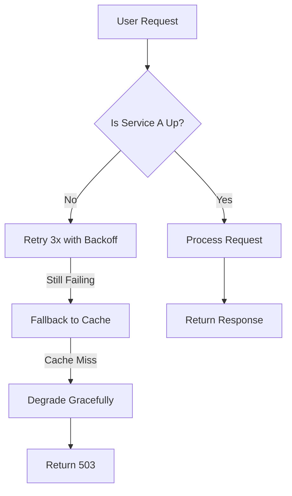

```markdown
# **"Resilience Tuning: How to Build APIs That Survive Chaos (Without Breaking the Bank)"**

*Advanced strategies to optimize fault tolerance in distributed systems—backed by real-world examples.*

---

## **Introduction: Why Resilience Isn’t Just About Retry Logic**

You’ve heard the mantra: *"Design for failure."* But in practice, most systems are built with ad-hoc resilience fixes—like slapping a retry loop on an HTTP call or hoping graceful degradation works. The result?

- **Performance sandbags:** Your API becomes slower when things go wrong, not faster.
- **Cost spikes:** Bad resilience strategies (e.g., endless retries) waste cloud spend.
- **Silent failures:** Partial outages degrade UX without clear feedback.

This isn’t just about making things *work*. It’s about **tuning resilience**—adjusting tradeoffs between cost, latency, and reliability to match real-world demands. This guide demystifies resilience tuning with practical patterns, code examples, and tradeoff analyses.

---

## **The Problem: When Resilience Becomes a Black Hole**

Consider this hypothetical API scenario:


At first glance, this looks resilient. But in production:
1. **Backoff is generic:** A linear retry delay (e.g., `100ms → 200ms → 400ms`) is too aggressive for some APIs and too sluggish for others.
2. **Cache is a blunt tool:** If `Service A` fails intermittently, you might cache stale data indefinitely.
3. **No circuit breaker for cascading failures:** If `Service A` ties up DB connections, your API might starve itself.

### **Real-World Costs of Poor Tuning**
- **Amazon’s 2012 DynamoDB outage:** A cascading failure killed 10% of AWS’s traffic [source](https://www.theregister.com/2012/04/18/amazon_dynamodb_outage/). Poor resilience tuning amplified the impact.
- **Netflix’s "Chaos Engineering" wake-up call:** Initially, retries were too aggressive, causing more load and further instability. Later, they introduced [Netflix’s resilience patterns](https://netflix.github.io/resilience/) (e.g., Bulkhead, Retry) but still needed tunable limits.

---

## **The Solution: Resilience Tuning Principles**

Resilience tuning is about **context-aware fault handling**. Key principles:

1. **Adaptive Retry:** Adjust retries based on:
   - Service SLA (e.g., 99.99% vs. 95% availability).
   - Failure patterns (transient vs. permanent).
   - Budget constraints (AWS Lambda cold starts vs. dedicated servers).

2. **Circuit Breaker Limits:** Dynamically set:
   - `failureThreshold`: How many consecutive failures to trip the circuit.
   - `timeout`: How long to wait before retrying.
   - `fallbackBehavior`: What to do when the circuit is open.

3. **Degradation Gradients:** Prioritize features based on:
   - Business impact (e.g., "Allow checkout without recommendations").
   - User type (e.g., VIPs get cached responses; others get 429s).

4. **Observability-Driven Tuning:** Use metrics to:
   - Detect failure modes (e.g., "90% of retries fail on Thursdays").
   - Adjust thresholds (e.g., "Increase timeout by 30% during peak hours").

---

## **Components/Solutions: The Toolbox**

### **1. Adaptive Retry with Exponential Backoff**
**Goal:** Avoid retry storms while minimizing latency.

**Tradeoff:** More retries = higher cost (but also better availability).

**Example (Python with `tenacity`):**
```python
from tenacity import retry, stop_after_attempt, wait_exponential, retry_if_exception_type
import requests

@retry(
    stop=stop_after_attempt(5),
    wait=wait_exponential(multiplier=1, min=4, max=10),
    retry=retry_if_exception_type(requests.exceptions.Timeout)
)
def call_external_api():
    response = requests.get("https://api.example.com/data", timeout=5)
    response.raise_for_status()
    return response.json()
```

**Tuning Knobs:**
| Parameter       | Default | Tuned Value (Example) | Why?                                  |
|-----------------|---------|-----------------------|---------------------------------------|
| `min` (backoff) | 1       | 2                     | Reduce early retry aggression.         |
| `multiplier`    | 1       | 1.5                   | Faster initial retries, slower later.  |
| `max` (backoff) | 10      | 30                    | Cap cost during prolonged outages.    |

---

### **2. Circuit Breaker with Dynamic Thresholds**
**Goal:** Stop retries when failures are permanent.

**Tradeoff:** Too strict = poor availability; too loose = wasted retries.

**Example (Java with Resilience4j):**
```java
CircuitBreaker circuitBreaker = CircuitBreaker.ofDefaults("api-service")
    .withFailureRateThreshold(50)  // Trip if >50% failures in 10s
    .withSuccessThreshold(10)      // Reset if >10 successes
    .withAutomaticTransitionFromOpenToHalfOpenEnabled(true)
    .withWaitDurationInOpenState(Duration.ofSeconds(30))
    .withPermittedNumberOfCallsInHalfOpenState(2);

Supplier<CallResult<String>> callSupplier = () -> {
    String result = RestClient.call("https://api.example.com/data");
    return CallResult.success(result);
};

CallResult<String> result = circuitBreaker.executeCall(callSupplier);
```

**Tuning Knobs:**
| Parameter                     | Default       | Tuned Value (Example) | Why?                                  |
|-------------------------------|---------------|-----------------------|---------------------------------------|
| `failureRateThreshold`        | 50%           | 30%                   | Be aggressive with circuit trips.     |
| `waitDurationInOpenState`     | 60s           | 120s                  | Let recovery time longer for DB calls.|
| `permittedNumberOfCallsHalfOpen` | 1       | 3                     | Test recovery faster.                |

---

### **3. Fallback with Context-Aware Degradation**
**Goal:** Provide a usable experience when primary services fail.

**Tradeoff:** Fallbacks add complexity but save UX.

**Example (Go with `go-resiliency`):**
```go
package main

import (
	"context"
	"fmt"
	"github.com/avast/retry-go"
	"github.com/avast/retry-go/strategy"
	"github.com/kelseyhightower/envconfig"
	"net/http"
)

type Config struct {
	ServiceATimeout int `envconfig:"SERVICE_A_TIMEOUT_DEFAULT=5"`
}

var config Config

func fetchUserData(ctx context.Context, userID string) (string, error) {
	var fallbackData string

	// Fallback: Return cached data if primary fails
	if err := retry.Do(
		func() error {
			resp, err := http.Get("https://service-a.example.com/data/" + userID)
			if err != nil {
				return err
			}
			defer resp.Body.Close()
			if resp.StatusCode == http.StatusOK {
				return nil // Success
			}
			return fmt.Errorf("retryable error: %v", resp.Status)
		},
		retry.Attempts(3),
		retry.Delay(strategy.Exponential(100*time.Millisecond)),
	); err != nil {
		// Degrade gracefully: return cached data or simplified UI
		fallbackData = "fallback:" + getCachedData(userID)
		return fallbackData, fmt.Errorf("service unavailable: %w", err)
	}
	return "", nil
}
```

**Tuning Knobs:**
| Strategy               | Use Case                          | Example Fallback          |
|------------------------|-----------------------------------|---------------------------|
| **Cache-first**        | High-read, low-write systems      | Return stale data        |
| **Simplified UI**      | E-commerce (show cart without recs)| Hide recommendations     |
| **429/503**            | Burstable APIs                     | Rate-limit gracefully     |

---

### **4. Bulkhead Pattern for Resource Isolation**
**Goal:** Prevent one failing call from starving the entire system.

**Tradeoff:** More threads = higher memory usage.

**Example (Netflix’s Hystrix-inspired Bulkhead):**
```python
from concurrent.futures import ThreadPoolExecutor, as_completed

def bulkhead(api_calls, max_concurrent=10):
    with ThreadPoolExecutor(max_workers=max_concurrent) as executor:
        futures = [executor.submit(call_api, call) for call in api_calls]
        results = []
        for future in as_completed(futures):
            try:
                results.append(future.result())
            except Exception as e:
                print(f"Isolated failure: {e}")
    return results
```

**Tuning Knobs:**
| Parameter           | Default | Tuned Value (Example) | Why?                                  |
|--------------------|---------|-----------------------|---------------------------------------|
| `max_concurrent`    | 10      | 5                     | DB-bound APIs (e.g., Oracle).        |
| Isolation          | Thread  | Process               | Avoid OOM with high concurrency.      |

---

## **Implementation Guide: Step-by-Step Tuning**

### **Step 1: Profile Your Failure Modes**
Use tools like:
- **AWS CloudWatch** for API latency percentiles.
- **OpenTelemetry** to trace failure paths.
- **Prometheus** to alert on retry loops.

**Example Query (PromQL):**
```sql
rate(http_requests_total{status=~"5.."}[1m]) > 0.1  # Alert if >10% errors
```

### **Step 2: Start with Conservative Thresholds**
- **Retry:** `max_attempts=3`, `backoff=exponential(min=1s, max=10s)`.
- **Circuit Breaker:** `failure_threshold=3` (failures in 30s).
- **Bulkhead:** `max_workers=5` (start low).

### **Step 3: Gradually Increase Limits**
1. **Load test** with chaos (e.g., `chaos-mesh`).
2. **Monitor** impact on:
   - Latency (P99 should stay < 1s for user-facing APIs).
   - Cost (e.g., AWS Lambda retries increase spend).
3. **Adjust** based on:
   - SLOs (e.g., "99.9% availability for payment APIs").
   - Business rules (e.g., "No retries for billing failures").

### **Step 4: Automate Tuning with Feedback Loops**
Use:
- **AWS Auto Scaling** to adjust bulkhead sizes dynamically.
- **Kubernetes HPA** to scale retries based on error rates.
- **ML models** (e.g., [Google’s Coral](https://github.com/google/coral)) to predict failure patterns.

---

## **Common Mistakes to Avoid**

| Mistake                                  | Impact                                  | Fix                                  |
|------------------------------------------|-----------------------------------------|--------------------------------------|
| **Fixed retry delays**                   | Too slow for time-sensitive APIs.      | Use adaptive backoff.                 |
| **No circuit breaker**                   | Infinite retries cost money.            | Always use one.                       |
| **Bulkhead too large**                   | OOM kills app.                          | Limit by service, not globally.      |
| **Fallbacks that hide errors**           | Users see broken UI without clues.     | Return `429` or `503` with retries.   |
| **Ignoring cost**                        | Retries inflate AWS bills.             | Set `max_retries` based on budget.   |

---

## **Key Takeaways**
✅ **Resilience tuning is iterative**—start conservative, monitor, then optimize.
✅ **Adaptive retries** beat static ones (use exponentials with caps).
✅ **Circuit breakers save more than they block**—tune fail rates based on SLA.
✅ **Fallbacks must degrade gracefully**—prioritize features by business impact.
✅ **Observe before optimizing**—use metrics to justify tuning changes.
✅ **Balance cost and resilience**—retries aren’t free (think AWS Lambda cold starts).

---

## **Conclusion: Building APIs That Outlast Outages**

Resilience tuning isn’t about adding more layers of complexity—it’s about **intentional tradeoffs**. A well-tuned API:
- **Recovers faster** (adaptive retries + circuit breakers).
- **Costs less** (capped backoff + bulkheads).
- **Delivers better UX** (context-aware fallbacks).

**Next Steps:**
1. Audit your current resilience (e.g., "Do we retry on 5xx errors?").
2. Start with **one component** (e.g., add exponential backoff to a slow API).
3. Measure impact (latency, errors, cost) before scaling.

For deeper dives:
- [Resilience4j Tuning Guide](https://resilience4j.readme.io/docs/quick-start)
- [Netflix’s Resilience Patterns](https://netflix.github.io/resilience/)
- [Google’s Site Reliability Engineering Book](https://sre.google/sre-book/table-of-contents/)

**Your turn:** What’s the most expensive failure mode in *your* system? How would you tune for it?
```