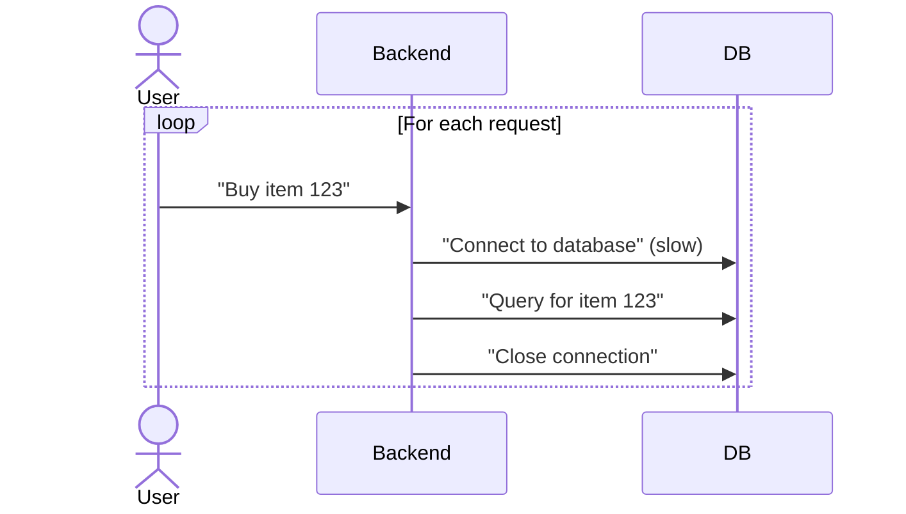

```markdown
---
title: "Resource Pooling: The Backend Pattern That Saves Money and Performance"
date: 2023-11-15
author: Alex Carter
description: "Learn how to implement resource pooling to optimize expensive resources in your backend systems—with practical code examples and real-world tradeoffs."
tags: ["database patterns", "backend design", "resource management", "software architecture"]
---

# **Resource Pooling: The Backend Pattern That Saves Money and Performance**

When you build scalable backend systems, you inevitably encounter resources that are expensive to initialize—whether it’s database connections, thread pools in a web server, or even GPU instances for ML inference. Every time a new request arrives, spinning up a new instance of these resources can be slow, inefficient, and costly.

**What if you could reuse them instead?**

That’s where **Resource Pooling** comes in. This pattern optimizes performance and cost by maintaining a pool of reusable resources, ready to be borrowed and returned as needed. While it’s a classic approach, it’s also nuanced—implementing it poorly can lead to bottlenecks, memory leaks, or unexpected failures.

In this comprehensive guide, we’ll explore:
- When resource pooling is necessary (and when it’s not)
- How to design a practical pool (with code examples)
- Common pitfalls and how to avoid them
- Tradeoffs like memory vs. performance

Let’s dive in.

---

## **The Problem: Why Resource Pooling Matters**

Imagine a high-traffic e-commerce backend where every user request needs a fresh database connection. With thousands of requests per second, spinning up a new connection on demand would look like this:



The problem:
1. **Latency**: Database connection handshakes add milliseconds of overhead, compounding with scale.
2. **Cost**: Every connection consumes memory and CPU. In cloud environments, this means higher bills.
3. **Resource exhaustion**: If the system scales too fast, it can exhaust connection limits, crashing under load.

Resource pooling solves this by **pre-warming** a pool of resources and **reusing** them instead of creating new ones each time.

---

## **The Solution: How Resource Pooling Works**

At its core, resource pooling follows this lifecycle:

1. **Pre-initialize** a fixed or dynamic number of resources.
2. **Borrow** a resource when needed (blocking or non-blocking).
3. **Use** the resource temporarily.
4. **Return** it to the pool for reuse.

This pattern is widely used for:
- Database connections (e.g., HikariCP, PostgreSQL’s `pgbouncer`)
- Thread pools (Java’s `ExecutorService`, Python’s `ThreadPoolExecutor`)
- GPU/ML inference workers
- In-memory caches (Redis, Memcached)

---

## **Components of a Resource Pool**

A robust pool has these components:

1. **Pool Container**: Stores the resources (e.g., a list, queue, or connection pool).
2. **Borrower**: Retrieves a resource (with possible blocking/waiting).
3. **Validator**: Checks if a resource is still usable before reuse.
4. **Eviction Policy**: Removes stale or idle resources (e.g., lazy cleanup).
5. **Metrics**: Tracks usage to optimize pool size.

---

## **Implementation Guide: A Database Connection Pool**

Let’s build a simple connection pool in Python using `psycopg2` (PostgreSQL). We’ll use a thread-safe queue as the pool container.

### **Step 1: Install Dependencies**
```bash
pip install psycopg2-binary
```

### **Step 2: Implement the Pool**
```python
import psycopg2
import queue
import threading
from typing import Optional

class DatabaseConnectionPool:
    def __init__(self, min_connections: int, max_connections: int, **connection_params):
        self._min_connections = min_connections
        self._max_connections = max_connections
        self._connection_params = connection_params
        self._pool = queue.Queue(maxsize=max_connections)
        self._lock = threading.Lock()

        # Pre-populate the pool with min_connections
        self._initialize_pool()

    def _initialize_pool(self):
        for _ in range(self._min_connections):
            self._pool.put(self._create_connection())

    def _create_connection(self):
        return psycopg2.connect(**self._connection_params)

    def get_connection(self, timeout: float = 5.0) -> Optional[psycopg2.extensions.connection]:
        """Borrow a connection from the pool (blocks if pool is empty)."""
        try:
            return self._pool.get(timeout=timeout)
        except queue.Empty:
            with self._lock:
                # Try to expand the pool if under max_connections
                if self._pool.qsize() < self._max_connections:
                    self._pool.put(self._create_connection())
                    return self._pool.get()
            return None  # Pool exhausted

    def return_connection(self, connection: psycopg2.extensions.connection):
        """Return a connection to the pool (lazily validate)."""
        if connection:
            try:
                # Basic validation: check if connection is alive
                if connection.closed == 0:
                    self._pool.put(connection)
                else:
                    self._create_connection()  # Replace stale connection
            except:
                # If validation fails, discard and create a new one
                pass

    def close_all(self):
        """Close all connections in the pool."""
        with self._lock:
            while not self._pool.empty():
                conn = self._pool.get()
                if conn and not conn.closed:
                    conn.close()
```

### **Step 3: Example Usage**
```python
pool = DatabaseConnectionPool(
    min_connections=5,
    max_connections=20,
    host="localhost",
    database="myapp",
    user="admin",
    password="secret"
)

# Simulate 10 concurrent requests
def fetch_data(conn_id):
    conn = pool.get_connection()
    try:
        with conn.cursor() as cursor:
            cursor.execute("SELECT * FROM products")
            print(f"Connection {conn_id} fetched data")
    finally:
        pool.return_connection(conn)

threads = []
for i in range(10):
    t = threading.Thread(target=fetch_data, args=(i,))
    threads.append(t)
    t.start()

for t in threads:
    t.join()

pool.close_all()  # Cleanup
```

---

## **Advanced Considerations**

### **1. Dynamic Pool Sizing**
For variable workloads, use **adaptive pooling**:
- Monitor queue lengths to expand/shrink the pool.
- Example: Use a `ThreadPoolExecutor` with `max_workers` set to `min_workers + (some_metric * scaling_factor)`.

### **2. Connection Validation**
Always validate connections before reuse. For databases, this might mean:
```python
def validate_connection(conn: psycopg2.extensions.connection) -> bool:
    try:
        with conn.cursor() as cursor:
            cursor.execute("SELECT 1")
            return True
    except:
        return False
```

### **3. Timeout Handling**
Avoid indefinite blocking. In our example, `get_connection(timeout=5.0)` fails after 5 seconds if the pool is empty.

### **4. Thread Safety**
Use fine-grained locks (e.g., `threading.Lock`) instead of global locks to prevent contention.

---

## **Common Mistakes to Avoid**

1. **Over-Provisioning**
   - Too many idle connections waste memory. Monitor usage and adjust `min_connections`/`max_connections`.

2. **Ignoring Connection Leaks**
   - Ensure every `get_connection()` has a matching `return_connection()`. Use context managers:
     ```python
     with pool.get_connection() as conn:
         # Do work
     # conn is automatically returned
     ```

3. **No Validation**
   - Never assume a returned connection is still valid. Always validate (e.g., check for timeouts or errors).

4. **Blocking the Main Thread**
   - Infinite waits in `get_connection()` can freeze your app. Always set timeouts.

5. **Poor Eviction Policy**
   - Idle connections can accumulate. Implement lazy cleanup (e.g., close connections older than X seconds).

---

## **Key Takeaways**

✅ **Use pooling for expensive, reusable resources** (e.g., DB connections, threads, GPUs).
✅ **Pre-initialize the pool** to avoid cold starts (but not too many idle resources).
✅ **Always validate resources** before reuse to prevent failures.
✅ **Set timeouts** to avoid blocking indefinitely.
✅ **Monitor and adjust pool size** dynamically if workload varies.
❌ **Avoid over-provisioning**—balance memory usage with performance.
❌ **Don’t ignore leaks**—ensure resources are always returned.
❌ **Assume nothing**—validate every returned connection.

---

## **Conclusion**

Resource pooling is a powerful pattern for optimizing expensive backend resources, but it requires careful design to avoid pitfalls. By pre-warming a pool and reusing connections/threads, you can significantly reduce latency and costs—especially in high-throughput systems.

In this guide, we built a simple connection pool in Python, but the principles apply to any language or resource type. For production, consider leveraging battle-tested libraries like:
- **Java**: HikariCP
- **Python**: SQLAlchemy + `pool_recycle`
- **Go**: `database/sql` with connection pooling
- **Cloud**: AWS RDS Proxy, Azure Database Connection Pooling

**Next steps**:
- Experiment with dynamic scaling (e.g., auto-scaling based on queue length).
- Benchmark your pool under load to fine-tune parameters.
- Extend this to other resources (e.g., HTTP clients, GPU sessions).

Happy pooling!
```

---
**About the Author**
Alex Carter is a senior backend engineer specializing in distributed systems and database architecture. He enjoys writing about patterns that balance simplicity with scalability. Follow him on [Twitter](https://twitter.com/alex_carter_dev) for more rants about thread pools.