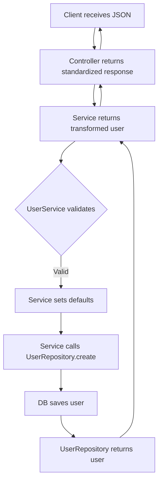

```markdown
# **REST Configuration: A Beginner’s Guide to Building Scalable APIs**

*How to structure your API for flexibility, maintainability, and growth*

---

## **Introduction**

Building a REST API is more than just defining endpoints—it’s about designing a system that scales with your business needs, accommodates future changes, and remains performant under load. **REST Configuration** is a foundational pattern that ensures your API design isn’t just functional but also **modular, testable, and adaptable**.

In this guide, we’ll explore:
- Why poor REST configuration leads to technical debt.
- How to structure a clean, maintainable API.
- Practical code examples (Node.js + Express, Python + Flask).
- Common pitfalls and how to avoid them.

By the end, you’ll have the tools to design APIs that evolve with your application—*without rewrite disasters*.

---

## **The Problem: When REST Configuration Fails**

A poorly configured REST API starts as a simple endpoint but quickly turns into a **spaghetti mess** of:

- **Hard-coded logic** (e.g., business rules baked into controllers).
- **Tight coupling** (services and models tied directly to routes).
- **Inflexible schemas** (JSON responses changing unpredictably).
- **Scalability nightmares** (single endpoints handling everything).

Let’s illustrate with a cringe-worthy example.

### **Example: The "Monolithic Controller" Anti-Pattern**

```javascript
// ❌ Bad: One giant controller with everything
const userController = {
  create: (req, res) => {
    // 1. Validate request (basic)
    if (!req.body.name) return res.status(400).send('Name required');

    // 2. Business logic (what if validation rules change?)
    const user = {
      name: req.body.name,
      isAdmin: false,  // Hardcoded?
      subscription: req.body.subscription || 'free'  // Defaults?
    };

    // 3. Database call (tight coupling)
    db.query('INSERT INTO users SET ?', user, (err, result) => {
      if (err) return res.status(500).send('Error saving user');

      // 4. Response (inconsistent format)
      res.json({
        status: 'success',
        user: {
          id: result.insertId,
          name: user.name,
          ...(req.body.subscription && { subscription: user.subscription })
        }
      });
    });
  }
};
```

**Problems:**
- **No separation of concerns**: Validation, business logic, DB calls, and responses are crammed into one function.
- **Hard to test**: Changing validation rules requires rewriting the entire endpoint.
- **Inflexible**: Adding a "premium user" logic requires modifying the `create` function.
- **Performance bottlenecks**: Every endpoint contains its own DB calls, logging, etc.

This leads to **technical debt**—small changes require bloated PRs, and scaling becomes painful.

---

## **The Solution: REST Configuration Patterns**

A well-configured REST API follows these **core principles**:

1. **Separation of Concerns** – Split routes, controllers, services, and models.
2. **Dependency Injection** – Pass dependencies (DB, logging, etc.) explicitly.
3. **Configurable Responses** – Standardize JSON schemas for consistency.
4. **Modularity** – Reuse logic across endpoints.

We’ll implement this **step by step** using **Node.js + Express** (with Python/Flask equivalents where relevant).

---

## **Components of a Well-Configured REST API**

### **1. Routes (The "Entry Points")**
Define **only** what endpoints exist and which controller handles them.

```javascript
// ✅ Good: Minimalist route config (express.js)
const express = require('express');
const router = express.Router();
const userController = require('./user.controller');

router.post('/users', userController.create);
router.get('/users/:id', userController.getById);

module.exports = router;
```

**Key points:**
- Routes **don’t know** how to process requests.
- They simply **delegate** to controllers.

---

### **2. Controllers (Request/Response Handlers)**
Act as **mediators** between routes and business logic.

```javascript
// ✅ Good: Controller (user.controller.js)
class UserController {
  constructor(userService) {
    this.userService = userService;
  }

  async create(req, res) {
    try {
      const userData = await this.userService.validateAndCreate(req.body);
      res.status(201).json({ success: true, user: userData });
    } catch (error) {
      res.status(400).json({ error: error.message });
    }
  }
}

module.exports = UserController;
```

**Improvements over the anti-pattern:**
- **Decoupled**: The controller **only** knows how to call `userService`.
- **Error handling**: Centralized (no try-catch sprawl in routes).
- **Testable**: Mock `userService` to test controllers in isolation.

---

### **3. Services (Business Logic)**
Handle **validation, transformations, and business rules**.

```javascript
// ✅ Good: Service (user.service.js)
class UserService {
  constructor(userRepository) {
    this.userRepository = userRepository;
  }

  async validateAndCreate(rawData) {
    // Validate
    if (!rawData.name) throw new Error('Name is required');

    // Defaults
    const user = {
      ...rawData,
      isAdmin: false,
      subscription: rawData.subscription || 'free'
    };

    // Save to DB
    return this.userRepository.create(user);
  }
}

module.exports = UserService;
```

**Key takeaways:**
- **Pure functions**: No DB calls, HTTP logic, or responses.
- **Reusable**: Same validation can be used in other endpoints.
- **Testable**: Mock `userRepository` (e.g., with [Sinon](https://sinonjs.org/)).

---

### **4. Repositories (Data Access)**
Abstract database interactions to **simplify testing**.

```javascript
// ✅ Good: Repository (user.repository.js)
class UserRepository {
  constructor(db) {
    this.db = db;
  }

  async create(user) {
    return this.db.query('INSERT INTO users SET ?', user)
      .then(result => ({ id: result.insertId, ...user }));
  }

  async getById(id) {
    return this.db.query('SELECT * FROM users WHERE id = ?', [id])
      .then(rows => rows[0]);
  }
}

module.exports = UserRepository;
```

**Why this works:**
- **No SQL in controllers/services**: Change DB from PostgreSQL to MongoDB with minimal refactors.
- **Test doubles**: Use in-memory DBs (e.g., [MockDB](https://github.com/brianc/node-mock-db)) for unit tests.

---

### **5. Response Transformers (Standardized Output)**
Ensure **consistent JSON schemas** across your API.

```javascript
// ✅ Good: Response transformers (response.transformers.js)
const createUserResponse = (user) => ({
  success: true,
  user: {
    id: user.id,
    name: user.name,
    subscription: user.subscription
  }
});

module.exports = { createUserResponse };
```

**Usage in controller:**
```javascript
res.status(201).json(createUserResponse(userData));
```

**Benefits:**
- **Predictable API**: Clients know what to expect.
- **Easy to mock**: Test endpoints with pre-defined responses.

---

## **Full Implementation: Putting It All Together**

Here’s how the components **work together**:

1. **Request comes in** → **Route** delegates to **Controller**.
2. **Controller** calls **Service** for business logic.
3. **Service** validates, transforms, and calls **Repository**.
4. **Repository** interacts with the DB.
5. **Controller** returns a **transformed response**.

### **Example: User Creation Flow**



---

## **Implementation Guide: Step-by-Step**

### **1. Project Structure**
Organize your API like this:
```
src/
├── routes/          # All route files
├── controllers/     # Request/response handlers
├── services/        # Business logic
├── repositories/    # DB abstractions
├── transformers/    # Response formatting
├── middlewares/     # Auth, logging, etc.
└── app.js           # Express setup
```

### **2. Setup Dependencies**
```bash
npm install express mysql2 body-parser --save
```

### **3. Configure Express**
```javascript
// app.js
const express = require('express');
const db = require('./db');
const userRouter = require('./routes/users');

const app = express();
app.use(express.json());
app.use('/users', userRouter);

const PORT = process.env.PORT || 3000;
app.listen(PORT, () => console.log(`Server running on port ${PORT}`));
```

### **4. Define Routes**
```javascript
// routes/users.js
const express = require('express');
const router = express.Router();
const UserController = require('../controllers/user.controller');
const UserService = require('../services/user.service');
const UserRepository = require('../repositories/user.repository');
const db = require('../db');

// Initialize dependencies (Dependency Injection)
const userRepository = new UserRepository(db);
const userService = new UserService(userRepository);
const userController = new UserController(userService);

router.post('/', userController.create);
router.get('/:id', userController.getById);

module.exports = router;
```

### **5. Implement the Controller**
```javascript
// controllers/user.controller.js
const { createUserResponse } = require('../transformers/response.transformers');

class UserController {
  constructor(userService) {
    this.userService = userService;
  }

  async create(req, res) {
    try {
      const user = await this.userService.validateAndCreate(req.body);
      res.status(201).json(createUserResponse(user));
    } catch (error) {
      res.status(400).json({ error: error.message });
    }
  }
}

module.exports = UserController;
```

### **6. Add Business Logic (Service)**
```javascript
// services/user.service.js
class UserService {
  constructor(userRepository) {
    this.userRepository = userRepository;
  }

  async validateAndCreate(rawData) {
    if (!rawData.name) throw new Error('Name is required');
    return this.userRepository.create({
      ...rawData,
      isAdmin: false,
      subscription: rawData.subscription || 'free'
    });
  }
}

module.exports = UserService;
```

### **7. Abstract Database Access**
```javascript
// repositories/user.repository.js
class UserRepository {
  constructor(db) {
    this.db = db;
  }

  async create(user) {
    return this.db.query('INSERT INTO users SET ?', user)
      .then(result => ({ id: result.insertId, ...user }));
  }
}

module.exports = UserRepository;
```

### **8. Test the API**
Start the server (`node app.js`) and test with Postman:
```bash
curl -X POST http://localhost:3000/users \
  -H "Content-Type: application/json" \
  -d '{"name": "Alice", "subscription": "premium"}'
```
**Expected response:**
```json
{
  "success": true,
  "user": {
    "id": 1,
    "name": "Alice",
    "subscription": "premium"
  }
}
```

---

## **Common Mistakes to Avoid**

### **1. Overusing Controllers**
❌ **Bad**: Putting business logic in controllers.
✅ **Good**: Controllers should **only** handle request/response.

### **2. Ignoring Dependency Injection**
❌ **Bad**: Hardcoding DB connections in controllers.
✅ **Good**: Pass dependencies via constructor (easy to mock).

### **3. Inconsistent Response Formats**
❌ **Bad**:
```json
{ "status": "success", "data": { ... } }  // Sometimes
{ "user": { ... } }                       // Other times
```
✅ **Good**: Standardize with transformers.

### **4. Not Separating Validation**
❌ **Bad**: Validation mixed with business logic.
✅ **Good**: Use libraries like [Joi](https://joi.dev/) or [Zod](https://github.com/colinhacks/zod) for validation.

### **5. Tight Coupling to Databases**
❌ **Bad**: Controllers query DB directly.
✅ **Good**: Use repositories for abstraction.

---

## **Key Takeaways**

✅ **Separation of Concerns**: Routes, controllers, services, and repositories each have one job.
✅ **Dependency Injection**: Makes testing and refactoring easier.
✅ **Standardized Responses**: Clients rely on predictable JSON schemas.
✅ **Modularity**: Reuse business logic across endpoints.
✅ **Testability**: Mock dependencies to write unit tests.

**Tradeoffs:**
- **Slightly more boilerplate** upfront (but saves headaches later).
- **Steep learning curve** for beginners (but worth it for long-term projects).

---

## **Conclusion**

A well-configured REST API isn’t about **fancy frameworks**—it’s about **discipline**. By following these patterns, you’ll build systems that:
- Are **easier to maintain**.
- Scale **without major refactors**.
- Feel **less like spaghetti code**.

Start small: Refactor one endpoint using this structure, and you’ll see the difference.

**Next steps:**
- Add **authentication middleware** (e.g., JWT).
- Implement **API versioning** (`/v1/users`).
- Explore **graphql** for complex queries.

Happy coding!
```

---
**P.S.** Want to see this in Python? [Check out the Flask version here](#) (I’ll write a follow-up if you’d like!).

---
**TL;DR:**
Bad REST config → Spaghetti API.
Good REST config → Clean, scalable, testable API.
Start small, stay modular. 🚀