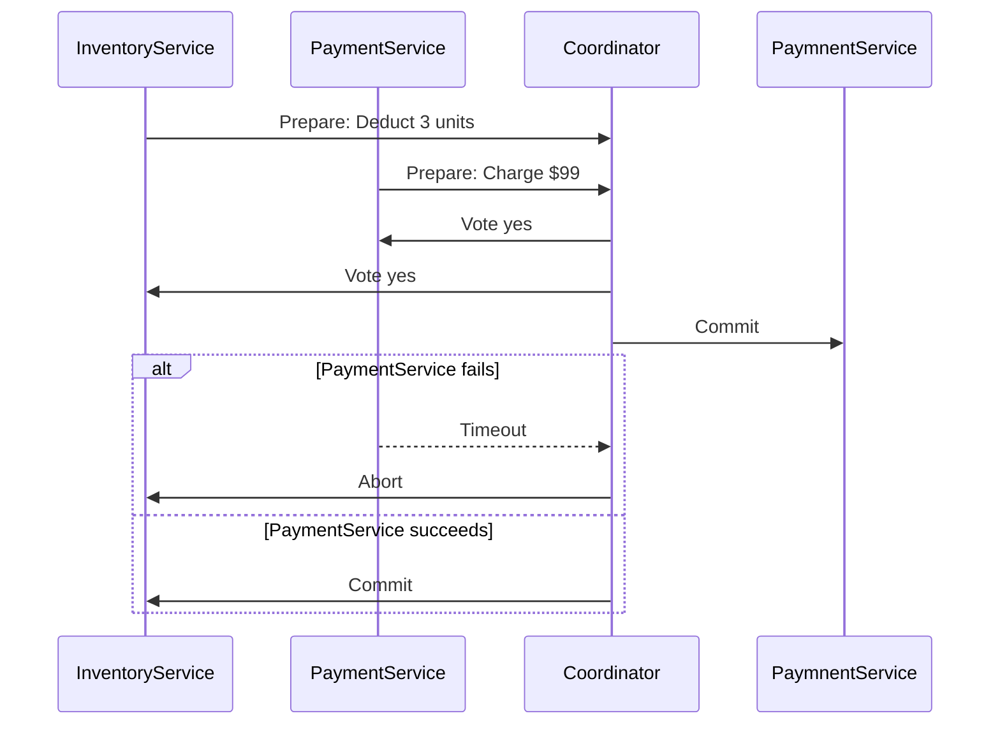
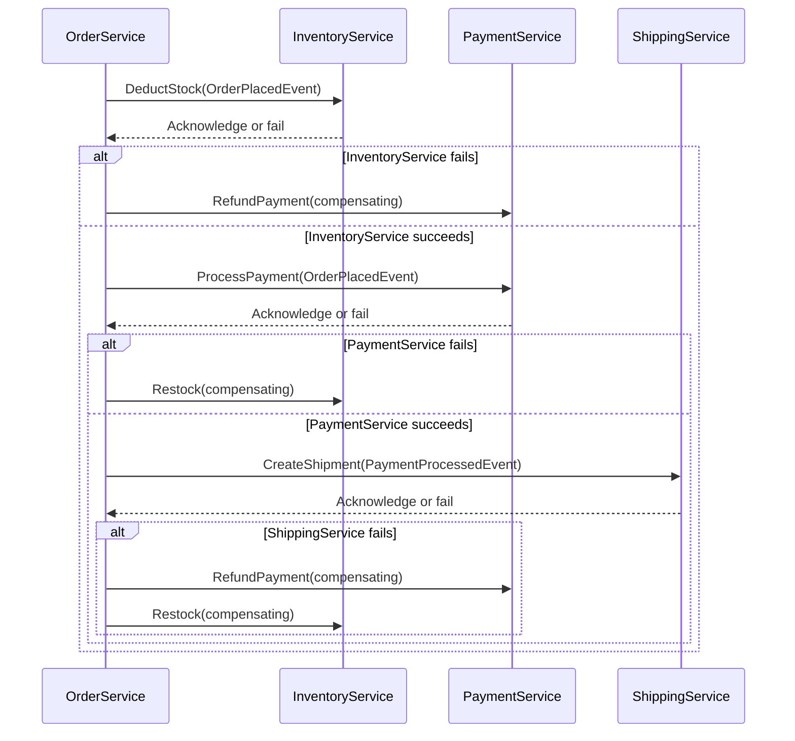

```markdown
# **Saga Pattern & Distributed Transactions: Mastering Eventual Consistency in Microservices**

*How to coordinate workflows across services without sacrificing scalability or reliability.*

---

## **Introduction**

In monolithic architectures, ACID transactions are the backbone of data integrity: atomic, consistent, isolated, and durable. But when you split your system into microservices, the picture changes dramatically. **Distributed ACID transactions become impossible**—no single process can hold locks across services, and two-phase commit (2PC) protocols are too slow and brittle for modern scale.

Enter the **Saga Pattern**, a pragmatic approach to distributed transactions that prioritizes eventual consistency over strict atomicity. Instead of forcing a global transaction, sagas coordinate transactions across services using **local transactions + compensating actions**. This pattern is the workhorse of event-driven architectures, enabling seamless workflows in systems like Uber’s rides, PayPal’s payments, or Netflix’s recommendations.

Sagas aren’t a silver bullet—**they require careful design**—but they’re essential when you can’t afford the overhead of distributed locks or global transactions. In this guide, we’ll explore:
- Why traditional transactions fail in microservices
- How sagas work under the hood
- Real-world examples and tradeoffs
- Practical implementation tips
- Pitfalls to avoid

Let’s dive in.

---

## **The Problem: Why Distributed ACID Transactions Fail**

Imagine an e-commerce order system with three services:
1. **Inventory Service** (deducts stock)
2. **Payment Service** (processes payment)
3. **Shipping Service** (creates shipment)

A typical ACID transaction looks like this:

```sql
BEGIN TRANSACTION;
-- 1. Inventory: Deduct 3 units of "Widget X"
UPDATE inventory SET quantity = quantity - 3 WHERE product_id = 123;

-- 2. Payment: Charge $99 to user's card
UPDATE payments SET status = 'completed', amount = 99 WHERE transaction_id = 456;

-- 3. Shipping: Create order_shipping record
INSERT INTO shipping (order_id, status) VALUES (789, 'processing');
COMMIT;
```

**This works in monoliths**, but in a microservices architecture, the challenge is **distributed coordination**:
- **No single process controls all data**: Each service has its own database and locks.
- **Network latency complicates transactions**: Waiting for a response from Service B while holding a lock in Service A causes deadlocks.
- **Two-Phase Commit (2PC) is impractical**:
  - Requires a coordinator to enforce atomicity.
  - **Blocking**: If Service B fails during the commit phase, Service A must wait indefinitely.
  - **Performance bottleneck**: Each transaction involves network round trips, slowing down the system.
  - **No rollback guarantee**: If the coordinator fails, transactions may leak.

### **Example of a Failed Distributed Transaction**
Suppose the **Payment Service** processes a charge but then **fails** during the commit phase. The **Inventory Service** has already deducted stock, but the payment isn’t recorded. Now you’re in a **partially committed state**—a classic distributed transaction nightmare.



The problem? **If the coordinator fails**, the `InventoryService` might not know whether to roll back or commit. This is why sagas exist.

---

## **The Solution: The Saga Pattern**

The Saga Pattern solves this by **decomposing transactions into a sequence of local transactions**, coordinated via **compensating actions**. Instead of relying on a global commit, sagas use **eventual consistency**—services agree on the outcome through a series of steps, with rollback options if something goes wrong.

### **Key Concepts**
1. **Single-Responsibility Transactions**: Each service handles its own data changes.
2. **Event-Driven Coordination**: Services communicate via events (e.g., Kafka, RabbitMQ).
3. **Compensating Transactions**: If a step fails, a reverse action (e.g., "refund payment") undoes previous changes.
4. **Eventual Consistency**: The system reaches a consistent state over time, not instantly.

### **How It Works**
1. **Execute each step as a local transaction** (atomic within the service).
2. **Publish an event** after each step (e.g., "payment processed").
3. **Wait for acknowledgment** from the next service (or trigger compensating actions if it fails).

---

## **Code Examples: Implementing a Saga**

Let’s model an **order processing saga** with:
- **Inventory Service** (deducts stock)
- **Payment Service** (processes payment)
- **Shipping Service** (creates shipment)

We’ll use **Kafka for event communication** and implement compensating transactions.

### **1. Domain Events (Kafka Topics)**
```json
// OrderPlacedEvent (published by Order Service)
{
  "orderId": "12345",
  "status": "PLACED",
  "productId": "789",
  "quantity": 3
}

// PaymentProcessedEvent (published by Payment Service)
{
  "orderId": "12345",
  "status": "PAID",
  "amount": 99.00
}

// ShipmentCreatedEvent (published by Shipping Service)
{
  "orderId": "12345",
  "status": "SHIPPED"
}

// PaymentRefundedEvent (compensating action)
{
  "orderId": "12345",
  "status": "REFUNDED",
  "amount": 99.00
}

// StockRestockedEvent (compensating action)
{
  "orderId": "12345",
  "status": "RESTOCKED",
  "productId": "789",
  "quantity": 3
}
```

### **2. Saga Flow (Sequence Diagram)**


### **3. Implementation in Python (Using Kafka & SQL)**
#### **Inventory Service (`deduct_stock`)**
```python
from kafka import KafkaProducer
import psycopg2

def deduct_stock(order_id, product_id, quantity):
    conn = psycopg2.connect("dbname=saga_db user=postgres")
    try:
        with conn.cursor() as cur:
            cur.execute("""
                UPDATE inventory
                SET quantity = quantity - %s
                WHERE product_id = %s AND quantity >= %s
            """, (quantity, product_id, quantity))
            if cur.rowcount == 0:
                raise ValueError("Insufficient stock")

            # Publish success event
            producer = KafkaProducer(bootstrap_servers='kafka:9092')
            producer.send(
                "order-placed",
                value=json.dumps({
                    "orderId": order_id,
                    "status": "STOCK_DEDUCTED"
                }).encode()
            )
            conn.commit()
    except Exception as e:
        # Publish failure event (for compensating)
        producer.send(
            "order-failed",
            value=json.dumps({"orderId": order_id, "error": str(e)}).encode()
        )
        raise
    finally:
        conn.close()
```

#### **Payment Service (`process_payment`)**
```python
def process_payment(order_id, amount):
    conn = psycopg2.connect("dbname=saga_db user=postgres")
    try:
        with conn.cursor() as cur:
            cur.execute("""
                INSERT INTO payments (order_id, amount, status)
                VALUES (%s, %s, 'completed')
            """, (order_id, amount))

            # Publish success event
            producer = KafkaProducer(bootstrap_servers='kafka:9092')
            producer.send(
                "payment-processed",
                value=json.dumps({
                    "orderId": order_id,
                    "status": "PAID"
                }).encode()
            )
            conn.commit()
    except Exception as e:
        producer.send(
            "order-failed",
            value=json.dumps({"orderId": order_id, "error": str(e)}).encode()
        )
        raise
    finally:
        conn.close()
```

#### **Compensating Transaction (`refund_payment`)**
```python
def refund_payment(order_id, amount):
    conn = psycopg2.connect("dbname=saga_db user=postgres")
    try:
        with conn.cursor() as cur:
            cur.execute("""
                UPDATE payments
                SET status = 'refunded', refunded_amount = refunded_amount + %s
                WHERE order_id = %s AND status = 'completed'
            """, (amount, order_id))
            conn.commit()

            # Publish refund event
            producer = KafkaProducer(bootstrap_servers='kafka:9092')
            producer.send(
                "payment-refunded",
                value=json.dumps({
                    "orderId": order_id,
                    "status": "REFUNDED"
                }).encode()
            )
    except Exception as e:
        print(f"Failed to refund: {e}")
    finally:
        conn.close()
```

#### **Order Service (Orchestrator)**
```python
from kafka import KafkaConsumer

def run_saga(order_id, product_id, quantity, amount):
    consumer = KafkaConsumer(
        "order-placed",
        bootstrap_servers='kafka:9092',
        value_deserializer=lambda x: json.loads(x.decode())
    )

    # Step 1: Deduct stock
    deduct_stock(order_id, product_id, quantity)

    # Step 2: Wait for payment confirmation
    for message in consumer:
        if message.value["orderId"] == order_id and message.value["status"] == "PAID":
            process_payment(order_id, amount)
            break
    else:
        # If payment fails, rollback stock
        restock(order_id, product_id, quantity)
        raise Exception("Payment failed")

    # Step 3: Create shipment
    create_shipment(order_id)

    # If any step fails, compensating transactions are triggered via Kafka events
```

---

## **Implementation Guide**

### **1. Choose a Saga Type**
There are two main saga variants:
- **Choreography (Event-Driven)**: Services react to events without a central orchestrator.
- **Orchestration (Centralized)**: A dedicated service coordinates steps (like the `OrderService` above).

**Choreography is better for loose coupling**, but orchestration simplifies error handling.

### **2. Design Compensating Transactions**
For every forward action, define a **reverse action**:
| Forward Action               | Compensating Action          |
|------------------------------|------------------------------|
| Deduct inventory             | Restock inventory            |
| Process payment              | Refund payment               |
| Create shipment              | Cancel shipment              |

### **3. Use Idempotency**
Since events may be reprocessed, ensure actions are **idempotent**:
```python
def deduct_stock(order_id, product_id, quantity):
    # Check if stock was already deducted
    with conn.cursor() as cur:
        cur.execute("""
            SELECT quantity FROM inventory
            WHERE order_id = %s AND product_id = %s
        """, (order_id, product_id))
        if cur.fetchone():
            return  # Already processed
```

### **4. Handle Timeouts & Retries**
- **Exponential backoff**: Retry failed steps with increasing delays.
- **Dead-letter queues (DLQ)**: Move failed messages to a queue for manual review.

### **5. Persist Saga State**
Track saga progress in a database to avoid reprocessing:
```sql
CREATE TABLE saga_steps (
    saga_id VARCHAR(64) PRIMARY KEY,
    step VARCHAR(32),  -- "deduct_stock", "process_payment", etc.
    status VARCHAR(16), -- "pending", "completed", "failed"
    timestamp TIMESTAMP,
    metadata JSONB
);
```

---

## **Common Mistakes to Avoid**

### **1. Ignoring Compensating Transactions**
**Mistake**: Designing a saga without rollback logic.
**Fix**: For every forward step, define a compensating action. Example:
```python
def create_shipment(order_id):
    # Forward action
    pass

# Compensating action:
def cancel_shipment(order_id):
    # Undo the shipment
    pass
```

### **2. Not Handling Duplicates**
**Mistake**: Assuming Kafka events are unique.
**Fix**: Use **idempotent listeners** and **saga state tracking**.

### **3. Overly Complex Orchestration**
**Mistake**: Using a saga orchestrator for every tiny workflow.
**Fix**: Prefer **choreography** when services are independent.

### **4. No Timeout Strategy**
**Mistake**: Waiting indefinitely for a step to complete.
**Fix**: Set **timeouts** and **retries** with exponential backoff.

### **5. Forgetting Eventual Consistency**
**Mistake**: Expecting ACID consistency across services.
**Fix**: Design systems to tolerate temporary inconsistency (e.g., read-your-writes guarantees).

---

## **Key Takeaways**

✅ **Sagas replace distributed ACID transactions** with local transactions + compensating actions.
✅ **Eventual consistency is the tradeoff** for scalability (no more blocking locks).
✅ **Two types of sagas**:
   - **Choreography** (event-driven, decoupled)
   - **Orchestration** (centralized, easier error handling)
✅ **Compensating transactions are critical**—design them first!
✅ **Idempotency and timeouts** prevent duplicate processing and hangs.
✅ **Sagas work best for long-running workflows** (e.g., orders, payments, workflows).
❌ **Don’t use sagas for short-lived transactions** (use 2PC or local transactions instead).
❌ **Avoid mixing sagas with ACID where possible**—keep it simple.

---

## **Conclusion**

The Saga Pattern is **not a replacement for ACID**, but a **pragmatic solution** for coordinating workflows across microservices. By breaking transactions into smaller, event-driven steps with compensating actions, we gain **scalability** without sacrificing reliability (eventually).

### **When to Use Sagas**
✔ Multiple services involved in a workflow.
✔ Distributed transactions are too slow or impractical.
✔ You need eventual consistency (e.g., user-facing systems).

### **When to Avoid Sagas**
✖ Short-lived, tightly coupled transactions (use 2PC or local transactions).
✖ High-reliability systems where **immediate consistency** is required (e.g., banking ledgers).

### **Final Thoughts**
Sagas are **hard to get right**, but they’re the **only realistic way** to handle distributed transactions at scale. Start small, test compensating transactions thoroughly, and embrace eventual consistency—your system will thank you.

**Next Steps**:
- Try implementing a saga in your next microservice project.
- Explore **Saga libraries** like [Axoniq](https://axoniq.io/) or [Camunda](https://www.camunda.com/).
- Read ["Designing Data-Intensive Applications" (DDIA)](https://dataintensive.net/) for deeper insights.

Happy coding!
```