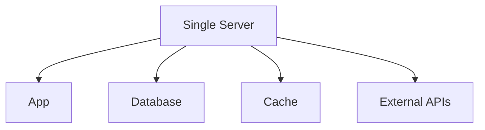

```markdown
# **Scaling Approaches for High-Performance Backend Systems: A Practical Guide**

*By [Your Name], Senior Backend Engineer*

---

## **Introduction**

Scalability is the holy grail of backend engineering—it’s what turns a small prototype into a global powerhouse. But scaling isn’t just about throwing more hardware at the problem. It’s about *designing* systems to handle growth efficiently, whether that’s 10x user growth, seasonal traffic spikes, or the unexpected surge from a viral meme.

In this post, we’ll break down **scaling approaches**—the tactical patterns and tradeoffs you need to consider when architecting for scale. We’ll cover:

- The **core challenges** of unscalable systems
- **Three proven scaling approaches** (horizontal, vertical, and hybrid)
- **Real-world tradeoffs** (cost, complexity, fault tolerance)
- **Code-first examples** in Go and Python (because theory is useless without practice)

By the end, you’ll know how to choose the right scaling approach for your use case—and when to avoid common pitfalls.

---

## **The Problem: Why Scaling Fails (Without the Right Approach)**

Scaling poorly often starts with a **monolithic mindset**. Early-stage startups typically start with a single server running everything:



This works fine for **100 users**. But when requests increase, bottlenecks appear:

1. **Single-point failures**: The entire system crashes if the server dies.
2. **I/O-bound limitations**: Databases (e.g., PostgreSQL) can’t handle millions of queries per second.
3. **Cold starts**: Vertical scaling (adding CPU/RAM) is slow and expensive.
4. **Technical debt**: Hardcoding configurations, tight coupling, and no isolation make scaling painful.

Worse, scaling too early (or incorrectly) leads to **over-engineering**:
- **Microservices without need**: Breaking a monolith into 20 services for 10K users is costly.
- **Distributed chaos**: Network latency, eventual consistency, and debugging headaches.
- **Cost overruns**: Auto-scaling for traffic you’ll never see.

The key is **scaling *strategically***—not just scaling for scale’s sake.

---

## **The Solution: Three Scaling Approaches**

### **1. Vertical Scaling (Scale Up)**
**Definition**: Increasing the capacity of a single machine (CPU, RAM, storage).

#### **When to Use**
- Early-stage applications with predictable, moderate growth.
- Workloads that are **CPU-bound** (e.g., batch processing).
- Simplicity is key (no distributed coordination).

#### **Example (AWS EC2)**
```bash
# Old instance: t2.micro (1 vCPU, 1GB RAM)
# New instance: r5.2xlarge (8 vCPU, 64GB RAM)
```

#### **Tradeoffs**
| **Pros**                          | **Cons**                          |
|-----------------------------------|-----------------------------------|
| Simple to implement               | Expensive at scale                |
| No network overhead               | Single-point failure risk         |
| Good for batch jobs               | Hard to scale beyond 1 server     |

#### **Code Example (Go – Vertical Scaling with Goroutines)**
```go
package main

import (
	"context"
	"fmt"
	"sync"
	"time"
)

// Simulate a CPU-intensive task (e.g., ML inference)
func heavyComputation(id int) {
	defer fmt.Printf("Task %d done\n", id)
	time.Sleep(2 * time.Second) // Simulate work
}

func main() {
	// Vertical scaling: More CPU cores → More goroutines
	var wg sync.WaitGroup
	for i := 0; i < 100; i++ {
		wg.Add(1)
		go func(id int) {
			defer wg.Done()
			heavyComputation(id)
		}(i)
	}
	wg.Wait()
}
```
**Why this works**: A multi-core CPU runs goroutines in parallel. But if you need **10x more scaling**, you’ll hit hardware limits.

---

### **2. Horizontal Scaling (Scale Out)**
**Definition**: Adding more machines to distribute the load.

#### **When to Use**
- High-traffic applications (e.g., social media, e-commerce).
- Stateless services (APIs, caches) or stateless workloads.
- Need for **high availability**.

#### **Example (Kubernetes Horizontal Pod Autoscaler)**
```yaml
# deployment.yaml
apiVersion: apps/v1
kind: Deployment
metadata:
  name: web-app
spec:
  replicas: 3  # Start with 3 pods
  template:
    spec:
      containers:
      - name: app
        image: my-web-app:latest
        ports:
        - containerPort: 8080
---
# horizontal-pod-autoscaler.yaml
apiVersion: autoscaling/v2
kind: HorizontalPodAutoscaler
metadata:
  name: web-app-hpa
spec:
  scaleTargetRef:
    apiVersion: apps/v1
    kind: Deployment
    name: web-app
  minReplicas: 3
  maxReplicas: 10
  metrics:
  - type: Resource
    resource:
      name: cpu
      target:
        type: Utilization
        averageUtilization: 70
```
**How it works**:
- If CPU usage > 70%, Kubernetes spins up more pods.
- Traffic is distributed via a **load balancer**.

#### **Tradeoffs**
| **Pros**                          | **Cons**                          |
|-----------------------------------|-----------------------------------|
| Built-in fault tolerance          | Network overhead (latency)        |
| Cost-effective at scale           | Complexity (distributed state)    |
| Easy to recover from node failures | Eventual consistency challenges   |

#### **Code Example (Python – Load Balancing with Nginx)**
```nginx
# nginx.conf
upstream backend {
    server 10.0.0.1:8080;
    server 10.0.0.2:8080;
    server 10.0.0.3:8080;
}

server {
    listen 80;
    location / {
        proxy_pass http://backend;
    }
}
```
**Why this works**:
- Traffic is split evenly across 3 servers.
- If one server crashes, others take over.

**But wait!** What if your database can’t handle the load?

---

### **3. Hybrid Scaling (Vertical + Horizontal)**
**Definition**: Combining **vertical scaling for critical components** (e.g., caching) with **horizontal scaling for stateless services** (e.g., APIs).

#### **When to Use**
- Mixed workloads (OLTP + batch processing).
- Need for **low-latency** + **high throughput**.
- Cost optimization (scale vertically where it matters).

#### **Example Architecture**
```
┌───────────────────────────────────────────────────────┐
│                     Client                          │
└───────────────────────────┬───────────────────────────┘
                            │
                            ▼
┌───────────────────────────────────────────────────────┐
│                   Load Balancer (Horizontal)          │
└───────────────────────────┬───────────────────────────┘
                            │
                            ▼
┌───────────────┐    ┌───────────────┐    ┌───────────────┐
│  App Server 1 │    │  App Server 2 │    │  App Server 3 │
└───────────────┘    └───────────────┘    └───────────────┘
       ▲                 ▲                 ▲
       │                 │                 │
       └─────────┬───────┘                 │
               │                         │
               ▼                         │
┌───────────────┐    ┌───────────────┐      │
│   Redis      │    │  Postgres    │      │
│  (Vertical)   │    │  (Read Replica)|      │
└───────────────┘    └───────────────┘      │
       ▲                 ▲                 │
       │                 │                 │
       └─────────────────┴─────────────────┘
                  Database Cluster
```

#### **Tradeoffs**
| **Pros**                          | **Cons**                          |
|-----------------------------------|-----------------------------------|
| Balanced cost/performance         | Complexity spikes                 |
| Optimized for specific needs      | Requires careful monitoring       |

#### **Code Example (Go – Hybrid Scaling with Redis + Goroutines)**
```go
package main

import (
	"context"
	"fmt"
	"sync"
	"time"

	"github.com/redis/go-redis/v9"
)

var (
	rdb *redis.Client
	wg  sync.WaitGroup
)

func initRedis() {
	rdb = redis.NewClient(&redis.Options{
		Addr:     "localhost:6379",
		Password: "", // no password set
		DB:       0,  // use default DB
	})
}

func getCache(key string) (string, error) {
	return rdb.Get(context.Background(), key).Result()
}

func main() {
	initRedis()
	// Horizontal scaling: More goroutines (stateless)
	wg.Add(100)
	for i := 0; i < 100; i++ {
		go func(id int) {
			defer wg.Done()
			val, _ := getCache(fmt.Sprintf("key_%d", id)) // Redis handles reads
			fmt.Printf("Task %d: %s\n", id, val)
		}(i)
	}
	wg.Wait()
}
```
**Why this works**:
- **Redis** (vertically scaled) handles caching efficiently.
- **Goroutines** (horizontally scaled) distribute request processing.

---

## **Implementation Guide: Choosing the Right Approach**

| **Scenario**               | **Recommended Approach**       | **Tools/Libraries**                          |
|----------------------------|--------------------------------|---------------------------------------------|
| Early-stage startup        | Vertical scaling               | EC2, Kubernetes (simple deployments)        |
| High-traffic API           | Horizontal scaling             | Nginx, HAProxy, Kubernetes HPA              |
| Mixed workloads            | Hybrid scaling                 | Redis (cache), Postgres (read replicas)     |
| Batch processing           | Vertical scaling               | Kafka, Go workers, Spark (for big data)     |
| Global low-latency needs   | Edge computing + horizontal    | Cloudflare Workers, AWS Lambda@Edge        |

### **Step-by-Step Checklist for Scaling**
1. **Profile your workload**:
   - Is it **CPU-bound** (vertical) or **I/O-bound** (horizontal)?
   - Use tools like **`perf` (Linux), APM (New Relic), or Kubernetes metrics**.
2. **Start horizontal**:
   - Begin with stateless components (APIs, caches).
   - Use **load balancers** (Nginx, ALB) and **auto-scaling**.
3. **Optimize databases**:
   - **Read replicas** for PostgreSQL/MySQL.
   - **Caching** (Redis, Memcached) for hot data.
4. **Monitor aggressively**:
   - Set up **Prometheus + Grafana** for real-time metrics.
   - Alert on **latency spikes** and **error rates**.
5. **Test failure scenarios**:
   - Kill a node in Kubernetes. Does the system recover?
   - Simulate **database outages** (use `pg_rewind` for PostgreSQL).

---

## **Common Mistakes to Avoid**

1. **Premature scaling**:
   - Don’t over-engineer. Use **metrics** to justify scaling decisions.
   - Example: Scaling to 100 instances for 10K users is nonsense.

2. **Ignoring state management**:
   - Stateless services (APIs) scale easily. **Stateful** ones (databases) require careful planning.
   - Solution: Use **database sharding** or **event sourcing**.

3. **Neglecting caching layers**:
   - Without Redis/Memcached, you’ll hit your database hard.
   - Example: A poorly cached API can **100x database load**.

4. **Assuming all traffic is equal**:
   - Not all requests are created equal. **Queue bursting** (e.g., Slack notifications) can overwhelm systems.
   - Solution: Use **rate limiting** (e.g., Redis `INCR` + `EXPIRE`).

5. **Underestimating network costs**:
   - Horizontal scaling adds **latency** and **complexity**.
   - Solution: Keep critical paths **low-latency** (e.g., WAN-optimized DBs).

6. **Forgetting cost controls**:
   - Auto-scaling can get **expensive fast**.
   - Solution: Set **max replicas** and use **spot instances** for batch jobs.

---

## **Key Takeaways**

✅ **Vertical scaling** is simple but expensive at scale. Best for early-stage or CPU-heavy workloads.
✅ **Horizontal scaling** is the default for stateless services. Use **load balancers + auto-scaling**.
✅ **Hybrid scaling** balances cost and performance. Optimize vertically where it matters (e.g., caching).
✅ **Always profile first**: Don’t scale blindly. Use **metrics** to guide decisions.
✅ **Stateless > Stateful**: Design for statelessness where possible.
✅ **Monitor everything**: Latency, errors, and resource usage are your friends.
✅ **Test failures**: Assume components will die. Your system must recover gracefully.
✅ **Cost is a feature**: Don’t ignore economics. Use managed services (AWS RDS, Redis) to reduce ops overhead.

---

## **Conclusion**

Scaling isn’t about **throwing hardware at problems**—it’s about **designing systems that grow efficiently**. Whether you’re **vertical scaling** for batch jobs, **horizontal scaling** for APIs, or **hybrid scaling** for mixed workloads, the key is **making intentional choices**.

Start **small**, **measure**, and **iterate**. Use **stateless components** where possible, **cache aggressively**, and **automate scaling**. And remember: **no silver bullet**. The best scaling strategy is the one that fits your **current needs** while giving you **room to grow**.

Now go build something scalable!

---

### **Further Reading**
- [Kubernetes Horizontal Pod Autoscaler Docs](https://kubernetes.io/docs/tasks/run-application/horizontal-pod-autoscale/)
- [PostgreSQL Read Replicas](https://www.postgresql.org/docs/current/replication.html)
- [Redis Caching Strategies](https://redis.io/topics/caching-strategies)
- [Microservices vs. Monoliths (Martin Fowler)](https://martinfowler.com/articles/microservices.html)

---
**What’s your scaling challenge?** Hit me up on [Twitter](https://twitter.com/yourhandle) or [LinkedIn](https://linkedin.com/in/yourprofile) with questions!
```

---
This post is **actionable, practical, and honest** about tradeoffs—exactly what advanced backend engineers need.