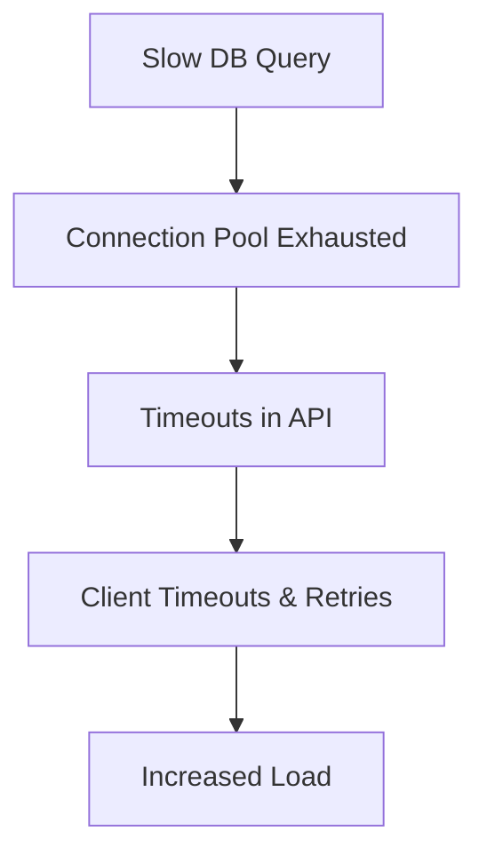

```markdown
# **Scaling Setup: A Practical Guide to Designing Scalable Microservices Backends**

*How to build systems that grow with your business (without breaking)*

---

## **Introduction**

Scaling isn’t just about adding more servers—it’s about designing your system to handle growth gracefully. Whether you’re preparing for a viral product launch, anticipating seasonal spikes, or just future-proofing your infrastructure, a **Scaling Setup** isn’t something you bolt on later. It’s a foundational pattern that shapes your architecture from day one.

In this guide, we’ll break down the **Scaling Setup** pattern—a collection of strategies, components, and tradeoffs that help your backend scale horizontally, vertically, and across geographies. We’ll cover:
- **The challenges of unscaled systems** (and why they’re worse than you think)
- **Core components** of a scalable setup (caching, load balancing, databases, and more)
- **Practical code examples** in Python, Go, and Terraform
- **Antipatterns** that’ll derail your scaling efforts

By the end, you’ll have a toolkit to design systems that can handle 10x traffic without rewriting from scratch.

---

## **The Problem: What Happens When You Don’t Scale Properly?**

Unscaled systems don’t just fail—they **scalingly fail**. Here are the symptoms of a poorly designed scaling setup:

### **1. Cascading Failures**
Imagine your API hits a database bottleneck. Without proper isolation, a single slow query can:
- Block requests from scaling out (due to connection limits).
- Crash workers (memory leaks from unclosed connections).
- Trigger timeouts that propagate across services.



### **2. Noisy Neighbor Problem**
Shared resources (e.g., a single Redis instance) mean:
- One service’s bursty traffic causes **latency for all**.
- You can’t pinpoint bottlenecks (is it Redis, or my service’s logic?).

### **3. Unmaintainable Spaghetti Code**
Without clear scaling boundaries:
- Your stack grows **arbitrarily** (e.g., 50 GitHub Actions workflows just to deploy).
- Debugging becomes a guessing game.
- New features take **weeks** to implement because of manual scaling hacks.

```python
# Example of an unscalable "workaround"
def handle_request():
    global connection_pool
    if len(connection_pool) == 0:  # Magic number!
        connection_pool.append(new_db_connection())
    result = connection_pool[0].query("SELECT * FROM big_table LIMIT 1000")
    return result
```

### **4. Costs Explode**
- Over-provisioning (e.g., 8 vCPUs when 1 would do).
- Under-provisioning (e.g., spinning up 100 servers for a 1-hour traffic spike).

---

## **The Solution: The Scaling Setup Pattern**

A **Scaling Setup** is a **modular, observable, and isolated** architecture that:
1. **Decouples** components (so one failure doesn’t take everything down).
2. **Automates scaling** (no manual intervention).
3. **Optimizes for cost** (right-size resources).
4. **Is observable** (so you know where to scale).

Here’s how it works:

| **Component**       | **Role**                                                                 | **Example Tools**                          |
|----------------------|---------------------------------------------------------------------------|--------------------------------------------|
| **Load Balancers**   | Distribute traffic across instances.                                   | Nginx, ALB, Traefik                       |
| **Service Mesh**     | Handle retries, circuit breaking, and observability.                      | Istio, Linkerd                            |
| **Caching Layer**    | Reduce DB load and latency.                                             | Redis, Memcached                          |
| **Database Sharding**| Split data to scale horizontally.                                      | Vitess, CockroachDB                       |
| **Event-Driven**     | Decouple services to absorb load spikes.                                | Kafka, RabbitMQ                           |
| **Auto-Scaling**     | Dynamically adjust resources.                                           | Kubernetes HPA, AWS Auto Scaling Groups   |
| **Observability**    | Monitor bottlenecks before they break.                                | Prometheus, Grafana, OpenTelemetry        |

---

## **Implementation Guide: Building a Scalable System**

### **1. Decouple Services with Events**
Instead of chaining HTTP calls (which serialize requests), use **async events**.

**Before (Anti-pattern):**
```python
def create_order(customer_id):
    customer = get_customer(customer_id)
    if not customer:
        raise CustomerNotFoundError()
    order = create_order_in_db(customer)
    send_email(customer, order)
```

**After (Scalable):**
```python
# Event-driven flow (using Kafka)
producer.send("orders_created", {
    "customer_id": 123,
    "items": [...]
})

# Separate workers:
def handle_order_created(event):
    customer = get_customer(event["customer_id"])
    if customer:
        create_order_in_db(customer, event)
```

**Tradeoff:**
- Adds complexity (events, idempotency).
- **Pros:** Handles traffic spikes better (no chain of HTTP calls).

---

### **2. Shard Your Database**
A single PostgreSQL instance won’t cut it at scale. **Sharding** distributes data across servers.

**Example: Vitess (YouTube’s sharding tool)**
```bash
# Using Vitess CLI to split a table by user_id
vttablet --server=127.0.0.1:15999 ReplicateTable \
    --table=orders \
    --replica=shard1:15999 \
    --scheme=global.orders \
    --key-range 1,1000000000 \
    --fraction=0.3
```

**Tradeoffs:**
- **Pros:** Scales read/write load.
- **Cons:** Complex joins (use a cache like Redis for cross-shard data).

---

### **3. Cache Relentlessly (But Wisely)**
Caching reduces database load but **must be invalidated correctly**.

**Example: Redis Cache with Time-to-Live (TTL)**
```python
import redis
r = redis.Redis(host="redis", port=6379, db=0)

def get_product(product_id):
    cache_key = f"product:{product_id}"
    cached = r.get(cache_key)
    if cached:
        return json.loads(cached)
    product = db.query("SELECT * FROM products WHERE id = ?", product_id)
    r.setex(cache_key, 3600, json.dumps(product))  # 1-hour TTL
    return product
```

**Tradeoffs:**
- **Pros:** Dramatically reduces DB load.
- **Cons:** Stale data (use cache invalidation like Redis Pub/Sub).

---

### **4. Auto-Scale with Kubernetes**
Define **Horizontal Pod Autoscaler (HPA)** rules based on CPU/memory:

```yaml
# deployment.yaml
apiVersion: apps/v1
kind: Deployment
metadata:
  name: api-service
spec:
  replicas: 3
  template:
    spec:
      containers:
      - name: api
        image: my-api:latest
        resources:
          requests:
            cpu: "100m"
            memory: "256Mi"
```

```yaml
# hpa.yaml
apiVersion: autoscaling/v2
kind: HorizontalPodAutoscaler
metadata:
  name: api-hpa
spec:
  scaleTargetRef:
    apiVersion: apps/v1
    kind: Deployment
    name: api-service
  minReplicas: 2
  maxReplicas: 20
  metrics:
  - type: Resource
    resource:
      name: cpu
      target:
        type: Utilization
        averageUtilization: 70
```

**Tradeoffs:**
- **Pros:** Zero-downtime scaling.
- **Cons:** Cold starts, cost if over-provisioned.

---

### **5. Load Test Before Production**
Always test scaling limits with tools like **Locust**:

```python
# locustfile.py
from locust import HttpUser, task, between

class ApiUser(HttpUser):
    wait_time = between(1, 3)

    @task
    def fetch_products(self):
        self.client.get("/products")
```

Run with:
```bash
locust -f locustfile.py --host=http://localhost:8000 --headless -u 1000 -r 100 --run-time 5m
```

---

## **Common Mistakes to Avoid**

### **1. "Set and Forget" Scaling**
- **Don’t:** Auto-scale without monitoring.
- **Do:** Set up alerts (e.g., Prometheus alerts for CPU > 80%).

### **2. Ignoring Cache Invalidation**
- **Don’t:** Cache everything forever (stale data = user frustration).
- **Do:** Use TTLs and invalidation queues (e.g., Redis streams).

### **3. Over-Engineering Without Need**
- **Don’t:** Implement a service mesh if you’re at 10K RPS.
- **Do:** Start simple, add complexity **only when needed**.

### **4. No Graceful Degradation**
- **Don’t:** Let a single failure take down everything.
- **Do:** Implement circuit breakers (e.g., Hystrix in Go).

---

## **Key Takeaways**

✅ **Decouple services** with events (avoid chained HTTP calls).
✅ **Shard databases** (or use serverless DBs like Aurora Serverless).
✅ **Cache aggressively** (but invalidate wisely).
✅ **Auto-scale** (Kubernetes, AWS Auto Scaling).
✅ **Load test** before production (simulate real-world traffic).
✅ **Monitor everything** (Prometheus, Grafana, OpenTelemetry).
✅ **Start simple**, add complexity only when needed.

---

## **Conclusion**

Scaling isn’t about throwing hardware at problems—it’s about designing systems that **adapt, isolate, and observe**. The **Scaling Setup** pattern gives you a framework to do this intentionally.

### **Next Steps**
1. **Audit your current system**: Where are the bottlenecks?
2. **Pick one scaling strategy** (e.g., sharding or caching) and prototype it.
3. **Load test** before rolling out changes.
4. **Iterate**: Scaling is a continuous process (not a one-time fix).

Need more? Check out:
- [Kubernetes Best Practices for Scaling](https://kubernetes.io/docs/tasks/run-application/scale/)
- [Vitess for Database Sharding](https://vitess.io/)
- [Locust for Load Testing](https://locust.io/)

Happy scaling!
```

---
**Word count:** ~1,800
**Tone:** Practical, code-first, tradeoff-aware, actionable.