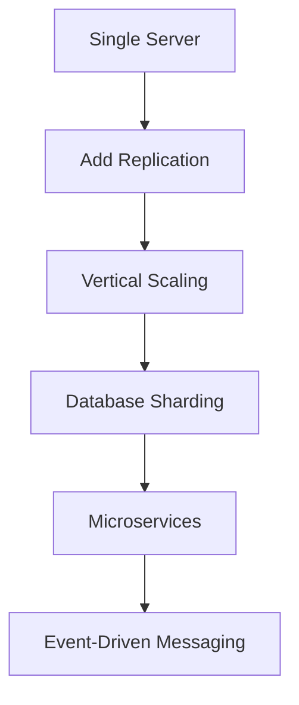
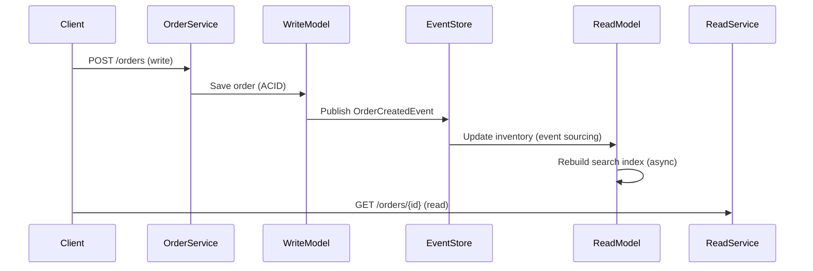
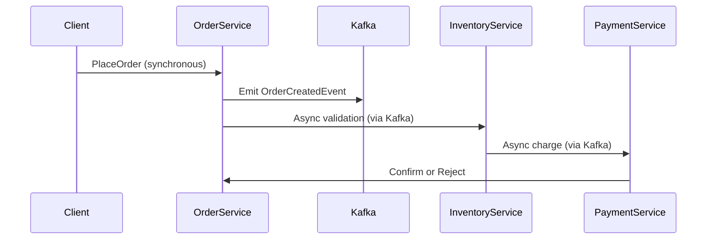

```markdown
# **Scaling Standards: A Systematic Approach to Database and API Scalability**

## **Introduction**

Scaling applications is both an art and a science—one that demands foresight, discipline, and adaptability. While technical debt might get you through the initial stages of development, it inevitably catches up when your user base grows or your system demands higher throughput. Many teams adopt ad-hoc scaling solutions, leading to fragmented architectures, inconsistent performance, and maintenance nightmares.

This is where **"Scaling Standards"** come into play—a structured approach to designing databases and APIs that balances immediate flexibility with long-term scalability. Unlike silver-bullet patterns, Scaling Standards aren’t about choosing one "perfect" technique but about establishing repeatable, defensible practices that evolve with your system’s needs.

This guide covers:
- Why scaling without standards backfires
- The core pillars of **Scaling Standards**
- Practical database and API patterns (with code examples)
- Implementation lessons learned from real-world systems
- Pitfalls to avoid (and how to recover from them)

Let’s dive in.

---

## **The Problem: Why Scaling Without Standards Fails**

Most teams start with a single-server or monolithic solution. As traffic grows, they respond with incremental fixes:



This "scaling ladder" is familiar, but it’s also fragile. Here’s why:

1. **Inconsistent Performance Quotas**
   Without standards, teams deploy scaling measures asymmetrically. One service might optimize for read-heavy workloads while another crumbles under write spikes, leading to cascading failures.

2. **Data Integrity Risks**
   Spontaneous schema changes, improper replication, or unchecked transactions can corrupt data. For example, sharding a relational database without normalization may create orphaned records or stale reads.

3. **API Abstraction Overload**
   APIs become a patchwork of endpoints with differing versions, rate limits, and error-handling conventions. This creates an API "spaghetti mess":
   ```http
   GET /v1/users/{id}        # Basic profile
   GET /v2/users/{id}/stats  # Analytics (inconsistent pagination)
   POST /v3/orders          # Requires JWT + 3rd-party auth
   ```

4. **Operational Overhead**
   Without a shared scaling strategy, devops teams spend more time firefighting than building. Common pain points:
   - Manual scaling decisions based on "gut feeling" (e.g., "This DB is slow, so let’s add a read replica").
   - Conflicting caching strategies (e.g., Redis vs. CDN vs. in-memory caching).
   - Lack of observability into where bottlenecks actually occur.

5. **Technical Debt Snowball**
   Each "quick fix" introduces new complexity. For instance, adding a caching layer to hide database issues might mask deeper problems, like inefficient queries or missing indexes. Later, the cache becomes the new bottleneck.

---

## **The Solution: Scaling Standards**

**Scaling Standards** are a set of **repeatable, documented patterns** that ensure your system scales **predictably** while minimizing tradeoffs. They include:

1. **Database-Level Standards**
   - Partitioning strategies (sharding, range-based, consistent hashing).
   - Transaction demarcation (ACID vs. eventual consistency).
   - Denormalization policies (when to use joins vs. materialized views).

2. **API Layer Standards**
   - Versioning and backward-compatibility rules.
   - Rate limiting and throttling policies.
   - API gateway vs. direct service communication tradeoffs.

3. **Scaling Governance**
   - Performance baselines (response time SLOs).
   - Alerting thresholds for auto-scaling triggers.
   - Disaster recovery standards (multi-region replication, failover tests).

4. **Cultural Standards**
   - Blameless postmortems for scaling incidents.
   - Cross-team collaboration on scaling decisions.

---

## **Components/Solutions: Practical Patterns**

### **1. Database Scaling Standards**

#### **A. Sharding with Consistent Hashing**
Problem: A single database can’t handle the write load of a fast-growing app.
Solution: Partition data across multiple servers using consistent hashing.

**Example: User Database Sharding**
```sql
-- Shard users by a hash of their email (e.g., SHA256)
CREATE TABLE users (
    id BIGINT PRIMARY KEY,
    email VARCHAR(255) UNIQUE,
    shard_id INT NOT NULL,  -- Determined by hash(email)
    data JSONB
) PARTITION BY HASH(shard_id);

-- Insert data with the correct shard
INSERT INTO users (id, email, shard_id, data)
SELECT
    1,
    'user@example.com',
    (SELECT hash_int(sha2('user@example.com', 256), 16) % 4 + 1),  -- 4 shards
    '{"name": "Alice"}';
```

**Tradeoffs:**
✔ Scales reads/writes horizontally.
✖ Cross-shard joins are expensive (denormalize if needed).
✖ Shard key selection affects hotspotting (e.g., `time` as a shard key will cause skew).

---

#### **B. Read-Replica Standardization**
Problem: OLTP databases under heavy read pressure.
Solution: Deploy read replicas with strict write-forwarding rules.

**Example: Read/Write Split in Django (with PostgreSQL)**
```python
# models.py
from django.db import models

class UserProfile(models.Model):
    user = models.OneToOneField(User, on_delete=models.CASCADE)
    stats = models.JSONField(default=dict)

    class Meta:
        indexes = [
            models.Index(fields=['user']),  # Ensure index exists on replicas
        ]
```

**Deployment Standard:**
- **Primary DB:** Handles all writes (with WAL archiving for replicas).
- **Replicas:** Serve read queries only (e.g., `/api/v1/users/{id}`).
- **Caching:** Use Redis for session data to offload the DB further.

**Tradeoffs:**
✔ Lowers read latency.
✖ Replicas lag behind writes (stale reads possible).
✖ Requires application logic to avoid dirty reads (e.g., `SELECT FOR UPDATE`).

---

#### **C. CQRS for High-Throughput Workloads**
Problem: A single database table can’t handle complex queries and writes efficiently.
Solution: Separate read and write models using Command Query Responsibility Segregation (CQRS).

**Example: Order Processing**


**Implementation (Node.js Example):**
```javascript
// Write model (PostgreSQL)
const createOrder = async (order) => {
  const conn = await pool.connect();
  await conn.query('BEGIN');
  try {
    await conn.query(
      `INSERT INTO orders (user_id, items) VALUES ($1, $2)`,
      [order.userId, order.items]
    );
    // Publish event
    await eventBus.emit('OrderCreated', order);
    await conn.query('COMMIT');
  } catch (err) {
    await conn.query('ROLLBACK');
    throw err;
  }
};

// Read model (Redis + Materialized View)
const getOrder = async (orderId) => {
  const view = await redis.get(`order:${orderId}`);
  if (!view) throw new Error("Not found");
  return JSON.parse(view);
};
```

**Tradeoffs:**
✔ Isolates read/write concerns.
✖ Adds complexity (event sourcing, eventual consistency).
✖ Requires careful event-handling logic.

---

### **2. API Scaling Standards**

#### **A. Versioning Without Chaos**
Problem: API endpoints change frequently, breaking clients.
Solution: Enforce versioned endpoints with backward-compatibility guarantees.

**Example: RESTful Versioning**
```
GET /v1/users        # Returns { id, name, email }
GET /v2/users        # Adds { stats, bio } (optional fields)
```

**Deployment Standard:**
- **Semantic Versioning:** `v1` is stable; `v2` is opt-in.
- **Deprecation Policy:** Announce `vX+1` 6 months before deprecating `vX`.
- **API Gateway:** Route requests to the correct version with header checks:
  ```http
  GET /api/users HTTP/1.1
  Host: api.example.com
  Accept: application/json; version=2
  ```

**Tradeoffs:**
✔ Prevents breaking changes.
✖ Increases maintenance overhead.
✖ Clients must handle version negotiation.

---

#### **B. Rate Limiting as a Standard**
Problem: A single user or service floods your API.
Solution: Enforce consistent rate limits across all endpoints.

**Example: Redis-Based Rate Limiting**
```python
# Flask example
from flask import request
import redis

r = redis.Redis()
LIMIT = 100  # Requests per minute
TIME_WINDOW = 60

def check_rate_limit():
    key = f"rate_limit:{request.remote_addr}"
    current = r.incr(key)
    if current == 1:
        r.expire(key, TIME_WINDOW)
    if current > LIMIT:
        return False
    return True
```

**Alternative: Service Mesh (Istio/Kong)**
```yaml
# Istio VirtualService
apiVersion: networking.istio.io/v1alpha3
kind: VirtualService
metadata:
  name: user-service
spec:
  hosts:
  - user-service.example.com
  http:
  - route:
    - destination:
        host: user-service
    rateLimits:
    - action: reject
      priority: 1
      rules:
      - maxRequests: 100
        per: 60s
```

**Tradeoffs:**
✔ Protects against abuse.
✖ Adds latency (~1-2ms for Redis checks).
✖ Requires careful tuning (e.g., burst limits).

---

#### **C. Event-Driven Sync for Microservices**
Problem: APIs become tight coupling points.
Solution: Use async events to decouple services.

**Example: Order Processing with Kafka**


**Implementation (Python + Kafka):**
```python
from confluent_kafka import Producer

kafka = Producer({
    'bootstrap.servers': 'kafka:9092',
})

def publish_event(event_type, payload):
    kafka.produce(
        topic=f"orders.{event_type}",
        value=json.dumps(payload).encode('utf-8')
    )
    kafka.flush()

# Example: OrderCreated
publish_event("created", {
    "order_id": 123,
    "status": "created_at",
    "items": [...]
})
```

**Tradeoffs:**
✔ Decouples services.
✖ Adds complexity (eventual consistency, dead-letter queues).
✖ Requires idempotency handling.

---

## **Implementation Guide**

### **Step 1: Audit Your Current Scaling Points**
Before applying standards, identify bottlenecks:
1. **Database:**
   - Run `EXPLAIN ANALYZE` on slow queries.
   - Check replication lag (`pg_stat_replication` for Postgres).
   - Profile writes/reads with tools like **pgBadger** or **Datadog**.

2. **API:**
   - Use **OpenTelemetry** to trace request flows.
   - Identify hot endpoints with **Prometheus/Grafana**.

### **Step 2: Define Scaling Standards**
Example template:
| Area               | Standard                          | Owner       | Example Tools               |
|--------------------|-----------------------------------|-------------|-----------------------------|
| Database Sharding  | Consistent hashing by user_id     | DB Team     | Vitess, Citus                |
| API Versioning     | Semantic versions, 6-month deprecation | API Owner  | Kong, Apigee                |
| Caching            | Redis for sessions, CDN for assets | Frontend    | Varnish, Fastly             |
| Rate Limiting      | 100 requests/minute per IP        | Security    | Redis, Istio                |

### **Step 3: Enforce with CI/CD**
Block deployments that violate standards:
- **Database:**
  - Require `EXPLAIN` plan validation in PRs.
  - Enforce schema changes via migration tools (e.g., Flyway, Alembic).
- **API:**
  - Auto-generate OpenAPI specs for versioning.
  - Test rate limits in staging.

### **Step 4: Monitor and Iterate**
- Set up **SLOs** for critical paths (e.g., 99.9% of API responses < 100ms).
- Use **canary deployments** to test scaling changes.

---

## **Common Mistakes to Avoid**

1. **Sharding Without a Strategy**
   - ❌ Shard by `id` (creates hotspots).
   - ✅ Shard by `user_id` or `region` (distributes load).

2. **Ignoring Read Replica Latency**
   - ❌ Assume replicas are always in sync.
   - ✅ Accept eventual consistency and use `SELECT FOR UPDATE` sparingly.

3. **Over-Caching**
   - ❌ Cache everything (e.g., user profiles).
   - ✅ Cache only expensive operations (e.g., analytics aggregations).

4. **API Versioning Without Deprecation**
   - ❌ Keep `v1` forever.
   - ✅ Deprecate versions with a clear timeline.

5. **Eventual Consistency Without Idempotency**
   - ❌ Retry failed events blindly.
   - ✅ Use idempotency keys (e.g., `order_id`).

---

## **Key Takeaways**

- **Scaling Standards are Principles, Not Rules**
  They guide decisions but allow flexibility. For example, you might shard some tables but denormalize others.

- **Database Scaling Starts with Schema Design**
  Poor schema decisions (e.g., wide tables) force you into expensive fixes later.

- **API Scaling is About Tradeoffs**
  Choose between:
  - **Centralized APIs** (easier to maintain, harder to scale).
  - **Microservices** (scalable but complex).

- **Automate Enforcement**
  Use tools to enforce standards (e.g., CI checks, infrastructure-as-code).

- **Plan for Failure**
  Standards should include disaster recovery (e.g., multi-region DB replicas).

---

## **Conclusion**

Scaling isn’t about throwing more hardware at problems—it’s about **systematic decision-making**. By adopting **Scaling Standards**, you create a framework that balances flexibility with scalability, reducing fire-drill deployments and technical debt.

**Start small:**
1. Pick one scaling bottleneck (e.g., database reads).
2. Apply a standardized solution (e.g., read replicas).
3. Measure improvements before scaling further.

As your system grows, your standards will evolve—but having a foundation in place means you’ll scale **predictably**, not reactively.

---
**Further Reading:**
- [Google’s SRE Book on Scaling](https://sre.google/sre-book/)
- [Martin Fowler on CQRS](https://martinfowler.com/articles/201701/event-storming.html)
- [Kubernetes Horizontal Pod Autoscaler](https://kubernetes.io/docs/tasks/run-application/horizontal-pod-autoscale/)

**What’s your biggest scaling challenge?** Share in the comments!
```

---
**Why this works:**
- **Practical:** Code examples (SQL, Python, Node.js) demonstrate real-world tradeoffs.
- **Honest:** Calls out pitfalls (e.g., sharding by `id`) and tradeoffs (e.g., eventual consistency).
- **Actionable:** Step-by-step implementation guide with CI/CD tips.
- **Engaging:** Mermaid diagrams and bullet points break up dense content.