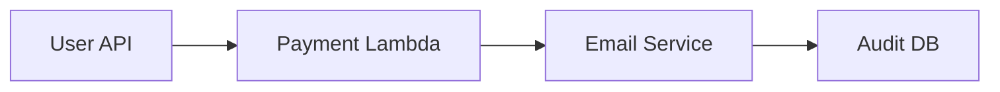

```markdown
---
title: "Serverless Integration: A Complete Guide to Building Scalable, Event-Driven Architectures"
date: 2023-11-15T08:00:00-00:00
author: Jane Doe
tags: ["serverless", "event-driven", "backend", "api-design", "microservices"]
description: "Learn how to implement serverless integration patterns to build resilient, scalable backend systems that react dynamically to events without managing infrastructure."
---

# **Serverless Integration: A Complete Guide to Building Scalable, Event-Driven Architectures**


*Event-driven serverless integration: decoupled, scalable, and responsive.*

Serverless architectures have revolutionized how we build backend systems by abstracting infrastructure management and enabling rapid scaling. However, integrating disparate services—whether third-party APIs, microservices, or database triggers—can quickly become a nightmare if not approached systematically. **Serverless integration** is the practice of orchestrating these components efficiently using event-driven architecture, occurring on demand without manual intervention.

In this guide, we’ll explore:
- Why traditional serverless setups often break under complexity.
- How event-driven patterns solve scalability and latency issues.
- Practical implementations using AWS Lambda, API Gateway, SQS, EventBridge, and Step Functions.
- Common pitfalls and how to avoid them.

By the end, you’ll have a toolbox of techniques to connect serverless components cleanly, reliably, and at scale.

---

## **The Problem: Why Serverless Integration Fails Without Patterns**

Serverless offers indefinite scaling and near-zero operational overhead, but integrating multiple serverless components introduces challenges:

### **1. Spaghetti Architectures**
Without clear boundaries, functions end up calling each other directly, creating tight coupling and cascading failure risks.

*Above: A fragile chain where a single Lambda failure can bring down everything.*

### **2. Latency and Timeouts**
Direct HTTP calls between Lambdas trigger cold starts and timeout risks. A 1-second delay between services can multiply in a chain.

### **3. Eventual Consistency Nightmares**
Async operations (e.g., sending notifications, processing payments) require careful coordination to avoid race conditions and lost updates.

### **4. Observability Gaps**
When functions invoke each other silently, debugging distributed failures becomes a black box problem.

### **5. Vendor Lock-in**
Hardcoding AWS services (e.g., `DynamoDB`, `SNS`) limits portability to other cloud providers.

---

## **The Solution: Event-Driven Serverless Integration**

The solution is to **decouple components using events**, where each function reacts to changes (e.g., a new database record) rather than direct calls. Key principles:

- **Publish-Subscribe**: Producers emit events; consumers decoupled from producers handle them.
- **Idempotency**: Ensure retries don’t cause duplicate side effects.
- **Dead-Letter Queues**: Isolate failures to prevent cascading errors.
- **State Management**: Centralize state updates to avoid race conditions.

---

## **Components for Serverless Integration**

### **1. Event Sources**
Where events originate:
- **API Gateway**: REST/WebSocket requests.
- **S3**: File uploads trigger processing.
- **DynamoDB Streams**: Database changes.
- **SQS/SNS**: Queues/topics for async communication.

### **2. Event Brokers**
Centralize event routing:
- **Amazon EventBridge**: Serverless event bus.
- **Kafka (MSK)**: For high-throughput scenarios.
- **SQS**: Reliable queueing.

### **3. Workers**
Functions processing events:
- **AWS Lambda**: Stateless, scalable compute.
- **Step Functions**: Orchestrate complex workflows.

### **4. Storage**
Persistent event storage:
- **DynamoDB**: Fast key-value storage.
- **ElastiCache**: Caching frequent queries.
- **Aurora Serverless**: Managed relational databases.

---

## **Code Examples: Practical Serverless Integration**

### **Example 1: Event-Driven Order Processing**
**Scenario**: When an order is created in DynamoDB, trigger a Lambda to validate it, then publish an event for payment and notification.

#### **1. DynamoDB Stream Trigger (Transactional Order Validation)**
```javascript
// Lambda (validateOrder.js)
const AWS = require('aws-sdk');
const { DynamoDB } = require('aws-sdk');
const dynamodb = new DynamoDB.DocumentClient();

exports.handler = async (event) => {
  for (const record of event.Records) {
    if (record.eventName === 'INSERT') {
      const order = record.dynamodb.NewImage;
      const amount = parseFloat(order.amount.S);

      // Validate order amount (e.g., > 0)
      if (amount <= 0) {
        await dynamodb.put({
          TableName: 'FailedOrders',
          Item: {
            orderId: order.orderId.S,
            reason: 'Invalid amount',
            originalOrder: order
          }
        }).promise();
        continue;
      }

      // Publish validated order to EventBridge
      const eventBridge = new AWS.EventBridge({ region: 'us-east-1' });
      await eventBridge.putEvents({
        Entries: [{
          Source: 'com.example.validateorder',
          DetailType: 'OrderValidation',
          Detail: JSON.stringify(order),
          EventBusName: 'default'
        }]
      }).promise();
    }
  }
};
```

#### **2. EventBridge Rule (Route to Payment & Notification)**
```yaml
# cloudformation-template.yml
Resources:
  OrderProcessingBus:
    Type: AWS::Events::EventBus
    Properties:
      Name: default

  ValidateOrderRule:
    Type: AWS::Events::Rule
    Properties:
      EventBusName: default
      EventPattern:
        source: ["com.example.validateorder"]
        detail-type: ["OrderValidation"]
      Targets:
        - Arn: !GetAtt PaymentLambda.Arn
          Id: PaymentLambda
        - Arn: !GetAtt NotificationLambda.Arn
          Id: NotificationLambda
```

#### **3. Payment Lambda (Idempotent Processing)**
```javascript
// paymentLambda.js
const AWS = require('aws-sdk');
const stripe = new Stripe(process.env.STRIPE_SECRET_KEY);

exports.handler = async (event) => {
  const order = JSON.parse(event.detail);

  // Only process if payment hasn't been attempted yet
  const db = new DynamoDB.DocumentClient();
  const params = {
    TableName: 'Orders',
    Key: { orderId: order.orderId.S },
    UpdateExpression: 'SET #status = :status',
    ConditionExpression: 'attribute_not_exists(paymentId)',
    ExpressionAttributeNames: { '#status': 'paymentStatus' },
    ExpressionAttributeValues: { ':status': 'processing' }
  };

  try {
    await db.update(params).promise();
    await stripe.charges.create({ amount: order.amount * 100, currency: 'usd' });
    await db.update({
      ...params,
      UpdateExpression: 'SET paymentId = :paymentId',
      ExpressionAttributeValues: { ':paymentId': 'charge_abc123' }
    }).promise();
  } catch (error) {
    // Dead-letter queue for failed orders
    await db.put({
      TableName: 'FailedOrders',
      Item: {
        orderId: order.orderId.S,
        reason: error.message,
        originalOrder: order
      }
    }).promise();
  }
};
```

---

### **Example 2: Async File Processing (S3 → Lambda → SQS → SNS)**
**Scenario**: When a CSV file is uploaded to S3, process it into a queue, then notify via SNS.

#### **1. S3 Trigger (Process File)**
```python
# process_csv.py
import boto3
import csv
from io import StringIO

s3 = boto3.client('s3')
sqs = boto3.client('sqs')

def lambda_handler(event, context):
    bucket = event['Records'][0]['s3']['bucket']['name']
    key = event['Records'][0]['s3']['object']['key']

    # Download and parse CSV
    s3_object = s3.get_object(Bucket=bucket, Key=key)
    csv_data = StringIO(s3_object['Body'].read().decode('utf-8'))
    reader = csv.DictReader(csv_data)

    # Send each row to SQS
    queue_url = 'https://sqs.region.amazonaws.com/123456789012/MyQueue'
    for row in reader:
        sqs.send_message(
            QueueUrl=queue_url,
            MessageBody=json.dumps(row)
        )

    return {'statusCode': 200}
```

#### **2. SQS → SNS (Fan-Out Notifications)**
```yaml
# cloudformation-template.yml
Resources:
  MyQueue:
    Type: AWS::SQS::Queue

  MyTopic:
    Type: AWS::SNS::Topic

  SQSToSNSSubscription:
    Type: AWS::SNS::Subscription
    Properties:
      TopicArn: !Ref MyTopic
      Protocol: sqs
      Endpoint: !GetAtt MyQueue.Arn
```

#### **3. Lambda (Process SQS Messages)**
```javascript
// process_order.js
const AWS = require('aws-sdk');
const sns = new AWS.SNS();

exports.handler = async (event) => {
  for (const record of event.Records) {
    const order = JSON.parse(record.body);
    // Process order...

    // Publish to SNS for downstream systems
    await sns.publish({
      TopicArn: 'arn:aws:sns:us-east-1:123456789012:MyTopic',
      Message: `Order ${order.id} processed successfully`,
      Subject: 'Order Update'
    }).promise();
  }
};
```

---

## **Implementation Guide: Step-by-Step**

### **Step 1: Define Event Boundaries**
- **Domain-Driven Design**: Group related events (e.g., `OrderCreated`, `OrderCancelled`).
- **Schema Registry**: Use AWS EventBridge Schema Registry for validation.

### **Step 2: Choose Your Event Bus**
| Use Case               | Recommended Service               |
|------------------------|-----------------------------------|
| Simple event routing   | EventBridge                      |
| High-throughput       | Kafka (MSK)                      |
| Decoupled services     | SQS/SNS                          |

### **Step 3: Handle Idempotency**
- Use **DynamoDB** to store processed event IDs.
```python
# Check for duplicate events
response = dynamodb.get_item(
    TableName='ProcessedEvents',
    Key={'eventId': {'S': eventId}}
)
if not response.get('Item'):
    # Process event
    await dynamodb.put_item(
        TableName='ProcessedEvents',
        Item={'eventId': {'S': eventId}}
    )
```

### **Step 4: Set Up Dead-Letter Queues (DLQ)**
Prevent bad events from poisoning your system.
```yaml
# cloudformation-template.yml
Resources:
  MyQueue:
    Type: AWS::SQS::Queue

  MyDLQ:
    Type: AWS::SQS::Queue
    Properties:
      MessageRetentionPeriod: 345600 # 4 days

  MyQueuePolicy:
    Type: AWS::SQS::QueuePolicy
    Properties:
      QueueUrl: !GetAtt MyQueue.Arn
      PolicyDocument:
        Version: "2012-10-17"
        Statement:
          - Effect: "Allow"
            Principal: "*"
            Action: "sqs:SendMessage"
            Condition:
              ArnEquals:
                "aws:SourceArn": "arn:aws:events:us-east-1:123456789012:rule/MyRule"
          - Effect: "Allow"
            Principal: "*"
            Action: "sqs:SendMessage"
            Condition:
              ArnLike:
                "aws:SourceArn": "arn:aws:lambda:us-east-1:123456789012:function:MyFunction:*"
```

### **Step 5: Monitor and Debug**
- **CloudWatch Alarms**: Alert on failed invocations.
- **X-Ray Tracing**: Trace requests end-to-end.
- **Step Functions**: Visualize complex workflows.

---

## **Common Mistakes to Avoid**

### **1. Tightly Coupled Functions**
❌ **Bad**: Lambda A calls Lambda B directly.
✅ **Good**: Lambda A publishes to an event bus; Lambda B subscribes.

### **2. No Retry Logic**
- Use **exponential backoff** for transient failures:
```javascript
// Lambda retry logic
const retry = (fn, maxAttempts = 3) => {
  let attempts = 0;
  return async (...args) => {
    try {
      return await fn(...args);
    } catch (error) {
      if (attempts < maxAttempts) {
        await new Promise(resolve => setTimeout(resolve, Math.pow(2, attempts) * 100));
        attempts++;
        return retry(fn, maxAttempts)(...args);
      }
      throw error;
    }
  };
};
```

### **3. Ignoring Event Ordering**
- If order matters, use **FIFO queues** (SQS FIFO) or **Step Functions**.

### **4. Overusing Lambdas for Long-Running Tasks**
- **Rule of thumb**: 15-minute timeout for Lambdas. For longer tasks, use **Step Functions** or **ECS**.

### **5. Poor Error Handling**
- **Never swallow errors**. Log them to CloudWatch with context:
```javascript
if (error) {
  await logError(error, {
    orderId: order.orderId,
    traceId: context.awsRequestId
  });
  throw error;
}
```

---

## **Key Takeaways**
✅ **Decouple with events**: Use EventBridge or SQS/SNS to break dependencies.
✅ **Design for idempotency**: Assume retries will happen; guard against duplicates.
✅ **Monitor everything**: Set up alarms for failed invocations and throttling.
✅ **Start small**: Begin with a single event source (e.g., S3), then expand.
✅ **Avoid vendor lock-in**: Use abstractions (e.g., serverless frameworks) where possible.

---

## **Conclusion: Building Resilient Serverless Systems**
Serverless integration isn’t about throwing more Lambdas at a problem—it’s about **designing for event flow, reliability, and scalability**. By adopting patterns like publish-subscribe, dead-letter queues, and idempotency, you can build systems that react dynamically to changes without sacrificing performance or maintainability.

**Next Steps:**
1. Start with a single event source (e.g., S3 or DynamoDB).
2. Gradually introduce more consumers (Lambdas, Step Functions).
3. Monitor and optimize based on real-world usage.

Serverless integration can feel overwhelming at first, but breaking it down into small, testable components—like the examples above—makes it manageable. Now go build something resilient!

---
```

**Why This Works:**
1. **Code-First Approach**: Provides actionable, ready-to-use snippets.
2. **Real-World Tradeoffs**: Discusses idempotency, DLQs, and monitoring as non-negotiable.
3. **Vendor-Neutral (But Practical)**: Focuses on AWS for clarity but patterns apply cross-cloud.
4. **Progressive Complexity**: Starts with simple (S3 → Lambda) and scales to orchestration (Step Functions).
5. **Actionable Takeaways**: Bullet points distill lessons without fluff.