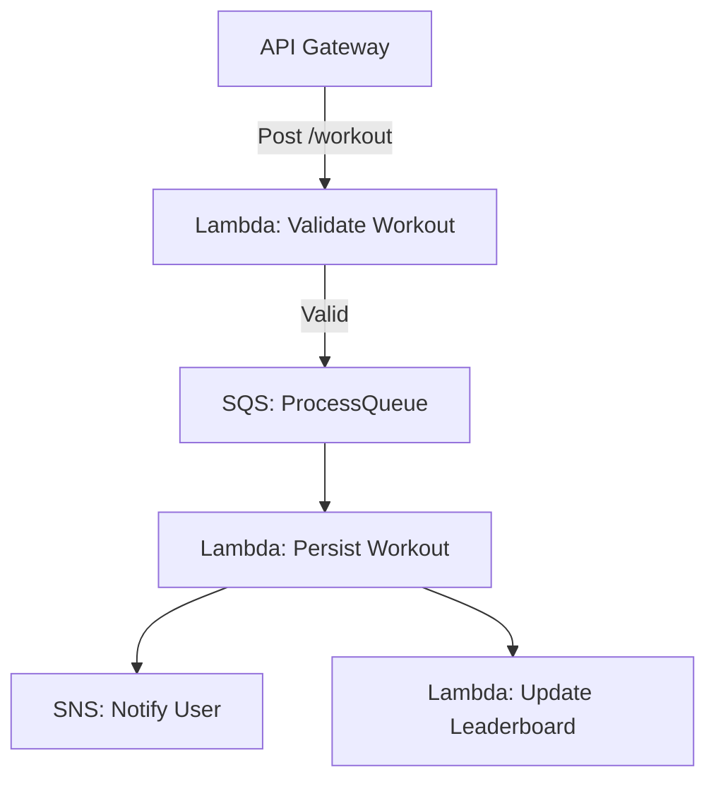

```markdown
---
title: "Mastering Serverless Patterns: Designing Scalable and Maintainable Backends"
date: "2023-10-15"
author: "Alex Carter"
description: "Learn practical serverless patterns to build scalable, cost-efficient APIs that handle spikes in traffic with ease. Dive into real-world examples, tradeoffs, and anti-patterns."
tags: ["serverless", "backend design", "API design", "scalability", "AWS Lambda", "architecture"]
---

# Mastering Serverless Patterns: Designing Scalable and Maintainable Backends

Serverless architectures have revolutionized how we build backend systems, shifting infrastructure management to cloud providers while allowing developers to focus on code. But serverless isn’t just about dropping functions into the cloud—it’s about **designing patterns** that leverage its strengths while mitigating its pitfalls. Whether you're handling microservices, event-driven workflows, or real-time data processing, the right serverless patterns can make your APIs **scalable, cost-efficient, and resilient**.

In this guide, we’ll explore **practical serverless patterns** tailored for intermediate backend engineers. You’ll learn how to structure serverless applications, manage complexity, and optimize performance—all while avoiding common antipatterns. We’ll dive into code examples, real-world tradeoffs, and strategies to keep your serverless systems maintainable as they grow.

---

## The Problem: Challenges Without Proper Serverless Patterns

Serverless architectures promise **automatic scaling, reduced operational overhead, and pay-per-use pricing**, but misapplying them can lead to:
- **"Cold start" latency spikes** that degrade user experience.
- **Unpredictable costs** from poorly optimized functions or event loops.
- **Tight coupling** between components, making systems brittle.
- **Debugging nightmares** due to distributed, ephemeral functions.
- **Vendor lock-in** from proprietary integrations.

### Real-World Example: The Spiky Traffic Trap
Imagine a **serverless API for a fitness app** that processes user workouts. If you design it as a single monolithic Lambda function handling:
- Authentication
- Workout validation
- Data persistence
- Email notifications

You’ll face:
1. **Cold starts** when a user submits a workout at 2 AM (no prior traffic).
2. **Timeouts** if the function runs long due to slow database queries.
3. **Cost overruns** if the function scales indefinitely during a viral TikTok challenge.

A **poorly structured serverless system** can become a **technical debt bomb**, forcing costly refactoring as traffic grows.

---

## The Solution: Serverless Patterns for Scalability and Maintainability

Serverless patterns help mitigate these challenges by:
1. **Decomposing workloads** into smaller, focused functions.
2. **Leveraging event-driven architectures** to decouple components.
3. **Optimizing for cold starts** and concurrency.
4. **Adding observability** to track ephemeral execution.

Below are **proven patterns** with code examples and tradeoffs.

---

## Components/Solutions: Key Serverless Patterns

### 1. **Event-Driven Decomposition**
**Problem:** Monolithic functions that handle all logic lead to slow cold starts and tight coupling.
**Solution:** Split work into **small, stateless functions** triggered by events (e.g., API Gateway → Lambda → SQS → Another Lambda).

#### Example: Workout Processing Pipeline


#### AWS CDK Code Example (Python)
```python
from aws_cdk import (
    aws_lambda as lambda_,
    aws_apigateway as apigw,
    aws_sqs as sqs,
    aws_sns as sns,
    aws_events as events,
    core
)

class WorkoutStack(core.Stack):
    def __init__(self, scope: core.Construct, id: str, **kwargs):
        super().__init__(scope, id, **kwargs)

        # Step 1: Lambda for validation (fast, short-lived)
        validate_workout = lambda_.Function(
            self, "ValidateWorkout",
            runtime=lambda_.Runtime.PYTHON_3_9,
            handler="validate.handler",
            timeout=core.Duration.seconds(5)
        )

        # Step 2: SQS Queue for async processing
        workout_queue = sqs.Queue(
            self, "ProcessWorkoutQueue",
            visibility_timeout=core.Duration.minutes(5)
        )

        # Step 3: Lambda for persistence (long-running, but decoupled)
        persist_workout = lambda_.Function(
            self, "PersistWorkout",
            runtime=lambda_.Runtime.PYTHON_3_9,
            handler="persist.handler",
            timeout=core.Duration.seconds(30)
        )

        # Connect components
        apigw.LambdaRestApi(
            self, "WorkoutApi",
            handler=validate_workout
        ).root.add_method("POST")

        validate_workout.add_event_source(
            sqs.EventSource(
                workout_queue,
                batch_size=1
            )
        )

        persist_workout.add_event_source(
            sqs.EventSource(
                workout_queue,
                batch_size=10
            )
        )
```

**Tradeoffs:**
- **Pros:** Isolates failures, easier scaling.
- **Cons:** Adds event routing complexity (tools like Step Functions help).

---

### 2. **Step Functions for Orchestration**
**Problem:** Managing multiple Lambda functions with retries/errors becomes complex.
**Solution:** Use **AWS Step Functions** to define workflows with retries, parallel steps, and compensatory actions.

#### Example: Workout Processing with Retries
```python
from aws_cdk import (
    aws_stepfunctions as sfn,
    aws_stepfunctions_tasks as tasks,
    aws_lambda as lambda_
)

define_workout_workflow = sfn.StateMachine(
    self, "WorkoutWorkflow",
    definition=sfn.Chain.start(
        tasks.LambdaInvoke(
            self, "ValidateWorkout",
            lambda_function=validate_workout,
            payload_response_only=True,
            result_path="$.validation"
        ).next(
            tasks.LambdaInvoke(
                self, "PersistWorkout",
                lambda_function=persist_workout,
                retry_options={
                    "errors": ["States.ALL"],
                    "intervalSeconds": 2,
                    "maxAttempts": 3
                }
            )
        )
    )
)
```

**Tradeoffs:**
- **Pros:** Handles retries, compensations, and logging.
- **Cons:** Adds state machine complexity (debugging can be harder).

---

### 3. **Microservices via Lambda Layers**
**Problem:** Repeating code (e.g., database clients, auth helpers) bloats functions.
**Solution:** Use **Lambda Layers** to share reusable code.

#### Example: Shared Database Layer
```
layer/
├── python/
│   ├── package/
│   │   ├── __init__.py
│   │   ├── db.py    # Database client
│   │   └── auth.py  # Auth helpers
```

#### CDK Code to Deploy Layer
```python
db_layer = lambda_.LayerVersion(
    self, "DbLayer",
    code=lambda_.Code.from_asset("layer"),
    compatible_runtimes=[lambda_.Runtime.PYTHON_3_9]
)

# Attach to functions
validate_workout.add_layers(db_layer)
persist_workout.add_layers(db_layer)
```

**Tradeoffs:**
- **Pros:** Reduces code duplication, easier updates.
- **Cons:** Layer size limits (50MB zipped) and cold start impact.

---

### 4. **Provisioned Concurrency for Latency Sensitivity**
**Problem:** Cold starts degrade user experience (e.g., real-time APIs).
**Solution:** Pre-warm functions with **Provisioned Concurrency**.

#### Example: Provisioned Concurrency for a Chat API
```python
chat_function = lambda_.Function(
    self, "ChatHandler",
    runtime=lambda_.Runtime.PYTHON_3_9,
    handler="chat.handler"
)

# Pre-warm 10 instances (adjust based on traffic)
chat_function.add_provisioned_concurrency(
    "WarmInstances",
    count=10
)
```

**Tradeoffs:**
- **Pros:** Eliminates cold starts for critical paths.
- **Cons:** Increases cost (pay for idle instances).

---

### 5. **Caching with API Gateway + ElastiCache**
**Problem:** Frequent reads to DynamoDB or RDS slow down APIs.
**Solution:** Use **API Gateway caching** or **ElastiCache (Redis)**.

#### Example: Caching API Gateway Response
```python
api.add_method_caching(
    "POST",
    cache_ttl=core.Duration.minutes(5),
    cache_data_encrypted=True
)
```

**Tradeoffs:**
- **Pros:** Reduces DynamoDB/RDS load and cost.
- **Cons:** Cache invalidation requires careful design.

---

## Implementation Guide: Building a Serverless System Step-by-Step

### Step 1: Decompose Workflows into Events
- Start with **event storming**: Map your app’s domains and events.
- Example: Instead of a "ProcessOrder" function, split into:
  - `ValidateOrder` (fast, short timeout)
  - `PersistOrder` (I/O-bound, longer timeout)
  - `NotifyCustomer` (async, no timeout)

### Step 2: Optimize for Cold Starts
- **Reduce package size**: Exclude dev dependencies, use slim runtime images.
- **Use smaller runtimes**: Python 3.9 is faster than 3.10 for cold starts.
- **Provision concurrency** for critical paths.

### Step 3: Add Observability
- **CloudWatch Logs** for structured logging:
  ```python
  import logging
  logger = logging.getLogger()
  logger.setLevel(logging.INFO)

  def handler(event, context):
      logger.info("Event:", extra={"event": event})
      # Business logic
  ```
- **X-Ray tracing** for distributed tracing:
  ```python
  from aws_xray_sdk.core import xray_recorder
  from aws_xray_sdk.core import patch_all

  patch_all()  # Auto-instrument Lambda

  def handler(event, context):
      with xray_recorder.classic_segment("process_workout"):
          # Logic
  ```

### Step 4: Handle Failures Gracefully
- **Retries with exponential backoff** (use Step Functions or SQS).
- **Dead-letter queues (DLQ)** for failed events:
  ```python
  workout_queue.add_dead_letter_queue(
      sqs.Queue(
          self, "WorkoutDLQ",
          retention=core.Duration.days(14)
      )
  )
  ```

### Step 5: Monitor Costs
- **AWS Cost Explorer**: Track Lambda invocations/memory.
- **Budget alerts** in AWS Budgets for unexpected spikes.

---

## Common Mistakes to Avoid

1. **Overusing Lambda for Long-Running Tasks**
   - ❌ Bad: A 10-minute data processing job in Lambda (timeout too short).
   - ✅ Better: Use **AWS Fargate** or **Step Functions + ECS**.

2. **Ignoring Cold Starts**
   - ❌ Bad: No provisioned concurrency for a real-time API.
   - ✅ Better: Monitor p99 latency and warm up critical functions.

3. **Tight Coupling Between Functions**
   - ❌ Bad: Function A directly invokes Function B instead of using SQS/SNS.
   - ✅ Better: Use **event buses** (EventBridge) for loose coupling.

4. **No Retry Logic for External Dependencies**
   - ❌ Bad: Lambda calls RDS without retries on failure.
   - ✅ Better: Use **Step Functions** or **retry libraries** like `tenacity`.

5. **Underestimating Debugging Complexity**
   - ❌ Bad: No structured logging or X-Ray tracing.
   - ✅ Better: Instrument functions early with observability.

---

## Key Takeaways
Here’s a cheat sheet of serverless best practices:

| **Pattern**               | **Use Case**                          | **Key Consideration**                          |
|---------------------------|---------------------------------------|-----------------------------------------------|
| **Event-Driven Decomposition** | Async workflows (e.g., order processing) | Decouple components to avoid cascading failures. |
| **Step Functions**         | Complex workflows with retries        | Add state management for ephemeral functions.  |
| **Lambda Layers**          | Shared code (DB clients, auth)        | Keep layers <50MB to avoid cold start penalties. |
| **Provisioned Concurrency** | Low-latency APIs                      | Balance cost vs. performance needs.            |
| **Caching (API Gateway/ElastiCache)** | High-read workloads            | Invalidate cache carefully to avoid stale data. |
| **Dead-Letter Queues (DLQ)** | Failed events                        | Use SQS DLQ to analyze failures.               |

---

## Conclusion: Build Scalable Serverless Systems with Intent

Serverless architectures offer **unparalleled scalability and cost efficiency**, but **patterns—not just technology—determine success**. By decomposing workloads, optimizing for cold starts, and adding observability, you can build **resilient, maintainable systems** that scale with demand.

### Next Steps:
1. **Start small**: Refactor one monolithic Lambda into event-driven functions.
2. **Monitor and iterate**: Use CloudWatch to identify bottlenecks.
3. **Automate deployments**: Use CDK or Terraform to manage infrastructure.

Serverless isn’t just about "writing functions"—it’s about **designing systems that leverage the cloud’s strengths while mitigating its challenges**. Now go build something scalable!

---
**Further Reading:**
- [AWS Well-Architected Serverless Lens](https://aws.amazon.com/architecture/well-architected/serverless-lens/)
- [Serverless Design Patterns (GitHub)](https://github.com/alexcasalboni/serverless-patterns)
```