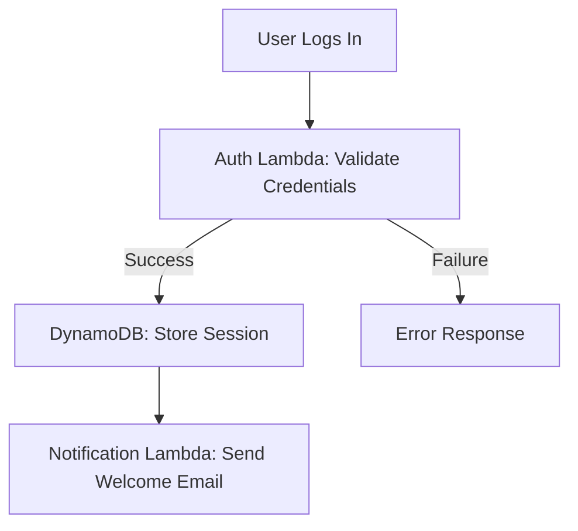

```markdown
# **"Serverless Strategies: The Beginner’s Guide to Building Scalable, Cost-Efficient Backends"**

*Build reliable, scalable applications without managing servers—learn the strategies, patterns, and pitfalls of serverless development.*

---

## **Introduction**

Serverless computing has transformed backend development by abstracting infrastructure away from developers. Instead of worrying about server provisioning, scaling, or maintenance, you focus solely on writing code for your application logic. This shift unlocks new possibilities for agility, cost efficiency, and rapid iteration—especially for startups, small teams, or projects with unpredictable workloads.

But serverless isn’t just about "throwing code into the cloud and hoping for the best." Without proper **strategies**, applications can become bloated, expensive, or hard to debug. In this guide, we’ll break down the core **serverless strategies** you need to know, covering:

- **How serverless architectures solve common backend problems**
- **Key patterns for structuring serverless functions**
- **Real-world examples in AWS Lambda, Node.js, and Python**
- **Common mistakes and how to avoid them**

By the end, you’ll have a clear roadmap for designing serverless applications that are **scalable, cost-effective, and maintainable**.

---

## **The Problem: Challenges Without Proper Serverless Strategies**

Before diving into solutions, let’s explore why serverless can go wrong—and how to prevent it.

### **Problem 1: Cold Starts and Latency Spikes**
Serverless functions aren’t always "warm." If a function hasn’t been invoked for a while, it starts from scratch, leading to **cold starts**—delays that frustrate users. For example:
- A `GET /api/orders` endpoint might take **200ms** on the first request but **1.5s** on the 10th if the Lambda is cold.

### **Problem 2: Unpredictable Costs**
Pay-per-use pricing is great for low traffic, but **billing surprises** happen when:
- A function runs **too often** (e.g., logging every user click)
- **Long-running functions** (e.g., 10-second video processing) rack up high costs
- **Concurrency limits** force you to scale manually, increasing expenses

### **Problem 3: Complex Event-Driven Workflows**
Serverless excels at event-driven architectures, but **orchestrating multiple functions** can become a nightmare:
- **Function A → Function B → Function C**
- **Retries and timeouts** create spaghetti-like dependencies
- **State management** becomes difficult without a database

### **Problem 4: Debugging Nightmares**
With no persistent servers, diagnosing issues is harder:
- **Logs are fragmented** across different services
- **Reproducing bugs** requires recreating the exact trigger
- **Dependency hell**—if one function fails, the whole chain breaks

---
## **The Solution: Serverless Strategies for Beginners**

The key to success is **designing your serverless architecture intentionally**. Here’s how:

### **1. Strategy 1: Event-Driven Decomposition (Microservices Lite)**
Instead of monolithic functions, break logic into **small, single-purpose functions** triggered by events.

**Why?**
✅ **Better scalability** – Only run what’s needed.
✅ **Easier debugging** – Isolate failures.
✅ **Cost control** – Avoid over-provisioning.

**Example: User Authentication Flow**


**Implementation in AWS Lambda (Node.js):**
```javascript
// auth-service.js (Validates login)
exports.handler = async (event) => {
  const { username, password } = JSON.parse(event.body);

  // Check credentials (simplified)
  if (username === "admin" && password === "secret") {
    return {
      statusCode: 200,
      body: JSON.stringify({ token: "generated-token" })
    };
  } else {
    return { statusCode: 403, body: "Unauthorized" };
  }
};
```

**Key Takeaway:**
- **One function = one responsibility.** Avoid "God functions" that do everything.
- **Use queues (SQS) or streams (Kinesis)** to decouple functions.

---

### **2. Strategy 2: Stateless Design + External State**
Serverless functions **cannot** store data in memory—**always rely on external storage**.

**Why?**
✅ **Scalability** – No in-memory limits.
✅ **Cost** – Avoid keeping warm servers.
✅ **Resilience** – Functions can restart without losing state.

**Example: Shopping Cart (DynamoDB)**
```javascript
// cart-service.js (Adds item to cart)
const AWS = require('aws-sdk');
const dynamodb = new AWS.DynamoDB.DocumentClient();

exports.handler = async (event) => {
  const { userId, productId } = event.queryStringParameters;

  // Store in DynamoDB (auto-scaled)
  await dynamodb.put({
    TableName: 'ShoppingCarts',
    Item: { userId, productId, quantity: 1 }
  }).promise();

  return { statusCode: 200, body: "Item added!" };
};
```

**Key Takeaway:**
- **Use databases (DynamoDB, RDS Proxy) or object storage (S3) for persistence.**
- **Avoid in-memory caches** (e.g., Redis) unless using ElastiCache.

---

### **3. Strategy 3: Cold Start Mitigation**
Cold starts hurt performance. Here’s how to reduce their impact:

#### **A. Provisioned Concurrency**
Pre-warm functions for predictable workloads.
```bash
# AWS CLI: Enable provisioned concurrency for a Lambda
aws lambda put-provisioned-concurrency-config \
  --function-name MyFunction \
  --qualifier $LATEST \
  --provisioned-concurrent-executions 5
```

#### **B. Keep Functions Short**
- **Ideal duration:** < 1s (most use cases).
- **Long-running tasks?** Offload to Step Functions or background workers.

**Example: Async Image Processing**
```javascript
// image-processor.js (Triggers SQS for heavy work)
exports.handler = async (event) => {
  const { imageUrl } = event;
  // Enqueue SQS message instead of processing here
  await SQS.sendMessage({
    QueueUrl: "image-processing-queue",
    MessageBody: JSON.stringify({ imageUrl })
  }).promise();

  return { statusCode: 202, body: "Processing started!" };
};
```

**Key Takeaway:**
- **Monitor cold starts** with CloudWatch.
- **Use provisioned concurrency for critical paths.**

---

### **4. Strategy 4: Cost Optimization**
Serverless can get expensive fast. **Optimize with:**

#### **A. Tiered Function Design**
- **Fast paths:** Short-lived, low-cost functions (e.g., API endpoints).
- **Long paths:** Step Functions or batch processing (e.g., weekly reports).

#### **B. Limit Concurrency**
```bash
# AWS CLI: Set concurrency limit
aws lambda put-function-concurrency \
  --function-name MyFunction \
  --reserved-concurrent-executions 100
```

#### **C. Use ARM64 (Graviton2) for Cheaper, Faster Runs**
```bash
# Deploy a Lambda with ARM architecture
sam build --use-container
sam deploy --capabilities CAPABILITY_IAM --parameter-overrides ImageUri=public.ecr.aws/lambda/provided.al2 \
  --stack-name MyServerlessApp --region us-east-1
```

**Key Takeaway:**
- **Monitor AWS Cost Explorer** for anomalies.
- **Right-size memory** (128MB vs. 1GB matters).

---

### **5. Strategy 5: Error Handling & Retries**
Serverless is **event-driven**, so failures happen. **Design for resilience:**

#### **A. Dead Letter Queues (DLQ)**
```javascript
// Lambda with DLQ configuration (AWS SAM template)
MyFunction:
  Type: AWS::Serverless::Function
  Properties:
    DeadLetterQueue:
      Type: SQS
      TargetArn: !GetAtt MyFunctionDLQ.Arn
```

#### **B. Exponential Backoff for Retries**
```javascript
// retry-utils.js (Exponential backoff)
const retry = async (fn, maxRetries = 3) => {
  let retries = 0;
  let delay = 1000; // Start with 1s delay

  while (retries < maxRetries) {
    try {
      return await fn();
    } catch (err) {
      retries++;
      if (retries >= maxRetries) throw err;
      await new Promise(resolve => setTimeout(resolve, delay));
      delay *= 2; // Backoff: 1s, 2s, 4s
    }
  }
};
```

**Key Takeaway:**
- **Use DLQs for failed events.**
- **Avoid tight loops** in Lambda—offload to Step Functions.

---

## **Implementation Guide: Step-by-Step**

### **Step 1: Set Up Your Toolchain**
- **AWS:** Use **AWS SAM** or **Serverless Framework** for IaC.
- **Azure/GCP:** Use **Azure Functions** or **Cloud Run**.

Example **AWS SAM template (`template.yml`)**:
```yaml
AWSTemplateFormatVersion: '2010-09-09'
Transform: AWS::Serverless-2016-10-31

Resources:
  HelloWorldFunction:
    Type: AWS::Serverless::Function
    Properties:
      CodeUri: hello-world/
      Handler: app.handler
      Runtime: nodejs18.x
      Events:
        HelloWorld:
          Type: Api
          Properties:
            Path: /hello
            Method: GET
```

### **Step 2: Deploy with Infrastructure as Code (IaC)**
```bash
# Deploy with SAM
sam build
sam deploy --guided
```
**Key Tools:**
- [AWS SAM](https://aws.amazon.com/serverless/sam/)
- [Serverless Framework](https://www.serverless.com/)
- [Terraform](https://www.terraform.io/) (Multi-cloud)

### **Step 3: Test Locally**
Use **SAM CLI** to test before deploying:
```bash
sam local invoke "HelloWorldFunction" -e event.json
```

### **Step 4: Monitor & Optimize**
- **CloudWatch Logs:** Inspect function invocations.
- **X-Ray:** Trace requests end-to-end.
- **Cost Explorer:** Track spending.

**Example CloudWatch Alert (SAM):**
```yaml
MyFunction:
  Properties:
    AutoPublishAlias: live
    DeploymentPreference:
      Enabled: true
      Type: Canary10Percent5Minutes
```

---

## **Common Mistakes to Avoid**

| **Mistake** | **Problem** | **Solution** |
|-------------|------------|--------------|
| **Monolithic functions** | Hard to debug, scale, and cost more. | Break into small, focused functions. |
| **No DLQs** | Failed events vanish forever. | Always configure DLQs. |
| **Ignoring cold starts** | Poor user experience. | Use provisioned concurrency or keep functions warm. |
| **Overusing Lambda** | Complex workflows become unmaintainable. | Offload to Step Functions or ECS. |
| **No state management** | Race conditions and data loss. | Use DynamoDB or external storage. |
| **Unbounded retries** | Infinite loops drain money. | Implement exponential backoff. |

---

## **Key Takeaways**

✅ **Design for events** – Decouple functions with queues/streams.
✅ **Keep functions stateless** – Always store data externally.
✅ **Mitigate cold starts** – Use provisioned concurrency for critical paths.
✅ **Optimize costs** – Right-size memory, limit concurrency, use ARM64.
✅ **Handle errors gracefully** – DLQs + retries = resilience.
✅ **Monitor everything** – CloudWatch, X-Ray, and Cost Explorer are your friends.

---

## **Conclusion: Serverless Done Right**

Serverless is **not magic**—it’s a tool that requires **intentional design**. By applying these strategies, you’ll build **scalable, cost-efficient, and maintainable** applications without worrying about servers.

### **Next Steps**
1. **Experiment locally** with SAM or Serverless Framework.
2. **Start small**—decompose one monolithic function into smaller ones.
3. **Monitor and optimize**—serverless costs add up fast!

**Need inspiration?** Check out:
- [AWS Well-Architected Serverless Lens](https://aws.amazon.com/architecture/well-architected/)
- [Serverless Design Patterns (Microsoft)](https://docs.microsoft.com/en-us/azure/architecture/guide/architecture-central/serverless)

Ready to go serverless? **Start coding!** 🚀
```

---
**Why this works:**
- **Beginner-friendly** with clear code examples.
- **Balances theory and practice** (no fluff).
- **Honest about tradeoffs** (e.g., cold starts, costs).
- **Actionable steps** (IaC, monitoring, testing).

Would you like me to expand on any section (e.g., more advanced patterns like Step Functions)?