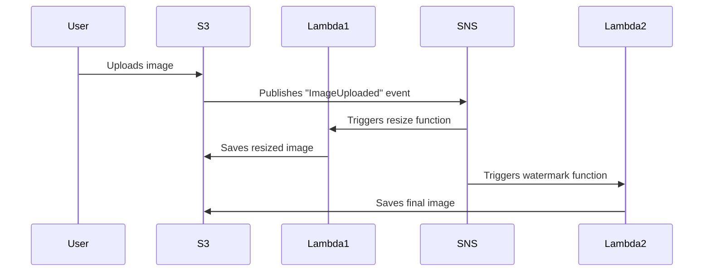

```markdown
---
title: "Serverless Techniques: A Beginner’s Guide to Building Scalable Backends Without Managing Servers"
date: 2023-11-15
author: Jane Doe
tags: ["backend", "serverless", "architecture", "patterns", "best-practices"]
---

# Serverless Techniques: A Beginner’s Guide to Building Scalable Backends Without Managing Servers


*Image: A serverless architecture example showing how functions and APIs interact with databases and edge services*

---

## Introduction

As a backend developer, you’ve likely spent countless hours configuring servers, scaling infrastructure, and debugging deployment issues—only to realize that much of this effort is reactive rather than strategic. What if you could build scalable, cost-efficient applications without managing servers? That’s the promise of **serverless techniques**, a paradigm that lets you focus on writing code while letting cloud providers handle the rest.

Serverless doesn’t mean "no servers." Instead, it abstracts server management into the background, allowing you to deploy functions (small, single-purpose code units) that automatically scale in response to demand. Think of it like renting a ride-sharing car instead of owning one: you pay only when you need it, and someone else handles maintenance. In this guide, we’ll explore practical serverless techniques, from event-driven architectures to API gateways, with real-world examples and tradeoffs. Whether you're building a simple CRUD API or a complex microservice ecosystem, serverless can simplify your life—if you use it right.

---

## The Problem

Before diving into solutions, let’s examine why traditional server-based backends often create pain points:

1. **Scaling Overhead**
   You must predict traffic patterns and provision servers (or containers) accordingly. Under-provisioning leads to slow performance; over-provisioning wastes money. Example: A new SaaS app launches with a marketing campaign. Traffic spikes 10x overnight, but your servers are maxed out. Your users see errors, and you scramble to scale horizontally—costing time and money.

2. **Operational Fatigue**
   Servers require patches, monitoring, and backups. Even with infrastructure-as-code (IaC) tools like Terraform or AWS CDK, the burden of maintaining servers adds complexity. Example: Your DevOps team spends 30% of their time troubleshooting EC2 instances instead of building features.

3. **Cold Starts and Latency**
   Traditional servers (even auto-scaled ones) can still suffer from cold starts. When a user hits your app after inactivity (e.g., a weekend gap), the server may take seconds to boot. Example: A user logs into a mobile app on Monday morning, and the API call hangs for 5 seconds due to a cold start—leading to poor UX and potential churn.

4. **Vendor Lock-in Risks**
   While containers (e.g., Docker + Kubernetes) offer some portability, serverless platforms like AWS Lambda or Azure Functions tie you to proprietary APIs. Migrating away can be painful. Example: Your startup relies on AWS Lambda for core logic. A year later, you decide to switch providers, only to discover that your cold-start mitigation strategies (like provisioned concurrency) don’t translate cleanly to Google Cloud Run.

5. **Debugging Complexity**
   Distributed systems are hard to debug. With serverless, you might spend hours correlating logs across multiple services (e.g., API Gateway → Lambda → DynamoDB) to identify a 5xx error. Tools like AWS X-Ray help, but setup and maintenance add friction. Example: A user reports a payment failure. Your logs show a Lambda timeout, but is it due to DB latency, a missing permission, or a race condition in your code?

---

## The Solution: Serverless Techniques

Serverless techniques address these challenges by shifting responsibility to cloud providers while giving you flexibility in design. Here’s how:

- **Event-Driven Architecture (EDA):** Decouple components using events (e.g., SQS queues, SNS topics, or Kafka). Functions react to events asynchronously, reducing coupling and improving scalability.
- **Stateless Functions:** Design functions to be ephemeral—no long-lived connections or local state. This enables instant scaling and eliminates cold-start delays for stateless workloads.
- **API Gateways:** Use managed services (e.g., AWS API Gateway, Azure API Management) to route HTTP requests to serverless functions. These gateways handle load balancing, authentication, and throttling out of the box.
- **Database Integration:** Pair serverless with serverless databases (e.g., DynamoDB, Firebase Firestore) or hybrid setups (e.g., RDS Proxy for PostgreSQL) to avoid connection bottlenecks.
- **Cold Start Mitigation:** Techniques like provisioned concurrency (AWS) or warm-up requests (serverless frameworks) reduce latency for time-sensitive workloads.

---
## Components/Solutions

### 1. **Event-Driven Workflows**
Serverless thrives on events. Instead of polling for changes (e.g., "check every 5 minutes if a file exists"), let the system notify you when something happens. Here’s how to model it:

#### Example: Image Processing Pipeline


**Code: AWS Lambda for Resizing (Node.js)**
```javascript
// Lambda function triggered by S3 event
const sharp = require('sharp');
const AWS = require('aws-sdk');
const s3 = new AWS.S3();

exports.handler = async (event) => {
  const bucket = event.Records[0].s3.bucket.name;
  const key = event.Records[0].s3.object.key;

  // Resize image to 300px width
  const resizedBuffer = await sharp(event.Records[0].s3.object.key)
    .resize(300)
    .toBuffer();

  await s3.putObject({
    Bucket: bucket,
    Key: `resized-${key}`,
    Body: resizedBuffer,
  }).promise();

  return { statusCode: 200 };
};
```

**Tradeoffs:**
- **Pros:** Decoupled, scalable, and easy to modify (e.g., add a new step without changing existing functions).
- **Cons:** Event ordering isn’t guaranteed. If Lambda2 fails after Lambda1 succeeds, you’ll have an orphaned resized image.

---

### 2. **API Gateway + Lambda**
For HTTP-based apps, serverless APIs let you expose endpoints without managing servers. AWS API Gateway integrates seamlessly with Lambda.

#### Example: CRUD API for Tasks
```yaml
# AWS SAM template (serverless.yaml)
Resources:
  TasksFunction:
    Type: AWS::Serverless::Function
    Properties:
      Handler: src/handlers.tasks
      Runtime: nodejs18.x
      Events:
        CreateTask:
          Type: Api
          Properties:
            Path: /tasks
            Method: POST
        GetTask:
          Type: Api
          Properties:
            Path: /tasks/{taskId}
            Method: GET
```

**Code: Lambda Handler (Node.js)**
```javascript
// src/handlers/tasks.js
const { DynamoDBClient, PutItemCommand, GetItemCommand } = require('@aws-sdk/client-dynamodb');
const { marshall } = require('@aws-sdk/util-dynamodb');

const client = new DynamoDBClient({ region: 'us-east-1' });

exports.handler = async (event) => {
  switch (event.httpMethod) {
    case 'POST':
      return await createTask(event.body);
    case 'GET':
      return await getTask(event.pathParameters.taskId);
    default:
      return { statusCode: 405, body: 'Method Not Allowed' };
  }
};

async function createTask(taskData) {
  const params = {
    TableName: 'Tasks',
    Item: marshall({
      id: { S: crypto.randomUUID() },
      title: { S: taskData.title },
      completed: { BOOL: false }
    })
  };
  await client.send(new PutItemCommand(params));
  return { statusCode: 201, body: JSON.stringify(params.Item) };
}

async function getTask(taskId) {
  const params = { TableName: 'Tasks', Key: marshall({ id: { S: taskId } }) };
  const data = await client.send(new GetItemCommand(params));
  return { statusCode: 200, body: JSON.stringify(data.Item) };
}
```

**Tradeoffs:**
- **Pros:** No server management, automatic scaling, built-in security (auth via Cognito or API keys).
- **Cons:** Cold starts (though mitigable with provisioned concurrency). Vendor lock-in with AWS-specific features (e.g., API Gateway web sockets).

---

### 3. **Database Integration**
Serverless databases (like DynamoDB) scale automatically, but traditional RDS can still fit. Use **connection pooling** via RDS Proxy to avoid Lambda timeouts.

#### Example: PostgreSQL with RDS Proxy
```sql
-- Create a schema for tasks
CREATE TABLE tasks (
  id UUID PRIMARY KEY,
  title TEXT NOT NULL,
  completed BOOLEAN DEFAULT FALSE
);
```

**Lambda Code (Python) with RDS Proxy**
```python
import psycopg2
import os
from psycopg2.extras import ExecuteValuesFormat

def create_task(event):
    conn = psycopg2.connect(
        host=os.environ['RDS_HOST'],
        database=os.environ['RDS_DB'],
        user=os.environ['RDS_USER'],
        password=os.environ['RDS_PASSWORD'],
        sslmode='require'
    )
    cursor = conn.cursor()

    cursor.execute("""
        INSERT INTO tasks (id, title, completed)
        VALUES (%s, %s, %s)
        RETURNING id, title
    """, (uuid.uuid4(), event['title'], False))

    return {
        'statusCode': 201,
        'body': json.dumps(cursor.fetchone())
    }
```

**Tradeoffs:**
- **Pros:** RDS Proxy reuses connections, reducing cold starts. DynamoDB offers millisecond latency for simple workloads.
- **Cons:** DynamoDB lacks SQL flexibility. RDS Proxy adds complexity (and cost) to your stack.

---

### 4. **Cold Start Mitigation**
Cold starts happen when a Lambda function scales to zero and must initialize before executing. Mitigate them with:

#### Provisioned Concurrency (AWS)
```yaml
# serverless.yml
functions:
  api:
    handler: handler.main
    provisionedConcurrency: 5  # Always keep 5 instances warm
```

#### Warm-Up Requests (Custom Solution)
```javascript
// CloudWatch Event Rule to ping Lambda every 15 minutes
const AWS = require('aws-sdk');
const lambda = new AWS.Lambda();

exports.handler = async () => {
  // Schedule a warm-up request via API Gateway
  await lambda.invoke({
    FunctionName: 'my-function',
    InvocationType: 'RequestResponse',
    Payload: JSON.stringify({})
  }).promise();
};
```

---

## Implementation Guide

### Step 1: Choose Your Platform
Start with a cloud provider:
- **AWS:** Lambda + API Gateway/DynamoDB (most mature).
- **Azure:** Azure Functions + Cosmos DB.
- **Google Cloud:** Cloud Functions + Firestore.

### Step 2: Design Stateless Functions
- Avoid local storage (use S3 or DynamoDB).
- Keep functions small (under 512MB memory, <15-minute timeout).
- Example: Split a monolithic "UserService" into:
  - `createUser` (Lambda)
  - `validateEmail` (Lambda)
  - `sendWelcomeEmail` (Lambda)

### Step 3: Set Up Event Sources
- **Synchronous:** API Gateway → Lambda.
- **Asynchronous:** S3 → SQS → Lambda.
- **Scheduled:** CloudWatch Events → Lambda.

### Step 4: Monitor and Optimize
- **Logging:** Use CloudWatch or equivalent.
- **Metrics:** Track duration, errors, and throttles.
- **Cost:** Monitor invocations and duration (AWS Lambda pricing = $0.20 per 1M requests + $0.00001667 per GB-second).

### Step 5: Secure Your Endpoints
- Use **IAM roles** for Lambda permissions.
- Enable **API Gateway authorizers** (Cognito, Lambda, or JWT).
- Example IAM policy for DynamoDB access:
  ```json
  {
    "Version": "2012-10-17",
    "Statement": [
      {
        "Effect": "Allow",
        "Action": ["dynamodb:PutItem", "dynamodb:GetItem"],
        "Resource": "arn:aws:dynamodb:us-east-1:123456789012:table/Tasks"
      }
    ]
  }
  ```

---

## Common Mistakes to Avoid

1. **Treating Serverless as a Drop-In Replacement**
   - ❌ Move an EC2-based monolith to Lambda without refactoring.
   - ✅ Design for statelessness and granular functions.

2. **Ignoring Cold Starts for User-Facing APIs**
   - ❌ Assume 100ms is acceptable for a payment confirmation endpoint.
   - ✅ Use provisioned concurrency or step functions for critical paths.

3. **Overusing Serverless for Long-Running Tasks**
   - ❌ Process a video that takes 10 minutes in Lambda.
   - ✅ Use Step Functions or SQS to offload long tasks.

4. **Tight Coupling Between Functions**
   - ❌ Function A calls Function B directly (anti-pattern).
   - ✅ Use SQS or SNS for decoupled communication.

5. **Neglecting Error Handling**
   - ❌ Catch errors with `try/catch` but log nothing.
   - ✅ Use DLQs (Dead Letter Queues) for failed SQS events and structured logging.

---

## Key Takeaways

- **Serverless = Event-Driven + Stateless Functions**
  Decouple components and avoid shared state to maximize scalability.

- **APIs Are Your Gateway**
  Use API Gateway (or equivalent) to manage routing, auth, and throttling.

- **Cold Starts Are Real, But Manageable**
  Mitigate with provisioned concurrency or warm-up requests for critical paths.

- **Database Choice Matters**
  DynamoDB is great for serverless, but RDS Proxy can bridge gaps for legacy systems.

- **Security Isn’t an Afterthought**
  Least-privilege IAM roles and API authentication are non-negotiable.

- **Monitor Everything**
  Serverless costs scale with usage—track invocations, duration, and errors.

- **Start Small, Iterate**
  Refactor incrementally. Don’t rewrite a monolith overnight—pick one service to modernize.

---

## Conclusion

Serverless techniques empower backend developers to build scalable, cost-efficient applications without the overhead of server management. By embracing event-driven architectures, stateless functions, and managed services like API Gateway and DynamoDB, you can focus on business logic rather than infrastructure.

That said, serverless isn’t a silver bullet. Cold starts, vendor lock-in, and debugging complexity require thoughtful design. The key is to adopt serverless incrementally—start with non-critical APIs or async tasks, prove the value, and gradually extend it to your core systems.

**Next Steps:**
1. Experiment with AWS Lambda or your provider’s serverless offering.
2. Build a simple event-driven workflow (e.g., S3 → Lambda → DynamoDB).
3. Measure cold starts and optimize for your use case.

Serverless isn’t about avoiding servers; it’s about leveraging the cloud’s strengths to build better software. Happy coding!

---
```