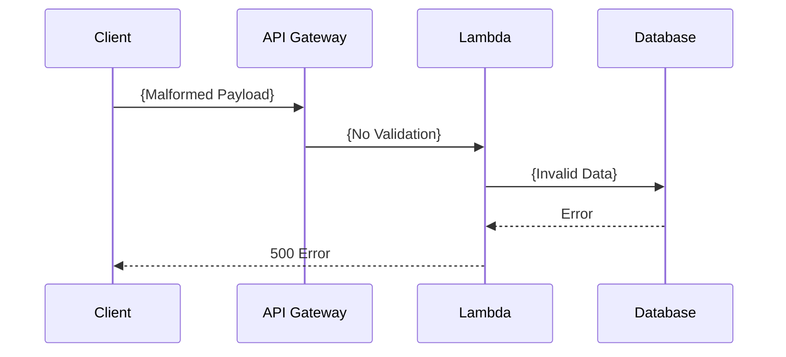

```markdown
# **Serverless Validation: The Complete Guide to Building Robust API Inputs in Serverless Architectures**

Managing data validation in serverless is different than in traditional architectures. Without a process server, your validation logic must be distributed, resilient, and performant.

In this guide, we’ll explore **serverless validation**, covering challenges, solutions, and implementation techniques. You’ll learn how to validate inputs at multiple layers (client, API gateway, AWS Lambda, etc.), optimize performance, and handle edge cases.

---

## **Introduction: Why Serverless Validation Matters**

Serverless architectures offer scalability, cost efficiency, and reduced operational overhead—but they introduce new validation challenges:

- **Statelessness**: No long-lived processes means no shared validation state.
- **Cold Starts**: Latency can expose unvalidated inputs.
- **Microservices Mix**: Inputs may traverse multiple services, requiring validation at each step.
- **Real-time Requirements**: Validation must be low-latency to avoid breaking user experiences.

Without proper validation, you risk:
✅ **Malformed data** propagating through your system.
✅ **Security vulnerabilities** (SQL injection, payload tampering).
✅ **Costly errors** in downstream services.

The solution? A **multi-layered validation strategy** that ensures data integrity at every stage.

---

## **The Problem: Challenges Without Proper Serverless Validation**

### **1. Inputs Slip Through Due to Distributed Validation**
In traditional monolithic apps, a single validation layer (e.g., a middleware in Node.js) catches errors early. But in serverless:



**Result?** Errors only surface after hitting a database or third-party service—making debugging painful.

### **2. Performance Bottlenecks**
Serverless functions should be fast. Heavy validation logic can increase cold start times and latency.

### **3. Inconsistent Validation Across Services**
If two Lambda functions validate the same input differently, you introduce **data drift**—leading to unexpected behavior.

### **4. Security Gaps**
Missing validation opens doors for:
- **SQL Injection**: `user_id=1; DROP TABLE users;--`
- **Denial-of-Service (DoS)**: Oversized payloads crashing functions.

---

## **The Solution: A Multi-Layered Serverless Validation Strategy**

To prevent these issues, we validate at **multiple levels**:

| **Layer**          | **Validation Responsibility**                                                                 | **Example Tools/Techniques**                     |
|---------------------|-----------------------------------------------------------------------------------------------|--------------------------------------------------|
| **Client**          | Basic schema checks (e.g., client-side libraries like Zod, Fastify Validator)                | TypeScript interfaces, Form validation           |
| **API Gateway**     | Payload format checks (JSON, query params, header validation)                                | AWS API Gateway Request Validation              |
| **Lambda (Edge)**   | Lightweight validation before hitting Lambda                                                | Serverless Framework, OpenAPI + AWS WAF          |
| **Lambda (Core)**   | Deep validation (business rules, data transformations)                                      | Custom handlers, Zod, TypeScript                 |
| **Database**        | Final checks (e.g., `ON INSERT` triggers, constraints)                                       | SQL CHECK constraints, Postgres Fk constraints   |

Each layer **defends against failures at a different level**, creating redundancy.

---

## **Implementation Guide: Practical Serverless Validation**

### **1. Client-Side Validation (TypeScript + Zod)**
Developers should validate inputs **before sending** them to your API.

```typescript
// client/src/schemas/user.ts
import { z } from "zod";

export const userSchema = z.object({
  username: z.string().min(3).max(30),
  email: z.string().email(),
  age: z.number().int().positive(),
});

export type User = z.infer<typeof userSchema>;
```

**Usage in React:**
```typescript
import { userSchema } from "./schemas/user";

const handleSubmit = async () => {
  const userData = { username: "test", email: "invalid", age: -10 };
  const result = userSchema.safeParse(userData);

  if (!result.success) {
    alert(`Invalid input: ${result.error.format()}`);
    return;
  }

  // Proceed to API call
};
```

**Why?** Catches errors **before** the API is called, improving UX.

---

### **2. API Gateway Validation (AWS SAM + OpenAPI)**
Use AWS SAM/OpenAPI to validate payloads at the **edge**.

#### **AWS SAM Template (YAML)**
```yaml
Resources:
  UserCreate:
    Type: AWS::Serverless::Function
    Properties:
      Events:
        CreateUser:
          Type: Api
          Properties:
            Path: /users
            Method: POST
            RequestValidator: RequestBodyValidator
            RequestParameters:
              method.request.body: "application/json"
            RequestModels:
              application/json: "UserInputModel"
```

#### **OpenAPI Request Model (YAML)**
```yaml
openapi: 3.0.1
components:
  schemas:
    UserInputModel:
      type: object
      required: [username, email]
      properties:
        username:
          type: string
          minLength: 3
          maxLength: 30
        email:
          type: string
          format: email
        age:
          type: integer
          minimum: 0
```

**Benefit:** AWS validates **before** invoking Lambda, reducing Lambda invocations.

---

### **3. Lambda-Level Validation (Zod + TypeScript)**
For **deep validation** (e.g., business rules), validate in Lambda.

#### **Example: User Creation Lambda**
```typescript
// src/handlers/user.ts
import { APIGatewayProxyEvent, APIGatewayProxyResult } from "aws-lambda";
import { userSchema } from "../schemas/user";

export const createUser = async (
  event: APIGatewayProxyEvent
): Promise<APIGatewayProxyResult> => {
  try {
    // Parse input (already validated by API Gateway, but double-check)
    const body = JSON.parse(event.body || "{}");
    const parsed = userSchema.parse(body);

    // Business logic (e.g., check if username exists)
    if (await doesUsernameExist(parsed.username)) {
      return {
        statusCode: 400,
        body: JSON.stringify({ error: "Username taken" }),
      };
    }

    // Save to DB
    await saveToDatabase(parsed);

    return {
      statusCode: 201,
      body: JSON.stringify({ success: true }),
    };
  } catch (error) {
    if (error instanceof z.ZodError) {
      return {
        statusCode: 400,
        body: JSON.stringify({ error: error.errors }),
      };
    }
    return { statusCode: 500, body: JSON.stringify({ error: "Server error" }) };
  }
};
```

**Why Zod?**
✔ **Type-safe**—compiler catches errors early.
✔ **Runtime validation**—checks payloads at execution.
✔ **Customizable**—add custom validation logic.

---

### **4. Database-Level Validation (PostgreSQL CHECK Constraints)**
Use **SQL constraints** as a final safeguard.

```sql
CREATE TABLE users (
  id SERIAL PRIMARY KEY,
  username VARCHAR(30) NOT NULL UNIQUE,
  email VARCHAR(255) NOT NULL UNIQUE,
  age INTEGER CHECK (age > 0),
  created_at TIMESTAMP DEFAULT NOW()
);
```

**Why?**
✔ Prevents **invalid data from reaching your DB**.
✔ No need to validate in Lambda for basic checks.

---

## **Common Mistakes to Avoid**

### **1. Relying on Client-Side Validation Alone**
❌ *Mistake:* Assume clients will always validate.
✅ **Fix:** Always validate in **multiple layers** (API Gateway + Lambda).

### **2. Overloading Validation in Lambda**
❌ *Mistake:* Running heavy validation (e.g., regex, complex rules) in Lambda.
✅ **Fix:** Move heavy checks to:
   - **API Gateway (OpenAPI)** for simple checks.
   - **Database (CHECK constraints)** for basic logic.

### **3. Ignoring Cold Start Latency**
❌ *Mistake:* Overcomplicating Lambda validation to avoid API Gateway checks.
✅ **Fix:** Use **API Gateway validation** for lightweight checks to reduce Lambda invocations.

### **4. Not Handling Edge Cases**
❌ *Mistake:* Failing to validate:
   - Empty objects (`{}`).
   - Missing required fields.
   - Large payloads (DoS risk).
✅ **Fix:** Use **Zod’s `.nonempty()`**, `.max()`, and `.min()`**.

---

## **Key Takeaways**
✅ **Validate at every layer** (Client → API Gateway → Lambda → Database).
✅ **Use Zod for runtime validation** (type-safe and flexible).
✅ **Leverage API Gateway OpenAPI** for edge-level checks.
✅ **Keep Lambda validation lightweight** (move heavy logic to DB).
✅ **Handle errors gracefully** (return structured responses).
✅ **Test edge cases** (empty inputs, malformed JSON, large payloads).

---

## **Conclusion: Build Resilient Serverless APIs**

Serverless validation isn’t about **one** perfect layer—it’s about **defense in depth**. By validating at the **client, API Gateway, Lambda, and database**, you ensure:
✔ **Faster failure modes** (errors caught early).
✔ **Better security** (malformed inputs blocked).
✔ **Lower costs** (fewer failed Lambda invocations).

**Next Steps:**
- Start with **Zod for runtime validation**.
- Configure **API Gateway OpenAPI validation**.
- Add **database constraints** for critical data.

By implementing these patterns, your serverless APIs will be **faster, safer, and more maintainable**.

---

### **Further Reading**
- [AWS API Gateway Request Validation](https://docs.aws.amazon.com/apigateway/latest/developerguide/request-validation.html)
- [Zod Documentation](https://zod.dev/)
- [Serverless Framework OpenAPI Integration](https://www.serverless.com/framework/docs/providers/aws/guide/open-api)

Happy validating!
```