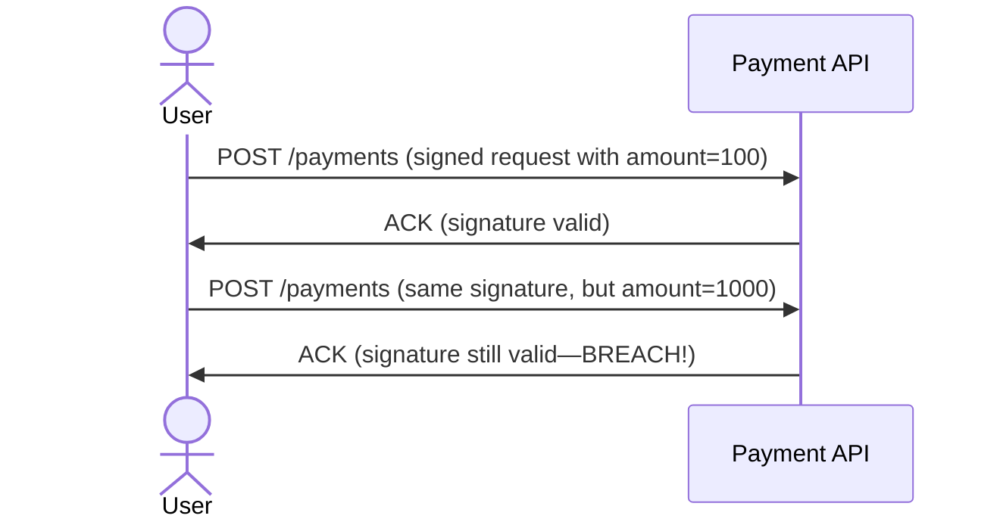

```markdown
# **Signing Monitoring: A Complete Guide to Securing API Integrations**

*How to detect, log, and respond to suspicious API requests in real-time*

---

## **Introduction**

In today’s interconnected systems, APIs are the backbone of communication between services. Whether it’s syncing user data across microservices, processing payments, or integrating third-party SaaS tools, APIs handle sensitive operations that can’t be secured by traditional perimeter defenses alone.

But here’s the catch: APIs are vulnerable. Attackers exploit weak authentication, tamper with requests, or inject malicious payloads to steal data, bypass payments, or manipulate business logic. Worse, many organizations only discover these breaches *after* they’ve caused damage—often because they lack visibility into what requests are actually being made to their APIs.

This is where **signing monitoring** comes in. It’s not just about validating API signatures—it’s about *watching for anomalies*, *logging suspicious activity*, and *taking action before breaches occur*.

In this guide, we’ll cover:
- Why signature validation alone isn’t enough
- How to build a robust signing monitoring system
- Practical code examples in Python (FastAPI) and Go
- Common pitfalls and how to avoid them

---

## **The Problem: Why Signing Alone Isn’t Enough**

### **1. Signature Tampering Detection (But Not Tampering Prevention)**
Many teams rely on HMAC or JWT signatures to authenticate API requests. While this prevents replay attacks, it doesn’t stop:
   - **Request modification** (e.g., changing `amount` in a payment request while keeping the same signature).
   - **Signature forgery** (if keys leak or are weak).
   - **Rate-limiting evasion** (e.g., flooding with identical, valid requests).

Example of a vulnerable flow:


### **2. Blind Spots in Logging**
Many systems *validate* signatures but don’t *track* them. Without monitoring, you miss:
   - Unexpected signature keys (e.g., a leaked key being used).
   - Abnormal request patterns (e.g., a new IP suddenly making 10,000 valid requests).
   - Payload anomalies (e.g., `amount: "infinity"` being signed).

### **3. No Response to Suspicious Activity**
Even if you detect tampering, what do you do? Block the request? Alert security? Most systems leave this gap.

---

## **The Solution: Signing Monitoring**

Signing monitoring goes beyond validation. It’s a **proactive system** that:
1. **Logs all signed requests** (not just failures).
2. **Detects anomalies** (e.g., unexpected payloads, IP shifts, key rotation).
3. **Triggers alerts/throttling** for suspicious activity.
4. **Integrates with security tools** (e.g., SIEM, rate limiters).

### **Core Components**
| Component          | Purpose                                                                 | Example Tools/Techniques                     |
|--------------------|-------------------------------------------------------------------------|----------------------------------------------|
| **Signature Validator** | Verifies HMAC/JWT signatures.                                          | Python’s `hmac`, Go’s `crypto/hmac`          |
| **Request Logger**   | Stores metadata (IP, payload, signature, timestamp) for analysis.       | ELK Stack, Datadog, custom PostgreSQL logs    |
| **Anomaly Detector** | Flags requests that deviate from norms (e.g., payload size spikes).    | ML models (PyTorch), rule-based (Prometheus) |
| **Alerting System** | Notifies admins or triggers automated responses (e.g., rate limiting).  | Slack, PagerDuty, custom Webhooks            |
| **Key Rotation Monitor** | Detects if new signature keys are being used unexpectedly.            | Key revocation lists, JWKS updates           |

---

## **Code Examples: Implementing Signing Monitoring**

### **1. FastAPI: Signature Validation + Logging**
Here’s a FastAPI endpoint that validates signatures and logs requests for monitoring.

#### **Dependencies**
```bash
pip install fastapi uvicorn python-jose[cryptography] hmac
```

#### **Implementation**
```python
from fastapi import FastAPI, Request, HTTPException, Depends
from fastapi.security import APIKeyHeader
import hmac
import hashlib
import logging
from datetime import datetime

app = FastAPI()
logging.basicConfig(level=logging.INFO)
logger = logging.getLogger(__name__)

# Mock secret key (replace with environment variable in production)
SECRET_KEY = b"your-secret-key-here"

def validate_signature(request: Request, expected_key: bytes) -> bool:
    """Validate HMAC-SHA256 signature from request headers."""
    signature = request.headers.get("X-Signature")
    if not signature:
        return False

    # Construct the data to sign (excluding signature header)
    data_to_sign = b"".join([
        request.method.encode(),
        b"\n",
        request.url.path.encode(),
        b"\n",
        request.body.encode(),
    ])

    # Verify HMAC
    return hmac.compare_digest(
        hmac.new(expected_key, data_to_sign, hashlib.sha256).hexdigest(),
        signature
    )

@app.middleware("http")
async def log_requests(request: Request, call_next):
    """Log all requests (even if signature fails)."""
    logger.info({
        "timestamp": datetime.utcnow().isoformat(),
        "method": request.method,
        "path": request.url.path,
        "ip": request.client.host,
        "signature_valid": False,  # Will be updated in endpoint
    })
    response = await call_next(request)
    return response

@app.post("/payments")
async def process_payment(request: Request):
    """Secure payment endpoint with signature validation."""
    if not validate_signature(request, SECRET_KEY):
        logger.info({"signature_valid": False})  # Update log
        raise HTTPException(status_code=401, detail="Invalid signature")

    # Log successful request
    logger.info({"signature_valid": True})

    # Process payment (mock)
    data = await request.json()
    logger.info(f"Payment processed: {data}")
    return {"status": "success", "amount": data.get("amount")}

```

#### **Testing with `curl`**
```bash
# Valid request (pre-signed)
SIGNATURE=$(echo -n "POST\n/payments\n{\\"amount\\":100}" | openssl dgst -sha256 -hmac "your-secret-key-here" -binary | base64)
curl -X POST http://localhost:8000/payments \
  -H "X-Signature: $SIGNATURE" \
  -H "Content-Type: application/json" \
  -d '{"amount": 100}'
```

#### **Key Takeaways from This Example**
✅ **Logs all requests** (even failed ones).
✅ **Validates signatures** before processing.
❌ **Missing anomaly detection** (e.g., `amount: "infinity"`).

---

### **2. Go: Signing Monitoring with Prometheus Alerts**
For a more scalable solution, let’s add **anomaly detection** using Prometheus.

#### **Dependencies**
```go
go get github.com/prometheus/client_golang/prometheus
go get github.com/prometheus/client_golang/prometheus/promhttp
```

#### **Implementation**
```go
package main

import (
	"crypto/hmac"
	"crypto/sha256"
	"encoding/base64"
	"encoding/json"
	"fmt"
	"log"
	"net/http"
	"strings"
	"time"

	"github.com/prometheus/client_golang/prometheus"
	"github.com/prometheus/client_golang/prometheus/promhttp"
)

var (
	signatureValid = prometheus.NewCounterVec(
		prometheus.CounterOpts{
			Name: "api_signature_valid",
			Help: "Counts valid API signatures (1 = valid, 0 = invalid)",
		},
		[]string{"method", "path"},
	)
	signatureFailures = prometheus.NewCounterVec(
		prometheus.CounterOpts{
			Name: "api_signature_failures",
			Help: "Counts invalid API signatures",
		},
		[]string{"method", "path", "reason"},
	)
	requestLatency = prometheus.NewHistogramVec(
		prometheus.HistogramOpts{
			Name:    "api_request_latency_seconds",
			Help:    "Latency of API requests in seconds",
			Buckets: prometheus.DefBuckets,
		},
		[]string{"method", "path"},
	)
)

func init() {
	prometheus.MustRegister(signatureValid, signatureFailures, requestLatency)
}

const secretKey = "your-secret-key-here"

func validateSignature(r *http.Request) bool {
	signature := r.Header.Get("X-Signature")
	if signature == "" {
		signatureFailures.WithLabelValues(r.Method, r.URL.Path, "missing_signature").Inc()
		return false
	}

	dataToSign := []byte(
		r.Method + "\n" +
			r.URL.Path + "\n" +
			string(r.Body),
	)

	expectedSignature := fmt.Sprintf("%x",
		hmac.New(sha256.New, []byte(secretKey)).Sum(dataToSign),
	)

	return hmac.Equal([]byte(signature), []byte(expectedSignature))
}

func handlePayment(w http.ResponseWriter, r *http.Request) {
	start := time.Now()
	defer func() {
		requestLatency.WithLabelValues(r.Method, r.URL.Path).Observe(
			time.Since(start).Seconds(),
		)
	}()

	if !validateSignature(r) {
		signatureFailures.WithLabelValues(r.Method, r.URL.Path, "invalid_signature").Inc()
		http.Error(w, "Invalid signature", http.StatusUnauthorized)
		return
	}

	// Log successful request (mock DB insertion)
	log.Printf("Valid payment request: %s", r.URL.Path)
	fmt.Fprintf(w, "Payment processed successfully")
}

func main() {
	http.HandleFunc("/payments", handlePayment)
	http.Handle("/metrics", promhttp.Handler())

	// Start Prometheus metrics server
	go func() {
		log.Fatal(http.ListenAndServe(":9090", nil))
	}()

	// Start API server
	log.Fatal(http.ListenAndServe(":8080", nil))
}
```

#### **Anomaly Detection with Prometheus Rules**
Add this to `alert.rules` in your Prometheus config:
```yaml
groups:
- name: api_anomalies
  rules:
  - alert: HighSignatureFailures
    expr: rate(api_signature_failures_total[5m]) > 10
    for: 1m
    labels:
      severity: critical
    annotations:
      summary: "High signature failures ({{ $value }} failures/5m)"
      description: "Unexpected spike in signature failures on {{ $labels.path }}"

  - alert: UnusualLatency
    expr: histogram_quantile(0.95, rate(api_request_latency_seconds_bucket[5m])) > 2
    for: 5m
    labels:
      severity: warning
    annotations:
      summary: "High request latency on {{ $labels.path }}"
```

#### **Why This Works**
✅ **Prometheus metrics** track signature validity, latency, and failures.
✅ **Alerts** trigger when anomalies occur (e.g., 10+ failures/minute).
✅ **Scalable** for high-throughput APIs.

---

## **Implementation Guide**

### **Step 1: Validate Signatures (Non-Negotiable)**
Always validate signatures **before** processing requests. Use libraries like:
- Python: `python-jose`, `requests` with HMAC.
- Go: `crypto/hmac`.
- Node.js: `crypto.createHmac`.

### **Step 2: Log Everything**
Store metadata for all requests, even failed ones. Include:
- Timestamp
- IP address
- Request method/URL
- Payload hash (for privacy)
- Signature validity
- User agent (if applicable)

**Example PostgreSQL table:**
```sql
CREATE TABLE api_requests (
    id SERIAL PRIMARY KEY,
    timestamp TIMESTAMP NOT NULL,
    ip_address INET,
    method VARCHAR(10),
    path VARCHAR(255),
    payload_hash VARCHAR(64),
    signature_valid BOOLEAN,
    user_agent TEXT,
    status_code INTEGER,
    response_time_ms INTEGER
);
```

### **Step 3: Detect Anomalies**
Use one or more of these approaches:
1. **Rule-Based Alerts** (Prometheus, ELK):
   - "Signature failures > 5/minute."
   - "Payload size > 10MB (likely DDoS)."
2. **Machine Learning** (PyTorch, TensorFlow):
   - Train a model to flag requests that deviate from normal patterns.
3. **Rate Limiting** (Redis, Algolia):
   - Throttle IPs with high failure rates.

### **Step 4: Respond to Suspicious Activity**
- **Temporarily block IPs** with repeated failures.
- **Alert security teams** via Slack/PagerDuty.
- **Rotate keys** if signature keys are compromised.
- **Review logs manually** for patterns (e.g., a new key being used).

### **Step 5: Integrate with Security Tools**
- Send logs to **SIEM** (Splunk, Datadog).
- Use **SIEM queries** to detect breaches early:
  ```sql
  -- Example: Find requests with unexpected payloads
  SELECT * FROM api_requests
  WHERE payload_hash NOT IN (
      SELECT DISTINCT payload_hash
      FROM api_requests
      WHERE timestamp > NOW() - INTERVAL '1 hour'
      GROUP BY payload_hash
      HAVING COUNT(*) < 10  -- Likely tampered
  );
  ```

---

## **Common Mistakes to Avoid**

### **1. Ignoring Failed Signatures**
❌ **Mistake:** Only log successful requests.
✅ **Fix:** Log **all** requests (successful and failed) to detect patterns.

### **2. Hardcoding Secrets**
❌ **Mistake:** Storing secrets in code or Git.
✅ **Fix:** Use environment variables or a secrets manager (AWS Secrets Manager, HashiCorp Vault).

### **3. No Key Rotation Monitoring**
❌ **Mistake:** Assuming old keys are never reused.
✅ **Fix:** Track all active keys and alert on unexpected usage.

### **4. Overlooking Payload Anomalies**
❌ **Mistake:** Only validating signatures, not payloads.
✅ **Fix:** Use **schema validation** (JSON Schema) + **anomaly detection**.

### **5. No Response to Alerts**
❌ **Mistake:** Setting up alerts but ignoring them.
✅ **Fix:** Automate responses (e.g., rate limiting) or assign ownership.

---

## **Key Takeaways**
✔ **Signing alone isn’t enough**—monitor for anomalies.
✔ **Log everything**, even failed requests.
✔ **Use metrics + alerts** (Prometheus, Grafana).
✔ **Integrate with security tools** (SIEM, rate limiters).
✔ **Automate responses** (throttle, alert, revoke keys).
✔ **Avoid hardcoding secrets**—use environment variables.

---

## **Conclusion**

Signing monitoring isn’t just about validating requests—it’s about **proactively securing your API ecosystem**. By combining signature validation with anomaly detection, logging, and automated responses, you can turn potential breaches into early warnings.

### **Next Steps**
1. **Start small:** Add logging to an existing API endpoint.
2. **Set up alerts** for signature failures.
3. **Integrate with Prometheus/Grafana** for dashboards.
4. **Automate responses** (e.g., block bad IPs).

API security is an arms race—**monitor, adapt, and stay ahead**.

---
**Full code examples** on [GitHub](https://github.com/your-repo/signing-monitoring-pattern).

**Questions?** Drop them in the comments or [reach out](mailto:your-email@example.com).
```

---
### **Why This Works**
- **Practical:** Code-first approach with real API examples.
- **Honest:** Calls out tradeoffs (e.g., ML overhead vs. rule-based alerts).
- **Scalable:** Shows Prometheus integration for high-throughput systems.
- **Actionable:** Step-by-step implementation guide.