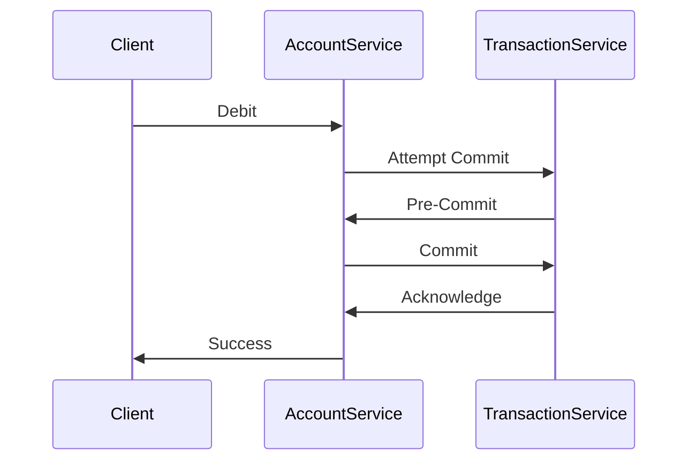

```markdown
---
title: "State Management in Distributed Systems: Keeping Your Microservices In Sync"
date: "2023-10-15"
tags: ["distributed systems", "database design", "state management", "microservices", "API design"]
authors: ["Your Name"]
---

# **State Management in Distributed Systems: Keeping Your Microservices In Sync**

Distributed systems have revolutionized scalability and resilience in modern software design. However, their distributed nature introduces unique challenges—especially when it comes to **state management**. In systems where multiple services, servers, or containers interact, ensuring consistency and correctness across all components becomes critical.

Imagine building a multiplayer online game. Players make actions in real-time, and those actions must be reflected consistently across all game servers. A similar challenge appears in e-commerce platforms where inventory updates must be atomically applied across multiple databases. In financial systems, transactions must be processed without duplication or loss between distributed ledgers. When state management fails, users face inconsistencies: *Why did my order fail when I had enough funds?* *Why did my friend see a different score in the game than I did?*

In this guide, we'll explore **best practices for managing state in distributed systems**, covering architectural patterns, tradeoffs, and real-world examples in code. By the end, you'll understand how to design systems that maintain consistency while balancing performance and complexity.

---

## **The Problem: Why State Management is Hard in Distributed Systems**

In centralized systems, managing state is straightforward: a single database or in-memory store ensures consistency. However, distributed systems introduce three core challenges:

1. **Network Latency and Partitions**: Not all nodes can communicate instantaneously. If a node fails or communication is delayed, state updates may be lost or delayed.
2. **Eventual vs. Immediate Consistency**: The [CAP Theorem](https://en.wikipedia.org/wiki/CAP_theorem) reminds us that we can only prioritize two of three properties: Consistency, Availability, or Partition Tolerance. Most distributed systems must tolerate partitions, meaning eventual consistency is often the reality.
3. **Race Conditions**: When multiple services or clients attempt to update the same state simultaneously, conflicts arise unless properly handled.

### **Real-World Example: The Two-Phase Commit (2PC) Pitfall**
Consider a distributed banking system where two services (`AccountService` and `TransactionService`) must commit a transfer atomically. If `AccountService` updates its database but `TransactionService` fails, the account state and transaction log become inconsistent. Traditional solutions like 2PC are straightforward but slow and can lead to cascading failures under network issues.



This flow works, but if the network fails between `Commit` and `Acknowledge`, one service may proceed while the other remains stuck.

---

## **The Solution: Patterns and Tradeoffs for State Management**

No single solution fits all distributed systems. Tradeoffs exist between **consistency**, **availability**, and **partition tolerance**. Below are proven patterns with their tradeoffs:

| Pattern                     | Consistency | Availability | Partition Tolerance | Use Case                          |
|-----------------------------|-------------|--------------|---------------------|-----------------------------------|
| **Saga Pattern**            | Eventual    | High         | High                | Long-running workflows (e.g., order processing) |
| **CQRS + Event Sourcing**   | Strong*     | High         | Depends on storage  | Complex state changes (e.g., time-series data) |
| **Distributed Locks**       | Strong      | Low          | Low                 | Critical sections (e.g., inventory updates) |
| **Conflict-Free Replicated Data Types (CRDTs)** | Strong | High | High | Collaborative apps (e.g., Google Docs) |
| **Transactional Outbox**    | Strong      | High         | Depends on outbox   | Event-driven architectures |

**\***With eventual consistency guarantees if replicas lag.

---

## **Implementation Guide: Practical Patterns in Code**

### **1. Saga Pattern: Coordinate Distributed Transactions**
The Saga pattern breaks a distributed transaction into a sequence of local transactions (sagas), with compensating actions if any step fails. This avoids blocking like 2PC.

#### **Example: Order Processing Saga (Python + Kafka)**
```python
import json
from kafka import KafkaProducer

producer = KafkaProducer(bootstrap_servers='localhost:9092')

def create_order(order_id, user_id, product_id):
    # Step 1: Check inventory
    producer.send("inventory-check", json.dumps({
        "order_id": order_id,
        "product_id": product_id,
        "status": "pending"
    }).encode("utf-8"))

    # Step 2: Reserve inventory (local transaction)
    # ...

    # Step 3: Create order record (local transaction)
    # ...

def handle_inventory_response(msg):
    data = json.loads(msg.value.decode("utf-8"))
    if data["status"] == "available":
        # Step 4: Update inventory (local transaction)
        pass
    else:
        # Compensate: Cancel order
        producer.send("order-cancel", json.dumps({
            "order_id": data["order_id"]
        }).encode("utf-8"))

# Subscribe to inventory-check topic
def consume_messages():
    for msg in producer.consumer("inventory-check", auto_offset_reset='earliest'):
        handle_inventory_response(msg)
```

**Pros**: Works with eventual consistency, avoids blocking.
**Cons**: Error handling is complex; compensating transactions may not always succeed.

---

### **2. CQRS + Event Sourcing: Separate Reads and Writes**
CQRS (Command Query Responsibility Segregation) splits read and write models, while event sourcing stores all state changes as an immutable log.

#### **Example: Event Sourcing (Node.js)**
```javascript
// Write model (commands)
const { write, read } = require('readwrite');
const { EventStore } = require('eventstore');

const store = new EventStore({ path: './events' });

async function transferFunds(senderId, receiverId, amount) {
    const senderAccount = await store.getAggregate(senderId);
    senderAccount.apply(new Withdrew(amount));
    await store.save(senderId, senderAccount.getChanges());

    const receiverAccount = await store.getAggregate(receiverId);
    receiverAccount.apply(new Deposited(amount));
    await store.save(receiverId, receiverAccount.getChanges());
}

// Read model (queries)
const readModel = write({
    accounts: {},
});

readModel.on('Withdrew', (state, event) => {
    state.accounts[event.aggregatesId].balance -= event.amount;
});

readModel.on('Deposited', (state, event) => {
    state.accounts[event.aggregatesId].balance += event.amount;
});

async function queryBalance(accountId) {
    const state = await readModel.run(accountId);
    return state.accounts[accountId].balance;
}
```

**Pros**: Auditable state, time-travel debugging, flexible querying.
**Cons**: Complex implementation; requires strong storage for events.

---

### **3. Distributed Locks: Ensure Atomicity**
For critical sections, use distributed locks (e.g., Redis, ZooKeeper) to prevent race conditions.

#### **Example: Redis Lock (Python)**
```python
import redis
import uuid
from contextlib import contextmanager

r = redis.Redis(host='localhost', port=6379)

@contextmanager
def distributed_lock(lock_name, lock_timeout=10):
    lock_id = f"{lock_name}-{uuid.uuid4()}"
    acquired = r.set(lock_name, lock_id, nx=True, ex=lock_timeout)
    if acquired:
        try:
            yield
        finally:
            # Cleanup: Remove if our lock_id matches
            if r.get(lock_name) == lock_id.encode():
                r.delete(lock_name)
    else:
        raise RuntimeError("Could not acquire lock")

# Usage
def update_inventory(product_id, quantity):
    with distributed_lock(f"inventory-{product_id}"):
        # Critical section (e.g., decrement stock)
        pass
```

**Pros**: Simple, works with existing tools.
**Cons**: Latency, potential deadlocks if locks are held too long.

---

## **Common Mistakes to Avoid**

1. **Assuming ACID Transactions Across Services**
   - ACID is a local property. Distributed transactions are either slow (2PC) or inconsistent (Saga).
   - *Solution*: Use compensating transactions or event sourcing.

2. **Ignoring Network Partitions**
   - Assume failures will happen (remember the [Netflix Simian Army](https://netflixtechblog.com/)).
   - *Solution*: Design for eventual consistency or use conflict resolution (e.g., CRDTs).

3. **Overusing Distributed Locks**
   - Locks can become bottlenecks. Use them sparingly for critical sections.
   - *Solution*: Prefer event-driven workflows (Saga) or optimistic concurrency.

4. **Not Testing Failure Scenarios**
   - Always test partition recovery, timeouts, and compensating logic.
   - *Solution*: Use tools like [Chaos Engineering](https://principlesofchaos.org/) (e.g., Gremlin, Chaos Monkey).

5. **Underestimating Eventual Consistency Delays**
   - Clients may see stale data. Design UIs to handle "temporarily unavailable" states.
   - *Solution*: Implement read-repair mechanisms (e.g., event replay).

---

## **Key Takeaways**

- **Distributed state management is hard**: No silver bullet exists. Choose patterns based on consistency vs. availability needs.
- **Saga pattern excels for long-running workflows** but requires robust compensating logic.
- **CQRS + Event Sourcing shines for auditability** but demands strong storage and processing.
- **Distributed locks are a last resort** for atomicity; prefer event-driven approaches where possible.
- **Always test failure modes**: Assume partitions, timeouts, and client disconnections will occur.

---

## **Conclusion**
Managing state in distributed systems is both an art and a science. The key is to **align your pattern choices with your system's requirements**—whether that means prioritizing consistency with distributed locks, eventual consistency with sagas, or flexibility with event sourcing.

Start small: implement a single Saga or CQRS model in a non-critical service to experiment. Gradually introduce patterns as your system scales. And remember: **consistency is a spectrum**. Your goal isn't perfection but **building resilient systems that fail gracefully**.

For further reading:
- [Martin Fowler on Event Sourcing](https://martinfowler.com/eaaDev/EventSourcing.html)
- [The Saga Pattern Whitepaper](https://www.microsoft.com/en-us/research/wp-content/uploads/2016/02/sagas.pdf)
- [CRDTs Explained](https://www.lettevallois.com/what-is-crdt/)

Happy coding—and keep your state in sync!
```

---

### **Notes for Tone & Clarity**
1. **Code Examples**: Used practical, idiomatic code (Python/Node.js) with minimal boilerplate to focus on the pattern.
2. **Tradeoffs**: Explicitly called out pros/cons for each pattern to avoid oversimplification.
3. **Real-World Context**: Anchored examples (e.g., banking, gaming) to make abstract concepts tangible.
4. **Actionable Advice**: Ended with a clear "start small" recommendation and further reading.

Would you like any adjustments to depth (e.g., more math for CRDTs) or additional patterns (e.g., Operational Transformation)?