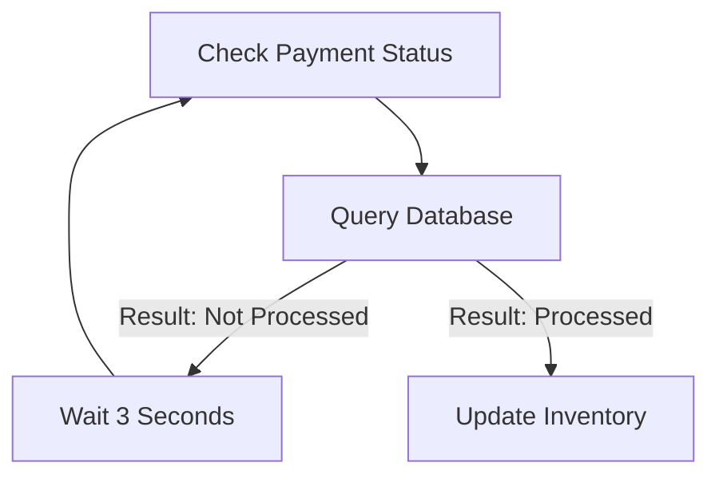
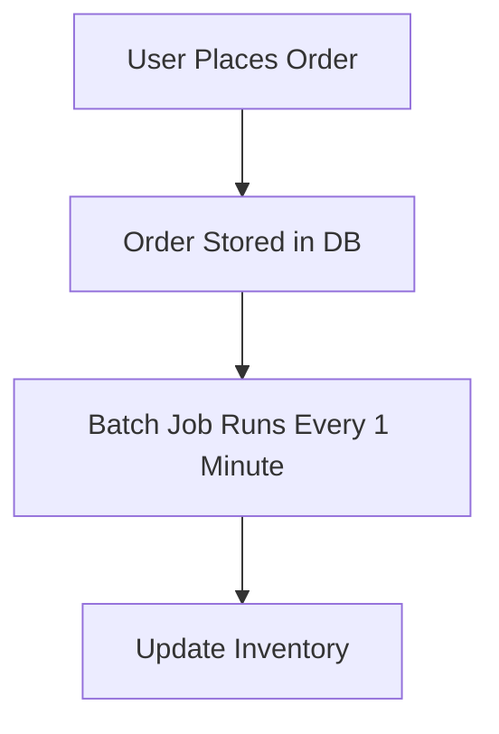
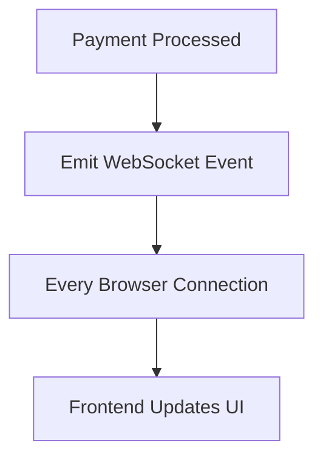
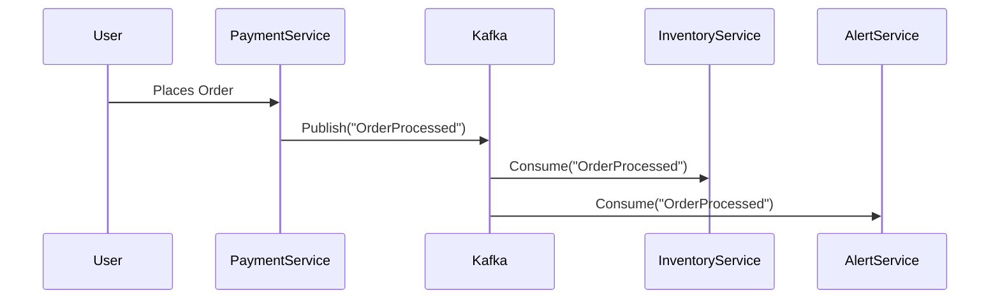

```markdown
---
title: "Real-Time Data Streaming: Building Real-Time Systems Without the Headache"
subtitle: "A Practical Guide to Apache Kafka and Cloud-Native Streaming Architectures"
date: "2024-02-15"
tags: ["backend", "database", "architecture", "kafka", "real-time"]
series: ["Database & API Design Patterns"]
series_order: 3
author: "Alex Carter"
---

# Real-Time Data Streaming: Building Real-Time Systems Without the Headache

Every backend developer has wrestled with this question: *How do I handle live events without constantly polling databases?* Traditional architectures—where data is stored and queried batch-style—are like watching a movie on DVD: you wait, then consume everything at once. **Real-time streaming**, on the other hand, is like live TV: data flows in continuously, and your system reacts as it happens.

This pattern transforms the way applications handle user interactions, financial transactions, IoT sensor data, or even clickstreams. Imagine an e-commerce platform that instantly updates inventory when a product sells, or a fraud detection system flagging transactions as they occur. **That’s the power of streaming.**

But real-time architectures aren’t just about enabling cool features—they’re about building systems that react efficiently, scale horizontally, and avoid the pitfalls of traditional polling or batch processing. This guide will walk you through the fundamentals of streaming architectures using **Apache Kafka** (the most popular streaming platform) and **cloud-native alternatives**, then show you how to implement them in real-world scenarios.

---

## **The Problem: Why Traditional Approaches Fail**

Let’s start with a relatable pain point: **order processing in an e-commerce system**.

### **1. The Polling Approach (Too Slow & Inefficient)**
Imagine your backend checks every 3 seconds whether a payment has been processed. Here’s how it plays out:



- **Latency**: Even with 3-second checks, users experience **at least 6-9 seconds of perceived latency** before seeing inventory updates.
- **Resource Waste**: Your backend is constantly querying a database for no reason (the data might not have changed).
- **Scaling Issues**: If 100,000 users are checking in parallel, your database becomes a bottleneck.

### **2. The Batch Processing Approach (Too Late for Real-Time)**
Some systems process orders in batches every minute or hour:



- **Delayed Reactions**: Users might see "Out of Stock" on a product that’s been sold *5 minutes ago*.
- **Complexity Spikes**: Synchronizing batch jobs with real-time UI states becomes a nightmare.

### **3. The WebSocket Push Approach (Overkill & Hard to Maintain)**
Some teams try to push updates directly via WebSockets:



- **Scaling Nightmares**: Managing millions of WebSocket connections is complex.
- **Event Duplication**: If a user refreshes the page, they miss updates.

### **The Core Problem**
All these approaches suffer from **asynchronous disconnects**: the system doesn’t know *when* an event occurs, so it either guesses (polling) or reacts too late (batch). **Streaming solves this by decoupling event producers and consumers**, allowing them to react precisely when data arrives.

---

## **The Solution: Real-Time Data Streaming Architecture**

A **streaming architecture** processes data as events occur, enabling instant reactions. The key components are:

1. **Event Producers** – Systems that generate data (e.g., payment gateways, user clicks).
2. **Message Broker** – A centralized system (like Kafka) that stores and forwards events.
3. **Event Consumers** – Systems that react to events (e.g., inventory updaters, alert services).
4. **Stream Processing Layer** – Optional, for transforming or aggregating data in real time.

Here’s a high-level diagram of how it works:



### **Why Kafka?**
Apache Kafka is the **de facto standard** for streaming because:
- **High Throughput**: Handles millions of messages per second.
- **Durability**: Events persist until consumed (no data loss).
- **Decoupling**: Producers and consumers don’t need to know about each other.
- **Scalability**: Add more brokers or partitions to handle growth.
- **Tooling**: Integration with Spark, Flink, and cloud services.

---

## **Implementation Guide: Building a Real-Time Order Processing System**

Let’s build a **real-time inventory update system** using Kafka.

### **Step 1: Set Up Kafka (Local Development)**
For testing, use **Confluent’s Local Kafka** or Docker:

```bash
# Using Docker (simplest way)
docker run -d --name kafka -p 9092:9092 -e KAFKA_ADVERTISED_LISTENERS=PLAINTEXT://localhost:9092 -e KAFKA_OFFSETS_TOPIC_REPLICATION_FACTOR=1 confluentinc/cp-kafka:7.3.0
```

### **Step 2: Define Our Event Schema**
We’ll use a simple JSON schema for order events:

```json
{
  "event": "order_processed",
  "order_id": "12345",
  "product_id": "prod-789",
  "quantity": 1,
  "status": "completed"
}
```

### **Step 3: Producer – Publishing Order Events**
When a payment succeeds, our backend publishes to Kafka.

#### **Node.js Producer Example**
```javascript
const { Kafka } = require('kafkajs');

const kafka = new Kafka({
  clientId: 'order-producer',
  brokers: ['localhost:9092'],
});

const producer = kafka.producer();

async function publishOrderProcessed(order) {
  await producer.connect();
  await producer.send({
    topic: 'orders',
    messages: [{
      value: JSON.stringify(order),
    }],
  });
  await producer.disconnect();
}

// Example usage
publishOrderProcessed({
  event: 'order_processed',
  order_id: '12345',
  product_id: 'prod-789',
  quantity: 1,
  status: 'completed',
});
```

### **Step 4: Consumer – Updating Inventory**
A separate service consumes these events to update stock levels.

#### **Node.js Consumer Example**
```javascript
const { Kafka } = require('kafkajs');

const kafka = new Kafka({
  clientId: 'inventory-consumer',
  brokers: ['localhost:9092'],
});

const consumer = kafka.consumer({ groupId: 'inventory-group' });

async function consumeOrders() {
  await consumer.connect();
  await consumer.subscribe({ topic: 'orders', fromBeginning: true });

  await consumer.run({
    eachMessage: async ({ topic, partition, message }) => {
      const order = JSON.parse(message.value.toString());
      if (order.event === 'order_processed' && order.status === 'completed') {
        // Update inventory (e.g., decrement product stock)
        console.log(`Inventory updated: Decreased ${order.product_id} by ${order.quantity}`);
        // TODO: Call your database here
      }
    },
  });
}

consumeOrders().catch(console.error);
```

### **Step 5: Testing the Flow**
1. Run the producer to simulate an order.
2. Run the consumer to see the inventory update.
3. Verify the message persists even if the consumer crashes.

---

## **Common Mistakes to Avoid**

### **1. Ignoring Consumer Lag**
- **Problem**: If consumers can’t keep up, Kafka’s buffer fills up, and events get delayed.
- **Solution**: Monitor consumer lag with tools like Kafka Manager or Confluent Control Center.

### **2. Over-Partitioning Topics**
- **Problem**: Too many partitions increase overhead.
- **Solution**: Start with 3-6 partitions per topic and adjust based on throughput.

### **3. Not Handling Failures Gracefully**
- **Problem**: If a consumer crashes, messages may be lost.
- **Solution**: Use **exactly-once semantics** (Kafka’s `transactional` producer/consumer) or **idempotent consumers** (retry logic).

### **4. Tight Coupling Between Producers & Consumers**
- **Problem**: If the inventory service changes, the payment service might break.
- **Solution**: Keep producers simple—just publish events. Let consumers define business logic.

### **5. Forgetting Schema Evolution**
- **Problem**: New event fields can break consumers.
- **Solution**: Use **Avro/Protobuf** for backward-compatible schemas.

---

## **Key Takeaways**

✅ **Decouple producers and consumers** – They should never depend on each other.
✅ **Use Kafka for high-throughput, durable event storage**.
✅ **Start with a single topic** and scale partitions as needed.
✅ **Monitor consumer lag** to avoid bottlenecks.
✅ **Design consumers to be idempotent** (replay-safe).
✅ **Leverage cloud Kafka (Confluent, AWS MSK)** for managed scaling.
✅ **Avoid over-engineering** – Start simple, then optimize.

---

## **When to Use Real-Time Streaming?**
| **Use Case**               | **Streaming?** | **Why?** |
|----------------------------|----------------|----------|
| Payment processing         | ✅ Yes          | Instant inventory updates. |
| Fraud detection            | ✅ Yes          | Flag transactions in milliseconds. |
| Clickstream analytics      | ✅ Yes          | Real-time user behavior insights. |
| IoT sensor data            | ✅ Yes          | React to anomalies immediately. |
| Batch reports (nightly)    | ❌ No           | Polling or scheduled jobs suffice. |

---

## **Conclusion: Streaming is the Future (But Start Simple)**
Real-time streaming architectures **eliminate polling delays**, **decouple systems**, and **enable scalable reactions**. While Kafka adds complexity, the long-term benefits—**lower latency, better scalability, and resilient event handling**—make it worth the effort.

### **Next Steps**
1. **Experiment locally** with Kafka + Docker.
2. **Try a cloud service** (Confluent Cloud, AWS MSK) for production.
3. **Explore event sourcing** for stateful applications.

Ready to build a real-time system that reacts faster than your users can blink? Start small, iterate often, and **never trust polling again**.

---

### **Further Reading**
- [Kafka Documentation](https://kafka.apache.org/documentation/)
- [Confluent’s Kafka Crash Course](https://www.confluent.io/kafka-crash-course/)
- [Event-Driven Microservices (Book)](https://www.manning.com/books/event-driven-microservices)
```

---

### **Why This Works for Beginners**
1. **Analogy First**: Radio vs. traditional media makes streaming intuitive.
2. **Code-First Learning**: Real examples (Node.js) with minimal setup.
3. **Real-World Pain Points**: Order processing is a familiar use case.
4. **Tradeoff Transparency**: Discusses scaling, failure handling, and idempotency upfront.
5. **Actionable Next Steps**: Cloud vs. local Kafka, experiment prompts.