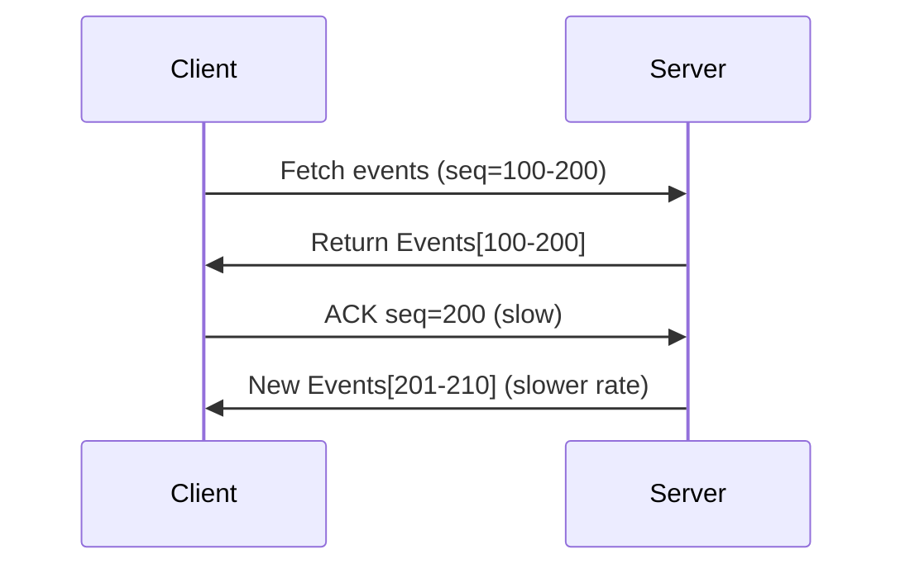

```markdown
# **Mastering the Streaming Conventions Pattern: A Backend Developer’s Guide**

*How to design scalable APIs and databases for real-time data without the chaos*

---

## **Introduction**

Real-time features—live updates, notifications, chat, and analytics—are the backbone of modern applications. But streaming data efficiently between clients and servers isn’t just about throwing raw events into a queue. Without proper **streaming conventions**, you risk inconsistent data, scalability bottlenecks, and debugging nightmares.

This tutorial dives deep into the **Streaming Conventions** pattern—a set of best practices for structuring streams of events, messages, or updates in a way that’s **predictable, reliable, and performant**. Whether you’re building a chat app, financial transaction processor, or IoT system, these conventions will save you from the common pitfalls of ad-hoc streaming solutions.

We’ll explore:
✅ **Why raw streaming leads to chaos** (and how conventions fix it)
✅ **Core components of streaming conventions** (with code examples)
✅ **Practical implementation** in databases and APIs
✅ **Anti-patterns to avoid** (yes, even with streaming conventions)

Let’s get started.

---

## **The Problem: Streaming Without Conventions**

Imagine a financial system where stock price updates are streamed to clients in real time. Without rules, you might end up with:

1. **Duplicate events** – A price update sent twice because of a retried message.
2. **Out-of-order updates** – A client receives a `$100` update before a `$50` one, breaking assumptions.
3. **Unreadable payloads** – Events lack metadata, making debugging impossible.
4. **Performance spikes** – Sudden bursts of traffic overwhelm the system.

These are symptoms of **streaming without conventions**. Without explicit agreements on *how* data is emitted, *what* data is included, and *how* clients process it, even well-designed systems fail under pressure.

### **Real-World Example: The Chat App Nightmare**
A chat app streams messages as they arrive. But if:
- Some messages include timestamps, others don’t.
- Some clients receive `message_id: 42` before `message_id: 41`.
- A client reconnects and misses the last 10 messages—how do they catch up?

Without conventions, this becomes a **technical debt bomb**.

---

## **The Solution: Streaming Conventions**

Streaming conventions are **design patterns** that standardize how streams are:
1. **Structured** (payload format, metadata)
2. **Ordered** (sequence guarantees)
3. **Delivered reliably** (retries, deduplication)

Think of them as **"HTTP for streams"**—clear rules for request/response, with added guarantees for real-time data.

### **Core Principles**
1. **Standardized Event Schema** – Every event has a predictable structure.
2. **Total Ordering** – Events are emitted in a deterministic sequence.
3. **Idempotency** – Retries don’t cause duplicate side effects.
4. **Backpressure Handling** – The system slows down if clients can’t keep up.
5. **Client Reconnection Logic** – Missing updates are recoverable.

---

## **Components of Streaming Conventions**

### **1. Event Schema**
Every event should follow a **consistent format**. Example for a chat message:

```json
{
  "event_type": "message_sent",
  "message_id": "msg_12345",
  "sender_id": "user_6789",
  "timestamp": "2024-03-15T14:30:00Z",
  "content": "Hello, world!",
  "sequence_number": 42,
  "checksum": "abc123..."
}
```

**Why this matters:**
- Clients parse events uniformly.
- Logs and monitoring tools can search by `event_type`.

---

### **2. Sequence Numbers & Ordering**
To avoid out-of-order events, assign a **monotonically increasing sequence number**:

```sql
-- PostgreSQL example: Track sequence numbers per user
CREATE TABLE user_streams (
  user_id VARCHAR(36) PRIMARY KEY,
  current_sequence_number BIGINT NOT NULL DEFAULT 0
);

-- When emitting an event:
INSERT INTO user_streams (user_id, current_sequence_number)
VALUES ('user_6789', 43)
ON CONFLICT (user_id) DO UPDATE
SET current_sequence_number = EXCLUDED.current_sequence_number;
```

**Alternative (for global streams):**
```sql
CREATE SEQUENCE msg_sequence START 1;
INSERT INTO messages (id, sequence_num, content)
VALUES (DEFAULT, nextval('msg_sequence'), 'Hello!');
```

---

### **3. Deduplication via Checksums/IDs**
Prevent duplicates by:
- **Assigning unique IDs** (`message_id` above).
- **Including cryptographic checksums** (e.g., SHA-256 of payload).

```python
# Example in Python (using `crc32` for checksum)
import zlib
import hashlib

def generate_checksum(data: str) -> str:
    return hashlib.sha256(data.encode()).hexdigest()
```

---

### **4. Backpressure: Sliding Window Acknowledgment**
Clients should **acknowledge** received events. If they lag, the server slows down:



**Implementation (Node.js example):**
```javascript
// Server: Track last ACK per client
const clientAcks = new Map();

function handleClientEvent(clientId, seqNum) {
  if (clientAcks.has(clientId)) {
    const lastAck = clientAcks.get(clientId);
    if (seqNum > lastAck) {
      clientAcks.set(clientId, seqNum);
      // Resume sending at seqNum + 1
    }
  }
}
```

---

### **5. Reconnection: State Recovery**
When a client reconnects, it needs to **catch up** without reprocessing everything. Solutions:
- **Persistent cursors** (save last seen sequence).
- **Log compaction** (store only recent events in memory).

```sql
-- Redis example: Track last seen sequence per client
SET user_6789:last_seq 42
```

---

## **Implementation Guide**

### **Step 1: Choose a Database Backend**
| Backend          | Use Case                          | Streaming Features                     |
|------------------|-----------------------------------|----------------------------------------|
| **PostgreSQL**   | High reliability, complex queries | Logical decoding, pagable streams     |
| **MongoDB**      | Flexible schemas                  | Change streams (`oplog`)               |
| **Redis**        | Low-latency, real-time            | Pub/Sub, streams for simple ordering   |
| **Kafka**        | High-throughput, distributed      | Exactly-once semantics, partitioning   |

---

### **Step 2: API Design for Streams**
Use **long-polling** or **Server-Sent Events (SSE)** for unidirectional streams:

#### **Option A: SSE (Simple, Http-Only)**
```http
GET /stream/messages?since=msg_123
Content-Type: text/event-stream

event: message
id: msg_456
data: {"content":"Hi!", "timestamp":"2024-03-15T15:00:00Z"}
```

#### **Option B: WebSocket (Bidirectional)**
```javascript
// Client-side WebSocket handler
const socket = new WebSocket('wss://api.example.com/stream');
socket.onmessage = (event) => {
  const data = JSON.parse(event.data);
  if (data.event_type === 'message') {
    // Process message
  }
};
```

---

### **Step 3: Database Schema**
```sql
-- PostgreSQL: Track stream metadata
CREATE TABLE streams (
  stream_name VARCHAR(100) PRIMARY KEY,
  last_sequence_number BIGINT NOT NULL DEFAULT 0
);

-- Events table with ordering
CREATE TABLE events (
  event_id UUID PRIMARY KEY,
  stream_name VARCHAR(100) REFERENCES streams(stream_name),
  sequence_number BIGINT NOT NULL,
  payload JSONB NOT NULL,
  emitted_at TIMESTAMP WITH TIME ZONE DEFAULT NOW(),
  checksum VARCHAR(64) NOT NULL
);

-- Index for fast scans by sequence
CREATE INDEX idx_events_sequence ON events(stream_name, sequence_number);
```

---

## **Common Mistakes to Avoid**

### **1. No Sequence Numbers → Out-of-Order Chaos**
❌ **Bad:**
```json
[ { "seq": 5 }, { "seq": 3 } ]  // Oops, out of order!
```
✅ **Fix:** Use **monotonic sequence numbers** (even if gaps exist).

### **2. No Deduplication → Duplicate Side Effects**
❌ **Bad:**
- A bank transfer is processed twice.
- A chat message is displayed twice.

✅ **Fix:** Use **unique IDs + checksums**.

### **3. Ignoring Backpressure → Memory Bloating**
❌ **Bad:**
```python
# Server sends 1000 events, client can’t keep up → OOM
for event in db_events:
    send_to_client(event)
```

✅ **Fix:** **Rate-limit based on client ACKs**.

### **4. No Reconnection Strategy → Lost Updates**
❌ **Bad:**
- Client reconnects → misses last 100 events.

✅ **Fix:** **Save last seen sequence per client**.

---

## **Key Takeaways**

✔ **Standardize event formats** (JSON schema, metadata).
✔ **Enforce ordering** (sequence numbers, timestamps).
✔ **Prevent duplicates** (unique IDs, checksums).
✔ **Handle backpressure** (client ACKs, rate limiting).
✔ **Support reconnection** (persistent state, cursors).

⚠ **Tradeoffs:**
- **Conventions add complexity** (but prevent spaghetti code).
- **Overhead for small use cases** (e.g., a simple chat may not need Kafka).

---

## **Conclusion**

Streaming conventions transform chaotic real-time data into a **reliable, maintainable** system. By following these patterns—standardized schemas, sequence numbers, deduplication, and backpressure handling—you’ll build APIs and databases that scale without breaking.

**Next steps:**
1. Pick a backend (PostgreSQL, Redis, Kafka) and experiment.
2. Start small: Add sequence numbers to a chat app.
3. Gradually introduce backpressure and reconnection logic.

Happy streaming!
```

---
**Further Reading:**
- [PostgreSQL Logical Decoding](https://www.postgresql.org/docs/current/logical-replication.html)
- [Kafka Streams API](https://kafka.apache.org/documentation/streams/)
- [SSE RFC](https://html.spec.whatwg.org/multipage/server-sent-events.html)