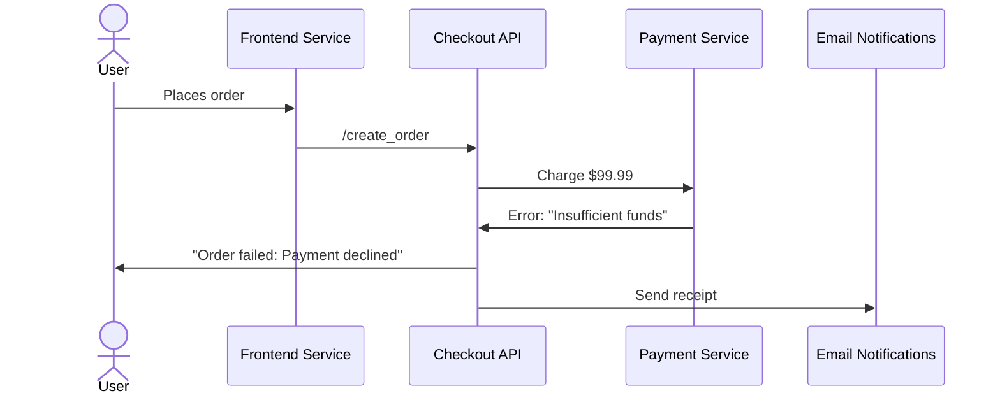

```markdown
---
title: "Streaming Debugging: Mastering Real-Time Debugging for Distributed Systems"
date: "2023-11-15"
tags: ["backend", "debugging", "distributed systems", "streaming", "observability"]
---

# Streaming Debugging: Mastering Real-Time Debugging for Distributed Systems

Debugging distributed systems is a unique beast. You’re not just chasing down bugs—you’re wading through sprawling event streams, orchestrated workflows, and ephemeral state across services. Traditional logging practices leave you with logs generated after-the-fact, which means you often arrive too late to catch problems before they snowball.

Maybe you’ve found yourself in one of these scenarios:

- A payment transaction fails silently in production, but your logs are scattered across three services.
- A Kafka topic floods with errors, but the root cause is buried in a downstream microservice.
- A real-time recommendation system fails to serve users, and your logs only show the final output—not the misbehaving steps in between.

With **streaming debugging**, you gain a live, interactive window into these systems. Instead of hunting for logs after a problem occurs, you **stream data and debug concurrently**. This approach is particularly powerful for event-driven architectures, real-time processing pipelines, and distributed workflows where state changes dynamically.

In this guide, we’ll explore:
- Why traditional debugging falls short in streaming/real-time systems.
- How streaming debugging works and its key components.
- Real-world code examples in Python and Go (with Kafka, Kafka Streams, and Flink).
- Pitfalls to avoid when implementing streaming debugging.

By the end, you’ll have a practical toolkit for debugging production-grade streaming applications.
---

## The Problem: When Logs Aren’t Enough

### The Hidden Complexity of Distributed Systems

In monolithic applications, debugging was simpler: a single process, a single call stack, and logs that followed a predictable flow. But distributed systems introduce **temporal decoupling**—services run independently, communicate asynchronously via events or messages, and often maintain only partial state of the system.

Consider this scenario:


If the payment service declines the order, the logs from `Notifications` might not show why. Worse, if you’re debugging this after the fact, you’ll have to reconstruct the flow manually—**which isn’t scalable**.

### The Limitations of Static Logging

Logs are **declarative**—they describe what happened after the fact. But real-time systems require **interactive**, **streaming** debugging:
- **Latency**: Logs are generated after events complete; you miss the moment things go wrong.
- **Volume**: Debugging a Kafka topic with 100K+ events/min is impractical with traditional `tail`.
- **Context**: Without snapshots or in-memory inspection, you can’t see intermediate state.

### When Debugging Costs Too Much

Debugging distributed systems often involves:
- **Reproducing bugs** in staging, which may not match production behavior.
- **Relying on observability tools**, but getting lost in metrics and traces without real-time access to raw data.

Streaming debugging bridges this gap by **letting you observe and interact with data streams in real time**.

---

## The Solution: Streaming Debugging

### What Is Streaming Debugging?

Streaming debugging is the practice of:
1. **Capturing live data streams** (messages, events, application state).
2. **Providing interactive access** to this data (filters, transformations, live inspection).
3. **Enabling real-time fixes** (e.g., injecting test events, modifying stream processing on the fly).

This approach is especially useful for:
- **Event-driven architectures** (Kafka, RabbitMQ, AWS EventBridge).
- **Real-time processing** (streaming SQL, Flink, Kafka Streams).
- **Microservices** where dependencies are asynchronous.

### Core Components of Streaming Debugging

A streaming debugging system typically includes:

| Component          | Purpose                                                                 |
|--------------------|-------------------------------------------------------------------------|
| **Stream Capture** | Tools to intercept streams (e.g., Kafka interceptors, Flink web UI).  |
| **Stream Forwarding** | Directly routing data to debug endpoints (e.g., `nc`, `socat`).          |
| **Live Inspection** | Querying streams in real time (e.g., `kafka-console-consumer --from-beginning`). |
| **State Snapshots** | Periodic or on-trigger snapshots of in-memory state.                   |
| **Debug Endpoints** | REST/gRPC interfaces to inspect/modify streams (e.g., `/debug/stream`). |

### A Practical Example: Debugging a Kafka Stream

Let’s say you’re running a Kafka Streams app that processes orders and updates inventory:

```python
# inventory_service.py (Python)
from confluent_kafka import Consumer, Producer
import json

def process_order(event):
    print(f"Processing order: {event}")  # This is your "log"
    # Later in production, this might be part of a larger pipeline
    return {"status": "processed"}

def main():
    conf = {"bootstrap.servers": "localhost:9092", "group.id": "inventory"}
    consumer = Consumer(conf)
    consumer.subscribe(["orders"])

    while True:
        msg = consumer.poll(1.0)
        if msg is None:
            continue
        event = json.loads(msg.value().decode('utf-8'))
        process_order(event)

if __name__ == "__main__":
    main()
```

**Problem**: If `process_order` fails, you only have the last log entry. But what if you want to:
- See all orders processed in the last 5 minutes?
- Filter for specific failures?
- Inject a test order to verify recovery?

With streaming debugging, you’d replace the simple `print` with **real-time inspection**.

---

## Implementation Guide: Streaming Debugging in Practice

### Option 1: Kafka Streams Debugging

#### Step 1: Configure a Debug Consumer
Add a dedicated consumer that forwards events to a debug endpoint.

```python
# inventory_debug_consumer.py
from confluent_kafka import Consumer
import json
import uvicorn
from fastapi import FastAPI

app = FastAPI()
stream_data = []

def debug_consumer():
    conf = {"bootstrap.servers": "localhost:9092",
            "group.id": "debug",
            "auto.offset.reset": "earliest"}
    consumer = Consumer(conf)
    consumer.subscribe(["orders"])

    while True:
        msg = consumer.poll(1.0)
        if msg:
            event = json.loads(msg.value().decode('utf-8'))
            stream_data.append(event)  # Store for inspection

        # Serve via FastAPI
        uvicorn.run(app, host="0.0.0.0", port=8000)

@app.get("/debug/stream")
def get_stream():
    return {"stream": stream_data[-100:]}  # Last 100 events
```

**Tradeoff**: This maintains state in memory, which may not scale for high-volume topics.

#### Step 2: Live Interaction via REST
Now you can query:
```bash
curl http://localhost:8000/debug/stream
```

Or filter events:
```python
# Add to FastAPI
@app.get("/debug/stream/{filter_term}")
def get_filtered_stream(filter_term: str):
    return {"stream": [e for e in stream_data if filter_term in e]}
```

---

### Option 2: Kafka Streams Debug Interceptors

For production-grade debugging, use Kafka’s **interceptors**.

#### Step 1: Add an Interceptor
Create a custom interceptor that logs and forwards events:

```java
// Java KafkaProducerInterceptor
public class DebugInterceptor implements ProducerInterceptor<String, String> {
    private final Logger log = LoggerFactory.getLogger(DebugInterceptor.class);

    @Override
    public ProducerRecord<String, String> onSend(ProducerRecord<String, String> record) {
        log.info("Debug: Sending record to topic: {} partition: {}",
                 record.topic(), record.partition());
        // Here you could also forward to a debug topic
        return record;
    }

    @Override
    public void onAcknowledgement(RecordMetadata metadata, Exception e) {
        log.info("Debug: Acknowledged record: {}", metadata);
    }
}
```

#### Step 2: Attach Interceptor to Producer
```java
Producer<String, String> producer = new KafkaProducer<>(props);
producer.interceptor(new DebugInterceptor());
```

**Advantage**: No need for separate debug consumers; interceptors run alongside production code.

---

### Option 3: Flink Debugging

For Flink applications, leverage the **Flink Web UI** and **checkpointing**.

#### Step 1: Enable Flink Web UI
Start Flink with:
```bash
./bin/flink run -m localhost:8081 -s /tmp/checkpoint my-flink-app.jar
```
The UI at `http://localhost:8081` lets you inspect tasks, backpressure, and the **Data Stream Graph**.

#### Step 2: Trigger Checkpoints
Flink’s checkpointing captures snapshots of state at configurable intervals. You can:
- View historical checkpoints via the UI.
- Use `savepoint` to manually trigger a snapshot.

#### Example: Debugging a Flink Job
```java
StreamExecutionEnvironment env = StreamExecutionEnvironment.getExecutionEnvironment();
env.enableCheckpointing(5000);  // Checkpoint every 5 seconds

DataStream<Order> orders = env.addSource(new KafkaSource(...));

// Debug: Add a side output for failed orders
orders.process(new ProcessFunction<Order, Order>() {
    @Override
    public void processElement(Order order, Context ctx, Collector<Order> out) {
        if (order.invalid()) {
            ctx.output(kafkaTags.FAILED_ORDERS, order);  // Side output
            out.collect(order);  // Still proceed
        }
    }
}).name("OrderProcessor");

orders.print();  // For local debugging
```

**Use the Web UI to see**:
- Which orders failed in the last checkpoint.
- How the job is scaling under load.

---

## Common Mistakes to Avoid

### ❌ Mistake 1: Overloading Debug Systems
**Problem**: Debugging tools introduce latency or consume too many resources.
**Fix**:
- Use **non-blocking** inspectors (e.g., async logging).
- Limit debug stream retention (e.g., only store last 10K events).

### ❌ Mistake 2: Ignoring Security
**Problem**: Exposing raw streams to debug endpoints risks exposing sensitive data.
**Fix**:
- Restrict access to debug endpoints (e.g., via Firewall or OAuth).
- Sanitize debug output (e.g., mask PII).

### ❌ Mistake 3: Debugging Only When Broken
**Problem**: Waiting for crashes means missing insights into edge cases.
**Fix**:
- Enable streaming debugging **proactively** in staging.
- Use debug tools to **inject test data** (e.g., fake errors) during CI.

### ❌ Mistake 4: Assuming Local Debugging Works in Production
**Problem**: Local debug code may not match production configurations.
**Fix**:
- Use **feature flags** to toggle debug modes.
- Capture debug output in observability tools (e.g., send logs to ELK).

---

## Key Takeaways

✅ **Streaming debugging shifts from reactive to proactive**: Instead of checking logs after failures, you inspect streams in real time.

✅ **Key components**:
- **Capture**: Interceptors, separate consumers, or Flink’s Web UI.
- **Forward**: REST APIs, gRPC, or debug topics.
- **Inspect**: Filter, query, and visualize live data.

✅ **Real-world tradeoffs**:
| Approach          | Pros                          | Cons                          |
|-------------------|-------------------------------|-------------------------------|
| Dedicated Consumer | Full control over data        | Higher operational overhead   |
| Kafka Interceptors | No degradation in production  | Complex to implement          |
| Flink UI          | Built-in, no code changes     | Requires Flink setup          |

✅ **When to use it**:
- Debugging Kafka/Flink pipelines.
- Inspecting microservices with async dependencies.
- Validating event-driven workflows.

---

## Conclusion: Debugging with the Stream of Awareness

Streaming debugging is a mindset shift: from **reacting to logs** to **interacting with data in motion**. By implementing the patterns in this guide, you can:
- Catch issues before they affect users.
- Reduce mean time to resolve (MTTR) in production.
- Build debugging into your pipeline from day one.

**Next steps**:
1. Start small: Add a debug consumer to a non-critical topic.
2. Gradually introduce interceptors or Flink’s debug tools.
3. Automate debug workflows (e.g., send alerts when stream anomalies are detected).

The goal isn’t just to debug faster—it’s to **build systems where debugging is seamless, because you’re in control of the data flow**.

---
### Further Reading
- [Kafka Streams Interceptors Guide](https://docs.confluent.io/platform/current/streams/developer-guide/interceptors.html)
- [Flink State Backends](https://nightlies.apache.org/flink/flink-docs-stable/docs/dev/datastream/state/state_backends/)
- [Observability in Distributed Systems](https://www.youtube.com/watch?v=0gw4z9Ud-2Y) (DemoLab talk by Google)
```

This post is structured to be practical, code-heavy, and transparent about tradeoffs—exactly what advanced backend engineers need.