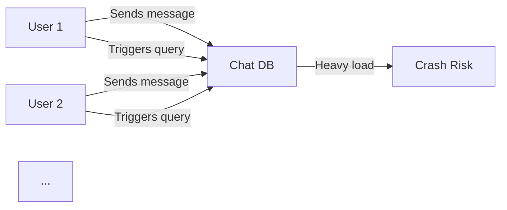

```markdown
---
title: "Streaming Guidelines: A Backend Engineer’s Guide to Efficient Data Flow"
date: "2023-11-15"
tags: ["api-design", "database-patterns", "backend-engineering", "streaming", "real-time-data", "efficiency"]
---

# **Streaming Guidelines: A Backend Engineer’s Guide to Efficient Data Flow**

In the age of real-time analytics, high-frequency trading, and interactive dashboards, data doesn’t just *move*—it *streams*. Whether you’re building a live sports scoreboard, a chat application, or a system for monitoring IoT devices, streaming data efficiently is critical. But without proper **streaming guidelines**, your system risks performance bottlenecks, wasted resources, and unpredictable behavior.

This post dives into the **Streaming Guidelines pattern**, a structured approach to designing systems that handle data in real-time with minimal overhead. We’ll explore the challenges of unguided streaming, practical solutions, real-world code examples, and the tradeoffs you’ll encounter. By the end, you’ll have a clear framework for building scalable, responsive applications—no silver bullets included.

---

## **The Problem: Data in Chaos**

Before jumping into solutions, let’s examine why unstructured streaming often goes wrong.

### **1. The Resource Tax of Unbounded Streams**
Imagine a chat app where every message sent to the server triggers an immediate query to fetch the entire chat history. If 1,000 users are chatting simultaneously, that’s 1,000 database queries per message—quickly spiraling into a resource nightmare. Without controls, streaming can:
- **Overload databases** with sequential reads/writes.
- **Spike CPU/memory** as buffers grow uncontrollably.
- **Increase latency** due to unoptimized data pipelines.



### **2. The Observer Effect: Side Effects Everywhere**
Streaming isn’t just about moving data—it’s about *triggering actions*. A single streamed event (e.g., a user login) might:
- Update a user profile.
- Fire off analytics scripts.
- Sync data across microservices.
If no one dictates the order or boundaries of these side effects, your system becomes a tangled web of inconsistencies.

### **3. The Visibility Gap: "Is It Done Yet?"**
Without explicit streaming guidelines, developers often assume:
- "The client will handle backpressure."
- "The consumers will process at their own pace."
But in reality:
- Clients may disconnect mid-stream.
- Consumers might lag behind.
- Data may be duplicated or lost if not handled proactively.

---
## **The Solution: Structured Streaming Guidelines**

The **Streaming Guidelines pattern** isn’t a monolithic framework—it’s a collection of rules and heuristics to govern how data flows through your system. The core idea is to **define boundaries, enforce order, and manage backpressure** explicitly. Here’s how:

### **1. Define Streaming Units**
Not all data is equal. Categorize streams by:
- **Granularity**: Is it a single record, a batch, or a full dataset?
- **Lifetime**: Is it ephemeral (e.g., a chat message) or persistent (e.g., user activity logs)?
- **Criticality**: Does it require immediate processing (e.g., fraud detection) or can it wait (e.g., analytics)?

**Example: Streaming a Chat Message**
```python
# Bad: Streams raw JSON blobs with no structure
stream_data = {
    "user_id": 123,
    "message": "Hello!",
    "timestamp": datetime.now(),
    "metadata": {"device": "mobile", "theme": "dark"}
}

# Good: Define a structured payload with versioning
STREAM_SCHEMA = {
    "version": "1.0",
    "payload": {
        "user_id": int,
        "message": str,
        "timestamp": datetime,
        "metadata": {"device": str, "theme": Optional[str]}  # Optional fields
    }
}
```

### **2. Enforce Ordering Policies**
Streams must have a **clear sequencing mechanism**. Common approaches:
- **Timestamp-based ordering**: Use UTC timestamps (but account for clock skew).
- **Sequence numbers**: Auto-incremented IDs (e.g., Kafka partitions).
- **Causal consistency**: For dependencies (e.g., "Transaction X must precede Y").

**Example: Kafka Partitioning for Ordering**
```java
// Java consumer ensuring order within a partition
public class OrderedMessageConsumer {
    public void consume(IIterator<ConsumerRecord<String, String>> records) {
        String lastKey = null;
        while (records.hasNext()) {
            ConsumerRecord<String, String> record = records.next();
            if (lastKey != null && !record.key().equals(lastKey)) {
                System.err.println("WARNING: Order broken! Last key was " + lastKey);
            }
            lastKey = record.key();
            processMessage(record.value());
        }
    }
}
```

### **3. Implement Backpressure Management**
Consumers must signal when they’re overwhelmed. Common strategies:
- **Dynamic batching**: Send smaller chunks when the consumer is slow.
- **Flow control**: Use HTTP 206 Partial Content or custom protocols.
- **Exponential backoff**: Retry failed deliveries with delays.

**Example: Backpressure in gRPC**
```protobuf
// Protobuf service definition with backpressure hints
service DataStreamer {
    rpc StreamData (stream DataRequest) returns (stream DataResponse) {
        option (grpc.backpressure = true);
    }
}

message DataResponse {
    bytes data = 1;
    bool has_more = 2;
}
```

### **4. Design for Partial Failures**
Assume streams will fail. Plan for:
- **Idempotency**: Allow reprocessing without side effects.
- **Dead-letter queues (DLQ)**: Isolate undeliverable messages.
- **Checkpointing**: Track progress (e.g., Kafka offsets).

**Example: Idempotent Stream Processing**
```python
# Python example with idempotent key generation
def process_message(message: dict, consumer_group: str) -> bool:
    key = generate_idempotent_key(message["user_id"], message["topic"])
    if check_processed(key):
        print("Skipping duplicate")
        return False
    # Process logic
    mark_as_processed(key)
    return True
```

### **5. Monitor and Alert**
Streaming systems need observability:
- **Latency metrics**: P99, P95, and P50 streaming delays.
- **Throughput**: Messages/sec, bytes/sec.
- **Error rates**: Duplicates, timeouts, corrupt data.

**Example: Prometheus Metrics for Streams**
```sql
-- SQL to track streaming health
SELECT
    COUNT(*) as total_messages,
    SUM(CASE WHEN status = 'error' THEN 1 ELSE 0 END) as errors,
    AVG(timestamp - processed_at) as latency_ms
FROM streaming_events
WHERE timestamp > NOW() - INTERVAL '1 hour'
GROUP BY 1;
```

---

## **Components/Solutions: The Toolkit**

Now that we’ve outlined the principles, let’s dive into practical tools and libraries to implement them.

### **1. Streaming Protocols**
| Protocol       | Use Case                          | Example Libraries          |
|----------------|-----------------------------------|---------------------------|
| HTTP Streaming | Lightweight, REST-friendly       | Spring WebFlux, Django Channels |
| WebSockets     | Real-time bidirectional          | Socket.IO, JavaScript `WebSocket` |
| gRPC           | High-performance RPC streams      | gRPC-Python, gRPC-Go         |
| Kafka          | Distributed, fault-tolerant       | Confluent Kafka, Kafka-Python |
| RabbitMQ       | Simple messaging queues           | Pika (Python), RabbitMQ-C |

**Example: Async WebSockets in Node.js**
```javascript
// Server-side streaming with Express + ws
const WebSocket = require('ws');
const wss = new WebSocket.Server({ noServer: true });

app.use((req, res, next) => {
    wss.handleUpgrade(req, req.socket, Buffer.alloc(0), (ws) => {
        wss.emit('connection', ws, req);
    });
    next();
});

wss.on('connection', (ws, req) => {
    const userId = req.query.userId;
    // Stream real-time updates
    ws.on('message', (data) => {
        // Process and broadcast to others
    });
});
```

### **2. State Management**
Maintain consistency with:
- **Local state**: For lightweight consumers (e.g., Redis).
- **Global state**: Distributed systems (e.g., DynamoDB Streams).

**Example: Redis for Stream State**
```bash
# Push new messages to a stream
RIGHTPUSH user:123:chat messages {"text": "Hello", "time": "10:00"}

# Consume with consumer groups
BRPOPLPUSH user:123:chat consumers:123 0
```

### **3. Error Handling Frameworks**
- **Retries with jitter**: Use libraries like `tenacity` (Python) or `resilience4j` (Java).
- **Circuit breakers**: Stop cascading failures (e.g., Hystrix in Java).

**Example: Retry with Backoff**
```python
from tenacity import retry, stop_after_attempt, wait_exponential

@retry(stop=stop_after_attempt(3), wait=wait_exponential(multiplier=1, min=4, max=10))
def send_stream_batch(batch: list[dict]):
    try:
        stream_service.publish(batch)
    except StreamError as e:
        log_error(e)
        raise
```

### **4. Serialization**
Choose formats wisely:
- **JSON**: Human-readable, but verbose.
- **Protocol Buffers**: Compact, fast.
- **MessagePack**: Balanced size/performance.

**Example: Protobuf vs. JSON**
```protobuf
// protobuf definition (compact)
message ChatMessage {
    string user_id = 1;
    string content = 2;
    int32 timestamp = 3;  // Unix epoch
}

# Equivalent JSON would be 3x larger for complex objects.
```

---

## **Implementation Guide: Step-by-Step**
Follow this checklist to adopt streaming guidelines:

### **Phase 1: Design**
1. **Audit your streams**: List all data flows (e.g., "User logs in → Sync profile → Update dashboard").
2. **Assign granularity**: Are these streams fine-grained (e.g., per-message) or coarse-grained (e.g., batch hourly)?
3. **Define SLAs**: Latency budgets (e.g., 99% of messages must arrive in <500ms).

### **Phase 2: Build**
1. **Start small**: Pilot with a single stream (e.g., notifications).
2. **Instrument early**: Add metrics for latency, errors, and throughput.
3. **Test chaos**: Simulate failures (e.g., kill a Kafka broker mid-stream).

### **Phase 3: Deploy**
1. **Canary release**: Roll out to a subset of users first.
2. **Monitor**: Set alerts for anomalies (e.g., "Stream X has 10% error rate").
3. **Optimize**: Tune batch sizes, timeouts, and backpressure thresholds.

### **Phase 4: Maintain**
1. **Review regularly**: Streaming patterns degrade over time (e.g., new consumers add load).
2. **Document**: Update your team on streaming contracts (e.g., "This API streams events, not snapshots").

---

## **Common Mistakes to Avoid**

| Mistake                          | Why It’s Bad                          | Fix                                                                 |
|----------------------------------|---------------------------------------|--------------------------------------------------------------------|
| **No backpressure handling**     | Consumers drown in messages.         | Use flow control (e.g., HTTP 206, Kafka consumer lag metrics).     |
| **Ignoring clock skew**          | Timestamps misorder events.          | Use system clocks + NTP, or sequence numbers.                      |
| **No idempotency**               | Duplicate processing causes bugs.    | Generate unique keys for deduplication.                           |
| **Over-partitioning**            | Too many small streams → overhead.    | Group related streams (e.g., all user-X events in one partition).  |
| **Untested failure scenarios**  | Streams break under load.             | Chaos engineering: kill producers/consumers randomly.             |
| **Tight coupling to consumers** | Change one consumer → break all.     | Use schemas (e.g., Avro) or topic partitioning.                   |

---

## **Key Takeaways**
Here’s what sticks:
✅ **Streaming is about boundaries**—define granularity, ordering, and guarantees upfront.
✅ **Backpressure is non-negotiable**—consumers must signal when they’re overwhelmed.
✅ **Assume failure**—design for retries, idempotency, and dead-letter queues.
✅ **Monitor everything**—latency, errors, and throughput are your friends.
✅ **Tradeoffs exist**—e.g., stronger consistency vs. lower throughput.
✅ **Start small**—don’t over-engineer your first stream; iterate.

---

## **Conclusion**
Streaming data efficiently is neither magical nor trivial. It requires discipline—defining clear contracts, handling edge cases, and balancing performance with reliability. The **Streaming Guidelines pattern** gives you a roadmap, but remember: there’s no one-size-fits-all solution.

Your next steps:
1. **Audit your current streams**—where are the ungoverned flows?
2. **Pick one guideline** to implement (e.g., backpressure) and measure impact.
3. **Share lessons learned** with your team—streaming is collaborative.

For further reading:
- [Kafka’s Guide to Idempotent Producer](https://kafka.apache.org/documentation/#idempotence)
- [gRPC Backpressure Documentation](https://grpc.io/blog/backpressure/)
- [Event-Driven Architecture Patterns](https://docs.microsoft.com/en-us/azure/architecture/guide/architecture-style/event-driven) (Microsoft)

Happy streaming!
```

---
**Note**: This post balances theory with practicality, emphasizing real-world tradeoffs and code snippets. Would you like me to expand on any section (e.g., deeper Kafka examples or a case study)?