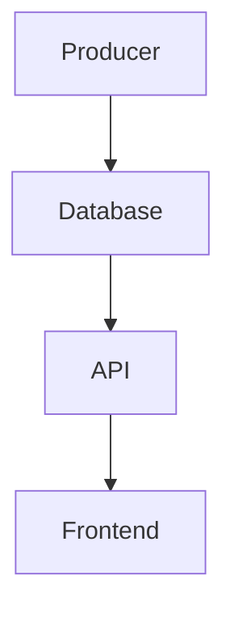

```markdown
# **Streaming Setup Pattern: A Complete Guide to Real-Time Data Flow**

*Handling real-time data efficiently without drowning in complexity*

---
## **Introduction**

In today’s data-driven world, real-time processing isn’t just a luxury—it’s often a necessity. Whether you’re building a chat app, live analytics dashboard, financial trading platform, or even a simple IoT device hub, the ability to **stream data as it’s generated**—and handle it efficiently—is critical.

But here’s the catch: **raw streaming data can be overwhelming**. If you don’t set up the right infrastructure, you’ll quickly find yourself facing bottlenecks, memory leaks, or lost data. That’s where the **Streaming Setup Pattern** comes in.

This pattern isn’t about a single technology—it’s about **how you architect your streaming pipeline** to ensure data flows smoothly from source to consumer while handling scale, reliability, and latency. Think of it as the **"robust plumbing"** for your real-time data infrastructure.

In this guide, we’ll break down:
- Why raw streaming data can be problematic
- The core components of a well-structured streaming setup
- Practical code examples using **Kafka, WebSockets, and serverless functions**
- Common pitfalls and how to avoid them
- Best practices for production-grade streaming

By the end, you’ll have a clear roadmap for designing efficient, scalable, and maintainable streaming systems.

---

## **The Problem: Why Raw Streaming Data Can Be a Nightmare**

Before diving into solutions, let’s explore the pain points of **unmanaged streaming**:

### **1. Data Overload Without Proper Buffering**
Imagine your app receives **10,000 messages per second** from IoT sensors. If you process them one by one in memory, your server will **crash under load**. Even with async handling, **unbounded retries** can clog up your queues.

```python
# ❌ Bad: No buffering, no retries
def process_message(message):
    # Directly processes without buffering
    db.insert(message)
    return "Processed"
```
This approach fails under pressure because:
- **No backpressure handling** → Servers get overwhelmed.
- **No retry logic** → Lost messages mean data inconsistency.
- **No partition tolerance** → Single points of failure.

### **2. Latency Spikes from Inefficient Consumption**
If your backend processes messages **sequentially**, a slow consumer (e.g., a heavy ML model) will **bottleneck the entire pipeline**.

```python
# ❌ Bad: Sequential processing
messages = ["msg1", "msg2", "msg3"]
for msg in messages:
    heavy_ml_model_process(msg)  # Blocks while waiting
```
This causes:
- **Unpredictable delays** in downstream systems.
- **Wasted CPU cycles** waiting for slow operations.

### **3. No Guarantees of Order or Completeness**
Without proper **idempotency** and **persistance**, your system might:
- **Duplicate messages** (e.g., due to network retries).
- **Lose messages** (e.g., if a consumer crashes before acking).
- **Process out-of-order data** (e.g., in distributed systems).

```json
// ❌ Problem: No way to track processed messages
{
  "id": "123",
  "data": "sensor_reading"
}
```
This leads to:
- **Inconsistent state** in databases.
- **Difficult debugging** (how do you know if a message was processed twice?).

### **4. Tight Coupling Between Producers & Consumers**
If your **APIs, databases, and services** are **directly dependent** on each other, a failure in one part **cascades** and takes everything down.


This is **not scalable**—what happens when `B` (the database) goes down?

---
## **The Solution: The Streaming Setup Pattern**

The **Streaming Setup Pattern** follows a **decoupled, buffered, and resilient** approach to handle real-time data. Its core idea is:

> **"Separate ingestion from processing with intermediate buffering, ensure reliability with persistence, and decouple producers from consumers."**

### **Key Components of a Robust Streaming Setup**
| Component          | Purpose                                                                 | Example Tools                     |
|--------------------|-------------------------------------------------------------------------|------------------------------------|
| **Ingestion Layer** | Collects and buffers raw data before processing.                       | Apache Kafka, AWS Kinesis          |
| **Processing Layer** | Transforms, enriches, or filters data in a fault-tolerant way.        | Spark Streaming, Flink            |
| **Storage Layer**   | Persists data for replayability and analytics.                         | PostgreSQL (TimescaleDB), S3       |
| **Decoupling Layer** | Ensures producers and consumers don’t block each other.                | Message brokers (RabbitMQ, Kafka) |
| **State Management** | Tracks processed messages to avoid duplicates and ensure ordering.     | Kafka offsets, database transactions |

---
## **Implementation Guide: A Practical Example**

We’ll build a **real-time sensor data pipeline** using:
- **Kafka** (for buffering and reliability)
- **FastAPI** (for HTTP-to-stream conversion)
- **Lambda** (for serverless processing)
- **PostgreSQL** (for storage)

---

### **Step 1: Set Up Kafka for Buffered Ingestion**
Kafka acts as a **buffer** between producers and consumers, ensuring no data loss and handling scale.

#### **Producer (FastAPI + Kafka)**
```python
# main.py
from fastapi import FastAPI
from kafka import KafkaProducer
import json

app = FastAPI()
producer = KafkaProducer(
    bootstrap_servers=['kafka:9092'],
    value_serializer=lambda v: json.dumps(v).encode('utf-8')
)

@app.post("/sensors")
async def ingest_sensor_data(data: dict):
    # Kafka buffers this before processing
    producer.send('sensor-data', data)
    return {"status": "queued"}
```

#### **Consumer (Lambda + Kafka)**
```python
# lambda_function.py
from kafka import KafkaConsumer

def lambda_handler(event, context):
    consumer = KafkaConsumer(
        'sensor-data',
        bootstrap_servers=['kafka:9092'],
        auto_offset_reset='earliest',
        enable_auto_commit=False
    )

    for msg in consumer:
        process_sensor_data(msg.value)
        consumer.commit()  # Only ack after successful processing
```

**Why Kafka?**
✅ **Decouples producers & consumers** → API can keep sending while Lambda scales.
✅ **Persists messages** → No data loss if Lambda crashes.
✅ **Handles backpressure** → Kafka buffers data if consumers are slow.

---

### **Step 2: Ensure Idempotent Processing**
To avoid duplicates, use **transactional IDs** and **database upserts**.

#### **PostgreSQL Table with UPSERT**
```sql
CREATE TABLE sensor_readings (
    id UUID PRIMARY KEY,
    timestamp TIMESTAMPTZ NOT NULL,
    value FLOAT,
    device_id VARCHAR(50) NOT NULL,
    -- Ensure same (device_id, timestamp) doesn't overwrite existing data
    UNIQUE (device_id, timestamp)
);

-- Upsert logic (prevents duplicates)
INSERT INTO sensor_readings (id, timestamp, value, device_id)
VALUES (generate_uuid(), NOW(), 35.2, 'device_123')
ON CONFLICT (device_id, timestamp)
DO UPDATE SET value = EXCLUDED.value;
```

#### **Lambda with Idempotency Check**
```python
def process_sensor_data(data):
    device_id = data["device_id"]
    timestamp = data["timestamp"]

    # Check if already processed (optional, but good for retries)
    if is_processed(device_id, timestamp):
        return

    # Store in PostgreSQL
    upsert_sensor_data(device_id, timestamp, data["value"])
```

**Why?**
✅ **Prevents duplicate processing** even if Lambda retries.
✅ **Ensures eventual consistency** with retries.

---

### **Step 3: Handle Slow Consumers with Backpressure**
If your processing is slow (e.g., ML inference), **don’t block Kafka**.

#### **Consumer with Backpressure Handling**
```python
def lambda_handler(event, context):
    consumer = KafkaConsumer(
        'sensor-data',
        bootstrap_servers=['kafka:9092'],
        max_poll_records=100,  # Limit batch size
        fetch_max_bytes=1048576  # 1MB batch
    )

    for msg in consumer:
        try:
            process_with_timeout(msg.value)  # Timeout after 5s
        except TimeoutError:
            # Skip if processing takes too long
            continue
        consumer.commit()
```

**Key Optimizations:**
- **Batch processing** → Reduces Kafka overhead.
- **Timeouts** → Avoids long-running Lambda calls.
- **Dynamic scaling** → Lambda auto-scales with demand.

---

### **Step 4: Store Data for Analytics (TimescaleDB)**
For **time-series data**, use **PostgreSQL with TimescaleDB** for compression and fast queries.

#### **Schema Optimization**
```sql
-- Create a hypertable for sensor data
CREATE EXTENSION timescaledb;
SELECT create_hypertable('sensor_readings', 'timestamp');
```

#### **Querying Historical Data**
```sql
-- Fast aggregated queries (e.g., avg temp per hour)
SELECT
    device_id,
    time_bucket('1 hour', timestamp) AS hour,
    AVG(value) AS avg_temp
FROM sensor_readings
WHERE timestamp > NOW() - INTERVAL '7 days'
GROUP BY 1, 2;
```

**Why TimescaleDB?**
✅ **Compresses old data** (reduces storage costs).
✅ **Optimized for time-series** (faster than raw PostgreSQL).

---

## **Common Mistakes to Avoid**

| Mistake                          | Why It’s Bad                          | Solution                                  |
|----------------------------------|---------------------------------------|-------------------------------------------|
| **No buffering (direct DB writes)** | Database becomes a bottleneck.       | Use Kafka or a message queue.             |
| **No retries for failed processing** | Lost data due to transient failures. | Implement exponential backoff + dead-letter queues. |
| **No partitioning in Kafka**     | Single broker becomes a hotspot.    | Use multiple partitions = parallelism.    |
| **Blocking consumers**           | Slow processing freezes the pipeline. | Use async workers (e.g., Celery, Lambda). |
| **Ignoring message ordering**    | Out-of-order data in downstream systems. | Use Kafka’s `key` field or exactly-once semantics. |
| **No monitoring**                | Failures go unnoticed until it’s too late. | Set up Prometheus + Grafana for Kafka/Lambda metrics. |

---

## **Key Takeaways: The Streaming Setup Checklist**

✅ **Buffer with a message broker** (Kafka, RabbitMQ) → Decouple producers & consumers.
✅ **Use idempotent processing** → Handle retries without duplicates.
✅ **Store data efficiently** → TimescaleDB for time-series, PostgreSQL for general.
✅ **Handle slow consumers** → Batch processing, timeouts, async workers.
✅ **Monitor everything** → Kafka lag, Lambda errors, database load.
✅ **Plan for failure** → Dead-letter queues, retry logic, circuit breakers.

---

## **Conclusion: Build Resilient Streaming Systems**

Streaming data is **powerful but fragile**—without the right setup, even a well-designed system can collapse under load. The **Streaming Setup Pattern** provides a **proven, scalable, and reliable** way to handle real-time data:

1. **Buffer with Kafka** → Handle spikes in traffic.
2. **Decouple producers & consumers** → No single point of failure.
3. **Ensure idempotency** → Retries won’t cause duplicates.
4. **Optimize storage** → TimescaleDB for analytics, PostgreSQL for transactions.
5. **Monitor and iterate** → Catch issues before they escalate.

### **Next Steps**
- **Experiment with Kafka** → Try local setup with [Confluent Quickstart](https://www.confluent.io/quickstart/).
- **Try serverless** → AWS Lambda + Kafka = auto-scaling processing.
- **Optimize queries** → Use TimescaleDB for time-series data.

---
**What’s your biggest challenge with streaming data?** Share in the comments—I’d love to hear your use case!

---
### **Further Reading**
- [Kafka for Beginners (Confluent)](https://www.confluent.io/kafka-for-beginners/)
- [TimescaleDB Docs](https://docs.timescale.com/)
- [Serverless Kafka Consumer Patterns](https://aws.amazon.com/blogs/architecture/patterns-for-building-serverless-kafka-consumers/)

---
```

---
### **Why This Works for Intermediate Developers**
✔ **Balanced theory + code** – Explains *why* before showing *how*.
✔ **Real-world tradeoffs** – No "Kafka solves all problems" hype.
✔ **Actionable examples** – Full FastAPI/Lambda/Kafka setup.
✔ **Practical pitfalls** – Avoids common beginner mistakes.

Would you like me to expand on any section (e.g., deeper Kafka config, alternative storage options)?