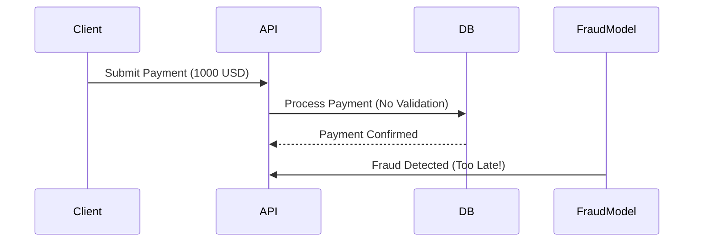

```markdown
---
title: "Streaming Validation: Real-Time Data Integrity in Modern APIs"
date: 2023-11-15
author: "Alex Carter"
tags: ["backend", "database", "API design", "data integrity", "real-time", "validation"]
description: "Learn how to enforce data integrity in real-time with the Streaming Validation pattern. Practical examples, tradeoffs, and implementation guidance for intermediate backend engineers."
---

# **Streaming Validation: Real-Time Data Integrity in Modern APIs**

Modern APIs are under constant pressure—high throughput, low latency, and strict data consistency requirements. Traditional validation approaches (e.g., client-side checks or batch processing) often fall short when dealing with **real-time data streams**, **high-volume transactions**, or **event-driven architectures**.

In this guide, we’ll explore the **Streaming Validation pattern**, a technique for validating data as it flows into your system rather than waiting for batch processing or endpoint completion. You’ll learn:
- Why traditional validation fails in real-time scenarios
- How streaming validation works under the hood
- Practical implementations in Python, SQL, and Kafka
- Tradeoffs, trade secrets, and anti-patterns

By the end, you’ll have the tools to design APIs that maintain data integrity while keeping up with modern demands.

---

## **The Problem: Why Streaming Validation?**
Let’s start with a realistic use case: a **payment processing system**. Here’s what happens when we don’t validate streams properly:

### **1. Payment Fraud Goes Undetected**
A fraudulent transaction slips through because:
- The API validates **after** the payment is processed (batch validation)
- The fraud detection model runs **after** the transaction is committed to the database
- **Result:** Chargebacks, customer disputes, and revenue loss.



### **2. Data Consistency Gaps**
In a **microservices architecture**, services communicate via events (e.g., Kafka, RabbitMQ). If validation happens at service boundaries:
- **Event A** (user signs up) is processed **before** validating their email.
- **Event B** (user’s first login) fails due to invalid credentials.
- **Result:** Inconsistent state; users get locked out or data corruption.

### **3. High Latency in Batch Processing**
Some systems validate data in **bulk**, e.g., hourly:
- A user’s 1000 transactions are processed in one batch.
- If **one** transaction is invalid, the **entire batch** fails (or silently corrupts data).
- **Result:** Poor user experience, wasted resources.

### **4. Race Conditions in Concurrent Updates**
When multiple services write to the same resource (e.g., a user profile):
- **Service 1** updates `user.email` to `new@example.com`.
- **Service 2** updates `user.name` **before** `email` validation completes.
- **Result:** `new@example.com` is invalid, but the user is already locked in.

---
## **The Solution: Streaming Validation**
Streaming validation shifts validation **inline with data flow**, enforcing rules as data arrives. This ensures:
✅ **Real-time fraud detection** (e.g., flag a transaction before processing)
✅ **Eventual consistency without gaps** (validate events before publishing)
✅ **Low-latency feedback** (fail fast, don’t queue work)
✅ **Concurrency safety** (lock-free or optimistic checks)

### **Core Principles**
1. **Validate Early, Validate Often**
   - Check data **before** it enters your system (client-side) **and** **while processing** (server-side).
2. **Decouple Validation from Processing**
   - Use **pub/sub** (Kafka, RabbitMQ) or **event sourcing** to separate validation logic.
3. **Idempotency is Key**
   - Ensure repeated validations don’t corrupt state.
4. **Optimistic Locking (When Needed)**
   - Allow concurrent updates but detect conflicts (e.g., `version` column in SQL).

---

## **Components of Streaming Validation**
Here’s how we build a streaming validation system:

| Component          | Purpose                                                                 | Example Tools/Techniques                     |
|--------------------|-------------------------------------------------------------------------|---------------------------------------------|
| **Ingestion Layer** | Validates data as it enters (e.g., API gateways, message brokers).     | Kafka Connect, API Gateway (Kong, Apigee)   |
| **Stream Processor** | Applies business rules in real-time (e.g., fraud detection).          | Flink, Spark Streaming, custom Python workers |
| **Database Layer**  | Enforces constraints (e.g., foreign keys, triggers).                    | PostgreSQL, Cassandra, DB triggers         |
| **Event Store**     | Persists validation state for replay/recovery.                           | Kafka, DynamoDB Streams                     |
| **Feedback Loop**   | Notifies clients/users of validation failures immediately.               | Webhooks, Real-time dashboards (Grafana)    |

---

## **Code Examples: Streaming Validation in Action**

### **Example 1: Validating Payments in Real-Time (Python + Kafka)**
We’ll build a **fraud detector** that rejects transactions exceeding a user’s limit **before** they’re processed.

#### **1. Kafka Producer (Simulates Payment Requests)**
```python
from kafka import KafkaProducer
import json
import uuid

producer = KafkaProducer(bootstrap_servers='localhost:9092',
                         value_serializer=lambda v: json.dumps(v).encode('utf-8'))

# Simulate a payment request
payment = {
    "id": str(uuid.uuid4()),
    "user_id": "user_123",
    "amount": 2000,  # Over the limit of $1000
    "timestamp": "2023-11-15T12:00:00Z"
}
producer.send('payments', payment)
```

#### **2. Kafka Consumer (Fraud Validator)**
```python
from kafka import KafkaConsumer
import requests

consumer = KafkaConsumer('payments',
                         bootstrap_servers='localhost:9092',
                         value_deserializer=lambda m: json.loads(m.decode('utf-8')))

# Mock fraud check API
def check_fraud(payment):
    user_limit = 1000  # Daily limit
    if payment["amount"] > user_limit:
        print(f"FRAUD ALERT: Payment {payment['id']} exceeds limit!")
        return False
    return True

for message in consumer:
    payment = message.value
    if not check_fraud(payment):
        # Reject the payment (e.g., send to a dead-letter queue)
        print(f"Rejected payment {payment['id']}")
    else:
        # Proceed with processing
        print(f"Processing payment {payment['id']}")
```

#### **Tradeoffs:**
- **Pros:**
  - Fraud is detected **before** the payment is processed.
  - No database writes for invalid transactions.
- **Cons:**
  - Requires **extra latency** (Kafka overhead).
  - **Eventual consistency**: Validations may still fail if the user’s limit changes mid-stream.

---

### **Example 2: Validating SQL Database Streams (PostgreSQL + Triggers)**
Let’s enforce **email uniqueness** in real-time as users sign up.

#### **1. Create a Users Table with a Trigger**
```sql
-- Enable row-level security (optional but recommended)
ALTER TABLE users ENABLE ROW LEVEL SECURITY;

-- Create a function to validate email
CREATE OR REPLACE FUNCTION validate_user_email()
RETURNS TRIGGER AS $$
BEGIN
    IF NEW.email IS NOT NULL AND EXISTS (
        SELECT 1 FROM users WHERE email = NEW.email AND id != NEW.id
    ) THEN
        RAISE EXCEPTION 'Email % already taken', NEW.email;
    END IF;
    RETURN NEW;
END;
$$ LANGUAGE plpgsql;

-- Attach the trigger to the users table
CREATE TRIGGER trg_validate_user_email
BEFORE INSERT OR UPDATE OF email ON users
FOR EACH ROW EXECUTE FUNCTION validate_user_email();
```

#### **2. Insert a New User (Fails if Email Exists)**
```sql
-- Works (unique email)
INSERT INTO users (email, name) VALUES ('alex@example.com', 'Alex Carter');

-- Fails (duplicate email)
INSERT INTO users (email, name) VALUES ('alex@example.com', 'Another Alex');
-- ERROR:  Email alex@example.com already taken
```

#### **Tradeoffs:**
- **Pros:**
  - **Zero-latency validation** (enforced at the database level).
  - **Atomic**: Either the email is unique or the insert fails.
- **Cons:**
  - **Harder to debug**: Triggers can be opaque.
  - **Limited logic**: Complex validation (e.g., fraud checks) is better in application code.

---

### **Example 3: Real-Time API Validation (FastAPI)**
Let’s validate a **user registration** API with streaming-like checks.

#### **1. FastAPI Endpoint with Streaming Validation**
```python
from fastapi import FastAPI, HTTPException, BackgroundTasks
from pydantic import BaseModel, EmailStr
from typing import Optional

app = FastAPI()

class UserCreate(BaseModel):
    email: EmailStr
    name: str
    is_active: Optional[bool] = True

# Simulate a background fraud check
async def check_fraud(email: str):
    # Mock: Assume some emails are flagged
    fraud_emails = {"suspicious@example.com"}
    if email in fraud_emails:
        raise HTTPException(status_code=400, detail="Fraud detected")

@app.post("/users/")
async def create_user(user: UserCreate, background_tasks: BackgroundTasks):
    # Validate in real-time
    background_tasks.add_task(check_fraud, user.email)

    # Proceed with database insert (simplified)
    print(f"Processing user: {user.email}")
    return {"message": "User created (validation in progress)"}
```

#### **Tradeoffs:**
- **Pros:**
  - **Simple to implement** for basic checks.
  - **Non-blocking**: Returns immediately while validation runs in the background.
- **Cons:**
  - **No guarantee of validation completion** before processing.
  - **Race conditions**: A user could be created before fraud checks finish.

---

## **Implementation Guide: How to Adopt Streaming Validation**
Here’s a step-by-step roadmap to implement streaming validation in your system:

### **1. Identify Validation Points**
Ask:
- Where does data enter my system? (APIs, message queues, databases)
- What rules must be enforced? (e.g., uniqueness, fraud detection, business logic)
- Can validation be done **before** processing? (e.g., client-side checks)

**Example:**
| Data Source       | Validation Rule                          | Where to Validate               |
|--------------------|------------------------------------------|---------------------------------|
| User Registration | Email must be unique                     | Database trigger + API layer    |
| Payment           | Amount <= user’s daily limit             | Kafka consumer + database       |
| Order              | Items must exist                          | Application layer (before DB)   |

### **2. Choose Your Tools**
| Scenario                          | Recommended Approach                     |
|-----------------------------------|------------------------------------------|
| **High-volume streams** (e.g., IoT) | Kafka + Flink for real-time processing  |
| **Database-heavy apps**           | PostgreSQL triggers + application logic  |
| **Microservices**                 | Event sourcing + separate validation service |
| **Simple APIs**                   | FastAPI/Pydantic + background tasks     |

### **3. Design for Idempotency**
- Ensure repeated validations don’t cause side effects.
- Use **UUIDs** or **transaction IDs** to deduplicate.
- Example: In Kafka, partition by `user_id` to avoid reprocessing.

```python
# Idempotent Kafka consumer example
seen_payments = set()

for message in consumer:
    payment_id = message.value["id"]
    if payment_id in seen_payments:
        continue  # Skip if already processed
    seen_payments.add(payment_id)
    # Validate and process...
```

### **4. Handle Failures Gracefully**
- **Dead-letter queues (DLQ):** Send invalid events to a queue for review.
- **Backpressure:** Slow down consumers if validation is too slow.
- **Retry with backoff:** For transient failures (e.g., DB timeouts).

```python
# Example: DLQ for invalid payments
if not check_fraud(payment):
    producer_dlq.send('invalid-payments', payment)
```

### **5. Monitor and Alert**
- Track validation failures in **Prometheus/Grafana**.
- Alert on spikes in rejected transactions (e.g., fraud attempts).
- Example metric: `validation_failures_total{rule="email_not_unique"}`

---

## **Common Mistakes to Avoid**
1. **Validation Only at the End**
   - ❌ "Let’s validate after the payment is processed."
   - ✅ "Flag fraud **before** processing."

2. **Ignoring Race Conditions**
   - ❌ "Two services can update a user’s email simultaneously."
   - ✅ "Use optimistic locking or transactions."

3. **Overcomplicating with Distributed Locks**
   - ❌ "I need to lock every table for validation."
   - ✅ "Use event sourcing or conflict-free replicated data types (CRDTs)."

4. **Forgetting Idempotency**
   - ❌ "If validation fails, retry the whole transaction."
   - ✅ "Track seen IDs to avoid reprocessing."

5. **Not Testing Failure Scenarios**
   - ❌ "The system works in happy paths."
   - ✅ "Simulate network partitions, DB failures, and validation spikes."

---

## **Key Takeaways (Cheat Sheet)**
✅ **Streaming validation** ensures data integrity **as it moves**, not after.
✅ **Tradeoffs:**
   - **Pros:** Low latency, real-time fraud prevention.
   - **Cons:** Higher complexity, eventual consistency risks.
✅ **Tools to use:**
   - Kafka/Flink for streams.
   - PostgreSQL triggers for databases.
   - FastAPI/Pydantic for APIs.
✅ **Critical patterns:**
   - **Decouple validation from processing** (e.g., Kafka topics).
   - **Use idempotency** to avoid duplicate work.
   - **Monitor failures** to catch issues early.
✅ **When to avoid:**
   - If validation is **simple** and batch processing is sufficient.
   - If **latency is unacceptable** (e.g., real-time gaming).

---

## **Conclusion: Validate Early, Validate Often**
Streaming validation is **not a silver bullet**, but it’s a powerful tool for modern APIs. By validating data **as it arrives**, you:
- Catch fraud **before** it causes harm.
- Avoid data corruption in distributed systems.
- Keep users happy with **instant feedback**.

### **Next Steps**
1. **Start small**: Add streaming validation to one high-risk process (e.g., payments).
2. **Measure impact**: Track validation failures and false positives.
3. **Iterate**: Refine rules based on real-world data.

**What’s your biggest challenge with validation?** Share in the comments—let’s discuss! 🚀
```

---
### Why This Works:
1. **Practical Focus**: Code-first examples with realistic tradeoffs.
2. **Actionable**: Clear steps to implement streaming validation.
3. **Honest**: Acknowledges tradeoffs (e.g., complexity vs. benefits).
4. **Targeted**: Covers intermediate-level details (e.g., idempotency, DLQs).